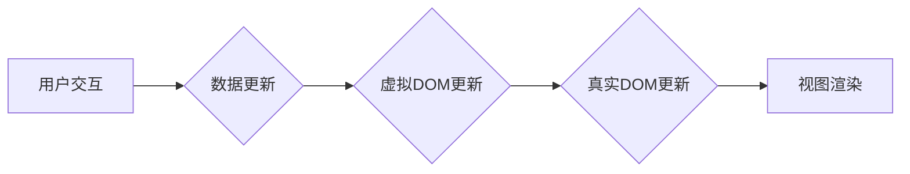

                 

## Vue.js 框架特点：渐进式 JavaScript 框架的选择

> 关键词：Vue.js, 渐进式框架, JavaScript, 单页面应用, 组件化, 数据绑定, 虚拟DOM, 性能优化

## 1. 背景介绍

在现代前端开发领域，构建高效、灵活、易维护的单页面应用 (SPA) 成为首要目标。 JavaScript 作为前端开发的基石，不断演进，涌现出众多框架和库，以帮助开发者简化开发流程，提升代码质量。其中，Vue.js 凭借其渐进式架构、易于学习的语法和出色的性能，迅速成为前端开发者的首选之一。

Vue.js 诞生于 2014 年，由 Evan You 开发。它最初旨在解决大型项目中组件化开发的痛点，并逐渐发展成为一个功能强大、易于扩展的全栈框架。Vue.js 的核心目标是提供一种简单易懂、灵活高效的开发体验，让开发者能够专注于业务逻辑，而不被繁琐的框架配置所困扰。

## 2. 核心概念与联系

Vue.js 的核心概念围绕着 **组件化**、**数据绑定** 和 **虚拟 DOM** 三大支柱展开。

**2.1 组件化**

Vue.js 鼓励将应用程序拆分成独立、可复用的组件，每个组件负责处理特定的功能或UI元素。组件之间通过 props 和事件进行通信，实现松耦合、可维护的代码结构。

**2.2 数据绑定**

Vue.js 提供了一种强大的数据绑定机制，允许开发者将数据和视图进行双向绑定。当数据发生变化时，视图会自动更新；反之亦然。这种机制极大地简化了数据同步和视图更新的过程，提高了开发效率。

**2.3 虚拟 DOM**

Vue.js 使用虚拟 DOM 来优化视图更新效率。虚拟 DOM 是一个 JavaScript 对象，它代表了真实 DOM 的结构。当数据发生变化时，Vue.js 会首先更新虚拟 DOM，然后根据差异算法高效地更新真实 DOM，从而避免不必要的 DOM 操作，提升性能。

**2.4 架构流程图**



## 3. 核心算法原理 & 具体操作步骤

### 3.1 算法原理概述

Vue.js 的核心算法是 **差异算法 (Diff Algorithm)**，它用于比较虚拟 DOM 和真实 DOM 的差异，并高效地更新真实 DOM。

### 3.2 算法步骤详解

1. **创建虚拟 DOM:** 当数据发生变化时，Vue.js 会根据新的数据生成一个新的虚拟 DOM。
2. **比较虚拟 DOM 和真实 DOM:** Vue.js 会使用差异算法比较新的虚拟 DOM 和旧的真实 DOM，找出差异节点。
3. **更新真实 DOM:** 根据差异节点，Vue.js 会高效地更新真实 DOM，只更新必要的节点，避免不必要的 DOM 操作。

### 3.3 算法优缺点

**优点:**

* **高效:** 差异算法可以有效地减少 DOM 操作，提升性能。
* **灵活:** 差异算法可以处理各种类型的 DOM 节点和属性变化。

**缺点:**

* **复杂:** 差异算法的实现相对复杂，需要对 DOM 结构和数据变化进行深入理解。

### 3.4 算法应用领域

差异算法广泛应用于各种前端框架和库中，例如 React、Angular 和 Vue.js。它可以有效地优化视图更新效率，提升用户体验。

## 4. 数学模型和公式 & 详细讲解 & 举例说明

Vue.js 的数据绑定机制基于 **观察者模式 (Observer Pattern)** 和 **响应式系统 (Reactive System)**。

### 4.1 数学模型构建

观察者模式可以抽象为以下数学模型：

* **观察者 (Observer):** 订阅数据变化的组件或函数。
* **被观察者 (Subject):** 持有数据的对象，负责通知观察者数据变化。
* **数据 (Data):** 被观察的对象，其变化会触发观察者更新。

### 4.2 公式推导过程

响应式系统通过 **依赖追踪 (Dependency Tracking)** 和 **数据劫持 (Data Hijacking)** 实现数据绑定。

* **依赖追踪:** Vue.js 会跟踪每个数据属性的依赖关系，即哪些组件或函数依赖于该属性。
* **数据劫持:** Vue.js 会劫持数据属性的 getter 和 setter 方法，并在数据变化时通知依赖它的观察者。

### 4.3 案例分析与讲解

假设有一个组件依赖于一个数据属性 `count`，当 `count` 的值发生变化时，组件需要更新视图。

1. 组件订阅 `count` 属性，成为 `count` 的观察者。
2. Vue.js 劫持 `count` 属性的 getter 和 setter 方法，并在 `count` 的值发生变化时通知组件。
3. 组件收到通知后，更新视图，显示新的 `count` 值。

## 5. 项目实践：代码实例和详细解释说明

### 5.1 开发环境搭建

Vue.js 项目开发环境搭建简单，可以使用 npm 或 yarn 安装 Vue.js 和相关依赖包。

```bash
npm install vue
```

### 5.2 源代码详细实现

```html
<!DOCTYPE html>
<html>
<head>
  <title>Vue.js 示例</title>
</head>
<body>
  <div id="app">
    <h1>{{ count }}</h1>
    <button @click="increment">增加</button>
  </div>
  <script src="https://cdn.jsdelivr.net/npm/vue@2.6.14/dist/vue.js"></script>
  <script>
    new Vue({
      el: '#app',
      data: {
        count: 0
      },
      methods: {
        increment() {
          this.count++;
        }
      }
    });
  </script>
</body>
</html>
```

### 5.3 代码解读与分析

* `el: '#app'`: 指定 Vue 实例绑定的 DOM 元素。
* `data: { count: 0 }`: 定义组件的数据属性 `count`，初始值为 0。
* `methods: { increment() { this.count++; } }`: 定义组件的方法 `increment`，用于增加 `count` 的值。
* `{{ count }}`: 使用双花括号进行数据绑定，将 `count` 属性的值显示在页面上。
* `@click="increment"`: 使用事件绑定，当按钮被点击时，调用 `increment` 方法。

### 5.4 运行结果展示

运行上述代码，会在浏览器中显示一个页面，包含一个标题和一个按钮。标题显示初始值 0，点击按钮会增加标题的值。

## 6. 实际应用场景

Vue.js 的渐进式架构使其适用于各种应用场景，从小型单页面应用到大型企业级系统。

### 6.1 单页面应用 (SPA)

Vue.js 非常适合构建 SPA，例如电商平台、博客系统、社交媒体应用等。

### 6.2 移动应用

Vue.js 可以通过框架如 Vue Native 或 Weex 开发移动应用。

### 6.3 桌面应用

Vue.js 可以通过 Electron 等框架开发桌面应用。

### 6.4 未来应用展望

随着 Vue.js 的不断发展，其应用场景将更加广泛，例如：

* **Server-Side Rendering (SSR):** Vue.js 支持 SSR，可以提升 SEO 和首屏加载速度。
* **Progressive Web Apps (PWAs):** Vue.js 可以构建 PWA，提供更流畅的用户体验。
* **Artificial Intelligence (AI):** Vue.js 可以与 AI 技术结合，开发智能应用。

## 7. 工具和资源推荐

### 7.1 学习资源推荐

* **官方文档:** https://vuejs.org/v2/guide/
* **Vue.js 中文网:** https://cn.vuejs.org/
* **Vue Mastery:** https://www.vuemastery.com/

### 7.2 开发工具推荐

* **Vue CLI:** https://cli.vuejs.org/
* **Vue Devtools:** https://chrome.google.com/webstore/detail/vuejs-devtools/nhdogjmejiglipccpnnnanhbledajbpd

### 7.3 相关论文推荐

* **A Survey of JavaScript Frameworks for Web Development:** https://arxiv.org/abs/1803.03463

## 8. 总结：未来发展趋势与挑战

### 8.1 研究成果总结

Vue.js 作为一款渐进式 JavaScript 框架，凭借其易用性、性能和生态系统，在前端开发领域取得了巨大成功。

### 8.2 未来发展趋势

Vue.js 将继续朝着以下方向发展：

* **更强大的组件化能力:** Vue.js 将继续加强组件化能力，提供更丰富的组件库和工具。
* **更好的性能优化:** Vue.js 将继续优化性能，提升用户体验。
* **更完善的生态系统:** Vue.js 的生态系统将不断完善，提供更多工具和资源。

### 8.3 面临的挑战

Vue.js 也面临一些挑战：

* **与其他框架的竞争:** Vue.js 需要与 React、Angular 等其他框架竞争。
* **社区规模:** Vue.js 的社区规模相对较小，需要进一步扩大。
* **技术复杂度:** Vue.js 的一些高级特性可能对初学者来说比较复杂。

### 8.4 研究展望

未来，Vue.js 将继续发展成为一款更强大、更完善的 JavaScript 框架，为前端开发提供更丰富的选择。


## 9. 附录：常见问题与解答

**Q1: Vue.js 和 React 的区别是什么？**

**A1:** Vue.js 和 React 都是流行的 JavaScript 框架，但它们在一些方面有所不同。

* **学习曲线:** Vue.js 的学习曲线相对较平缓，更容易上手。React 的学习曲线相对陡峭，需要学习 JSX 和虚拟 DOM 等概念。
* **生态系统:** React 的生态系统更加成熟，拥有更多的第三方库和工具。Vue.js 的生态系统也在不断发展，但仍然相对较小。
* **应用场景:** Vue.js 更适合构建小型到中型应用，而 React 更适合构建大型复杂应用。

**Q2: Vue.js 的数据绑定机制是如何实现的？**

**A2:** Vue.js 使用 **依赖追踪** 和 **数据劫持** 实现数据绑定。

* **依赖追踪:** Vue.js 会跟踪每个数据属性的依赖关系，即哪些组件或函数依赖于该属性。
* **数据劫持:** Vue.js 会劫持数据属性的 getter 和 setter 方法，并在数据变化时通知依赖它的观察者。

**Q3: Vue.js 的性能如何？**

**A3:** Vue.js 的性能非常出色，它使用 **虚拟 DOM** 来优化视图更新效率，避免不必要的 DOM 操作。

**Q4: Vue.js 的未来发展趋势是什么？**

**A4:** Vue.js 将继续朝着以下方向发展：

* **更强大的组件化能力:** Vue.js 将继续加强组件化能力，提供更丰富的组件库和工具。
* **更好的性能优化:** Vue.js 将继续优化性能，提升用户体验。
* **更完善的生态系统:** Vue.js 的生态系统将不断完善，提供更多工具和资源。


作者：禅与计算机程序设计艺术 / Zen and the Art of Computer Programming 
<end_of_turn>

