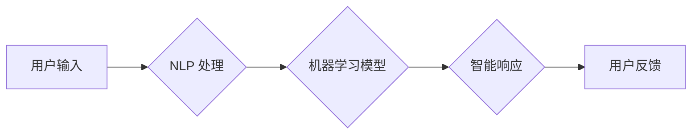

                 

## 人工智能在人机交互中的应用

> 关键词：人工智能、人机交互、自然语言处理、机器学习、深度学习、对话系统、虚拟助手、情感计算

## 1. 背景介绍

人机交互 (Human-Computer Interaction, HCI) 是计算机科学的一个重要分支，致力于研究人和计算机之间如何有效地交流和合作。随着人工智能 (Artificial Intelligence, AI) 技术的快速发展，AI 在人机交互领域扮演着越来越重要的角色，为我们带来了更加智能、自然、便捷的交互体验。

传统的 HCI 主要依赖于图形用户界面 (GUI) 和命令行界面 (CLI)，用户需要通过鼠标、键盘等物理设备与计算机进行操作。然而，这些界面往往缺乏灵活性、自然性和智能性。AI 则能够通过学习和理解人类语言、行为和意图，提供更加智能、个性化的交互体验。

## 2. 核心概念与联系

### 2.1 人工智能 (AI)

人工智能是指模拟人类智能行为的计算机系统。AI 的核心目标是让计算机能够像人类一样学习、推理、决策和解决问题。

### 2.2 人机交互 (HCI)

人机交互是指人与计算机之间进行信息交换和操作的整个过程。HCI 的目标是设计出易用、高效、愉悦的用户体验。

### 2.3 AI 在 HCI 中的应用

AI 技术可以应用于各个环节的人机交互，例如：

* **自然语言处理 (NLP)**：使计算机能够理解和生成人类语言，实现语音识别、文本理解、机器翻译等功能。
* **机器学习 (ML)**：使计算机能够从数据中学习，识别模式和做出预测，例如个性化推荐、行为预测等。
* **深度学习 (DL)**：一种更高级的机器学习方法，能够处理更复杂的数据，例如图像识别、语音合成等。

**Mermaid 流程图**



## 3. 核心算法原理 & 具体操作步骤

### 3.1 算法原理概述

在 AI 驱动的 HCI 中，常用的算法包括：

* **自然语言理解 (NLU)**：用于理解用户输入的文本或语音，识别意图、实体和关系。
* **对话管理 (Dialogue Management)**：用于控制对话流程，根据用户输入生成适当的响应。
* **文本生成 (Text Generation)**：用于生成自然流畅的文本响应。

### 3.2 算法步骤详解

以 NLU 算法为例，其具体步骤如下：

1. **文本预处理**: 将用户输入的文本进行清洗、分词、词性标注等处理，使其更易于理解。
2. **特征提取**: 从预处理后的文本中提取特征，例如词语、词性、语法结构等。
3. **模型训练**: 使用机器学习算法，例如支持向量机 (SVM)、神经网络等，对特征进行训练，学习用户意图和实体之间的关系。
4. **意图识别**: 将用户输入的文本映射到相应的意图类别。
5. **实体识别**: 从文本中识别出关键实体，例如人名、地名、时间等。

### 3.3 算法优缺点

**优点**:

* 能够理解和处理自然语言，提供更加自然、人性化的交互体验。
* 可以学习和适应用户的个性化需求，提供更加个性化的服务。

**缺点**:

* 算法复杂度高，需要大量的训练数据和计算资源。
* 对于复杂、模糊的语言理解能力有限。

### 3.4 算法应用领域

* **虚拟助手**: 例如 Siri、Alexa、Google Assistant 等，能够理解用户的语音指令，并执行相应的操作。
* **聊天机器人**: 用于提供客户服务、咨询等功能。
* **搜索引擎**: 能够理解用户的搜索意图，并提供更精准的搜索结果。
* **智能翻译**: 能够将文本或语音从一种语言翻译成另一种语言。

## 4. 数学模型和公式 & 详细讲解 & 举例说明

### 4.1 数学模型构建

在 NLU 算法中，常用的数学模型包括：

* **词嵌入**: 将词语映射到低维向量空间，捕捉词语之间的语义关系。例如 Word2Vec 和 GloVe。
* **神经网络**: 用于学习复杂的非线性关系，例如循环神经网络 (RNN) 和卷积神经网络 (CNN)。

### 4.2 公式推导过程

**词嵌入**:

假设有一个词典 V，包含 N 个词语。每个词语可以表示为一个向量 $v_i \in R^d$，其中 d 是词向量的维度。

词嵌入模型的目标是学习一个词向量表示，使得相似的词语拥有相似的向量表示。

常用的词嵌入算法包括：

* **Word2Vec**: 使用神经网络训练，通过预测上下文词语来学习词向量。
* **GloVe**: 使用全局词共现矩阵来学习词向量。

### 4.3 案例分析与讲解

**Word2Vec**:

Word2Vec 使用一个神经网络结构，称为 Skip-gram 模型，来学习词向量。

Skip-gram 模型的输入是一个词语，输出是该词语周围的上下文词语。

模型的目标是最大化上下文词语的预测概率。

通过训练，Word2Vec 可以学习到词语之间的语义关系。例如，"king" 和 "queen" 的向量表示会比较接近，因为它们是同类概念。

## 5. 项目实践：代码实例和详细解释说明

### 5.1 开发环境搭建

* Python 3.x
* TensorFlow 或 PyTorch
* NLTK 或 spaCy

### 5.2 源代码详细实现

```python
# 使用 TensorFlow 实现一个简单的 NLU 模型
import tensorflow as tf

# 定义模型结构
model = tf.keras.Sequential([
    tf.keras.layers.Embedding(input_dim=vocab_size, output_dim=embedding_dim),
    tf.keras.layers.LSTM(units=128),
    tf.keras.layers.Dense(units=num_classes, activation='softmax')
])

# 编译模型
model.compile(optimizer='adam',
              loss='sparse_categorical_crossentropy',
              metrics=['accuracy'])

# 训练模型
model.fit(x_train, y_train, epochs=10)

# 预测
predictions = model.predict(x_test)
```

### 5.3 代码解读与分析

* **Embedding 层**: 将词语映射到低维向量空间。
* **LSTM 层**: 用于学习文本序列中的上下文信息。
* **Dense 层**: 用于分类，输出每个意图的概率。
* **编译模型**: 选择优化器、损失函数和评价指标。
* **训练模型**: 使用训练数据训练模型。
* **预测**: 使用训练好的模型预测新的文本输入的意图。

### 5.4 运行结果展示

训练完成后，可以评估模型的性能，例如准确率、召回率等。

## 6. 实际应用场景

### 6.1 智能客服

AI 驱动的聊天机器人可以自动回答客户常见问题，提供24/7 的服务，减轻人工客服的压力。

### 6.2 个性化推荐

AI 可以分析用户的行为数据，推荐个性化的商品、服务或内容。

### 6.3 语音控制

AI 驱动的语音识别技术可以实现对设备的语音控制，例如智能家居、汽车等。

### 6.4 医疗诊断

AI 可以辅助医生进行诊断，例如分析医学影像、预测疾病风险等。

### 6.5 教育辅助

AI 可以提供个性化的学习辅导、自动批改作业等功能，提高学习效率。

## 7. 工具和资源推荐

### 7.1 学习资源推荐

* **斯坦福大学 CS224N 自然语言处理课程**: https://web.stanford.edu/class/cs224n/
* **DeepLearning.AI 自然语言处理专业证书**: https://www.deeplearning.ai/specializations/natural-language-processing-with-deep-learning/

### 7.2 开发工具推荐

* **TensorFlow**: https://www.tensorflow.org/
* **PyTorch**: https://pytorch.org/
* **NLTK**: https://www.nltk.org/
* **spaCy**: https://spacy.io/

### 7.3 相关论文推荐

* **Attention Is All You Need**: https://arxiv.org/abs/1706.03762
* **BERT: Pre-training of Deep Bidirectional Transformers for Language Understanding**: https://arxiv.org/abs/1810.04805

## 8. 总结：未来发展趋势与挑战

### 8.1 研究成果总结

AI 在人机交互领域取得了显著的进展，例如：

* 自然语言理解和生成能力的提升。
* 对话系统更加智能、自然、人性化。
* 个性化推荐和服务更加精准。

### 8.2 未来发展趋势

* **更强大的 AI 模型**: 发展更强大的 AI 模型，例如 Transformer、GPT 等，提升自然语言理解和生成能力。
* **多模态交互**: 将语音、文本、图像、视频等多种模态信息融合，实现更加丰富的交互体验。
* **情感计算**: 理解和响应用户的 emosi，提供更加人性化的交互体验。
* **解释性 AI**: 使 AI 的决策过程更加透明，提高用户信任度。

### 8.3 面临的挑战

* **数据隐私和安全**: AI 模型需要大量数据进行训练，如何保护用户数据隐私和安全是一个重要挑战。
* **算法偏见**: AI 模型可能存在算法偏见，导致不公平的结果。
* **伦理问题**: AI 在人机交互中的应用可能引发伦理问题，例如机器人权利、人工智能意识等。

### 8.4 研究展望

未来，AI 在人机交互领域将继续发挥重要作用，为我们带来更加智能、便捷、人性化的交互体验。

## 9. 附录：常见问题与解答

### 9.1 如何选择合适的 AI 模型？

选择合适的 AI 模型取决于具体的应用场景和数据特点。例如，对于文本分类任务，可以使用 BERT 或 LSTM 模型；对于语音识别任务，可以使用 CNN 或 RNN 模型。

### 9.2 如何解决 AI 模型的偏见问题？

可以通过以下方法解决 AI 模型的偏见问题：

* 使用更加多样化的训练数据。
* 在训练过程中加入公平性约束。
* 对模型的输出进行评估和修正。

### 9.3 如何保护用户数据隐私？

可以通过以下方法保护用户数据隐私：

* 使用匿名化技术对数据进行处理。
* 加密用户数据，防止未经授权的访问。
* 获得用户的明确同意，才能使用他们的数据。


作者：禅与计算机程序设计艺术 / Zen and the Art of Computer Programming 
<end_of_turn>

