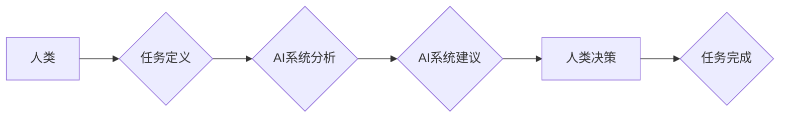

                 

## 人机协作：伦理规范与准则

> 关键词：人机协作、人工智能、伦理规范、准则、责任、透明度、公平性、可解释性、安全

### 1. 背景介绍

人工智能（AI）技术的飞速发展，正在深刻地改变着人类社会各个领域。从医疗保健到金融服务，从交通运输到教育，AI都展现出强大的应用潜力。其中，人机协作作为一种新的工作模式，正逐渐成为未来发展的重要趋势。

人机协作是指人类和人工智能系统共同完成任务的一种合作模式。在这种模式下，人类和AI系统各自发挥各自的优势，相互补充，共同完成复杂的任务。例如，在医疗诊断领域，AI系统可以辅助医生分析病理图像，提高诊断准确率；在金融领域，AI系统可以帮助分析市场数据，提供投资建议。

然而，随着人机协作的深入发展，也随之带来了新的伦理挑战。如何确保人机协作的公平性、透明度和安全性？如何避免AI系统带来的潜在风险？这些问题都需要我们认真思考和探讨。

### 2. 核心概念与联系

**2.1 人机协作模式**

人机协作模式可以分为多种类型，例如：

* **监督式协作:** 人类在整个过程中扮演着主导角色，AI系统辅助人类完成任务。
* **合作式协作:** 人类和AI系统共同参与任务的各个阶段，相互协作完成目标。
* **自主式协作:** AI系统能够独立完成任务，人类只在必要时进行干预。

**2.2 伦理规范与准则**

在人机协作领域，需要制定相应的伦理规范和准则，以确保人机协作的健康发展。这些规范和准则应涵盖以下几个方面：

* **责任:** 明确人机协作中各方的责任和义务，避免责任模糊不清。
* **透明度:** AI系统的决策过程应尽可能透明，以便人类能够理解和监督AI系统的行为。
* **公平性:** AI系统应公平公正地对待所有用户，避免因种族、性别、宗教等因素而产生歧视。
* **安全:** AI系统应安全可靠，避免造成人员伤亡或财产损失。
* **隐私保护:** AI系统应保护用户的隐私信息，避免滥用或泄露用户数据。

**2.3 相关法律法规**

随着人机协作技术的不断发展，各国政府也开始制定相关法律法规，以规范人机协作的应用。例如，欧盟的《通用数据保护条例》（GDPR）就对AI系统的隐私保护提出了明确的要求。

**Mermaid 流程图**



### 3. 核心算法原理 & 具体操作步骤

**3.1 算法原理概述**

人机协作的核心算法通常基于机器学习和深度学习技术。这些算法能够帮助AI系统学习人类的行为模式，并根据学习到的知识，辅助人类完成任务。例如，在自然语言处理领域，AI系统可以使用机器学习算法学习人类的语言表达方式，从而能够理解和生成人类语言。

**3.2 算法步骤详解**

1. **数据收集:** 收集大量相关数据，例如文本数据、图像数据、音频数据等。
2. **数据预处理:** 对收集到的数据进行清洗、转换和格式化，使其能够被AI系统理解。
3. **模型训练:** 使用机器学习算法训练AI模型，使模型能够从数据中学习到规律和知识。
4. **模型评估:** 对训练好的模型进行评估，测试模型的性能和准确性。
5. **模型部署:** 将训练好的模型部署到实际应用场景中，用于辅助人类完成任务。

**3.3 算法优缺点**

**优点:**

* **自动化:** AI系统能够自动完成重复性或复杂的任务，提高工作效率。
* **精准度:** AI系统能够根据数据分析，提供更精准的建议和决策支持。
* **个性化:** AI系统能够根据用户的需求和喜好，提供个性化的服务。

**缺点:**

* **数据依赖:** AI系统需要大量数据进行训练，如果数据质量不高，则会影响AI系统的性能。
* **黑盒问题:** 一些AI算法的决策过程难以理解，这可能会导致缺乏透明度和可解释性。
* **伦理风险:** AI系统可能会出现偏见或歧视，从而带来伦理风险。

**3.4 算法应用领域**

人机协作算法广泛应用于各个领域，例如：

* **医疗保健:** 辅助医生诊断疾病、制定治疗方案。
* **金融服务:** 帮助分析市场数据、识别欺诈行为。
* **教育:** 提供个性化学习辅导、自动批改作业。
* **交通运输:** 辅助驾驶员驾驶车辆、优化交通流量。

### 4. 数学模型和公式 & 详细讲解 & 举例说明

**4.1 数学模型构建**

人机协作的数学模型通常基于概率论和统计学。例如，在决策支持系统中，AI系统可以根据用户的历史行为和当前情况，计算出不同决策方案的概率，并提供建议。

**4.2 公式推导过程**

假设一个决策问题有n个可能的决策方案，每个方案的概率为p1, p2, ..., pn。AI系统可以根据用户的历史行为和当前情况，计算出每个方案的权重，并根据权重进行加权平均，得到最终的决策建议。

**公式:**

```latex
决策建议 = \sum_{i=1}^{n} p_i * w_i
```

其中，$p_i$表示第i个方案的概率，$w_i$表示第i个方案的权重。

**4.3 案例分析与讲解**

例如，在推荐系统中，AI系统可以根据用户的历史浏览记录和评分数据，计算出不同商品的推荐概率。然后，根据用户的兴趣偏好和当前时间等因素，计算出每个商品的权重，并根据权重进行加权平均，得到最终的推荐结果。

### 5. 项目实践：代码实例和详细解释说明

**5.1 开发环境搭建**

* Python 3.x
* TensorFlow 或 PyTorch 等深度学习框架
* Jupyter Notebook 或 VS Code 等代码编辑器

**5.2 源代码详细实现**

```python
import tensorflow as tf

# 定义模型结构
model = tf.keras.models.Sequential([
    tf.keras.layers.Dense(64, activation='relu', input_shape=(10,)),
    tf.keras.layers.Dense(32, activation='relu'),
    tf.keras.layers.Dense(1, activation='sigmoid')
])

# 编译模型
model.compile(optimizer='adam', loss='binary_crossentropy', metrics=['accuracy'])

# 训练模型
model.fit(x_train, y_train, epochs=10)

# 评估模型
loss, accuracy = model.evaluate(x_test, y_test)
print('Loss:', loss)
print('Accuracy:', accuracy)
```

**5.3 代码解读与分析**

这段代码实现了简单的机器学习模型，用于分类任务。

* `tf.keras.models.Sequential` 定义了一个顺序模型，即层级结构的模型。
* `tf.keras.layers.Dense` 定义了一个全连接层，每个神经元都连接到上一层的每个神经元。
* `activation='relu'` 指定了激活函数为ReLU函数，用于引入非线性。
* `input_shape=(10,)` 指定了输入数据的形状为10维向量。
* `optimizer='adam'` 指定了优化器为Adam算法，用于更新模型参数。
* `loss='binary_crossentropy'` 指定了损失函数为二分类交叉熵损失函数。
* `metrics=['accuracy']` 指定了评估指标为准确率。
* `model.fit()` 函数用于训练模型，`x_train` 和 `y_train` 分别为训练数据和标签。
* `model.evaluate()` 函数用于评估模型，`x_test` 和 `y_test` 分别为测试数据和标签。

**5.4 运行结果展示**

训练完成后，模型会输出训练和测试的损失值和准确率。

### 6. 实际应用场景

**6.1 医疗诊断辅助**

AI系统可以辅助医生分析病理图像，识别肿瘤、骨折等疾病，提高诊断准确率。

**6.2 金融风险管理**

AI系统可以分析市场数据，识别欺诈行为、预测风险，帮助金融机构进行风险管理。

**6.3 自动驾驶**

AI系统可以帮助车辆感知周围环境，做出驾驶决策，实现自动驾驶功能。

**6.4 个性化教育**

AI系统可以根据学生的学习进度和兴趣爱好，提供个性化的学习辅导，提高学习效率。

**6.5 未来应用展望**

随着AI技术的不断发展，人机协作将在更多领域得到应用，例如：

* **机器人协作:** 人类和机器人共同完成复杂的任务，例如制造、物流、服务等。
* **虚拟助手:** AI虚拟助手能够理解人类语言，并提供个性化的服务，例如日程安排、信息查询、娱乐等。
* **创意协作:** 人类和AI系统共同进行创作，例如音乐、绘画、写作等。

### 7. 工具和资源推荐

**7.1 学习资源推荐**

* **在线课程:** Coursera、edX、Udacity 等平台提供丰富的AI课程。
* **书籍:** 《深度学习》、《人工智能：一种现代方法》等书籍。
* **开源项目:** TensorFlow、PyTorch 等开源项目提供了丰富的代码示例和学习资源。

**7.2 开发工具推荐**

* **Python:** 人工智能开发的常用编程语言。
* **Jupyter Notebook:** 用于代码编写、数据分析和可视化。
* **VS Code:** 代码编辑器，支持多种编程语言和插件。

**7.3 相关论文推荐**

* **《人机协作中的伦理问题》**
* **《AI算法的可解释性》**
* **《人机协作的未来发展趋势》**

### 8. 总结：未来发展趋势与挑战

**8.1 研究成果总结**

人机协作领域取得了显著的进展，AI系统能够辅助人类完成越来越复杂的任务。

**8.2 未来发展趋势**

* **更智能的AI系统:** AI系统将更加智能，能够更好地理解人类需求和行为。
* **更广泛的应用场景:** 人机协作将应用于更多领域，例如医疗保健、教育、娱乐等。
* **更安全的AI系统:** AI系统将更加安全可靠，能够有效避免潜在风险。

**8.3 面临的挑战**

* **伦理风险:** AI系统可能会出现偏见或歧视，需要制定相应的伦理规范和准则。
* **可解释性问题:** 一些AI算法的决策过程难以理解，需要提高AI系统的可解释性。
* **数据安全问题:** AI系统需要大量数据进行训练，需要加强数据安全保护。

**8.4 研究展望**

未来，人机协作领域的研究将更加注重伦理、安全和可解释性。


### 9. 附录：常见问题与解答

**9.1 如何确保AI系统的公平性？**

* 使用公平的训练数据，避免数据中存在偏见。
* 开发公平的算法模型，避免算法本身产生歧视。
* 对AI系统的决策过程进行透明化，以便人类能够监督和纠正潜在的偏见。

**9.2 如何避免AI系统的黑盒问题？**

* 使用可解释的算法模型，例如决策树、规则模型等。
* 开发可视化工具，帮助人类理解AI系统的决策过程。
* 进行模型解释性分析，解释AI系统的决策结果背后的原因。

**9.3 如何保护AI系统的安全？**

* 使用安全的训练数据，避免数据泄露和攻击。
* 开发安全的AI模型，避免模型被恶意利用。
* 进行安全测试和评估，确保AI系统的安全可靠。


作者：禅与计算机程序设计艺术 / Zen and the Art of Computer Programming 
<end_of_turn>

