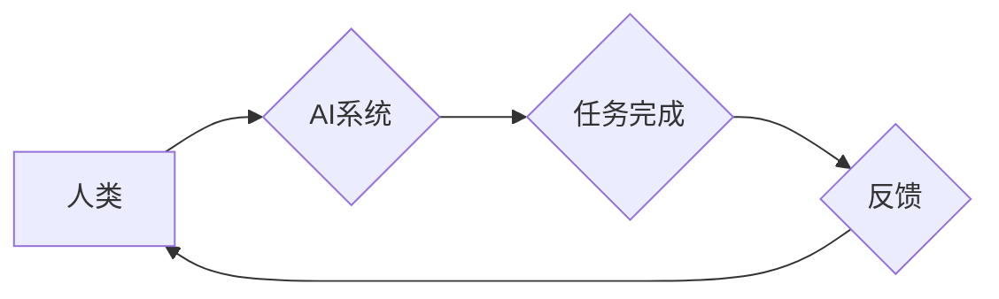

                 

## 人类-AI协作：增强人类与机器之间的信任

> 关键词：人工智能、协作、信任、算法、模型、应用场景、未来趋势

### 1. 背景介绍

人工智能（AI）技术近年来发展迅速，已渗透到各个领域，从自动驾驶到医疗诊断，从个性化推荐到金融风险评估，AI正在改变着我们的生活方式和工作模式。然而，AI技术的发展也引发了一些担忧，例如算法偏见、数据隐私和工作岗位替代等。如何有效地利用AI技术，同时解决其带来的挑战，是当前人工智能领域面临的重要课题。

人类-AI协作是解决上述问题的关键路径之一。通过将人类的智慧和创造力与AI技术的强大计算能力相结合，我们可以构建更加高效、智能、可信赖的系统。然而，实现真正意义上的人类-AI协作，需要建立起人类与机器之间的信任关系。

### 2. 核心概念与联系

**2.1 核心概念**

* **人类-AI协作:** 指人类和人工智能系统共同完成任务的过程，其中人类提供决策、创意和情感理解等方面的支持，而AI系统提供数据分析、计算和自动化等方面的能力。
* **信任:** 在人类-AI协作中，信任是指人类对AI系统的可靠性和安全性有充分的信心，愿意依赖AI系统的决策和行动。

**2.2 联系**

人类-AI协作的核心是建立信任关系。只有当人类对AI系统有足够的信任时，才能充分发挥其协作优势。信任的建立需要基于以下几个方面：

* **透明度:** AI系统的决策过程应该清晰可解释，人类能够理解AI是如何做出决定的。
* **可控性:** 人类应该能够对AI系统的行为进行监督和控制，并在必要时进行干预。
* **安全性:** AI系统应该能够保证数据的安全性和隐私性，避免被恶意攻击或滥用。
* **可靠性:** AI系统应该能够稳定地运行，并提供准确可靠的结果。

**2.3 架构图**



### 3. 核心算法原理 & 具体操作步骤

**3.1 算法原理概述**

在人类-AI协作中，常用的算法包括：

* **强化学习:** AI系统通过与环境交互，学习最优的策略，以获得最大奖励。
* **迁移学习:** AI系统将已学习到的知识应用于新的任务或领域。
* **联邦学习:** 多个分散的AI模型协同学习，而无需共享原始数据。

**3.2 算法步骤详解**

以强化学习为例，其具体操作步骤如下：

1. **环境建模:** 建立一个模拟真实世界的环境，并定义奖励函数。
2. **策略初始化:** 初始化一个策略，用于指导AI系统在环境中采取行动。
3. **交互学习:** AI系统与环境交互，根据环境反馈调整策略，以最大化奖励。
4. **策略更新:** 使用学习到的经验更新策略，使其更加优化。
5. **评估性能:** 在测试环境中评估AI系统的性能，并根据结果进行调整。

**3.3 算法优缺点**

* **优点:** 能够学习复杂的任务，并适应不断变化的环境。
* **缺点:** 需要大量的训练数据和计算资源，训练过程可能很长。

**3.4 算法应用领域**

* **自动驾驶:** 训练AI系统识别道路环境，并做出最优的驾驶决策。
* **机器人控制:** 训练AI系统控制机器人的运动和行为。
* **游戏AI:** 训练AI系统玩游戏，并与人类玩家进行竞争。

### 4. 数学模型和公式 & 详细讲解 & 举例说明

**4.1 数学模型构建**

强化学习的数学模型通常基于马尔可夫决策过程（MDP）。

* **状态空间:** 环境可能处于的各种状态。
* **动作空间:** AI系统可以采取的各种动作。
* **状态转移概率:** 从一个状态到另一个状态的概率。
* **奖励函数:** 评估AI系统在特定状态采取特定动作的奖励。

**4.2 公式推导过程**

强化学习的目标是找到一个最优策略，使得AI系统在长期的互动过程中获得最大的总奖励。

最优策略可以通过动态规划或蒙特卡罗方法来求解。

**4.3 案例分析与讲解**

例如，在玩游戏时，AI系统可以将游戏状态作为输入，并根据奖励函数选择最优的动作。

如果选择正确的动作，AI系统会获得奖励，反之则会受到惩罚。

通过不断地学习和调整策略，AI系统最终可以学会玩得越来越好。

### 5. 项目实践：代码实例和详细解释说明

**5.1 开发环境搭建**

* Python 3.x
* TensorFlow 或 PyTorch 等深度学习框架
* Jupyter Notebook 或 VS Code 等代码编辑器

**5.2 源代码详细实现**

```python
import tensorflow as tf

# 定义神经网络模型
model = tf.keras.models.Sequential([
    tf.keras.layers.Dense(128, activation='relu', input_shape=(input_size,)),
    tf.keras.layers.Dense(64, activation='relu'),
    tf.keras.layers.Dense(output_size)
])

# 定义损失函数和优化器
loss_fn = tf.keras.losses.MeanSquaredError()
optimizer = tf.keras.optimizers.Adam()

# 训练模型
for epoch in range(num_epochs):
    for batch in data_loader:
        with tf.GradientTape() as tape:
            predictions = model(batch['input'])
            loss = loss_fn(batch['target'], predictions)
        gradients = tape.gradient(loss, model.trainable_variables)
        optimizer.apply_gradients(zip(gradients, model.trainable_variables))

# 评估模型性能
loss, accuracy = model.evaluate(test_data)
print(f'Loss: {loss}, Accuracy: {accuracy}')
```

**5.3 代码解读与分析**

这段代码实现了基于深度学习的强化学习模型训练。

* 首先定义了一个神经网络模型，包含多个隐藏层和输出层。
* 然后定义了损失函数和优化器，用于训练模型。
* 接着使用训练数据训练模型，并计算损失值和准确率。
* 最后评估模型在测试数据上的性能。

**5.4 运行结果展示**

训练完成后，可以将模型应用于实际场景，例如控制机器人或玩游戏。

运行结果可以展示AI系统的性能，例如机器人完成任务的成功率或游戏玩家的得分。

### 6. 实际应用场景

**6.1 自动驾驶**

AI系统可以帮助自动驾驶汽车识别道路环境、预测其他车辆的行为，并做出最优的驾驶决策。

**6.2 医疗诊断**

AI系统可以帮助医生分析医学影像，识别疾病，并提供诊断建议。

**6.3 金融风险评估**

AI系统可以帮助金融机构评估客户的信用风险，并做出贷款决策。

**6.4 未来应用展望**

随着AI技术的不断发展，人类-AI协作将在更多领域得到应用，例如教育、娱乐、科学研究等。

### 7. 工具和资源推荐

**7.1 学习资源推荐**

* **书籍:**

    * 《深度学习》
    * 《强化学习：原理、算法和应用》

* **在线课程:**

    * Coursera 上的《机器学习》课程
    * Udacity 上的《人工智能工程师》课程

**7.2 开发工具推荐**

* **Python:** 广泛用于AI开发的编程语言。
* **TensorFlow:** 开源深度学习框架。
* **PyTorch:** 开源深度学习框架。

**7.3 相关论文推荐**

* **AlphaGo论文:** 《Mastering the game of Go with deep neural networks and tree search》
* **GPT-3论文:** 《Language Models are Few-Shot Learners》

### 8. 总结：未来发展趋势与挑战

**8.1 研究成果总结**

近年来，人类-AI协作取得了显著进展，例如AlphaGo战胜人类围棋冠军、GPT-3生成高质量的文本等。

**8.2 未来发展趋势**

* **更强大的AI模型:** 随着计算能力的提升，AI模型将变得更加强大，能够解决更复杂的任务。
* **更广泛的应用场景:** 人类-AI协作将应用于更多领域，例如医疗、教育、科学研究等。
* **更注重伦理和安全:** 人类-AI协作需要更加注重伦理和安全问题，例如算法偏见、数据隐私和工作岗位替代等。

**8.3 面临的挑战**

* **算法解释性:** 许多AI模型的决策过程难以解释，这使得人类难以信任其结果。
* **数据安全:** AI系统需要大量数据进行训练，这可能会导致数据泄露和隐私问题。
* **社会影响:** 人类-AI协作可能会导致工作岗位的减少，需要制定相应的政策应对。

**8.4 研究展望**

未来研究方向包括：

* **开发更可解释的AI模型:** 使人类能够更好地理解AI系统的决策过程。
* **加强数据安全和隐私保护:** 保证AI系统的安全性和可靠性。
* **探索人类-AI协作的伦理和社会影响:** 制定相应的政策和规范，引导AI技术健康发展。

### 9. 附录：常见问题与解答

**9.1 如何提高AI系统的信任度？**

可以通过以下方式提高AI系统的信任度：

* **提高算法透明度:** 使AI系统的决策过程更加清晰可解释。
* **增强用户控制:** 赋予用户对AI系统的监督和控制权。
* **保证数据安全:** 加强数据加密和访问控制，防止数据泄露。
* **建立反馈机制:** 鼓励用户反馈AI系统的表现，并根据反馈进行改进。

**9.2 人类-AI协作会取代人类工作吗？**

人类-AI协作更像是人类和AI系统共同完成任务，而不是取代。

AI系统可以帮助人类完成重复性、繁琐性工作，而人类则可以专注于需要创造力和决策能力的工作。

**9.3 如何应对AI算法的偏见？**

AI算法的偏见通常来自于训练数据本身。

可以通过以下方式应对AI算法的偏见：

* 使用更加多样化的训练数据。
* 开发算法检测和缓解偏见的机制。
* 提高算法透明度，以便人类能够识别和纠正偏见。


作者：禅与计算机程序设计艺术 / Zen and the Art of Computer Programming 
<end_of_turn>

