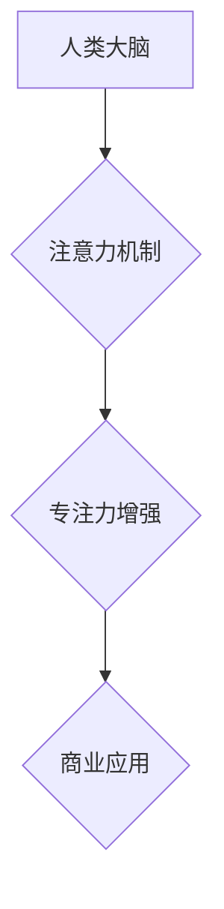

                 

## 人类注意力增强：提升专注力和注意力在商业中的价值

> 关键词：注意力增强、专注力、深度学习、神经网络、脑机接口、商业应用、认知科学、人类-计算机交互

## 1. 背景介绍

在当今信息爆炸的时代，人类的注意力面临着前所未有的挑战。来自社交媒体、电子邮件、新闻推送等各种信息源的不断干扰，使得人们难以集中精力完成任务，效率低下，工作压力增加。注意力力的下降不仅影响个人生活，也对商业发展造成严重阻碍。

商业领域对专注力的需求日益增长。高效的决策、创新思维、高质量的客户服务都离不开高度的注意力集中。然而，注意力力的下降趋势正在威胁着商业的竞争力。因此，如何提升人类注意力，增强专注力，成为一个亟待解决的难题。

## 2. 核心概念与联系

**2.1  注意力机制**

注意力机制（Attention Mechanism）是近年来深度学习领域兴起的一种重要技术，它能够帮助模型聚焦于输入数据中最重要的部分，从而提高模型的性能。注意力机制的灵感来源于人类的注意力机制，它模拟了人类在处理信息时，会根据信息的重要性选择性地关注某些部分的过程。

**2.2  专注力与注意力**

专注力（Focus）是指能够将注意力集中在特定目标上，排除干扰，持续一段时间的能力。注意力（Attention）则是指对特定信息或刺激的感知和认知。专注力是注意力的一种高级形式，它需要对目标的理解和意图，并能够抑制其他不相关的信息。

**2.3  商业应用场景**

注意力增强技术在商业领域有着广泛的应用场景，例如：

* **提升员工工作效率:** 通过注意力增强技术，帮助员工集中注意力，提高工作效率，减少错误率。
* **增强客户服务体验:** 利用注意力增强技术，帮助客服人员快速识别客户需求，提供更精准的解决方案，提升客户满意度。
* **促进创新思维:** 通过注意力增强技术，帮助员工突破思维定式，激发创新灵感，促进企业创新发展。

**2.4  架构图**



## 3. 核心算法原理 & 具体操作步骤

**3.1  算法原理概述**

注意力增强算法通常基于深度学习技术，例如卷积神经网络（CNN）和循环神经网络（RNN）。这些算法通过学习数据中的模式和特征，识别出影响注意力和专注力的因素，并通过调整神经网络的权重，增强对重要信息的关注，抑制对干扰信息的响应。

**3.2  算法步骤详解**

1. **数据收集和预处理:** 收集大量与注意力和专注力相关的脑电信号、眼动数据、行为数据等，并进行预处理，例如去噪、特征提取等。
2. **模型构建:** 选择合适的深度学习模型，例如CNN或RNN，并根据数据特点进行模型结构设计。
3. **模型训练:** 使用训练数据训练模型，调整模型参数，使模型能够准确识别影响注意力和专注力的因素。
4. **模型评估:** 使用测试数据评估模型的性能，例如准确率、召回率等。
5. **模型部署:** 将训练好的模型部署到实际应用场景中，例如脑机接口设备、智能手机应用程序等。

**3.3  算法优缺点**

**优点:**

* **高精度:** 深度学习算法能够学习到复杂的数据模式，实现高精度的注意力增强。
* **可定制性强:** 可以根据不同的应用场景和数据特点，定制不同的模型结构和训练策略。
* **持续改进:** 随着数据量的增加和算法的改进，注意力增强算法的性能将不断提升。

**缺点:**

* **数据依赖性强:** 深度学习算法需要大量的训练数据，否则模型性能难以保证。
* **计算资源需求高:** 训练深度学习模型需要大量的计算资源，成本较高。
* **解释性差:** 深度学习模型的内部工作机制较为复杂，难以解释模型的决策过程。

**3.4  算法应用领域**

注意力增强算法在以下领域有着广泛的应用前景：

* **医疗保健:** 帮助患者集中注意力，进行康复训练，治疗注意力缺陷多动障碍（ADHD）等疾病。
* **教育:** 帮助学生提高学习效率，增强记忆力，提升学习成绩。
* **游戏:** 增强游戏玩家的沉浸感和体验，提高游戏竞技水平。
* **人机交互:** 提高人机交互的自然性和流畅性，例如语音识别、机器翻译等。

## 4. 数学模型和公式 & 详细讲解 & 举例说明

**4.1  数学模型构建**

注意力机制通常使用一个加权求和函数来计算注意力分数，该函数将输入序列中的每个元素与一个查询向量进行比较，并根据相似度分配权重。

**4.2  公式推导过程**

假设输入序列为 $X = \{x_1, x_2, ..., x_n\}$, 查询向量为 $q$,  则注意力分数 $a_{ij}$ 可以表示为：

$$a_{ij} = \frac{exp(score(x_i, q))}{\sum_{k=1}^{n} exp(score(x_k, q))}$$

其中，$score(x_i, q)$ 是 $x_i$ 和 $q$ 之间的相似度得分，可以使用点积、余弦相似度等方式计算。

**4.3  案例分析与讲解**

例如，在机器翻译任务中，注意力机制可以帮助模型关注源语言句子中与目标语言句子相关的关键词，从而提高翻译的准确性和流畅性。

## 5. 项目实践：代码实例和详细解释说明

**5.1  开发环境搭建**

* Python 3.x
* TensorFlow 或 PyTorch 深度学习框架
* NumPy 科学计算库
* Matplotlib 数据可视化库

**5.2  源代码详细实现**

```python
import tensorflow as tf

# 定义注意力机制层
class AttentionLayer(tf.keras.layers.Layer):
    def __init__(self, units):
        super(AttentionLayer, self).__init__()
        self.W1 = tf.keras.layers.Dense(units)
        self.W2 = tf.keras.layers.Dense(units)
        self.v = tf.keras.layers.Dense(1)

    def call(self, inputs):
        # inputs: (batch_size, sequence_length, embedding_dim)
        query = self.W1(inputs)
        key = self.W2(inputs)
        value = inputs
        scores = tf.matmul(query, key, transpose_b=True)
        scores = scores / tf.math.sqrt(tf.cast(units, tf.float32))
        attention_weights = tf.nn.softmax(scores, axis=-1)
        context_vector = tf.matmul(attention_weights, value)
        return context_vector

# 使用注意力机制层
model = tf.keras.Sequential([
    tf.keras.layers.Embedding(input_dim=vocab_size, output_dim=embedding_dim),
    AttentionLayer(units=embedding_dim),
    tf.keras.layers.Dense(units=output_dim, activation='softmax')
])
```

**5.3  代码解读与分析**

* `AttentionLayer` 类定义了一个注意力机制层，包含三个密集层：`W1` 用于生成查询向量，`W2` 用于生成键向量，`v` 用于计算上下文向量。
* `call` 方法实现注意力机制的计算过程，包括计算注意力分数、归一化注意力分数、计算上下文向量等步骤。
* 代码示例展示了如何将注意力机制层集成到一个简单的文本分类模型中。

**5.4  运行结果展示**

运行代码并使用训练数据训练模型，可以评估模型的性能，例如准确率、召回率等。

## 6. 实际应用场景

**6.1  提升员工工作效率**

注意力增强技术可以帮助员工集中注意力，提高工作效率。例如，一些软件应用程序可以利用脑电信号或眼动数据，识别员工的注意力状态，并提供相应的提醒或干预措施，帮助员工保持专注。

**6.2  增强客户服务体验**

注意力增强技术可以帮助客服人员快速识别客户需求，提供更精准的解决方案。例如，一些聊天机器人可以使用注意力机制，分析客户的聊天记录，识别客户的意图和问题，并提供相应的帮助。

**6.3  促进创新思维**

注意力增强技术可以帮助员工突破思维定式，激发创新灵感。例如，一些设计软件可以使用注意力机制，帮助设计师集中注意力，探索新的创意方向。

**6.4  未来应用展望**

注意力增强技术在未来将有更广泛的应用场景，例如：

* **个性化教育:** 根据学生的注意力特点，提供个性化的学习方案。
* **远程医疗:** 帮助医生远程诊断患者，提高诊断准确率。
* **增强现实:** 增强现实体验，提高用户沉浸感。

## 7. 工具和资源推荐

**7.1  学习资源推荐**

* **书籍:**
    * 《深度学习》 by Ian Goodfellow, Yoshua Bengio, Aaron Courville
    * 《注意力机制》 by Christopher Manning, Hinrich Schütze
* **在线课程:**
    * Coursera: 深度学习 Specialization
    * Udacity: 自然语言处理 Nanodegree

**7.2  开发工具推荐**

* **TensorFlow:** https://www.tensorflow.org/
* **PyTorch:** https://pytorch.org/
* **Keras:** https://keras.io/

**7.3  相关论文推荐**

* 《Attention Is All You Need》 by Vaswani et al.
* 《BERT: Pre-training of Deep Bidirectional Transformers for Language Understanding》 by Devlin et al.

## 8. 总结：未来发展趋势与挑战

**8.1  研究成果总结**

注意力增强技术在近年来取得了显著的进展，在多个领域展现出巨大的应用潜力。深度学习算法能够有效地学习注意力机制，提高模型的性能。

**8.2  未来发展趋势**

* **更精准的注意力机制:** 研究更精准的注意力机制，能够更好地理解和模拟人类的注意力机制。
* **跨模态注意力:** 研究跨模态注意力机制，能够处理不同模态的数据，例如文本、图像、音频等。
* **可解释性增强:** 研究注意力机制的可解释性，能够更好地理解模型的决策过程。

**8.3  面临的挑战**

* **数据获取和标注:** 训练注意力增强算法需要大量的标注数据，数据获取和标注成本较高。
* **模型复杂度:** 复杂的注意力机制模型训练成本高，部署成本也较高。
* **伦理问题:** 注意力增强技术可能被用于操纵用户行为，需要关注伦理问题。

**8.4  研究展望**

未来，注意力增强技术将继续发展，在更多领域发挥重要作用。研究人员将继续探索更精准、更有效的注意力机制，并解决技术和伦理方面的挑战，推动注意力增强技术走向更广泛的应用。

## 9. 附录：常见问题与解答

**9.1  注意力增强技术与脑机接口有什么关系？**

注意力增强技术可以与脑机接口技术相结合，实现更精准的脑机交互。例如，脑机接口设备可以实时监测用户的脑电信号，识别用户的注意力状态，并根据用户的意图控制外部设备。

**9.2  注意力增强技术是否会让人变得过度依赖技术？**

注意力增强技术应该被视为一种辅助工具，而不是替代人类注意力能力的工具。过度依赖技术可能会导致人类注意力能力退化，因此需要合理使用注意力增强技术，并保持对自身注意力的掌控。


作者：禅与计算机程序设计艺术 / Zen and the Art of Computer Programming 
<end_of_turn>

