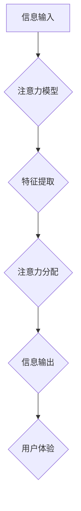

                 

## 人类注意力增强：提升创新能力和创造力

> 关键词：注意力增强、深度学习、脑机接口、认知科学、创新能力、创造力、神经网络、可穿戴设备

## 1. 背景介绍

在当今信息爆炸的时代，人类面临着前所未有的信息洪流。从新闻推送到社交媒体，从电子邮件到视频会议，我们每天都被各种信息所包围。这种信息过载不仅导致注意力分散，还严重影响了我们的工作效率、学习能力和生活质量。 

创新和创造力是人类社会进步的驱动力，而注意力是这两者不可或缺的基础。然而，随着科技发展和生活节奏的加快，人类的注意力正在逐渐被削弱。 

因此，如何增强人类注意力，提升创新能力和创造力，成为当今科技领域的重要课题。

## 2. 核心概念与联系

### 2.1 注意力机制

注意力机制是近年来深度学习领域取得的重要突破，它模拟了人类大脑在处理信息时选择性关注特定内容的能力。 

注意力机制的核心思想是通过赋予不同输入元素不同的权重，从而突出重要信息，抑制无关信息。 

在深度学习模型中，注意力机制通常被应用于序列数据处理，例如机器翻译、文本摘要和语音识别等任务。

### 2.2 人脑认知与注意力

人类的注意力是一个复杂的心理过程，涉及到多个脑区协同工作。 

研究表明，前额叶皮层、顶叶皮层和后 parietal 皮层等脑区在注意力控制中发挥着重要作用。 

注意力机制的出现，为理解人类认知过程提供了新的视角，也为开发增强人类注意力的技术提供了理论基础。

### 2.3  注意力增强技术架构



**架构说明：**

* **信息输入:** 包括来自各种传感器的数据，例如视觉、听觉、触觉等。
* **注意力模型:** 利用深度学习算法，学习识别和分配注意力。
* **特征提取:** 从输入信息中提取关键特征。
* **注意力分配:** 根据特征重要性，分配不同的注意力权重。
* **信息输出:**  选择性地输出重要信息，增强用户体验。
* **用户体验:**  通过增强注意力，提升用户的工作效率、学习能力和生活质量。

## 3. 核心算法原理 & 具体操作步骤

### 3.1 算法原理概述

注意力机制的核心算法原理是通过学习一个注意力权重向量，来对输入序列中的每个元素进行加权求和。 

注意力权重向量可以根据输入序列的特征和任务目标进行动态调整，从而突出重要信息，抑制无关信息。

### 3.2 算法步骤详解

1. **输入序列编码:** 将输入序列中的每个元素编码成向量表示。
2. **查询、键、值矩阵计算:** 对编码后的向量进行线性变换，得到查询 (query)、键 (key) 和值 (value) 三个矩阵。
3. **注意力权重计算:** 计算查询向量与每个键向量的相似度，得到注意力权重向量。
4. **加权求和:** 根据注意力权重向量，对值向量进行加权求和，得到输出向量。

### 3.3 算法优缺点

**优点:**

* 可以有效地捕捉输入序列中的长距离依赖关系。
* 可以根据任务目标动态调整注意力权重，提高模型的泛化能力。
* 在许多自然语言处理任务中取得了优异的性能。

**缺点:**

* 计算复杂度较高，训练时间较长。
* 对训练数据的质量要求较高。
* 难以解释注意力权重向量背后的含义。

### 3.4 算法应用领域

注意力机制在自然语言处理、计算机视觉、语音识别等领域都有广泛的应用，例如:

* **机器翻译:**  注意力机制可以帮助机器翻译模型更好地理解句子结构和语义，提高翻译质量。
* **文本摘要:**  注意力机制可以帮助文本摘要模型识别重要信息，生成更简洁准确的摘要。
* **图像识别:**  注意力机制可以帮助图像识别模型关注图像中的关键区域，提高识别准确率。

## 4. 数学模型和公式 & 详细讲解 & 举例说明

### 4.1 数学模型构建

注意力机制的数学模型可以表示为以下公式：

$$
\text{Attention}(Q, K, V) = \text{softmax}\left(\frac{Q K^T}{\sqrt{d_k}}\right) V
$$

其中：

* $Q$：查询矩阵
* $K$：键矩阵
* $V$：值矩阵
* $d_k$：键向量的维度
* $\text{softmax}$：softmax 函数，用于将注意力权重归一化

### 4.2 公式推导过程

注意力权重计算公式的推导过程如下：

1. 计算查询向量 $q$ 与每个键向量 $k$ 的点积：

$$
\text{score}(q, k) = q \cdot k
$$

2. 对所有键向量的点积进行归一化，得到注意力权重向量：

$$
\text{attention}(k) = \frac{\text{exp}(\text{score}(q, k))}{\sum_{k'} \text{exp}(\text{score}(q, k'))}
$$

3. 将注意力权重向量与值向量 $v$ 进行加权求和，得到输出向量：

$$
\text{output} = \sum_{k} \text{attention}(k) v
$$

### 4.3 案例分析与讲解

假设我们有一个句子 "The cat sat on the mat"，我们想使用注意力机制来识别句子中最重要的词语。

我们可以将每个词语编码成向量表示，然后计算查询向量与每个键向量的点积。 

通过softmax 函数，我们可以得到每个词语的注意力权重，权重高的词语表示其在句子中更为重要。

例如，在该句子中，"cat" 和 "sat" 的注意力权重可能较高，因为它们是句子中的核心动词和主语。

## 5. 项目实践：代码实例和详细解释说明

### 5.1 开发环境搭建

* Python 3.7+
* TensorFlow 2.0+
* PyTorch 1.0+
* Jupyter Notebook

### 5.2 源代码详细实现

```python
import tensorflow as tf

# 定义注意力机制
def attention_layer(inputs, key_dim):
    # 计算查询、键、值矩阵
    query = tf.keras.layers.Dense(key_dim, activation='linear')(inputs)
    key = tf.keras.layers.Dense(key_dim, activation='linear')(inputs)
    value = tf.keras.layers.Dense(key_dim, activation='linear')(inputs)

    # 计算注意力权重
    attention_weights = tf.keras.layers.Lambda(lambda x: tf.nn.softmax(x, axis=-1))(tf.matmul(query, key, transpose_b=True) / tf.math.sqrt(tf.cast(key_dim, tf.float32)))

    # 加权求和
    output = tf.matmul(attention_weights, value)
    return output

# 示例使用
inputs = tf.random.normal((10, 512))
key_dim = 64
output = attention_layer(inputs, key_dim)
print(output.shape)
```

### 5.3 代码解读与分析

* 该代码定义了一个简单的注意力机制层，它接受输入序列和键维度作为参数。
* 首先，它使用三个全连接层分别计算查询、键和值矩阵。
* 然后，它计算查询向量与每个键向量的点积，并使用softmax 函数将其归一化，得到注意力权重向量。
* 最后，它将注意力权重向量与值向量进行加权求和，得到输出向量。

### 5.4 运行结果展示

运行该代码后，输出的 `output` 形状为 `(10, 64)`，表示注意力机制层将输入序列中的每个元素映射到一个 64 维的向量。

## 6. 实际应用场景

### 6.1  医疗诊断辅助

注意力机制可以帮助医生更准确地识别医学图像中的关键区域，例如肿瘤、骨折等，从而提高诊断准确率。

### 6.2  教育领域个性化学习

注意力机制可以根据学生的学习进度和兴趣，个性化推荐学习内容，提高学习效率。

### 6.3  智能客服系统

注意力机制可以帮助智能客服系统更好地理解用户的需求，提供更精准的回复。

### 6.4  未来应用展望

随着人工智能技术的不断发展，注意力机制将在更多领域得到应用，例如：

* **脑机接口:**  注意力机制可以帮助脑机接口系统更准确地识别用户的意图，实现人机交互的自然化。
* **增强现实:**  注意力机制可以帮助增强现实系统识别用户的视线焦点，提供更沉浸式的体验。
* **自动驾驶:**  注意力机制可以帮助自动驾驶系统识别道路上的关键信息，提高驾驶安全。

## 7. 工具和资源推荐

### 7.1 学习资源推荐

* **书籍:**
    * "深度学习" by Ian Goodfellow, Yoshua Bengio, and Aaron Courville
    * "Attention Is All You Need" by Vaswani et al.
* **在线课程:**
    * Coursera: Deep Learning Specialization
    * Udacity: Deep Learning Nanodegree

### 7.2 开发工具推荐

* **TensorFlow:**  开源深度学习框架
* **PyTorch:**  开源深度学习框架
* **Keras:**  高层深度学习 API

### 7.3 相关论文推荐

* "Attention Is All You Need"
* "BERT: Pre-training of Deep Bidirectional Transformers for Language Understanding"
* "Transformer-XL: Attentive Language Models Beyond a Fixed-Length Context"

## 8. 总结：未来发展趋势与挑战

### 8.1 研究成果总结

近年来，注意力机制在人工智能领域取得了显著的进展，并在许多任务中取得了优异的性能。 

注意力机制的出现，为理解人类认知过程提供了新的视角，也为开发增强人类注意力的技术提供了理论基础。

### 8.2 未来发展趋势

未来，注意力机制的研究将朝着以下几个方向发展：

* **更有效的注意力机制:**  开发更有效的注意力机制，提高模型的效率和性能。
* **多模态注意力机制:**  研究跨模态的注意力机制，例如将文本、图像、音频等多种模态信息融合在一起。
* **可解释性注意力机制:**  研究可解释性注意力机制，使得注意力权重更容易被理解和解释。

### 8.3 面临的挑战

注意力机制也面临着一些挑战：

* **计算复杂度:**  一些注意力机制的计算复杂度较高，难以在资源有限的设备上运行。
* **数据依赖性:**  注意力机制的性能依赖于训练数据的质量，缺乏高质量数据的限制其应用范围。
* **可解释性:**  注意力机制的内部工作机制难以解释，这限制了其在一些安全敏感领域的应用。

### 8.4 研究展望

尽管面临着一些挑战，但注意力机制仍然是一个非常有前景的研究方向。 

随着人工智能技术的不断发展，相信注意力机制将在未来发挥更加重要的作用，帮助我们更好地理解人类认知过程，并开发出更智能、更强大的人工智能系统。

## 9. 附录：常见问题与解答

**Q1: 注意力机制与传统的神经网络有什么区别？**

**A1:** 传统的神经网络通常使用全连接层，将输入数据逐层处理。而注意力机制则可以学习识别输入序列中的重要信息，并对这些信息进行加权求和，从而提高模型的性能。

**Q2: 注意力机制的应用场景有哪些？**

**A2:** 注意力机制在自然语言处理、计算机视觉、语音识别等领域都有广泛的应用，例如机器翻译、文本摘要、图像识别等。

**Q3: 如何评估注意力机制的性能？**

**A3:** 注意力机制的性能通常通过在特定任务上的准确率、召回率等指标进行评估。


作者：禅与计算机程序设计艺术 / Zen and the Art of Computer Programming 
<end_of_turn>

