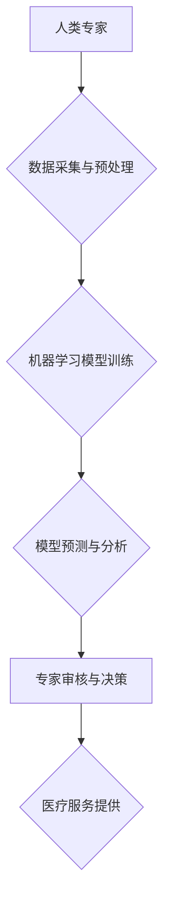

                 

## 人类计算：医疗保健领域的应用

> 关键词： 人类计算、医疗保健、人工智能、机器学习、深度学习、自然语言处理、图像识别

## 1. 背景介绍

医疗保健领域正处于数字化转型和智能化升级的关键时期。海量医疗数据、先进的计算技术和不断涌现的人工智能 (AI) 应用，为医疗保健的未来发展带来了前所未有的机遇。人类计算作为一种新兴的计算范式，将人类的智慧和机器的计算能力有机结合，在医疗保健领域展现出巨大的潜力。

传统的医疗诊断和治疗模式往往依赖于医生的经验和判断，存在着主观性、局限性和效率问题。而人类计算通过将人类的专业知识和机器学习算法相结合，可以实现更精准、更智能、更便捷的医疗服务。

## 2. 核心概念与联系

**2.1 人类计算的概念**

人类计算是指将人类的智慧和机器的计算能力相结合，通过协同工作来解决复杂问题的一种计算范式。它强调人类和机器的互补性，认为人类的创造力、洞察力和判断能力与机器的计算速度、数据处理能力和逻辑推理能力相辅相成。

**2.2 人类计算与医疗保健的联系**

在医疗保健领域，人类计算可以应用于多个方面，例如：

* **疾病诊断:** 利用机器学习算法分析患者的病历、影像资料和基因信息，辅助医生进行疾病诊断。
* **个性化治疗:** 根据患者的个体特征和病史，制定个性化的治疗方案。
* **药物研发:** 利用机器学习算法加速药物研发过程，发现新的药物靶点和候选药物。
* **医疗影像分析:** 利用深度学习算法分析医学影像，辅助医生进行病灶识别和定位。
* **患者管理:** 利用自然语言处理技术分析患者的医疗记录和沟通记录，提高患者管理效率。

**2.3 人类计算架构**



## 3. 核心算法原理 & 具体操作步骤

**3.1 算法原理概述**

人类计算在医疗保健领域中主要依赖于机器学习算法，例如：

* **监督学习:** 利用标记数据训练模型，预测新的数据类别或值。
* **无监督学习:** 利用未标记数据发现数据中的潜在模式和结构。
* **强化学习:** 通过试错学习，使模型在特定环境中获得最大奖励。

**3.2 算法步骤详解**

以监督学习为例，其具体操作步骤如下：

1. **数据收集:** 收集相关医疗数据，例如患者病历、影像资料、基因信息等。
2. **数据预处理:** 对收集到的数据进行清洗、转换和特征工程，使其适合机器学习模型训练。
3. **模型选择:** 根据具体任务选择合适的机器学习模型，例如支持向量机、决策树、神经网络等。
4. **模型训练:** 利用标记数据训练选择的机器学习模型，调整模型参数，使其能够准确预测新的数据类别或值。
5. **模型评估:** 利用测试数据评估模型的性能，例如准确率、召回率、F1-score等。
6. **模型部署:** 将训练好的模型部署到实际应用场景中，用于疾病诊断、个性化治疗等。

**3.3 算法优缺点**

**优点:**

* **高准确率:** 机器学习算法能够学习复杂的模式和关系，实现高准确率的预测。
* **自动化程度高:** 机器学习算法可以自动化完成数据分析和预测任务，提高效率。
* **可扩展性强:** 机器学习算法可以处理海量数据，满足医疗保健领域的需求。

**缺点:**

* **数据依赖性强:** 机器学习算法需要大量高质量的数据进行训练，否则性能会下降。
* **解释性弱:** 一些机器学习模型的决策过程难以解释，难以获得用户的信任。
* **算法偏差:** 如果训练数据存在偏差，模型也会产生偏差，导致不公平的结果。

**3.4 算法应用领域**

* **疾病诊断:** 癌症、心血管疾病、糖尿病等。
* **药物研发:** 新药发现、药物筛选、药物安全性评估。
* **医疗影像分析:** X光片、CT扫描、MRI等影像数据的分析和解读。
* **患者管理:** 患者风险评估、疾病预警、个性化护理方案。

## 4. 数学模型和公式 & 详细讲解 & 举例说明

**4.1 数学模型构建**

在人类计算中，常用的数学模型包括：

* **线性回归:** 用于预测连续变量，例如患者的年龄、血压等。
* **逻辑回归:** 用于预测分类变量，例如患者是否患有某种疾病。
* **支持向量机:** 用于分类和回归，能够处理高维数据。
* **神经网络:** 用于复杂模式的学习，例如图像识别、自然语言处理。

**4.2 公式推导过程**

以线性回归为例，其目标是找到一条直线，使得预测值与真实值之间的误差最小。

假设我们有n个样本数据，每个样本包含一个输入特征x和一个输出特征y。线性回归模型的公式如下：

$$y = w_0 + w_1x$$

其中，$w_0$和$w_1$是模型的参数，需要通过训练数据进行学习。

为了最小化预测值与真实值之间的误差，我们使用均方误差作为损失函数：

$$Loss = \frac{1}{n}\sum_{i=1}^{n}(y_i - \hat{y}_i)^2$$

其中，$y_i$是真实值，$\hat{y}_i$是预测值。

通过梯度下降算法，我们可以迭代更新模型参数，使得损失函数最小化。

**4.3 案例分析与讲解**

假设我们想利用线性回归模型预测患者的年龄，已知患者的体重和身高数据。

我们可以将体重和身高作为输入特征，年龄作为输出特征，训练一个线性回归模型。

通过训练数据，模型会学习到体重和身高与年龄之间的关系，并得到相应的参数$w_0$和$w_1$。

然后，我们可以利用训练好的模型预测新的患者的年龄，只需要输入其体重和身高数据即可。

## 5. 项目实践：代码实例和详细解释说明

**5.1 开发环境搭建**

* 操作系统: Ubuntu 20.04
* Python 版本: 3.8
* 必要的库: scikit-learn, numpy, pandas

**5.2 源代码详细实现**

```python
import pandas as pd
from sklearn.linear_model import LinearRegression
from sklearn.model_selection import train_test_split

# 加载数据
data = pd.read_csv("patient_data.csv")

# 选择特征和目标变量
X = data[['weight', 'height']]
y = data['age']

# 将数据划分为训练集和测试集
X_train, X_test, y_train, y_test = train_test_split(X, y, test_size=0.2, random_state=42)

# 创建线性回归模型
model = LinearRegression()

# 训练模型
model.fit(X_train, y_train)

# 预测测试集数据
y_pred = model.predict(X_test)

# 评估模型性能
from sklearn.metrics import mean_squared_error
mse = mean_squared_error(y_test, y_pred)
print(f"Mean Squared Error: {mse}")
```

**5.3 代码解读与分析**

1. 首先，我们加载数据并选择特征和目标变量。
2. 然后，我们将数据划分为训练集和测试集，用于训练和评估模型。
3. 接下来，我们创建线性回归模型并训练模型。
4. 训练完成后，我们可以利用模型预测测试集数据。
5. 最后，我们评估模型性能，例如使用均方误差来衡量预测值与真实值之间的差异。

**5.4 运行结果展示**

运行代码后，会输出模型的均方误差值，该值越小，模型的预测性能越好。

## 6. 实际应用场景

**6.1 疾病诊断辅助系统**

利用机器学习算法分析患者的病历、影像资料和基因信息，辅助医生进行疾病诊断。例如，可以开发一个癌症诊断辅助系统，利用患者的影像资料和基因信息，预测患者是否患有癌症，并提供相应的诊断建议。

**6.2 个性化治疗方案推荐系统**

根据患者的个体特征和病史，制定个性化的治疗方案。例如，可以开发一个糖尿病治疗方案推荐系统，根据患者的年龄、体重、血糖水平等信息，推荐相应的治疗方案。

**6.3 药物研发加速平台**

利用机器学习算法加速药物研发过程，发现新的药物靶点和候选药物。例如，可以开发一个药物靶点发现平台，利用患者的基因信息和疾病数据，预测哪些基因是疾病的潜在靶点。

**6.4 医疗影像分析系统**

利用深度学习算法分析医学影像，辅助医生进行病灶识别和定位。例如，可以开发一个肺癌检测系统，利用患者的CT扫描数据，自动识别肺部肿瘤。

**6.5 患者风险评估系统**

利用机器学习算法分析患者的医疗记录和生活习惯，评估患者患病风险。例如，可以开发一个心血管疾病风险评估系统，根据患者的年龄、血压、血脂等信息，评估患者患心血管疾病的风险。

**6.6 未来应用展望**

随着人工智能技术的不断发展，人类计算在医疗保健领域的应用将更加广泛和深入。未来，我们可以期待以下应用场景：

* **智能医疗助手:** 利用自然语言处理技术，开发智能医疗助手，帮助患者查询医疗信息、预约医生、管理药物等。
* **远程医疗:** 利用人工智能技术，实现远程医疗，让患者在家就能获得医疗服务。
* **精准医疗:** 利用基因信息和人工智能技术，为患者提供个性化的医疗服务。
* **医疗机器人:** 利用人工智能技术，开发医疗机器人，辅助医生进行手术、护理等。

## 7. 工具和资源推荐

**7.1 学习资源推荐**

* **在线课程:** Coursera, edX, Udacity
* **书籍:**
    * 《深度学习》
    * 《机器学习》
    * 《人工智能：一种现代方法》
* **网站:**
    * TensorFlow
    * PyTorch
    * scikit-learn

**7.2 开发工具推荐**

* **Python:** 广泛应用于机器学习和人工智能领域。
* **Jupyter Notebook:** 用于编写和执行Python代码，方便进行数据分析和模型开发。
* **TensorFlow:** 开源深度学习框架。
* **PyTorch:** 开源深度学习框架。

**7.3 相关论文推荐**

* **AlphaFold:** 利用深度学习预测蛋白质结构。
* **BERT:** 基于Transformer的预训练语言模型。
* **GPT-3:** 基于Transformer的生成式语言模型。

## 8. 总结：未来发展趋势与挑战

**8.1 研究成果总结**

人类计算在医疗保健领域取得了显著的成果，例如：

* **疾病诊断:** 机器学习算法能够辅助医生进行疾病诊断，提高诊断准确率。
* **个性化治疗:** 人工智能技术能够帮助制定个性化的治疗方案，提高治疗效果。
* **药物研发:** 人工智能算法能够加速药物研发过程，发现新的药物靶点和候选药物。

**8.2 未来发展趋势**

* **更精准的预测:** 利用更先进的机器学习算法和更大的数据规模，实现更精准的疾病预测和治疗方案推荐。
* **更智能的医疗助手:** 开发更智能的医疗助手，帮助患者管理健康、预约医生、查询医疗信息等。
* **更广泛的应用场景:** 将人类计算应用到更多医疗保健领域，例如远程医疗、精准医疗、医疗机器人等。

**8.3 面临的挑战**

* **数据隐私和安全:** 医疗数据是高度敏感的信息，需要采取有效的措施保护数据隐私和安全。
* **算法解释性和可信度:** 一些机器学习模型的决策过程难以解释，难以获得用户的信任。
* **伦理问题:** 人工智能技术在医疗保健领域的应用可能会引发一些伦理问题，例如算法偏见、医疗决策权等。

**8.4 研究展望**

未来，人类计算在医疗保健领域的应用将更加广泛和深入，需要进一步研究以下问题：

* 如何开发更准确、更智能、更安全的机器学习算法。
* 如何提高算法的解释性和可信度，获得用户的信任。
* 如何解决人工智能技术在医疗保健领域的伦理问题。


## 9. 附录：常见问题与解答

**9.1 如何选择合适的机器学习算法？**

选择合适的机器学习算法取决于具体的应用场景和数据特点。例如，对于分类问题，可以考虑使用支持向量机、决策树或神经网络；对于回归问题，可以考虑使用线性回归或支持向量回归。

**9.2 如何处理医疗数据中的缺失值？**

可以采用多种方法处理医疗数据中的缺失值，例如：

* **删除缺失值:** 如果缺失值较少，可以删除包含缺失值的样本。
* **用均值或中位数填充缺失值:** 如果缺失值较多，可以将缺失值填充为该特征的均值或中位数。
* **使用机器学习算法进行缺失值预测:** 可以使用机器学习算法预测缺失值的取值。

**9.3 如何评估机器学习模型的性能？**

常用的评估指标包括：

* **准确率:** 预测正确的样本数占总样本数的比例。
* **召回率:** 预测正确的正样本数占所有正样本数的比例。
* **F1-score:** 准确率和召回率的调和平均数。
* **AUC:** 曲线下面积，用于评估模型的二分类性能。


作者：禅与计算机程序设计艺术 / Zen and the Art of Computer Programming<end_of_turn>

