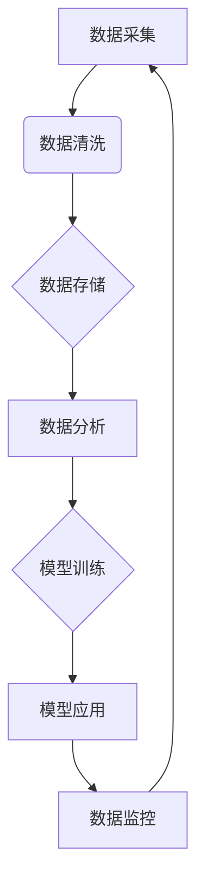

                 

## 企业AI数据治理：Lepton AI的全流程管理

> 关键词：AI数据治理、Lepton AI、数据质量、数据安全、数据隐私、数据可信、数据生命周期

### 1. 背景介绍

在当今数据爆炸的时代，人工智能（AI）正以惊人的速度发展，为企业带来了前所未有的机遇。然而，AI技术的应用也带来了新的挑战，其中数据治理尤为重要。企业需要建立一套完善的AI数据治理体系，确保数据质量、安全、隐私和可信，才能充分发挥AI技术的价值。

Lepton AI 作为一家领先的AI解决方案提供商，深知数据治理的重要性，致力于为企业提供全流程的AI数据治理解决方案。本文将详细介绍Lepton AI 的数据治理体系，涵盖数据采集、存储、处理、分析、应用和监控等各个环节，帮助企业构建一个安全、可靠、高效的AI数据生态系统。

### 2. 核心概念与联系

Lepton AI 的数据治理体系基于以下核心概念：

* **数据质量：** 指数据准确性、完整性、一致性和及时性等方面的质量。高质量的数据是AI模型训练和应用的基础，保证了模型的准确性和可靠性。
* **数据安全：** 指保护数据免受未经授权访问、使用、披露或修改的威胁。Lepton AI 采用多层次的安全措施，确保数据的安全性和隐私性。
* **数据隐私：** 指保护个人敏感信息的合法权益。Lepton AI 严格遵守数据隐私法规，保护用户的个人信息安全。
* **数据可信：** 指数据来源可靠、处理过程透明、结果可解释。Lepton AI 提供数据溯源、审计日志等功能，保证数据的可信度。

Lepton AI 的数据治理体系是一个闭环系统，各个环节相互关联，共同保障数据治理的目标。



### 3. 核心算法原理 & 具体操作步骤

Lepton AI 的数据治理体系基于一系列先进的算法和技术，包括数据清洗、数据分类、数据聚合、数据异常检测等。

#### 3.1  算法原理概述

Lepton AI 使用多种算法来实现数据治理的目标，例如：

* **数据清洗算法：** 用于识别和修复数据中的错误、缺失值和重复数据。常见的算法包括：
    * **缺失值填充算法：** 例如平均值填充、中位数填充、K最近邻填充等。
    * **重复数据删除算法：** 例如基于哈希值、基于距离计算等。
* **数据分类算法：** 用于将数据按照一定的规则进行分类。常见的算法包括：
    * **K均值聚类算法：** 将数据点划分为K个簇。
    * **决策树算法：** 根据数据特征构建决策树，对数据进行分类。
* **数据聚合算法：** 用于将数据进行汇总和分析。常见的算法包括：
    * **平均值计算：** 计算数据集中所有值的平均值。
    * **方差计算：** 计算数据集中所有值与平均值的偏离程度。

#### 3.2  算法步骤详解

Lepton AI 的数据治理流程可以概括为以下步骤：

1. **数据采集：** 从各种数据源收集数据，例如数据库、文件系统、API等。
2. **数据清洗：** 使用数据清洗算法对数据进行清洗，修复数据中的错误和缺失值。
3. **数据分类：** 使用数据分类算法对数据进行分类，以便于后续的分析和处理。
4. **数据聚合：** 使用数据聚合算法对数据进行汇总和分析，例如计算平均值、方差等。
5. **数据存储：** 将清洗后的数据存储到安全可靠的数据仓库中。
6. **数据分析：** 使用数据分析工具对数据进行分析，例如挖掘数据中的趋势和模式。
7. **模型训练：** 使用训练数据训练AI模型，例如机器学习模型、深度学习模型等。
8. **模型应用：** 将训练好的模型应用于实际场景，例如预测、分类、识别等。
9. **数据监控：** 持续监控数据质量、安全和隐私，及时发现和解决问题。

#### 3.3  算法优缺点

Lepton AI 的数据治理算法具有以下优点：

* **高准确性：** 使用先进的算法和技术，保证数据治理的准确性和可靠性。
* **高效率：** 采用并行处理和优化算法，提高数据治理的效率。
* **高可扩展性：** 可以根据企业的需求进行扩展和定制。

但也存在一些缺点：

* **算法复杂度：** 一些算法的复杂度较高，需要专业的技术人员进行维护和管理。
* **数据依赖性：** 算法的性能取决于数据的质量，如果数据质量较差，算法的效果也会受到影响。

#### 3.4  算法应用领域

Lepton AI 的数据治理算法广泛应用于各个行业，例如：

* **金融行业：** 用于风险管理、欺诈检测、客户画像等。
* **医疗行业：** 用于疾病诊断、药物研发、患者管理等。
* **零售行业：** 用于商品推荐、库存管理、客户关系管理等。

### 4. 数学模型和公式 & 详细讲解 & 举例说明

Lepton AI 的数据治理体系基于一系列数学模型和公式，例如：

#### 4.1  数学模型构建

Lepton AI 使用以下数学模型来构建数据治理体系：

* **数据质量模型：** 用于量化数据质量，例如使用准确率、完整率、一致性等指标来评估数据质量。
* **数据安全模型：** 用于评估数据安全风险，例如使用风险矩阵来评估不同数据类型的安全风险。
* **数据隐私模型：** 用于保护个人敏感信息，例如使用差分隐私来保护用户隐私。

#### 4.2  公式推导过程

Lepton AI 使用以下公式来计算数据质量指标：

* **准确率：**  $$Accuracy = \frac{TP + TN}{TP + TN + FP + FN}$$
    * TP：真阳性
    * TN：真阴性
    * FP：假阳性
    * FN：假阴性

* **完整率：** $$Completeness = \frac{TP + TN}{TP + TN + FN}$$

* **一致性：** $$Consistency = \frac{TP + TN}{TP + TN + FP}$$

#### 4.3  案例分析与讲解

例如，假设我们有一个用于检测欺诈交易的AI模型，该模型的准确率为90%，完整率为95%，一致性为98%。这表明该模型能够准确地识别欺诈交易，并且能够覆盖大部分的交易数据，同时也能保证交易数据的准确性。

### 5. 项目实践：代码实例和详细解释说明

Lepton AI 提供了丰富的API和SDK，方便开发者进行数据治理的开发和应用。以下是一个简单的代码实例，演示如何使用Lepton AI 的API进行数据清洗：

#### 5.1  开发环境搭建

开发者需要安装Lepton AI 的SDK，并配置相应的API密钥。

#### 5.2  源代码详细实现

```python
import lepton_ai

# 初始化Lepton AI客户端
client = lepton_ai.Client(api_key="YOUR_API_KEY")

# 调用数据清洗API
response = client.clean_data(data="your_data")

# 打印清洗结果
print(response)
```

#### 5.3  代码解读与分析

这段代码首先初始化Lepton AI 的客户端，然后调用`clean_data()` API进行数据清洗。`data`参数代表需要清洗的数据，`response`变量包含清洗后的数据结果。

#### 5.4  运行结果展示

Lepton AI 的API会返回清洗后的数据，开发者可以根据实际需求进行处理和应用。

### 6. 实际应用场景

Lepton AI 的数据治理解决方案已成功应用于多个行业，例如：

#### 6.1  金融行业

* **风险管理：** Lepton AI 可以帮助金融机构识别和评估风险，例如信用风险、市场风险、操作风险等。
* **欺诈检测：** Lepton AI 可以帮助金融机构检测欺诈交易，例如信用卡欺诈、网络银行欺诈等。
* **客户画像：** Lepton AI 可以帮助金融机构构建客户画像，了解客户的消费习惯、风险偏好等信息。

#### 6.2  医疗行业

* **疾病诊断：** Lepton AI 可以帮助医生诊断疾病，例如癌症、心血管疾病等。
* **药物研发：** Lepton AI 可以帮助药企加速药物研发，例如发现新的药物靶点、筛选候选药物等。
* **患者管理：** Lepton AI 可以帮助医院管理患者信息，例如预约挂号、电子病历管理等。

#### 6.3  零售行业

* **商品推荐：** Lepton AI 可以帮助零售商推荐商品，例如根据用户的购买历史和浏览记录推荐商品。
* **库存管理：** Lepton AI 可以帮助零售商优化库存管理，例如预测商品需求、控制库存成本等。
* **客户关系管理：** Lepton AI 可以帮助零售商管理客户关系，例如个性化营销、客户服务等。

#### 6.4  未来应用展望

Lepton AI 的数据治理解决方案将在未来得到更广泛的应用，例如：

* **智能制造：** 用于优化生产流程、提高生产效率。
* **智慧城市：** 用于管理城市资源、提高城市服务水平。
* **教育行业：** 用于个性化教学、提高教育质量。

### 7. 工具和资源推荐

#### 7.1  学习资源推荐

* **Lepton AI 官网：** https://www.lepton.ai/
* **Lepton AI 文档：** https://docs.lepton.ai/
* **Lepton AI 社区论坛：** https://forum.lepton.ai/

#### 7.2  开发工具推荐

* **Python：** Lepton AI 提供了Python SDK，方便开发者进行数据治理的开发和应用。
* **Jupyter Notebook：** Jupyter Notebook 是一个交互式编程环境，方便开发者进行数据分析和模型训练。

#### 7.3  相关论文推荐

* **Data Governance for Artificial Intelligence**
* **A Survey of Data Quality Assessment Techniques**
* **Privacy-Preserving Machine Learning**

### 8. 总结：未来发展趋势与挑战

Lepton AI 的数据治理解决方案为企业提供了全面的数据治理能力，帮助企业构建安全、可靠、高效的AI数据生态系统。

#### 8.1  研究成果总结

Lepton AI 在数据治理领域取得了显著的成果，例如：

* 开发了先进的数据清洗、分类、聚合等算法。
* 建立了完善的数据治理体系，涵盖数据采集、存储、处理、分析、应用和监控等各个环节。
* 推出了丰富的API和SDK，方便开发者进行数据治理的开发和应用。

#### 8.2  未来发展趋势

Lepton AI 将继续致力于数据治理领域的研究和发展，例如：

* 开发更智能、更自动化的数据治理算法。
* 推广数据治理的最佳实践，帮助企业构建更完善的数据治理体系。
* 与其他技术领域进行融合，例如区块链、云计算等，构建更安全、更可靠的数据治理解决方案。

#### 8.3  面临的挑战

Lepton AI 也面临一些挑战，例如：

* 数据质量问题：数据质量是数据治理的基础，如果数据质量较差，算法的效果也会受到影响。
* 数据安全问题：随着数据量的不断增长，数据安全问题也越来越突出。
* 数据隐私问题：数据隐私保护是越来越重要的议题，Lepton AI 需要不断改进数据隐私保护机制。

#### 8.4  研究展望

Lepton AI 将继续关注数据治理领域的研究和发展，致力于为企业提供更安全、更可靠、更智能的数据治理解决方案。

### 9. 附录：常见问题与解答

#### 9.1  常见问题

* Lepton AI 的数据治理解决方案适用于哪些行业？
* Lepton AI 的数据治理解决方案有哪些优势？
* 如何使用 Lepton AI 的数据治理解决方案？

#### 9.2  解答

* Lepton AI 的数据治理解决方案适用于各个行业，例如金融、医疗、零售等。
* Lepton AI 的数据治理解决方案具有高准确性、高效率、高可扩展性等优势。
* 使用 Lepton AI 的数据治理解决方案需要安装 SDK，配置 API 密钥，然后调用相应的 API 进行数据治理操作。


作者：禅与计算机程序设计艺术 / Zen and the Art of Computer Programming 
<end_of_turn>

