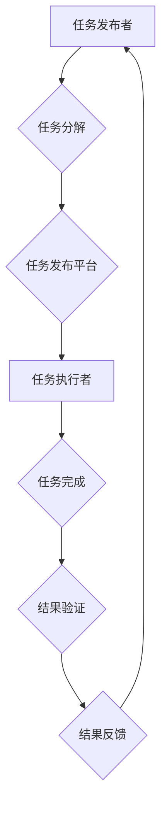

                 

## 众包：汇聚点滴智慧，解决重大难题

> 关键词：众包、协同计算、微任务、人工智能、大数据、云计算、开源

### 1. 背景介绍

在信息时代，数据爆炸和计算能力的飞速发展为解决复杂问题提供了新的机遇。传统的中心化开发模式面临着效率低下、成本高昂、人才短缺等挑战。而众包，作为一种新型的协同计算模式，通过将任务分解为微任务，并利用互联网平台将这些任务分配给全球范围内的志愿者或专业人员，有效地解决了上述问题。

众包的本质是将任务的执行权分散到网络上的众多参与者，通过他们的集体智慧和协作，完成原本难以实现的复杂任务。这种模式的出现，标志着计算力的民主化，也为解决重大难题提供了全新的思路。

### 2. 核心概念与联系

**2.1 核心概念**

* **众包 (Crowdsourcing):**  一种通过互联网平台，将任务分配给全球范围内的志愿者或专业人员，并通过激励机制引导他们完成任务的协同计算模式。
* **微任务 (Micro-task):** 将大型复杂任务分解成一个个简单易懂、独立完成的小任务。
* **平台 (Platform):** 众包平台是连接任务发布者和任务执行者的桥梁，提供任务发布、分配、管理、激励等功能。

**2.2 核心架构**



**2.3 联系**

众包模式的核心是将任务分解为微任务，并通过互联网平台将这些微任务分配给全球范围内的参与者。平台扮演着连接任务发布者和任务执行者的角色，提供任务发布、分配、管理、激励等功能，确保任务的顺利完成。

### 3. 核心算法原理 & 具体操作步骤

**3.1 算法原理概述**

众包的核心算法原理是基于**分而治之**的思想，将复杂的任务分解成一系列简单易懂的微任务，并通过**激励机制**引导参与者完成这些微任务。

**3.2 算法步骤详解**

1. **任务分解:** 将大型复杂任务分解成一个个独立可执行的微任务。
2. **任务发布:** 将微任务发布到众包平台，并设置相应的奖励机制。
3. **任务分配:** 众包平台根据任务类型、参与者技能等因素，将任务分配给合适的执行者。
4. **任务执行:** 参与者接取任务，并根据任务要求完成相应的操作。
5. **结果验证:** 平台对完成的任务进行验证，确保任务质量。
6. **结果反馈:** 平台将验证通过的结果反馈给任务发布者。

**3.3 算法优缺点**

**优点:**

* **成本效益高:** 众包模式可以有效降低任务执行成本，尤其是在需要大量人力参与的任务中。
* **效率提升:** 通过将任务分散到众多参与者，可以显著提高任务完成效率。
* **资源共享:** 众包平台可以连接全球范围内的参与者，共享资源和知识。

**缺点:**

* **质量控制:** 众包任务的质量难以保证，需要有效的验证机制。
* **激励机制:** 需要设计合理的激励机制，才能吸引参与者积极完成任务。
* **数据安全:** 众包平台需要保障参与者和任务数据的安全。

**3.4 算法应用领域**

众包模式广泛应用于以下领域:

* **数据标注:** 用于机器学习模型训练的数据标注。
* **图像识别:** 将图像分类、物体检测等任务分配给参与者进行识别。
* **文本分析:** 对文本进行情感分析、主题提取等任务。
* **软件测试:** 将软件测试任务分配给参与者进行测试和反馈。
* **创意设计:** 征集创意设计方案，例如logo设计、产品设计等。

### 4. 数学模型和公式 & 详细讲解 & 举例说明

**4.1 数学模型构建**

众包任务的完成时间可以看作是一个随机变量，其分布可以由以下公式描述:

$$T = \frac{N}{P}$$

其中:

* $T$：任务完成时间
* $N$：任务总量
* $P$：每个参与者完成任务的速度

**4.2 公式推导过程**

假设任务总量为 $N$，每个参与者完成任务的速度为 $P$，则任务完成时间为 $N$ 除以 $P$。

**4.3 案例分析与讲解**

例如，一个图像识别任务需要标注 1000 张图片，每个参与者每分钟可以标注 10 张图片，则任务完成时间为 1000 / 10 = 100 分钟。

### 5. 项目实践：代码实例和详细解释说明

**5.1 开发环境搭建**

* 操作系统：Linux/Windows/macOS
* 编程语言：Python
* 框架：Flask/Django
* 数据库：MySQL/PostgreSQL

**5.2 源代码详细实现**

```python
from flask import Flask, request, jsonify

app = Flask(__name__)

# 任务列表
tasks = [
    {
        'id': 1,
        'title': '图像标注',
        'description': '标注 100 张图片',
        'status': '未完成'
    }
]

@app.route('/tasks', methods=['GET'])
def get_tasks():
    return jsonify({'tasks': tasks})

@app.route('/tasks/<int:task_id>', methods=['GET'])
def get_task(task_id):
    task = [task for task in tasks if task['id'] == task_id]
    if len(task) == 0:
        return jsonify({'error': '任务不存在'}), 404
    return jsonify({'task': task[0]})

if __name__ == '__main__':
    app.run(debug=True)
```

**5.3 代码解读与分析**

以上代码是一个简单的众包任务管理平台的示例，使用 Flask 框架实现。

* `/tasks` 路由用于获取所有任务列表。
* `/tasks/<int:task_id>` 路由用于获取指定 ID 的任务信息。

**5.4 运行结果展示**

运行以上代码后，可以使用浏览器访问 http://127.0.0.1:5000/tasks 获取所有任务列表，访问 http://127.0.0.1:5000/tasks/1 获取 ID 为 1 的任务信息。

### 6. 实际应用场景

**6.1 数据标注**

众包平台可以用于标注海量数据，例如图像、文本、音频等，为机器学习模型训练提供数据支持。

**6.2 翻译服务**

众包平台可以将翻译任务分配给全球范围内的翻译人员，提供快速、高效的翻译服务。

**6.3 创意设计**

众包平台可以用于征集创意设计方案，例如logo设计、产品设计等，激发创意，获得更多元的解决方案。

**6.4 未来应用展望**

随着人工智能、大数据等技术的不断发展，众包模式将应用于更多领域，例如：

* **科学研究:** 利用众包的力量进行科学实验、数据分析等。
* **医疗诊断:** 利用众包平台收集患者信息，辅助医生进行诊断。
* **城市管理:** 利用众包平台收集城市数据，优化城市管理。

### 7. 工具和资源推荐

**7.1 学习资源推荐**

* **书籍:** 《众包：汇聚点滴智慧，解决重大难题》
* **网站:**
    * **CrowdFlower:** https://www.crowdflower.com/
    * **Amazon Mechanical Turk:** https://www.mturk.com/

**7.2 开发工具推荐**

* **Flask:** https://flask.palletsprojects.com/en/2.2.x/
* **Django:** https://www.djangoproject.com/

**7.3 相关论文推荐**

* **The Wisdom of Crowds** by James Surowiecki
* **Crowdsourcing: Why the Power of the Crowd Is Driving the Future of Business** by Jeff Howe

### 8. 总结：未来发展趋势与挑战

**8.1 研究成果总结**

众包模式已经取得了显著的成果，在数据标注、翻译服务、创意设计等领域发挥着重要作用。

**8.2 未来发展趋势**

* **人工智能的融入:** 人工智能技术将进一步提升众包平台的智能化水平，例如自动任务分配、结果验证等。
* **区块链技术的应用:** 区块链技术可以提高众包平台的透明度和安全性，保障参与者的权益。
* **边缘计算的扩展:** 边缘计算技术可以将任务处理更靠近数据源，降低延迟，提高效率。

**8.3 面临的挑战**

* **数据安全:** 众包平台需要加强数据安全防护，防止数据泄露和滥用。
* **激励机制:** 需要设计更有效的激励机制，吸引更多优质参与者。
* **伦理问题:** 众包模式的应用需要考虑伦理问题，例如公平性、隐私保护等。

**8.4 研究展望**

未来，众包模式将继续发展壮大，并与人工智能、大数据、区块链等技术深度融合，为解决更复杂的问题提供新的解决方案。


### 9. 附录：常见问题与解答

**9.1 如何参与众包平台？**

您可以注册众包平台账号，并根据平台的规则选择合适的任务进行参与。

**9.2 如何获得众包任务的奖励？**

完成任务后，平台会根据任务难度和完成质量进行奖励，奖励方式包括现金、积分、虚拟货币等。

**9.3 众包平台的数据安全如何保障？**

众包平台会采取多种措施保障数据安全，例如加密传输、数据脱敏等。

**9.4 众包平台的伦理问题如何解决？**

众包平台需要制定相应的伦理规范，并加强监督和管理，确保平台的公平、透明、安全。


作者：禅与计算机程序设计艺术 / Zen and the Art of Computer Programming 
<end_of_turn>

