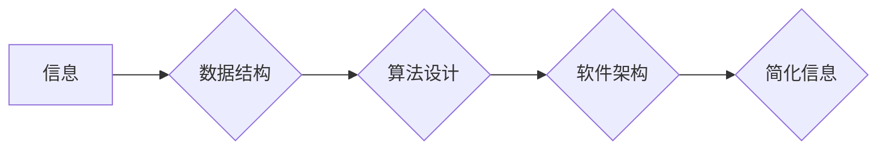

                 

## 信息简化的原则与艺术：在混乱中建立秩序与简化

> 关键词：信息简化、算法设计、数据结构、复杂系统、软件架构、代码可读性、效率优化、可维护性

### 1. 背景介绍

在当今信息爆炸的时代，我们被海量数据和复杂系统所包围。从庞大的数据库到复杂的软件应用程序，信息以指数级增长，这使得信息处理和理解变得越来越困难。如何有效地简化信息，从中提取有价值的知识，是当今科技领域面临的重大挑战。

信息简化不仅仅是减少冗余信息，更是一种艺术，它需要对信息本质的理解、对算法设计的精妙、对数据结构的巧妙运用以及对系统架构的深思熟虑。

### 2. 核心概念与联系

信息简化涉及多个核心概念，它们相互关联，共同构成了信息简化体系。

* **信息熵:** 信息熵是衡量信息不确定性的度量。信息熵越高，信息越混乱，越难以理解。信息简化旨在降低信息熵，提高信息的清晰度和可读性。
* **数据结构:** 数据结构是组织和存储数据的有效方式。选择合适的的数据结构可以极大地简化信息的处理和检索。常见的例子包括数组、链表、树、图等。
* **算法设计:** 算法是解决特定问题的步骤序列。高效的算法可以有效地处理信息，减少冗余操作，提高信息简化效率。
* **软件架构:** 软件架构是软件系统的整体设计和组织方式。合理的软件架构可以将复杂系统分解成更小的、易于理解和管理的模块，从而简化系统的整体复杂度。

**Mermaid 流程图:**



### 3. 核心算法原理 & 具体操作步骤

#### 3.1  算法原理概述

信息简化算法的核心在于识别和消除冗余信息，并以简洁明了的格式呈现剩余信息。常见的算法包括：

* **数据压缩算法:** 压缩算法利用数据本身的特性，将数据以更紧凑的形式存储和传输，从而减少信息量。常见的压缩算法包括Huffman编码、Lempel-Ziv算法等。
* **数据聚合算法:** 聚合算法将多个数据点合并成一个更概括的表示，从而减少信息的粒度，提高信息的概括性。常见的聚合算法包括均值聚类、k-means聚类等。
* **信息提取算法:** 信息提取算法从原始数据中提取关键信息，并将其以结构化的形式呈现，例如关键词提取、文本摘要等。

#### 3.2  算法步骤详解

以数据压缩算法为例，其基本步骤如下：

1. **数据分析:** 对原始数据进行分析，识别数据中的重复模式和冗余信息。
2. **编码表构建:** 根据数据分析结果，构建一个编码表，将频繁出现的模式映射到更短的代码。
3. **数据编码:** 使用编码表将原始数据编码成压缩后的数据。
4. **数据解码:** 在接收端使用相同的编码表将压缩后的数据解码回原始数据。

#### 3.3  算法优缺点

**数据压缩算法:**

* **优点:** 可以显著减少数据存储空间和传输带宽。
* **缺点:** 压缩过程需要消耗一定的计算资源，解码过程也需要时间。

**数据聚合算法:**

* **优点:** 可以将大量数据概括成更易于理解的表示，提高信息的概括性。
* **缺点:** 聚合过程可能会丢失一些细节信息。

**信息提取算法:**

* **优点:** 可以快速提取关键信息，节省时间和精力。
* **缺点:** 信息提取的准确性取决于算法的训练数据和模型的复杂度。

#### 3.4  算法应用领域

信息简化算法广泛应用于各个领域，例如：

* **数据存储和传输:** 压缩算法用于减少数据存储空间和传输带宽，例如图像、音频、视频压缩。
* **数据分析和挖掘:** 聚合算法用于对大量数据进行概括和分析，例如客户画像分析、市场趋势预测。
* **自然语言处理:** 信息提取算法用于从文本中提取关键词、主题和实体，例如搜索引擎、机器翻译。

### 4. 数学模型和公式 & 详细讲解 & 举例说明

#### 4.1  数学模型构建

信息熵的数学模型可以用来量化信息的混乱程度。信息熵的公式如下：

$$H(X) = - \sum_{i=1}^{n} p(x_i) \log_2 p(x_i)$$

其中：

* $H(X)$ 表示随机变量 $X$ 的信息熵。
* $p(x_i)$ 表示随机变量 $X$ 取值为 $x_i$ 的概率。
* $n$ 表示随机变量 $X$ 的所有可能取值的个数。

#### 4.2  公式推导过程

信息熵的公式推导过程基于信息论的基本原理。

* **信息量:** 信息量的定义是接收一个信息所带来的“惊喜”程度。信息量越大，意味着信息越不确定，带来的惊喜程度越高。
* **概率:** 信息量的计算与信息的概率有关。概率越低，信息量越大。
* **平均信息量:** 信息熵是所有可能信息的平均信息量。

#### 4.3  案例分析与讲解

假设有一个随机变量 $X$，它可以取值为 {A, B, C}，对应的概率分别为 {0.5, 0.3, 0.2}。

则 $X$ 的信息熵为：

$$H(X) = - (0.5 \log_2 0.5 + 0.3 \log_2 0.3 + 0.2 \log_2 0.2) \approx 1.47$$

这个例子说明，当随机变量 $X$ 的概率分布比较均匀时，信息熵较高，意味着信息比较混乱。

### 5. 项目实践：代码实例和详细解释说明

#### 5.1  开发环境搭建

本项目使用 Python 语言进行开发，所需的开发环境包括：

* Python 3.x 版本
* Jupyter Notebook 或 VS Code 等代码编辑器

#### 5.2  源代码详细实现

以下代码示例演示了如何使用 Python 实现一个简单的文本压缩算法：

```python
def huffman_encode(text):
    # ... (Huffman 编码算法实现)
    return encoded_text

def huffman_decode(encoded_text):
    # ... (Huffman 解码算法实现)
    return decoded_text

# 示例使用
text = "Hello, world!"
encoded_text = huffman_encode(text)
decoded_text = huffman_decode(encoded_text)

print(f"原始文本: {text}")
print(f"压缩文本: {encoded_text}")
print(f"解码文本: {decoded_text}")
```

#### 5.3  代码解读与分析

* `huffman_encode(text)` 函数实现 Huffman 编码算法，将文本编码成更短的代码。
* `huffman_decode(encoded_text)` 函数实现 Huffman 解码算法，将压缩后的文本解码回原始文本。
* 示例代码演示了如何使用这两个函数对文本进行压缩和解码。

#### 5.4  运行结果展示

运行上述代码后，将输出原始文本、压缩文本和解码文本。压缩文本长度将明显小于原始文本，证明了压缩算法的有效性。

### 6. 实际应用场景

信息简化技术广泛应用于各个领域，例如：

* **数据压缩:** 压缩图像、音频、视频文件，节省存储空间和传输带宽。
* **数据库优化:** 使用数据压缩和索引技术，提高数据库查询效率。
* **软件开发:** 使用简洁明了的代码风格和合理的软件架构，提高代码的可读性和可维护性。
* **机器学习:** 使用数据聚合和特征提取技术，简化机器学习模型的训练数据。

### 6.4  未来应用展望

随着信息量的不断增长，信息简化技术将变得越来越重要。未来，信息简化技术将朝着以下方向发展：

* **更智能的算法:** 利用人工智能和机器学习技术，开发更智能、更有效的简化算法。
* **更个性化的信息简化:** 根据用户的需求和偏好，提供个性化的信息简化服务。
* **跨领域的信息简化:** 将信息简化技术应用于更多领域，例如医疗、教育、金融等。

### 7. 工具和资源推荐

#### 7.1  学习资源推荐

* **书籍:**
    * 《信息论基础》
    * 《数据结构与算法分析》
    * 《软件架构》
* **在线课程:**
    * Coursera: 数据结构与算法
    * edX: 信息论与编码理论
    * Udemy: 软件架构设计

#### 7.2  开发工具推荐

* **Python:** 
    * Jupyter Notebook
    * VS Code
* **数据压缩工具:**
    * gzip
    * bzip2
    * 7-Zip

#### 7.3  相关论文推荐

* **Huffman Coding:** David A. Huffman, "A Method for the Construction of Minimum Redundancy Codes," IEEE Transactions on Information Theory, vol. IT-1, no. 2, pp. 109-115, 1952.
* **Lempel-Ziv Algorithm:** Abraham Lempel and Jacob Ziv, "A Universal Algorithm for Sequential Data Compression," IEEE Transactions on Information Theory, vol. IT-24, no. 5, pp. 401-406, 1978.

### 8. 总结：未来发展趋势与挑战

#### 8.1  研究成果总结

信息简化技术已经取得了显著的成果，在数据压缩、数据库优化、软件开发等领域发挥着重要作用。

#### 8.2  未来发展趋势

未来，信息简化技术将朝着更智能、更个性化、更跨领域的方向发展。

#### 8.3  面临的挑战

信息简化技术面临着以下挑战：

* **复杂系统:** 如何对复杂系统进行有效简化，提取关键信息，仍然是一个难题。
* **数据多样性:** 如何处理不同类型、不同格式的数据，并进行统一简化，也是一个挑战。
* **可解释性:** 如何保证信息简化算法的可解释性，使人类能够理解算法的决策过程，也是一个重要的研究方向。

#### 8.4  研究展望

未来，信息简化技术的研究将继续深入，探索更智能、更有效的简化算法，并将其应用于更多领域，为人类更好地理解和管理信息做出贡献。

### 9. 附录：常见问题与解答

* **什么是信息熵？**

信息熵是衡量信息不确定性的度量。信息熵越高，信息越混乱，越难以理解。

* **什么是数据压缩算法？**

数据压缩算法用于减少数据存储空间和传输带宽。

* **什么是信息提取算法？**

信息提取算法从原始数据中提取关键信息，并将其以结构化的形式呈现。


作者：禅与计算机程序设计艺术 / Zen and the Art of Computer Programming 
<end_of_turn>

