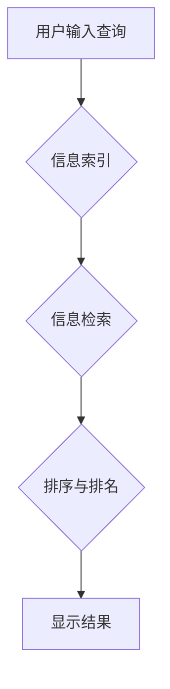

                 

## 信息过载与信息搜索策略与技术：在庞大的信息海洋中找到所需信息

> 关键词：信息过载、信息检索、搜索策略、算法、机器学习、自然语言处理、信息架构、知识图谱

### 1. 背景介绍

在当今信息爆炸的时代，我们每天接触的海量信息呈指数级增长。从新闻、社交媒体到学术论文、电子书籍，信息无处不在，却也带来了“信息过载”的挑战。如何有效地从庞大的信息海洋中找到所需信息，已成为当今社会面临的重大课题。

信息过载不仅影响个人效率和生活质量，也对企业决策、科学研究和社会发展产生深远影响。过多的无关信息会分散注意力，降低工作效率，甚至导致信息疲劳和决策失误。

为了应对信息过载的挑战，我们需要不断探索和改进信息搜索策略和技术。

### 2. 核心概念与联系

**2.1 信息检索概述**

信息检索是指在海量信息中快速、准确地找到所需信息的系统过程。它涉及到信息存储、索引、查询和排序等多个环节。

**2.2 搜索策略**

搜索策略是指在信息检索过程中，如何制定和执行查询策略，以提高信息查找效率和准确性的方法。常见的搜索策略包括：

* **关键词搜索:** 根据用户输入的关键词，从信息库中检索包含这些关键词的信息。
* **布尔搜索:** 使用布尔运算符（AND、OR、NOT）组合关键词，进行更精确的检索。
* **主题搜索:** 根据用户指定的主题或概念，检索相关信息。
* **关联搜索:** 基于用户已检索的信息，推荐相关或相似的信息。

**2.3 信息架构与知识图谱**

信息架构是指对信息进行组织、分类和结构化的过程，以提高信息的可查找性和可理解性。知识图谱是一种数据模型，用于表示和组织知识，通过实体和关系的网络结构，将信息连接起来，形成一个知识网络。

**2.4 流程图**



### 3. 核心算法原理 & 具体操作步骤

**3.1 算法原理概述**

信息检索的核心算法通常基于统计学和机器学习原理，旨在找到用户查询与信息内容之间匹配程度最高的文档。常见的算法包括：

* **TF-IDF:** 基于词频和逆向文档频率的算法，用于衡量词语在文档中的重要性。
* **BM25:** 基于TF-IDF算法改进的算法，考虑了文档长度和查询词语的权重。
* **PageRank:** 基于网页链接结构的算法，用于衡量网页的重要性。
* **深度学习:** 利用神经网络模型，学习用户查询和信息内容之间的语义关系，提高检索准确率。

**3.2 算法步骤详解**

以TF-IDF算法为例，其具体步骤如下：

1. **词袋模型:** 将文档中的所有词语转换为一个词袋，忽略词语的顺序和语法结构。
2. **词频统计:** 计算每个词语在每个文档中出现的频率 (TF)。
3. **逆向文档频率计算:** 计算每个词语在整个文档集合中出现的频率 (IDF)。
4. **TF-IDF权重计算:** 将TF和IDF相乘，得到每个词语在每个文档中的权重。
5. **文档相似度计算:** 计算用户查询与文档的TF-IDF权重之间的相似度，以确定文档的排序。

**3.3 算法优缺点**

**优点:**

* 计算简单，易于实现。
* 对大规模数据处理效率高。
* 可以有效地衡量词语在文档中的重要性。

**缺点:**

* 无法捕捉词语之间的语义关系。
* 对新词语的识别能力有限。
* 对文档结构和语义理解能力不足。

**3.4 算法应用领域**

TF-IDF算法广泛应用于搜索引擎、文本挖掘、信息检索等领域。

### 4. 数学模型和公式 & 详细讲解 & 举例说明

**4.1 数学模型构建**

TF-IDF算法的数学模型可以表示为：

$$TF-IDF(t, d) = TF(t, d) \times IDF(t)$$

其中：

* $TF-IDF(t, d)$ 表示词语 $t$ 在文档 $d$ 中的TF-IDF权重。
* $TF(t, d)$ 表示词语 $t$ 在文档 $d$ 中的词频。
* $IDF(t)$ 表示词语 $t$ 在整个文档集合中的逆向文档频率。

**4.2 公式推导过程**

* **词频 (TF):**

$$TF(t, d) = \frac{f(t, d)}{\sum_{i=1}^{N} f(i, d)}$$

其中：

* $f(t, d)$ 表示词语 $t$ 在文档 $d$ 中出现的次数。
* $N$ 表示文档 $d$ 中所有词语的总数。

* **逆向文档频率 (IDF):**

$$IDF(t) = \log \frac{D}{df(t)}$$

其中：

* $D$ 表示整个文档集合的大小。
* $df(t)$ 表示词语 $t$ 在文档集合中出现的文档数。

**4.3 案例分析与讲解**

假设我们有一个文档集合，包含以下三个文档：

* 文档 1: “苹果是水果，香蕉也是水果。”
* 文档 2: “苹果是一种红色水果，香蕉是一种黄色水果。”
* 文档 3: “香蕉是一种热带水果，苹果是一种温带水果。”

我们想要检索与“水果”相关的文档。

使用TF-IDF算法，我们可以计算每个词语在每个文档中的权重，并根据权重进行排序。

例如，词语“水果”在文档 1 中的TF-IDF权重为：

$$TF-IDF("水果", d1) = \frac{2}{5} \times \log \frac{3}{3} = 0$$

因为“水果”在整个文档集合中出现的所有文档中都出现过，所以IDF值为0。

最终，我们可以根据所有词语的TF-IDF权重，对文档进行排序，并显示出与“水果”相关的文档。

### 5. 项目实践：代码实例和详细解释说明

**5.1 开发环境搭建**

* Python 3.x
* NLTK 自然语言处理库
* Scikit-learn 机器学习库

**5.2 源代码详细实现**

```python
import nltk
from sklearn.feature_extraction.text import TfidfVectorizer

# 下载停用词列表
nltk.download('stopwords')

# 定义文档集合
documents = [
    "苹果是水果，香蕉也是水果。",
    "苹果是一种红色水果，香蕉是一种黄色水果。",
    "香蕉是一种热带水果，苹果是一种温带水果。"
]

# 创建TF-IDF向量化器
vectorizer = TfidfVectorizer(stop_words='english')

# 将文档转换为TF-IDF矩阵
tfidf_matrix = vectorizer.fit_transform(documents)

# 打印TF-IDF矩阵
print(tfidf_matrix.toarray())
```

**5.3 代码解读与分析**

* 首先，我们导入必要的库，并下载停用词列表。
* 然后，我们定义一个文档集合，包含三个示例文档。
* 接下来，我们创建TF-IDF向量化器，并使用`fit_transform`方法将文档转换为TF-IDF矩阵。
* 最后，我们打印TF-IDF矩阵，可以看到每个词语在每个文档中的权重。

**5.4 运行结果展示**

运行上述代码，会输出一个TF-IDF矩阵，其中每个元素代表一个词语在某个文档中的权重。

### 6. 实际应用场景

**6.1 搜索引擎**

搜索引擎利用TF-IDF算法和其他信息检索算法，从海量网页中检索与用户查询相关的网页结果。

**6.2 文本挖掘**

文本挖掘技术利用TF-IDF算法和其他自然语言处理技术，从文本数据中提取有价值的信息，例如主题、情感、趋势等。

**6.3 信息推荐**

信息推荐系统利用TF-IDF算法和其他机器学习算法，根据用户的历史行为和偏好，推荐相关的信息内容。

**6.4 知识图谱构建**

TF-IDF算法可以用于知识图谱构建中，例如用于提取实体和关系，构建知识网络。

**6.5 未来应用展望**

随着人工智能和机器学习技术的不断发展，信息检索技术将更加智能化和个性化。未来，信息检索系统将能够更好地理解用户的意图，提供更精准和相关的搜索结果。

### 7. 工具和资源推荐

**7.1 学习资源推荐**

* **书籍:**
    * 信息检索导论 (Introduction to Information Retrieval)
    * 自然语言处理 (Natural Language Processing)
* **在线课程:**
    * Coursera: 自然语言处理
    * edX: 信息检索

**7.2 开发工具推荐**

* **Python:** 
    * NLTK
    * Scikit-learn
    * SpaCy
* **Elasticsearch:** 
    * 基于Lucene的开源搜索引擎

**7.3 相关论文推荐**

* **TF-IDF算法:**
    * Robertson, S. E., & Zaragoza, H. (2009). The probabilistic relevance model. In Foundations of information retrieval (pp. 1-20). Springer, Berlin, Heidelberg.
* **深度学习在信息检索中的应用:**
    * Deng, L., &  Liu, Y. (2018). Deep learning for information retrieval: A survey. ACM Computing Surveys (CSUR), 50(6), 1-36.

### 8. 总结：未来发展趋势与挑战

**8.1 研究成果总结**

信息检索技术在过去几十年取得了长足的进步，从传统的基于关键词的检索到基于机器学习的深度学习检索，检索准确率和效率不断提高。

**8.2 未来发展趋势**

* **更智能的检索:** 利用自然语言理解和知识图谱技术，实现更智能的语义检索。
* **个性化检索:** 根据用户的历史行为、偏好和上下文，提供个性化的检索结果。
* **跨模态检索:** 将文本、图像、音频等多种数据类型融合，实现跨模态的检索。

**8.3 面临的挑战**

* **数据质量:** 信息检索算法的性能依赖于数据质量，如何处理噪声数据和不准确数据是一个挑战。
* **算法解释性:** 深度学习算法的“黑盒”性质，使得其结果难以解释，如何提高算法的透明度和可解释性是一个重要问题。
* **隐私保护:** 信息检索过程中涉及到大量用户数据，如何保护用户隐私是一个重要的伦理问题。

**8.4 研究展望**

未来，信息检索技术将继续朝着更智能、更个性化、更安全的方向发展。

### 9. 附录：常见问题与解答

**9.1 如何提高信息检索的准确率？**

* 使用更精确的关键词和查询语句。
* 利用布尔搜索或主题搜索等高级搜索策略。
* 使用机器学习算法，例如TF-IDF、BM25或深度学习算法，提高检索准确率。

**9.2 如何处理信息过载的问题？**

* 使用信息架构和知识图谱技术，组织和结构化信息。
* 利用信息过滤和聚合技术，筛选和总结重要信息。
* 培养信息筛选和评估的能力，避免信息疲劳。

**9.3 如何选择合适的搜索引擎？**

* 考虑搜索引擎的专业领域和数据范围。
* 评估搜索引擎的检索准确率、速度和用户体验。
* 了解搜索引擎的隐私政策和数据安全措施。


作者：禅与计算机程序设计艺术 / Zen and the Art of Computer Programming 
<end_of_turn>

