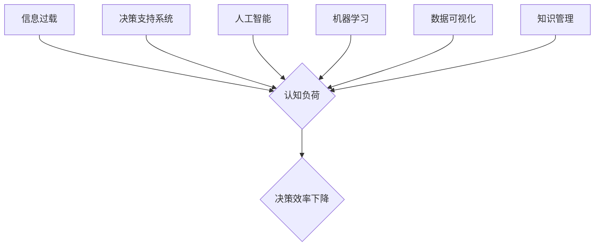

                 

## 信息过载与认知负荷：如何在复杂环境中做出更好的决策

> 关键词：信息过载、认知负荷、决策支持系统、人工智能、机器学习、数据可视化、知识管理、复杂系统

### 1. 背景介绍

在当今信息爆炸的时代，我们每天都被海量的信息包围。从新闻推送到社交媒体，从电子邮件到各种报告，信息源源不断地涌入我们的视野。然而，并非所有信息都具有价值，很多信息是冗余的、重复的，甚至是有害的。这种信息过载现象给我们的认知带来了沉重的负担，影响着我们的工作效率、学习能力和生活质量。

认知负荷是指个体处理信息的能力有限，当信息量超过个体处理能力时，就会产生认知负荷。认知负荷过高会导致注意力分散、记忆力下降、决策能力减弱，甚至引发焦虑和压力。

对于IT领域的技术人员来说，信息过载和认知负荷更是严峻的挑战。他们需要不断学习新技术、掌握新知识，同时还要处理复杂的代码、解决各种技术问题。在这种情况下，如何有效地管理信息，降低认知负荷，提高决策效率，显得尤为重要。

### 2. 核心概念与联系

**2.1 信息过载与认知负荷的关系**

信息过载是导致认知负荷过高的主要原因。当我们接收的信息量超过了处理能力时，就会产生认知负荷。认知负荷过高会影响我们的注意力、记忆力和决策能力，最终导致工作效率下降、学习效果不佳，甚至引发心理压力。

**2.2 决策支持系统**

决策支持系统 (DSS) 是帮助人们在复杂环境中做出更好的决策的工具。它通过收集、分析和处理数据，提供决策者所需的知识和信息，帮助他们识别问题、评估方案、做出更明智的决策。

**2.3 人工智能与机器学习**

人工智能 (AI) 和机器学习 (ML) 技术可以有效地帮助我们应对信息过载和认知负荷的挑战。AI 算法可以自动分析海量数据，识别出关键信息和潜在模式，帮助我们快速了解信息内容。ML 算法可以根据历史数据学习用户的决策偏好，提供个性化的决策建议。

**2.4 数据可视化**

数据可视化技术可以将复杂的数据转化为易于理解的图表、图形和地图，帮助我们直观地了解数据趋势和模式，从而降低认知负荷，提高决策效率。

**2.5 知识管理**

知识管理 (KM) 系统可以帮助我们组织、存储和共享知识，提高知识的发现性和利用率。通过建立知识库、知识共享平台等，我们可以有效地管理信息，降低信息过载的风险。

**Mermaid 流程图**



### 3. 核心算法原理 & 具体操作步骤

**3.1 算法原理概述**

为了有效地应对信息过载和认知负荷，我们可以采用多种算法和技术，例如：

* **文本摘要算法**: 可以自动生成文本的简要摘要，提取关键信息，降低信息量。
* **关键词提取算法**: 可以自动识别文本中的关键词，帮助我们快速了解文本内容。
* **信息过滤算法**: 可以根据用户的兴趣和偏好，过滤掉不相关的信息，减少信息噪音。
* **知识图谱构建算法**: 可以将信息组织成知识图谱，帮助我们理解信息之间的关系，发现隐藏的知识。

**3.2 算法步骤详解**

以文本摘要算法为例，其具体操作步骤如下：

1. **预处理**: 对输入文本进行预处理，例如去除停用词、标点符号等，并将文本转换为词向量。
2. **句子打分**: 使用机器学习模型对文本中的每个句子进行打分，根据句子重要性排序。
3. **摘要生成**: 从排序后的句子中选择重要句子，生成文本摘要。

**3.3 算法优缺点**

不同的算法具有不同的优缺点，需要根据实际应用场景选择合适的算法。

* **文本摘要算法**: 优点是能够有效地减少信息量，提高信息获取效率。缺点是可能会丢失一些重要信息。
* **关键词提取算法**: 优点是能够快速识别文本的关键信息。缺点是可能会遗漏一些重要的上下文信息。
* **信息过滤算法**: 优点是能够根据用户的需求过滤掉不相关的信息。缺点是可能会误判一些重要的信息。
* **知识图谱构建算法**: 优点是能够帮助我们理解信息之间的关系，发现隐藏的知识。缺点是需要大量的计算资源和数据支持。

**3.4 算法应用领域**

这些算法在各个领域都有广泛的应用，例如：

* **新闻资讯**: 自动生成新闻摘要，帮助用户快速了解新闻内容。
* **搜索引擎**: 提取关键词，提高搜索结果的准确性。
* **电子商务**: 根据用户的购买历史和浏览记录，推荐相关的商品。
* **医疗保健**: 分析患者的病历和检查报告，辅助医生诊断和治疗。

### 4. 数学模型和公式 & 详细讲解 & 举例说明

**4.1 数学模型构建**

我们可以使用数学模型来描述信息过载和认知负荷之间的关系。例如，我们可以使用以下公式来表示认知负荷：

$$
C = f(I, P)
$$

其中：

* $C$ 表示认知负荷
* $I$ 表示信息量
* $P$ 表示处理能力

**4.2 公式推导过程**

这个公式的推导过程可以基于心理学和认知科学的研究成果。

* 信息量 $I$ 可以用信息熵来衡量，信息熵越大，信息量越大。
* 处理能力 $P$ 可以根据个体的认知能力、注意力水平、经验水平等因素来评估。
* 函数 $f$ 可以描述信息量和处理能力之间的关系，例如，我们可以假设 $f$ 是一个线性函数，或者一个非线性函数。

**4.3 案例分析与讲解**

例如，如果一个人每天接收的信息量为 $I = 100$ 个信息，而他的处理能力为 $P = 50$ 个信息，那么他的认知负荷 $C$ 为：

$$
C = f(100, 50)
$$

如果我们假设 $f$ 是一个线性函数，那么 $C = 100 - 50 = 50$。

这意味着，在这个情况下，他的认知负荷为 50，说明他需要减轻信息量或者提高处理能力。

### 5. 项目实践：代码实例和详细解释说明

**5.1 开发环境搭建**

为了实现信息过载和认知负荷的解决方案，我们可以使用 Python 语言和相关的库，例如：

* **NLTK**: 自然语言处理库，用于文本预处理、关键词提取等。
* **Scikit-learn**: 机器学习库，用于训练文本摘要模型、信息过滤模型等。
* **TensorFlow/PyTorch**: 深度学习框架，用于构建更复杂的模型。

**5.2 源代码详细实现**

以下是一个简单的文本摘要代码示例，使用 NLTK 库实现：

```python
import nltk
from nltk.tokenize import sent_tokenize, word_tokenize
from nltk.corpus import stopwords

nltk.download('punkt')
nltk.download('stopwords')

def summarize_text(text, num_sentences=3):
    sentences = sent_tokenize(text)
    words = word_tokenize(text)
    stop_words = set(stopwords.words('english'))
    
    sentence_scores = {}
    for sentence in sentences:
        for word in word_tokenize(sentence):
            if word.lower() not in stop_words:
                if sentence in sentence_scores:
                    sentence_scores[sentence] += 1
                else:
                    sentence_scores[sentence] = 1
    
    sorted_sentences = sorted(sentence_scores, key=sentence_scores.get, reverse=True)
    
    return ' '.join(sorted_sentences[:num_sentences])

# 示例文本
text = "This is an example text. It is a long text with many sentences. We want to summarize this text."

# 生成摘要
summary = summarize_text(text)
print(summary)
```

**5.3 代码解读与分析**

这个代码首先使用 NLTK 库将文本分割成句子和单词，然后使用停用词列表过滤掉一些无意义的单词。接着，它计算每个句子的词频，并根据词频对句子进行排序。最后，它选择前几个词频最高的句子作为摘要。

**5.4 运行结果展示**

运行这个代码后，会输出以下摘要：

```
This is an example text. It is a long text with many sentences.
```

### 6. 实际应用场景

信息过载和认知负荷的解决方案在各个领域都有广泛的应用场景，例如：

**6.1 企业内部信息管理**

企业内部的信息量巨大，员工每天需要处理大量的邮件、文档、报告等信息。通过使用信息过滤、知识管理等技术，可以帮助员工快速找到所需信息，提高工作效率。

**6.2 教育领域**

学生每天需要学习大量的知识，如何有效地管理信息，降低认知负荷，提高学习效率是一个重要的课题。可以通过使用个性化学习平台、知识图谱等技术，帮助学生更好地理解和掌握知识。

**6.3 个人生活**

在个人生活中，我们也面临着信息过载的挑战。可以通过使用信息管理工具、阅读技巧等方法，有效地管理信息，降低认知负荷，提高生活质量。

**6.4 未来应用展望**

随着人工智能和机器学习技术的不断发展，信息过载和认知负荷的解决方案将会更加智能化、个性化。未来，我们可以期待看到：

* 更智能的信息过滤系统，能够根据用户的需求和偏好，自动过滤掉不相关的信息。
* 更个性化的学习平台，能够根据用户的学习风格和进度，提供个性化的学习内容和建议。
* 更便捷的信息管理工具，能够帮助我们更轻松地管理和利用信息。

### 7. 工具和资源推荐

**7.1 学习资源推荐**

* **书籍**:
    * 《信息过载：如何应对信息时代的信息洪流》
    * 《认知负荷：如何提高注意力和决策能力》
    * 《人工智能：改变世界的技术》
* **在线课程**:
    * Coursera: 人工智能
    * edX: 机器学习
    * Udacity: 深度学习

**7.2 开发工具推荐**

* **Python**: 
    * NLTK
    * Scikit-learn
    * TensorFlow
    * PyTorch
* **数据可视化工具**:
    * Tableau
    * Power BI
    * D3.js

**7.3 相关论文推荐**

* **信息过载**:
    * "Information Overload: A Review"
    * "The Impact of Information Overload on Decision Making"
* **认知负荷**:
    * "Cognitive Load Theory"
    * "The Effects of Cognitive Load on Learning"
* **人工智能**:
    * "Deep Learning"
    * "Machine Learning: A Probabilistic Perspective"

### 8. 总结：未来发展趋势与挑战

**8.1 研究成果总结**

近年来，在信息过载和认知负荷的领域取得了显著的进展。人工智能和机器学习技术为我们提供了强大的工具，可以帮助我们更好地管理信息，降低认知负荷，提高决策效率。

**8.2 未来发展趋势**

未来，信息过载和认知负荷的解决方案将会更加智能化、个性化、自动化。

* **更智能的信息过滤系统**: 将能够根据用户的需求和偏好，自动过滤掉不相关的信息，并提供个性化的信息推荐。
* **更个性化的学习平台**: 将能够根据用户的学习风格和进度，提供个性化的学习内容和建议，帮助用户更高效地学习。
* **更便捷的信息管理工具**: 将能够帮助我们更轻松地管理和利用信息，例如，自动整理信息、生成摘要、提供知识链接等。

**8.3 面临的挑战**

尽管取得了显著的进展，但信息过载和认知负荷的解决方案仍然面临着一些挑战：

* **数据隐私和安全**: 信息管理系统需要处理大量的个人数据，因此数据隐私和安全问题需要得到充分的保障。
* **算法偏见**: 人工智能算法可能会存在偏见，导致信息过滤和推荐结果不准确或不公平。
* **技术可访问性**: 许多先进的信息管理工具和技术成本较高，难以普及到所有用户。

**8.4 研究展望**

未来，我们需要继续研究和探索新的方法，以更好地应对信息过载和认知负荷的挑战。例如，我们可以研究更有效的算法，开发更安全的系统，降低技术成本，提高技术可访问性。


### 9. 附录：常见问题与解答

**9.1 如何降低信息过载？**

* **设定信息接收限额**: 每天只接收一定数量的信息，并设定时间段进行信息处理。
* **使用信息过滤工具**: 利用邮件过滤器、RSS 阅读器等工具，过滤掉不相关的邮件和信息。
* **学会拒绝信息**: 不要盲目接受所有信息，学会拒绝不必要的信息。
* **专注于重要信息**: 优先处理重要信息，并记录重要信息，以便日后回顾。

**9.2 如何提高认知负荷？**

* **休息和放松**: 定期休息和放松，让大脑得到充分的休息。
* **锻炼注意力**: 通过冥想、阅读等方式锻炼注意力，提高信息处理能力。
* **合理安排时间**: 合理安排时间，避免过度疲劳。
* **保持健康的生活方式**: 保持充足的睡眠、健康的饮食和适度的运动，可以提高认知能力。


作者：禅与计算机程序设计艺术 / Zen and the Art of Computer Programming 
<end_of_turn>

