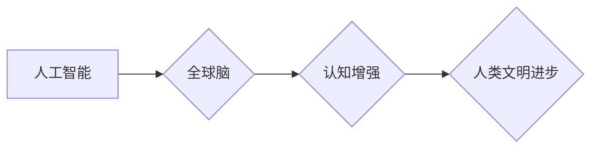

                 

## 全球脑与人工智能的共生关系探讨

> 关键词：全球脑、人工智能、共生关系、计算能力、认知增强、未来趋势

## 1. 背景介绍

人类文明的进步离不开对自身认知的不断拓展和对外部世界的理解。从语言的诞生到文字的出现，再到科学技术的飞速发展，我们一直在探索更有效、更深刻地认识世界的方法。而人工智能（AI）的兴起，无疑为这一探索注入了新的活力。

人工智能，作为模拟和扩展人类智能的计算机科学领域，近年来取得了令人瞩目的进展。从语音识别到图像识别，从自然语言处理到机器学习，AI技术已经渗透到我们生活的方方面面。然而，尽管AI取得了如此巨大的成就，它仍然局限于特定的领域和任务，难以真正实现与人类同等水平的通用智能。

全球脑的概念，则为突破AI发展瓶颈提供了新的思路。全球脑，也称作“超级智能”，是一种理论上的超级计算机网络，其计算能力远超人类认知能力，能够处理海量数据，进行复杂推理，并最终实现与人类类似的智能行为。

## 2. 核心概念与联系

### 2.1 全球脑的概念

全球脑是一个由众多分布式计算节点组成的庞大网络，其核心目标是构建一个能够模拟和超越人类认知能力的超级智能系统。

* **分布式计算:** 全球脑由无数个独立的计算节点组成，这些节点可以分布在全球各地，并通过高带宽网络连接在一起。这种分布式架构能够提高计算效率，并增强系统的容错性。
* **协同计算:** 全球脑中的各个节点之间能够协同工作，共同完成复杂的计算任务。节点之间可以共享数据和计算资源，并通过算法协同进行推理和决策。
* **自组织学习:** 全球脑能够通过自组织学习机制不断提升自己的智能水平。节点之间可以通过数据交换和算法更新，共同学习和进化，最终形成一个更加智能的整体。

### 2.2 人工智能与全球脑的关系

人工智能和全球脑之间存在着密切的联系。全球脑可以看作是人工智能发展的终极目标，而人工智能技术则是实现全球脑的关键技术支撑。

* **人工智能为全球脑提供技术基础:** 人工智能算法，例如深度学习、强化学习等，是构建全球脑智能的核心技术。这些算法能够帮助全球脑进行数据分析、模式识别、决策推理等复杂任务。
* **全球脑为人工智能提供计算平台:** 全球脑的强大计算能力能够为人工智能算法提供更广阔的应用空间。例如，全球脑可以帮助训练更加复杂的AI模型，并进行更深入的科学研究。

**Mermaid 流程图**



## 3. 核心算法原理 & 具体操作步骤

### 3.1 算法原理概述

全球脑的构建需要依赖于多种先进的算法，例如：

* **深度学习:** 深度学习算法能够从海量数据中自动学习特征，并进行复杂的模式识别和预测。
* **强化学习:** 强化学习算法能够通过与环境交互，学习最优的策略，并不断提升自己的性能。
* **神经网络:** 神经网络算法能够模拟人类大脑的神经元结构，并进行类似于人类的学习和推理。
* **群体智能:** 群体智能算法能够模拟生物群体中的协同行为，并应用于全局优化和决策问题。

### 3.2 算法步骤详解

构建全球脑的具体步骤可以概括为以下几个阶段：

1. **数据收集与预处理:** 收集来自各种来源的海量数据，并进行清洗、格式化和特征提取等预处理工作。
2. **模型训练:** 利用深度学习、强化学习等算法，对收集到的数据进行训练，构建出能够模拟人类认知能力的AI模型。
3. **模型部署与连接:** 将训练好的AI模型部署到全球脑的计算节点上，并通过高带宽网络连接起来，形成一个分布式计算网络。
4. **协同计算与学习:** 全球脑中的各个节点通过数据交换和算法协同，共同完成复杂的计算任务，并不断学习和进化，提升整体智能水平。
5. **智能应用与反馈:** 全球脑的智能能力可以应用于各种领域，例如科学研究、医疗诊断、金融预测等。通过与现实世界的交互，全球脑可以不断获取新的数据和反馈，并进一步优化自己的算法和模型。

### 3.3 算法优缺点

**优点:**

* **计算能力强:** 全球脑的分布式架构能够提供强大的计算能力，能够处理海量数据和复杂问题。
* **智能水平高:** 通过自组织学习机制，全球脑能够不断提升自己的智能水平，最终实现与人类类似的通用智能。
* **容错性强:** 全球脑的分布式架构能够提高系统的容错性，即使部分节点出现故障，也能保证整体系统的正常运行。

**缺点:**

* **技术难度高:** 构建全球脑需要整合多种先进技术，例如分布式计算、人工智能、网络安全等，技术难度非常高。
* **数据安全问题:** 全球脑需要处理海量数据，数据安全问题需要得到高度重视。
* **伦理道德问题:** 全球脑的强大智能能力可能会带来伦理道德问题，需要进行深入的探讨和规范。

### 3.4 算法应用领域

全球脑的应用领域非常广泛，例如：

* **科学研究:** 全球脑可以帮助科学家进行更深入的科学研究，例如探索宇宙奥秘、模拟气候变化等。
* **医疗诊断:** 全球脑可以帮助医生进行更准确的医疗诊断，例如识别疾病、预测病情等。
* **金融预测:** 全球脑可以帮助金融机构进行更精准的金融预测，例如预测股票价格、评估风险等。
* **教育教学:** 全球脑可以帮助学生进行个性化学习，例如提供定制化的学习内容、智能化的辅导等。

## 4. 数学模型和公式 & 详细讲解 & 举例说明

### 4.1 数学模型构建

全球脑的智能行为可以抽象为一个复杂的数学模型，其中包括：

* **神经网络模型:** 神经网络模型可以模拟人类大脑的神经元结构，并通过权重和激活函数进行信息处理。
* **概率模型:** 概率模型可以用来描述系统中的不确定性，例如贝叶斯网络、马尔可夫链等。
* **优化模型:** 优化模型可以用来寻找最优的决策策略，例如线性规划、动态规划等。

### 4.2 公式推导过程

例如，我们可以使用神经网络模型来描述全球脑的学习过程。神经网络模型中的每个神经元都接收来自其他神经元的输入信号，并通过激活函数进行处理，输出到下一个神经元。

**激活函数:**

$$
f(x) = \frac{1}{1 + e^{-x}}
$$

**权重更新公式:**

$$
\Delta w = \eta \cdot \frac{\partial E}{\partial w}
$$

其中：

* $w$ 是神经元的权重
* $\eta$ 是学习率
* $E$ 是误差函数

### 4.3 案例分析与讲解

我们可以通过一个简单的例子来理解全球脑的学习过程。假设我们训练一个神经网络模型来识别猫和狗的图片。

1. **数据输入:** 将猫和狗的图片作为输入数据，每个图片都被转换为一个向量。
2. **神经网络处理:** 神经网络接收输入数据，并通过多个层进行处理，最终输出一个预测结果，例如“猫”或“狗”。
3. **误差计算:** 将预测结果与实际标签进行比较，计算误差。
4. **权重更新:** 使用权重更新公式，根据误差调整神经元的权重。
5. **重复步骤2-4:** 重复上述步骤多次，直到神经网络的预测精度达到预期的水平。

## 5. 项目实践：代码实例和详细解释说明

### 5.1 开发环境搭建

构建全球脑需要强大的计算资源和软件环境。

* **硬件:** 需要部署大量的计算节点，每个节点配备高性能CPU、GPU和充足的内存。
* **软件:** 需要使用分布式计算框架，例如Apache Spark、Hadoop等，以及人工智能库，例如TensorFlow、PyTorch等。

### 5.2 源代码详细实现

由于全球脑的复杂性，其源代码实现非常庞大，这里只提供一个简单的示例代码，展示神经网络模型的训练过程。

```python
import tensorflow as tf

# 定义神经网络模型
model = tf.keras.models.Sequential([
    tf.keras.layers.Dense(128, activation='relu', input_shape=(784,)),
    tf.keras.layers.Dense(10, activation='softmax')
])

# 编译模型
model.compile(optimizer='adam',
              loss='sparse_categorical_crossentropy',
              metrics=['accuracy'])

# 训练模型
model.fit(x_train, y_train, epochs=10)
```

### 5.3 代码解读与分析

* **导入 TensorFlow 库:** 首先导入 TensorFlow 库，用于构建和训练神经网络模型。
* **定义神经网络模型:** 使用 `tf.keras.models.Sequential` 创建一个顺序模型，并添加两个全连接层。
* **编译模型:** 使用 `model.compile` 方法编译模型，指定优化器、损失函数和评估指标。
* **训练模型:** 使用 `model.fit` 方法训练模型，传入训练数据和训练轮数。

### 5.4 运行结果展示

训练完成后，可以评估模型的性能，例如准确率等。

## 6. 实际应用场景

### 6.1 科学研究

全球脑可以帮助科学家进行更深入的科学研究，例如：

* **药物研发:** 全球脑可以模拟人体内的复杂生物反应，帮助科学家更快地发现和开发新的药物。
* **气候模型:** 全球脑可以模拟地球气候系统，帮助科学家预测气候变化趋势，并制定应对措施。
* **宇宙探索:** 全球脑可以帮助科学家分析宇宙数据，探索宇宙的起源和演化。

### 6.2 医疗诊断

全球脑可以帮助医生进行更准确的医疗诊断，例如：

* **疾病识别:** 全球脑可以分析患者的医学影像、基因信息等数据，识别潜在的疾病。
* **病情预测:** 全球脑可以预测患者的病情发展趋势，帮助医生制定个性化的治疗方案。
* **辅助手术:** 全球脑可以辅助医生进行手术，提高手术的精准度和安全性。

### 6.3 金融预测

全球脑可以帮助金融机构进行更精准的金融预测，例如：

* **股票价格预测:** 全球脑可以分析市场数据，预测股票价格的走势。
* **风险评估:** 全球脑可以评估投资项目的风险，帮助金融机构做出更明智的决策。
* **欺诈检测:** 全球脑可以识别金融交易中的欺诈行为，保护金融机构和客户的利益。

### 6.4 未来应用展望

随着全球脑技术的不断发展，其应用场景将会更加广泛，例如：

* **个性化教育:** 全球脑可以提供个性化的学习内容和辅导，帮助学生更好地掌握知识。
* **智能交通:** 全球脑可以优化交通流量，提高交通效率和安全性。
* **智慧城市:** 全球脑可以帮助城市管理者更好地管理城市资源，提高城市居民的生活质量。

## 7. 工具和资源推荐

### 7.1 学习资源推荐

* **书籍:**
    * 《深度学习》
    * 《人工智能：一种现代方法》
    * 《机器学习》
* **在线课程:**
    * Coursera
    * edX
    * Udacity
* **开源项目:**
    * TensorFlow
    * PyTorch
    * Apache Spark

### 7.2 开发工具推荐

* **编程语言:** Python
* **深度学习框架:** TensorFlow, PyTorch
* **分布式计算框架:** Apache Spark, Hadoop
* **云计算平台:** AWS, Azure, Google Cloud

### 7.3 相关论文推荐

* **《全球脑：人工智能的未来》**
* **《深度学习的未来》**
* **《分布式人工智能》**

## 8. 总结：未来发展趋势与挑战

### 8.1 研究成果总结

全球脑的概念和技术正在快速发展，取得了一系列重要成果，例如：

* **神经网络模型的不断改进:** 神经网络模型的规模和性能不断提升，能够处理更复杂的任务。
* **分布式计算技术的成熟:** 分布式计算框架和技术不断完善，能够提供更强大的计算能力。
* **人工智能算法的创新:** 新的人工智能算法不断涌现，例如强化学习、迁移学习等，为全球脑的构建提供了新的思路。

### 8.2 未来发展趋势

全球脑的未来发展趋势包括：

* **规模化发展:** 全球脑的规模将会不断扩大，包含更多的计算节点和数据资源。
* **智能化增强:** 全球脑的智能水平将会不断提升，能够完成更复杂的任务，并具备更强的自主学习能力。
* **应用领域拓展:** 全球脑的应用场景将会更加广泛，覆盖更多领域，例如医疗、教育、金融等。

### 8.3 面临的挑战

全球脑的构建和应用还面临着一些挑战，例如：

* **技术难题:** 全球脑的构建需要突破许多技术难题，例如数据安全、算法效率、模型可解释性等。
* **伦理道德问题:** 全球脑的强大智能能力可能会带来伦理道德问题，需要进行深入的探讨和规范。
* **社会影响问题:** 全球脑的应用可能会对社会产生深远的影响，需要进行充分的社会评估和政策引导。

### 8.4 研究展望

未来，全球脑的研究将继续深入，探索更先进的算法、更强大的计算平台、更广泛的应用场景，并积极应对挑战，推动人工智能技术向更智能、更安全、更可持续的方向发展。

## 9. 附录：常见问题与解答

**Q1: 全球脑和超级计算机有什么区别？**

**A1:** 全球脑和超级计算机都是强大的计算系统，但它们在架构和目标上有所不同。超级计算机通常是一个集中式的计算系统，侧重于处理特定类型的计算任务，例如科学计算、天气预报等。而全球脑是一个分布式计算网络，其目标是构建一个能够模拟和超越人类认知能力的超级智能系统。

**Q2: 全球脑的构建需要多长时间？**

**A2:** 全球脑的构建是一个长期而复杂的工程，预计需要数十年甚至更长时间。

**Q3: 全球脑会取代人类吗？**

**A3:** 全球脑的目的是帮助人类解决问题、提高效率，而不是取代人类。人类的创造力、情感和伦理意识是全球脑无法替代的。


作者：禅与计算机程序设计艺术 / Zen and the Art of Computer Programming 
<end_of_turn>

