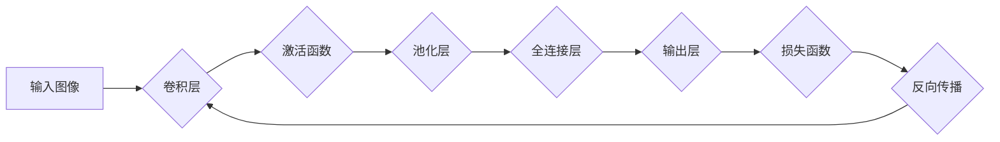

                 

## 反向传播在计算机视觉中的应用

> 关键词：反向传播、深度学习、计算机视觉、卷积神经网络、梯度下降、损失函数、优化算法

## 1. 背景介绍

计算机视觉作为人工智能领域的重要分支，致力于让计算机“看”和理解图像、视频等视觉信息。近年来，深度学习的兴起极大地推动了计算机视觉的进步。其中，反向传播算法作为深度学习的核心训练算法，在计算机视觉领域扮演着至关重要的角色。

传统的计算机视觉方法主要依赖于人工设计的特征提取方法，需要大量的领域知识和经验。而深度学习通过多层神经网络自动学习图像特征，能够从海量数据中提取更抽象、更具判别力的特征，从而实现更准确、更鲁棒的视觉识别任务。

反向传播算法正是深度学习训练的核心，它通过计算误差梯度，不断调整神经网络参数，使得模型能够更好地拟合训练数据。

## 2. 核心概念与联系

### 2.1  深度学习

深度学习是一种机器学习的子领域，它利用多层神经网络来模拟人类大脑的学习过程。深度神经网络由多个神经元层组成，每层神经元之间通过连接权重进行信息传递。通过训练，神经网络能够自动学习输入数据中的特征表示，并将其用于预测或分类任务。

### 2.2  反向传播

反向传播算法是一种用于训练深度神经网络的优化算法。它通过计算误差梯度，不断调整神经网络参数，使得模型能够更好地拟合训练数据。

反向传播算法的核心思想是利用链式法则，将输出误差反向传播到网络的每一层，计算每个参数的梯度。然后，根据梯度下降法，更新每个参数的值，使得误差逐渐减小。

### 2.3  卷积神经网络

卷积神经网络（CNN）是一种专门用于处理图像数据的深度神经网络结构。CNN利用卷积操作和池化操作来提取图像特征，能够有效地学习图像的局部和全局特征。

反向传播算法是训练CNN的关键，它通过计算误差梯度，不断调整CNN的参数，使得模型能够更好地识别图像中的物体、场景等信息。

**Mermaid 流程图**



## 3. 核心算法原理 & 具体操作步骤

### 3.1  算法原理概述

反向传播算法的核心思想是利用链式法则，将输出误差反向传播到网络的每一层，计算每个参数的梯度。然后，根据梯度下降法，更新每个参数的值，使得误差逐渐减小。

具体来说，反向传播算法的步骤如下：

1. **正向传播:** 将输入数据通过神经网络，计算输出结果。
2. **计算损失函数:** 计算输出结果与真实值的误差，使用损失函数来量化误差。
3. **反向传播:** 利用链式法则，将误差梯度反向传播到网络的每一层。
4. **更新参数:** 根据梯度下降法，更新每个参数的值，使得误差逐渐减小。

### 3.2  算法步骤详解

1. **正向传播:**

   - 将输入数据输入到神经网络的第一层。
   - 每个神经元接收来自上一层的输入，并通过权重进行加权求和。
   - 对加权求和结果应用激活函数，得到该神经元的输出。
   - 将输出传递到下一层神经元，重复上述过程，直到计算出最终的输出结果。

2. **计算损失函数:**

   - 将输出结果与真实值进行比较，计算误差。
   - 使用损失函数来量化误差，常见的损失函数包括均方误差（MSE）、交叉熵损失等。

3. **反向传播:**

   - 从输出层开始，计算每个神经元的误差梯度。
   - 利用链式法则，将误差梯度反向传播到上一层神经元。
   - 每个神经元的误差梯度等于其输出对损失函数的偏导数，乘以上一层神经元的输出。

4. **更新参数:**

   - 根据梯度下降法，更新每个参数的值。
   - 参数更新公式通常为：

     ```
     参数 = 参数 - 学习率 * 梯度
     ```

     其中，学习率是一个控制参数更新幅度的超参数。

### 3.3  算法优缺点

**优点:**

- 能够有效地训练深度神经网络，学习复杂的特征表示。
- 适用于各种类型的视觉任务，例如图像分类、目标检测、图像分割等。
- 理论基础完善，算法原理清晰易懂。

**缺点:**

- 训练过程需要大量的计算资源和时间。
- 容易陷入局部最优解，需要使用一些技巧来避免。
- 对超参数的选择敏感，需要进行大量的实验来调优。

### 3.4  算法应用领域

反向传播算法广泛应用于计算机视觉领域，例如：

- **图像分类:** 识别图像中的物体类别，例如猫、狗、车等。
- **目标检测:** 在图像中定位和识别目标物体，例如人、车、行人等。
- **图像分割:** 将图像分割成不同的区域，例如前景和背景、物体和背景等。
- **图像生成:** 生成新的图像，例如人脸生成、图像修复等。
- **视频分析:** 分析视频内容，例如动作识别、视频摘要等。

## 4. 数学模型和公式 & 详细讲解 & 举例说明

### 4.1  数学模型构建

反向传播算法的核心是利用链式法则，将误差梯度反向传播到网络的每一层。

假设神经网络有 L 层，第 l 层有 N_l 个神经元，每个神经元接收来自上一层的输入，并通过权重进行加权求和。

**输入:**

- X: 输入数据，维度为 (N_0, D)，其中 N_0 是输入样本数量，D 是输入特征维度。

**隐藏层:**

- H_l: 第 l 层神经元的输出，维度为 (N_l,)。

**输出层:**

- Y: 输出结果，维度为 (N_L, C)，其中 C 是输出类别数量。

**权重:**

- W_l: 第 l 层神经元的权重矩阵，维度为 (N_l-1, N_l)。

**偏置:**

- b_l: 第 l 层神经元的偏置向量，维度为 (N_l,)。

**激活函数:**

- f_l: 第 l 层神经元的激活函数。

### 4.2  公式推导过程

1. **损失函数:**

   - L(Y, Y_true): 损失函数，衡量输出结果 Y 与真实值 Y_true 之间的误差。

2. **误差梯度:**

   - ∂L/∂Y: 损失函数对输出结果 Y 的偏导数。

3. **反向传播:**

   - ∂L/∂W_l: 损失函数对第 l 层权重矩阵 W_l 的偏导数。
   - ∂L/∂b_l: 损失函数对第 l 层偏置向量 b_l 的偏导数。

   利用链式法则，可以将 ∂L/∂W_l 和 ∂L/∂b_l 表示为 ∂L/∂Y 和 ∂Y/∂W_l, ∂Y/∂b_l 的组合。

4. **参数更新:**

   - W_l = W_l - α * ∂L/∂W_l
   - b_l = b_l - α * ∂L/∂b_l

   其中，α 是学习率。

### 4.3  案例分析与讲解

假设我们有一个简单的图像分类任务，输入图像为 28x28 的灰度图像，输出类别为 10 个数字。

我们可以使用一个简单的 CNN 模型，包含一个卷积层、一个池化层和一个全连接层。

在训练过程中，我们使用反向传播算法来更新模型参数。

首先，我们将输入图像通过卷积层，提取图像特征。然后，将特征图通过池化层进行降维。最后，将池化后的特征输入到全连接层，进行分类。

在每个训练步骤中，我们计算输出结果与真实值的误差，并利用反向传播算法将误差梯度反向传播到网络的每一层。然后，根据梯度下降法，更新每个参数的值。

通过不断重复上述过程，模型的参数会逐渐调整，使得模型能够更好地识别图像中的数字。

## 5. 项目实践：代码实例和详细解释说明

### 5.1  开发环境搭建

为了实现反向传播算法在计算机视觉中的应用，我们需要搭建一个合适的开发环境。

推荐使用 Python 语言和 TensorFlow 或 PyTorch 深度学习框架。

**Python 环境:**

- 安装 Python 3.6 或更高版本。

**深度学习框架:**

- 使用 pip 安装 TensorFlow 或 PyTorch:

  ```
  pip install tensorflow
  ```

  或

  ```
  pip install torch torchvision torchaudio
  ```

### 5.2  源代码详细实现

以下是一个简单的 CNN 模型的代码实现，使用 TensorFlow 框架：

```python
import tensorflow as tf

# 定义模型结构
model = tf.keras.models.Sequential([
    tf.keras.layers.Conv2D(32, (3, 3), activation='relu', input_shape=(28, 28, 1)),
    tf.keras.layers.MaxPooling2D((2, 2)),
    tf.keras.layers.Conv2D(64, (3, 3), activation='relu'),
    tf.keras.layers.MaxPooling2D((2, 2)),
    tf.keras.layers.Flatten(),
    tf.keras.layers.Dense(10, activation='softmax')
])

# 定义损失函数和优化器
model.compile(loss='sparse_categorical_crossentropy',
              optimizer='adam',
              metrics=['accuracy'])

# 加载 MNIST 数据集
(x_train, y_train), (x_test, y_test) = tf.keras.datasets.mnist.load_data()

# 数据预处理
x_train = x_train.astype('float32') / 255.0
x_test = x_test.astype('float32') / 255.0
x_train = x_train.reshape((x_train.shape[0], 28, 28, 1))
x_test = x_test.reshape((x_test.shape[0], 28, 28, 1))

# 训练模型
model.fit(x_train, y_train, epochs=5)

# 评估模型
loss, accuracy = model.evaluate(x_test, y_test)
print('Test loss:', loss)
print('Test accuracy:', accuracy)
```

### 5.3  代码解读与分析

这段代码定义了一个简单的 CNN 模型，并使用 TensorFlow 框架进行训练。

- **模型结构:** 模型包含一个卷积层、一个池化层、一个全连接层和一个输出层。
- **损失函数:** 使用交叉熵损失函数，用于衡量分类结果的准确性。
- **优化器:** 使用 Adam 优化器，用于更新模型参数。
- **数据预处理:** 将 MNIST 数据集预处理为适合模型输入的格式。
- **训练过程:** 使用 `model.fit()` 函数训练模型，指定训练 epochs 和批处理大小。
- **评估过程:** 使用 `model.evaluate()` 函数评估模型在测试集上的性能。

### 5.4  运行结果展示

运行上述代码后，会输出模型在测试集上的损失值和准确率。

通常情况下，经过训练的模型能够达到较高的准确率，例如在 MNIST 数据集上，准确率可以达到 98% 以上。

## 6. 实际应用场景

反向传播算法在计算机视觉领域有着广泛的应用场景，例如：

### 6.1  图像分类

- **自动驾驶:** 识别道路标志、交通信号灯、行人等物体。
- **医疗诊断:** 识别病灶、肿瘤等异常区域。
- **人脸识别:** 识别和验证个人的身份。

### 6.2  目标检测

- **安防监控:** 检测入侵者、可疑行为等。
- **零售分析:** 分析顾客行为、商品销售情况等。
- **无人机导航:** 识别障碍物、目标物体等。

### 6.3  图像分割

- **医学图像分析:** 分割器官、组织等区域。
- **遥感图像分析:** 分割土地利用类型、植被覆盖等。
- **图像编辑:** 分割图像中的前景和背景。

### 6.4  未来应用展望

随着深度学习技术的不断发展，反向传播算法在计算机视觉领域的应用将会更加广泛和深入。

例如，未来可能会出现：

- 更高效、更鲁棒的深度学习模型。
- 更复杂的视觉任务，例如三维重建、视频理解等。
- 更广泛的应用场景，例如虚拟现实、增强现实等。

## 7. 工具和资源推荐

### 7.1  学习资源推荐

- **书籍:**

  - 《深度学习》 by Ian Goodfellow, Yoshua Bengio, Aaron Courville
  - 《动手学深度学习》 by Aurélien Géron

- **在线课程:**

  - Coursera: 深度学习 Specialization
  - Udacity: Deep Learning Nanodegree

### 7.2  开发工具推荐

- **深度学习框架:** TensorFlow, PyTorch, Keras
- **图像处理库:** OpenCV, Pillow

### 7.3  相关论文推荐

- **《ImageNet Classification with Deep Convolutional Neural Networks》** by Alex Krizhevsky, Ilya Sutskever, Geoffrey E. Hinton
- **《Deep Residual Learning for Image Recognition》** by Kaiming He, Xiangyu Zhang, Shaoqing Ren, Jian Sun

## 8. 总结：未来发展趋势与挑战

### 8.1  研究成果总结

反向传播算法在深度学习的训练中发挥着至关重要的作用，推动了计算机视觉领域的快速发展。

通过反向传播算法，我们可以训练出能够识别图像中复杂物体、场景的深度神经网络模型。

### 8.2  未来发展趋势

未来，反向传播算法将会继续朝着以下方向发展：

- **更高效的算法:** 研究更快速、更节省资源的反向传播算法，例如并行反向传播、异步反向传播等。
- **更鲁棒的模型:** 研究能够应对噪声、遮挡、视角变化等挑战的更鲁棒的深度神经网络模型。
- **更广泛的应用:** 将反向传播算法应用于更复杂的视觉任务，例如三维重建、视频理解等。

### 8.3  面临的挑战

反向传播算法也面临着一些挑战：

- **训练时间长:** 训练深度神经网络需要大量的计算资源和时间。
- **参数量大:** 深度神经网络的参数量很大，需要大量的存储空间。
- **可解释性差:** 深度神经网络的决策过程难以理解，缺乏可解释性。

### 8.4  研究展望

未来，我们需要继续研究和探索反向传播算法的改进方法，以克服其面临的挑战，并将其应用于更广泛的领域。

## 9. 附录：常见问题与解答

### 9.1  反向传播算法的梯度消失问题

梯度消失问题是指在训练深层神经网络时，随着网络层数的增加，梯度会逐渐减小，导致模型难以学习深层特征。

解决梯度消失问题的常用方法包括：

- 使用ReLU等非线性激活函数。
- 使用残差连接。
- 使用梯度裁剪。

### 9.2  反向传播算法的梯度爆炸问题

梯度爆炸问题是指在训练深层神经网络时，梯度会逐渐增大，导致模型训练不稳定。

解决梯度爆炸问题的常用方法包括：

- 使用梯度裁剪。
- 使用学习率衰减。
- 使用正则化技术。


作者：禅与计算机程序设计艺术 / Zen and the Art of Computer Programming<end_of_turn>

