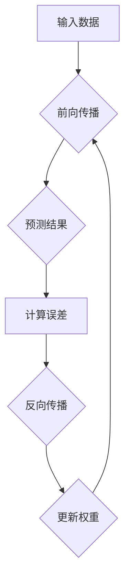

                 

## 反向传播详解：梯度和权重更新

> 关键词：反向传播、梯度下降、权重更新、神经网络、机器学习、深度学习

## 1. 背景介绍

深度学习的蓬勃发展离不开反向传播算法的贡献。作为神经网络训练的核心，反向传播算法通过计算误差梯度，并利用梯度下降法更新网络权重，从而不断优化模型性能。本文将深入探讨反向传播算法的原理、步骤和应用，帮助读者理解其在深度学习中的重要作用。

## 2. 核心概念与联系

反向传播算法的核心概念包括：

* **误差函数（Loss Function）:** 用于衡量模型预测结果与真实值的差距。常见的误差函数包括均方误差（MSE）、交叉熵损失等。
* **梯度（Gradient）:**  表示误差函数对模型参数（权重）的偏导数，反映了参数变化对误差的影响程度。
* **梯度下降法（Gradient Descent）:**  一种优化算法，通过沿着梯度的负方向更新参数，逐步降低误差函数的值。

**Mermaid 流程图**



## 3. 核心算法原理 & 具体操作步骤

### 3.1  算法原理概述

反向传播算法的核心思想是利用链式法则，将误差函数对每个参数的梯度计算出来，并根据梯度下降法更新参数值。

具体步骤如下：

1. **前向传播:** 将输入数据通过神经网络传递，计算最终的预测结果。
2. **计算误差:** 将预测结果与真实值进行比较，计算误差函数的值。
3. **反向传播:** 从输出层开始，计算每个神经元的误差梯度，并沿着神经网络的连接方向反向传播。
4. **更新权重:** 利用梯度下降法，根据每个参数的梯度值更新其权重。

### 3.2  算法步骤详解

1. **前向传播:**

   * 将输入数据输入到神经网络的第一层。
   * 每个神经元接收来自上一层的输入信号，并对其进行线性变换和非线性激活函数处理。
   * 将处理后的信号传递到下一层神经元。
   * 重复上述过程，直到输出层产生最终的预测结果。

2. **计算误差:**

   * 将预测结果与真实值进行比较，计算误差函数的值。
   * 常见的误差函数包括均方误差（MSE）和交叉熵损失（Cross-Entropy Loss）。

3. **反向传播:**

   * 从输出层开始，计算每个神经元的误差梯度。
   * 利用链式法则，将误差梯度反向传播到上一层神经元。
   * 每个神经元的误差梯度等于其输出对误差函数的偏导数，乘以上一层神经元的输出对当前神经元的偏导数。

4. **更新权重:**

   * 利用梯度下降法，根据每个参数的梯度值更新其权重。
   * 权重的更新公式通常为：

     $$w_{new} = w_{old} - \alpha \frac{\partial Loss}{\partial w}$$

     其中：
     * $w_{new}$ 是更新后的权重
     * $w_{old}$ 是原始的权重
     * $\alpha$ 是学习率，控制着权重更新的步长
     * $\frac{\partial Loss}{\partial w}$ 是误差函数对权重的梯度

### 3.3  算法优缺点

**优点:**

* **高效:** 反向传播算法能够有效地计算误差梯度，并利用梯度下降法快速更新参数。
* **通用:** 适用于各种类型的神经网络，包括卷积神经网络（CNN）和循环神经网络（RNN）。
* **可解释性:** 反向传播算法的原理相对清晰，可以帮助理解模型的训练过程。

**缺点:**

* **梯度消失/爆炸问题:** 在训练深层神经网络时，梯度可能会在反向传播过程中消失或爆炸，导致训练不稳定。
* **局部最优解:** 梯度下降法可能会陷入局部最优解，导致模型性能无法达到最佳。
* **计算量大:** 反向传播算法的计算量较大，尤其是在训练大型神经网络时。

### 3.4  算法应用领域

反向传播算法广泛应用于各种机器学习领域，例如：

* **图像识别:**  用于识别图像中的物体、场景和人脸。
* **自然语言处理:**  用于机器翻译、文本摘要、情感分析等任务。
* **语音识别:**  用于将语音转换为文本。
* **推荐系统:**  用于推荐用户可能感兴趣的商品或内容。

## 4. 数学模型和公式 & 详细讲解 & 举例说明

### 4.1  数学模型构建

假设我们有一个神经网络模型，其输出为 $y$，输入为 $x$，权重为 $W$，偏置为 $b$。模型的预测结果可以通过以下公式计算：

$$y = f(Wx + b)$$

其中 $f$ 是激活函数。

误差函数通常定义为预测结果与真实值之间的差距，例如均方误差：

$$Loss = \frac{1}{2} \sum_{i=1}^{n}(y_i - t_i)^2$$

其中 $y_i$ 是模型预测的第 $i$ 个样本的输出，$t_i$ 是真实值的第 $i$ 个样本的输出，$n$ 是样本数量。

### 4.2  公式推导过程

利用链式法则，我们可以计算误差函数对每个参数的梯度。

* 误差函数对权重的梯度：

$$\frac{\partial Loss}{\partial W} = \frac{\partial Loss}{\partial y} \cdot \frac{\partial y}{\partial W}$$

* 误差函数对偏置的梯度：

$$\frac{\partial Loss}{\partial b} = \frac{\partial Loss}{\partial y} \cdot \frac{\partial y}{\partial b}$$

其中 $\frac{\partial Loss}{\partial y}$ 可以通过对误差函数求导得到，$\frac{\partial y}{\partial W}$ 和 $\frac{\partial y}{\partial b}$ 可以通过对模型输出公式求导得到。

### 4.3  案例分析与讲解

假设我们有一个简单的单层神经网络，输入为 $x$，输出为 $y$，激活函数为 sigmoid 函数。

* 模型输出公式：

$$y = \sigma(Wx + b)$$

* 误差函数为均方误差：

$$Loss = \frac{1}{2}(y - t)^2$$

其中 $t$ 是真实值。

我们可以通过链式法则计算误差函数对权重 $W$ 和偏置 $b$ 的梯度：

* $\frac{\partial Loss}{\partial W} = (y - t) \cdot \sigma'(Wx + b) \cdot x$

* $\frac{\partial Loss}{\partial b} = (y - t) \cdot \sigma'(Wx + b)$

其中 $\sigma'(x)$ 是 sigmoid 函数的导数。

利用这些梯度值，我们可以使用梯度下降法更新权重 $W$ 和偏置 $b$。

## 5. 项目实践：代码实例和详细解释说明

### 5.1  开发环境搭建

* Python 3.x
* TensorFlow 或 PyTorch 等深度学习框架

### 5.2  源代码详细实现

```python
import tensorflow as tf

# 定义模型
model = tf.keras.models.Sequential([
    tf.keras.layers.Dense(units=10, activation='relu', input_shape=(784,)),
    tf.keras.layers.Dense(units=10, activation='softmax')
])

# 定义损失函数和优化器
loss_fn = tf.keras.losses.CategoricalCrossentropy()
optimizer = tf.keras.optimizers.Adam(learning_rate=0.001)

# 训练模型
for epoch in range(10):
    for batch in dataset:
        with tf.GradientTape() as tape:
            predictions = model(batch['images'])
            loss = loss_fn(batch['labels'], predictions)
        gradients = tape.gradient(loss, model.trainable_variables)
        optimizer.apply_gradients(zip(gradients, model.trainable_variables))

    print(f'Epoch {epoch+1}, Loss: {loss.numpy()}')
```

### 5.3  代码解读与分析

* 首先，我们定义了一个简单的多层感知机模型，包含两层全连接层。
* 然后，我们定义了损失函数和优化器。损失函数用于衡量模型预测结果与真实值的差距，优化器用于更新模型参数。
* 训练模型时，我们遍历数据集中的每个批次，计算损失值，并利用梯度下降法更新模型参数。

### 5.4  运行结果展示

训练完成后，我们可以评估模型的性能，例如使用测试集计算准确率。

## 6. 实际应用场景

反向传播算法在深度学习领域有着广泛的应用场景，例如：

* **图像识别:**  用于识别图像中的物体、场景和人脸。
* **自然语言处理:**  用于机器翻译、文本摘要、情感分析等任务。
* **语音识别:**  用于将语音转换为文本。
* **推荐系统:**  用于推荐用户可能感兴趣的商品或内容。

## 7. 工具和资源推荐

### 7.1  学习资源推荐

* **书籍:**
    * 《深度学习》 - Ian Goodfellow, Yoshua Bengio, Aaron Courville
    * 《神经网络与深度学习》 - Michael Nielsen
* **在线课程:**
    * Coursera: 深度学习 Specialization
    * Udacity: Deep Learning Nanodegree

### 7.2  开发工具推荐

* **TensorFlow:**  Google 开发的开源深度学习框架。
* **PyTorch:**  Facebook 开发的开源深度学习框架。
* **Keras:**  基于 TensorFlow 或 Theano 的高层深度学习 API。

### 7.3  相关论文推荐

* **《Gradient-Based Learning Applied to Document Recognition》** - LeCun et al. (1998)
* **《A Fast Learning Algorithm for Deep Belief Nets》** - Hinton et al. (2006)
* **《ImageNet Classification with Deep Convolutional Neural Networks》** - Krizhevsky et al. (2012)

## 8. 总结：未来发展趋势与挑战

### 8.1  研究成果总结

反向传播算法是深度学习的核心算法，其发展推动了深度学习的蓬勃发展。近年来，在算法优化、模型架构设计和硬件加速等方面取得了显著进展，使得深度学习模型在各种领域取得了突破性成果。

### 8.2  未来发展趋势

* **更高效的优化算法:**  研究更有效的梯度下降变体，例如 AdamW、RMSprop 等，以加速模型训练速度。
* **更强大的模型架构:**  探索新的神经网络架构，例如 Transformer、Graph Neural Network 等，以提高模型的表达能力和泛化能力。
* **可解释性增强:**  研究更有效的模型解释方法，例如 LIME、SHAP 等，以提高模型的可解释性和可信度。

### 8.3  面临的挑战

* **梯度消失/爆炸问题:**  在训练深层神经网络时，梯度可能会在反向传播过程中消失或爆炸，导致训练不稳定。
* **数据效率:**  深度学习模型通常需要大量的训练数据，而获取高质量的训练数据往往成本高昂。
* **计算资源:**  训练大型深度学习模型需要大量的计算资源，这对于资源有限的机构或个人来说是一个挑战。

### 8.4  研究展望

未来，反向传播算法的研究将继续朝着更高效、更强大、更可解释的方向发展。随着算法和硬件技术的不断进步，深度学习将继续在各个领域发挥越来越重要的作用。

## 9. 附录：常见问题与解答

* **什么是梯度下降法？**

   梯度下降法是一种优化算法，用于找到函数的最小值。它通过沿着梯度的负方向更新参数，逐步降低函数的值。

* **为什么反向传播算法需要链式法则？**

   链式法则用于计算误差函数对每个参数的偏导数。由于神经网络的结构是多层连接的，因此需要利用链式法则将误差信号反向传播到每个参数。

* **如何解决梯度消失/爆炸问题？**

   常用的解决方法包括：

   * 使用ReLU等非线性激活函数
   * 使用Batch Normalization等正则化技术
   * 使用梯度裁剪等技术

* **如何选择合适的学习率？**

   学习率控制着参数更新的步长。过大的学习率会导致模型训练不稳定，过小的学习率会导致训练速度过慢。通常需要通过实验来确定合适的学习率。


作者：禅与计算机程序设计艺术 / Zen and the Art of Computer Programming<end_of_turn>

