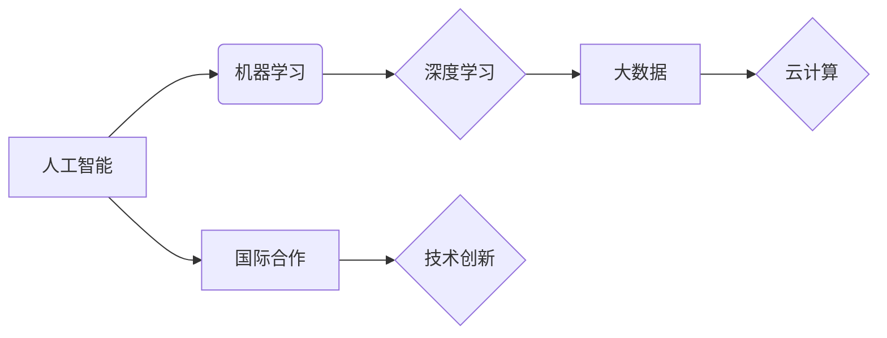

                 

## 国际合作：共同推动人类计算领域的进步

> 关键词：人工智能、机器学习、深度学习、大数据、云计算、国际合作、技术创新

### 1. 背景介绍

人类计算领域的进步从未像现在这样迅猛。从人工智能的兴起到机器学习的深度发展，再到大数据和云计算的蓬勃发展，我们正处于一个前所未有的技术变革时代。这些技术突破正在深刻地改变着我们的生活，为我们带来了前所未有的机遇和挑战。

然而，这些技术的进步并非孤立发生的，而是建立在全球范围内广泛的合作和知识共享基础之上。无论是开源软件的兴起，还是国际学术会议的盛况，都体现了人类计算领域国际合作的蓬勃发展。

### 2. 核心概念与联系

**2.1  人工智能 (AI)**

人工智能是指模拟人类智能行为的计算机系统。它涵盖了广泛的领域，包括机器学习、自然语言处理、计算机视觉等。

**2.2  机器学习 (ML)**

机器学习是人工智能的一个子领域，它使计算机能够从数据中学习，并根据学习到的知识进行预测或决策。

**2.3  深度学习 (DL)**

深度学习是机器学习的一个子领域，它使用多层神经网络来模拟人类大脑的学习过程。深度学习在图像识别、语音识别等领域取得了突破性的进展。

**2.4  大数据 (Big Data)**

大数据是指海量、高速度、高多样性的数据。大数据分析可以帮助我们从数据中发现隐藏的模式和趋势。

**2.5  云计算 (Cloud Computing)**

云计算是指使用互联网提供计算资源、存储资源和软件服务的模式。云计算为人工智能、机器学习等技术的发展提供了强大的基础设施支持。

**2.6  国际合作**

国际合作是指不同国家和地区的科学家、工程师、企业家等在技术研发、知识共享、人才培养等方面进行合作。

**2.7  技术创新**

技术创新是指开发新的技术、产品和服务，以满足社会不断变化的需求。

**核心概念联系流程图**



### 3. 核心算法原理 & 具体操作步骤

**3.1  算法原理概述**

深度学习算法的核心原理是使用多层神经网络来模拟人类大脑的学习过程。神经网络由许多相互连接的神经元组成，每个神经元接收来自其他神经元的输入，并根据输入进行计算，输出到其他神经元。通过训练神经网络，使其能够从数据中学习到复杂的模式和关系。

**3.2  算法步骤详解**

1. **数据预处理:** 将原始数据转换为深度学习算法可以理解的格式。
2. **网络结构设计:** 根据任务需求设计神经网络的结构，包括神经元的数量、连接方式等。
3. **参数初始化:** 为神经网络中的参数进行随机初始化。
4. **前向传播:** 将输入数据通过神经网络进行一次传播，得到输出结果。
5. **损失函数计算:** 计算输出结果与真实值的差异，即损失函数的值。
6. **反向传播:** 根据损失函数的值，调整神经网络的参数，使损失函数的值最小化。
7. **迭代训练:** 重复步骤4-6，直到损失函数的值达到预设的阈值。

**3.3  算法优缺点**

**优点:**

* 能够学习到复杂的模式和关系。
* 在图像识别、语音识别等领域取得了突破性的进展。

**缺点:**

* 需要大量的训练数据。
* 训练过程耗时且耗能。
* 模型解释性较差。

**3.4  算法应用领域**

* 图像识别
* 语音识别
* 自然语言处理
* 机器翻译
* 医疗诊断
* 金融预测

### 4. 数学模型和公式 & 详细讲解 & 举例说明

**4.1  数学模型构建**

深度学习算法的核心是神经网络，神经网络可以看作是一个复杂的数学模型。每个神经元可以看作是一个简单的数学函数，它接收来自其他神经元的输入，并根据输入进行计算，输出到其他神经元。

**4.2  公式推导过程**

神经网络的输出可以表示为：

$$
y = f(W x + b)
$$

其中：

* $y$ 是神经网络的输出。
* $f$ 是激活函数。
* $W$ 是权重矩阵。
* $x$ 是输入向量。
* $b$ 是偏置向量。

**4.3  案例分析与讲解**

假设我们有一个简单的感知器，它只有一个输入神经元和一个输出神经元。感知器的激活函数是阶跃函数，权重和偏置分别为 $w$ 和 $b$。

输入数据为 $x$，输出为 $y$，则感知器的输出可以表示为：

$$
y = \begin{cases}
1, & \text{if } Wx + b > 0 \\
0, & \text{otherwise}
\end{cases}
$$

**5. 项目实践：代码实例和详细解释说明**

**5.1  开发环境搭建**

* Python 3.x
* TensorFlow 或 PyTorch

**5.2  源代码详细实现**

```python
import tensorflow as tf

# 定义神经网络模型
model = tf.keras.models.Sequential([
  tf.keras.layers.Dense(128, activation='relu', input_shape=(784,)),
  tf.keras.layers.Dense(10, activation='softmax')
])

# 编译模型
model.compile(optimizer='adam',
              loss='sparse_categorical_crossentropy',
              metrics=['accuracy'])

# 训练模型
model.fit(x_train, y_train, epochs=10)

# 评估模型
loss, accuracy = model.evaluate(x_test, y_test)
print('Test loss:', loss)
print('Test accuracy:', accuracy)
```

**5.3  代码解读与分析**

* 使用 TensorFlow 库构建一个简单的深度学习模型。
* 模型包含两层全连接神经网络，第一层有 128 个神经元，使用 ReLU 激活函数；第二层有 10 个神经元，使用 softmax 激活函数。
* 使用 Adam 优化器、稀疏类别交叉熵损失函数和准确率作为评估指标。
* 使用训练数据训练模型 10 个 epochs。
* 使用测试数据评估模型的性能。

**5.4  运行结果展示**

训练完成后，可以查看模型的训练损失和准确率曲线，以及测试集上的损失和准确率。

### 6. 实际应用场景

**6.1  医疗诊断**

深度学习算法可以用于分析医学图像，例如 X 光片、CT 扫描和 MRI 图像，帮助医生诊断疾病。

**6.2  金融预测**

深度学习算法可以用于分析金融数据，例如股票价格、汇率和债券收益率，帮助金融机构预测市场趋势。

**6.3  自动驾驶**

深度学习算法可以用于训练自动驾驶汽车，使其能够识别道路上的障碍物、交通信号和行人。

**6.4  未来应用展望**

随着人工智能技术的不断发展，深度学习算法将在更多领域得到应用，例如个性化教育、精准营销、智能家居等。

### 7. 工具和资源推荐

**7.1  学习资源推荐**

* **书籍:**
    * 深度学习 (Deep Learning) - Ian Goodfellow, Yoshua Bengio, Aaron Courville
    * 构建深度学习模型 (Hands-On Machine Learning with Scikit-Learn, Keras & TensorFlow) - Aurélien Géron
* **在线课程:**
    * TensorFlow 官方教程
    * PyTorch 官方教程
    * Coursera 上的深度学习课程

**7.2  开发工具推荐**

* TensorFlow
* PyTorch
* Keras

**7.3  相关论文推荐**

* ImageNet Classification with Deep Convolutional Neural Networks (AlexNet)
* Deep Residual Learning for Image Recognition (ResNet)
* Attention Is All You Need (Transformer)

### 8. 总结：未来发展趋势与挑战

**8.1  研究成果总结**

近年来，深度学习算法取得了显著的进展，在图像识别、语音识别、自然语言处理等领域取得了突破性的成果。

**8.2  未来发展趋势**

* **模型效率提升:** 研究更轻量级、更高效的深度学习模型。
* **数据安全与隐私保护:** 研究如何保护深度学习算法训练过程中和应用过程中数据安全和隐私。
* **可解释性增强:** 研究如何提高深度学习模型的解释性，使其决策过程更加透明。

**8.3  面临的挑战**

* **数据获取和标注:** 深度学习算法需要大量的训练数据，获取和标注这些数据成本高昂。
* **计算资源需求:** 训练深度学习模型需要大量的计算资源，这对于资源有限的机构和个人来说是一个挑战。
* **伦理问题:** 深度学习算法的应用可能带来一些伦理问题，例如算法偏见、隐私侵犯等。

**8.4  研究展望**

未来，人工智能和深度学习技术将继续发展，并对人类社会产生更深远的影响。我们需要加强国际合作，共同推动这些技术的健康发展，并将其应用于解决人类面临的重大挑战。

### 9. 附录：常见问题与解答

**9.1  深度学习算法需要多少数据才能训练？**

深度学习算法需要大量的训练数据，一般来说，需要至少几千到几百万个样本才能达到较好的效果。

**9.2  深度学习算法的训练过程需要多长时间？**

深度学习算法的训练时间取决于模型的复杂度、数据的规模和计算资源的配置。一般来说，训练一个简单的模型可能只需要几小时，而训练一个复杂的模型可能需要几天甚至几周。

**9.3  深度学习算法的解释性如何？**

深度学习算法的解释性相对较差，因为其决策过程是通过复杂的非线性映射实现的，难以直接理解。

**9.4  深度学习算法有哪些伦理问题？**

深度学习算法的应用可能带来一些伦理问题，例如算法偏见、隐私侵犯等。我们需要在应用深度学习算法时，充分考虑这些伦理问题，并采取相应的措施来规避风险。


作者：禅与计算机程序设计艺术 / Zen and the Art of Computer Programming 
<end_of_turn>

