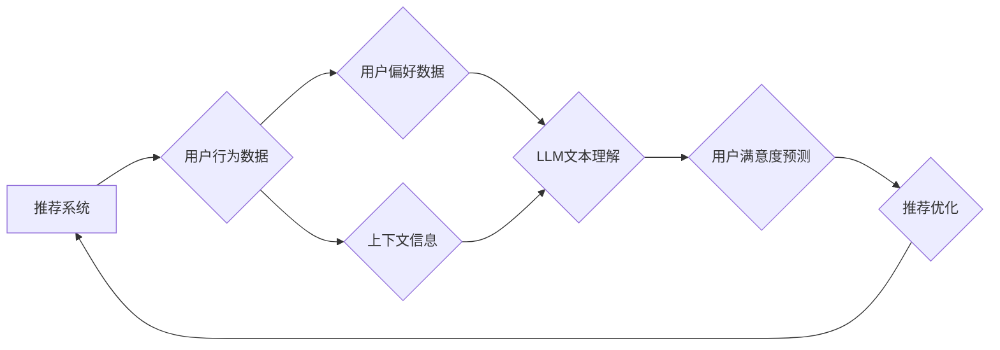

                 

## 基于LLM的推荐系统用户满意度预测

> 关键词：LLM,推荐系统,用户满意度预测,自然语言处理,机器学习,深度学习,Transformer

## 1. 背景介绍

推荐系统是互联网时代的重要组成部分，广泛应用于电商、视频、音乐、新闻等领域，旨在为用户提供个性化的内容和服务，提升用户体验。传统的推荐系统主要依赖于协同过滤、内容过滤等方法，但这些方法在面对冷启动问题、数据稀疏性等挑战时表现不足。近年来，随着大语言模型（LLM）的快速发展，其强大的文本理解和生成能力为推荐系统带来了新的机遇。

LLM能够理解用户对内容的潜在需求，并生成更精准、更个性化的推荐，从而提升用户满意度。基于LLM的推荐系统用户满意度预测旨在利用LLM的优势，预测用户对推荐内容的满意程度，为推荐系统提供更有效的反馈机制，从而不断优化推荐效果。

## 2. 核心概念与联系

### 2.1  推荐系统

推荐系统是指通过分析用户历史行为、偏好和上下文信息，预测用户对特定内容的兴趣，并提供个性化的推荐。推荐系统可以分为以下几种类型：

* **基于内容的推荐系统:** 根据用户历史行为和偏好，推荐与之相似的其他内容。
* **基于协同过滤的推荐系统:** 根据其他用户对相同内容的评价，推荐用户可能感兴趣的内容。
* **混合推荐系统:** 结合基于内容和基于协同过滤的方法，提高推荐效果。

### 2.2  大语言模型（LLM）

大语言模型（LLM）是一种基于深度学习的强大自然语言处理模型，能够理解和生成人类语言。LLM通常由 Transformer 架构构成，并通过海量文本数据进行训练，具备强大的文本理解、生成、翻译、摘要等能力。

### 2.3  用户满意度预测

用户满意度预测是指利用机器学习算法，根据用户行为、偏好和上下文信息，预测用户对特定内容或服务的满意程度。用户满意度预测可以帮助企业了解用户需求，优化产品和服务，提升用户体验。

**核心概念与架构流程图:**



## 3. 核心算法原理 & 具体操作步骤

### 3.1  算法原理概述

基于LLM的推荐系统用户满意度预测通常采用以下算法原理：

* **文本嵌入:** 将用户行为、偏好和上下文信息转换为向量表示，以便LLM理解和处理。
* **LLM文本理解:** 利用LLM对用户文本数据进行理解，提取用户需求和意图。
* **用户满意度建模:** 建立数学模型，将LLM提取的用户需求和意图与推荐内容相关联，预测用户满意度。

### 3.2  算法步骤详解

1. **数据收集:** 收集用户行为数据、用户偏好数据和上下文信息。
2. **数据预处理:** 对数据进行清洗、转换和编码，使其适合LLM处理。
3. **文本嵌入:** 利用预训练的词嵌入模型或句子嵌入模型，将用户文本数据转换为向量表示。
4. **LLM文本理解:** 将用户文本向量输入LLM，利用其强大的文本理解能力，提取用户需求和意图。
5. **用户满意度建模:** 根据LLM提取的用户需求和意图，以及推荐内容的特征，建立用户满意度预测模型。常用的模型包括线性回归、逻辑回归、支持向量机、深度神经网络等。
6. **模型训练:** 利用训练数据训练用户满意度预测模型。
7. **模型评估:** 利用测试数据评估模型性能，并进行调参优化。
8. **部署与应用:** 将训练好的模型部署到推荐系统中，用于预测用户对推荐内容的满意度。

### 3.3  算法优缺点

**优点:**

* **精准度高:** LLM能够理解用户潜在需求，提高推荐精准度。
* **个性化强:** LLM可以根据用户个性化需求生成个性化推荐。
* **适应性强:** LLM可以适应不同类型的推荐场景和数据。

**缺点:**

* **计算资源消耗大:** LLM训练和推理需要大量的计算资源。
* **数据依赖性强:** LLM需要海量文本数据进行训练，数据质量直接影响模型性能。
* **解释性差:** LLM的决策过程较为复杂，难以解释其推荐结果。

### 3.4  算法应用领域

基于LLM的推荐系统用户满意度预测可以应用于以下领域:

* **电商推荐:** 预测用户对商品的满意度，提高商品推荐精准度。
* **视频推荐:** 预测用户对视频的满意度，推荐用户感兴趣的视频内容。
* **音乐推荐:** 预测用户对音乐的满意度，推荐用户喜欢的音乐。
* **新闻推荐:** 预测用户对新闻的满意度，推荐用户感兴趣的新闻资讯。

## 4. 数学模型和公式 & 详细讲解 & 举例说明

### 4.1  数学模型构建

基于LLM的推荐系统用户满意度预测模型通常采用深度学习方法，例如多层感知机（MLP）或卷积神经网络（CNN）。模型输入包括用户特征、推荐内容特征和LLM提取的用户需求和意图。模型输出为用户对推荐内容的满意度评分。

### 4.2  公式推导过程

假设用户 $u$ 对推荐内容 $i$ 的满意度评分为 $r_{ui}$，则用户满意度预测模型可以表示为以下公式：

$$r_{ui} = f(x_u, x_i, y_u)$$

其中：

* $x_u$ 为用户 $u$ 的特征向量。
* $x_i$ 为推荐内容 $i$ 的特征向量。
* $y_u$ 为LLM提取的用户 $u$ 的需求和意图向量。
* $f$ 为用户满意度预测模型的激活函数。

### 4.3  案例分析与讲解

例如，在电商推荐场景中，用户特征可以包括用户的年龄、性别、购买历史等，推荐内容特征可以包括商品的类别、价格、评价等，LLM提取的用户需求和意图可以包括用户的购物意图、偏好商品类型等。

模型训练过程中，利用用户历史行为数据，训练模型参数，使得模型能够准确预测用户对推荐内容的满意度评分。

## 5. 项目实践：代码实例和详细解释说明

### 5.1  开发环境搭建

* **操作系统:** Ubuntu 20.04
* **Python版本:** 3.8
* **深度学习框架:** PyTorch 1.8
* **LLM库:** HuggingFace Transformers

### 5.2  源代码详细实现

```python
import torch
from torch import nn
from transformers import AutoTokenizer, AutoModel

# 定义用户满意度预测模型
class RecommenderModel(nn.Module):
    def __init__(self, user_embedding_dim, item_embedding_dim, hidden_dim):
        super(RecommenderModel, self).__init__()
        self.user_embedding = nn.Embedding(num_embeddings=user_embedding_dim, embedding_dim=user_embedding_dim)
        self.item_embedding = nn.Embedding(num_embeddings=item_embedding_dim, embedding_dim=item_embedding_dim)
        self.llm_embedding = AutoModel.from_pretrained("bert-base-uncased")
        self.fc = nn.Linear(user_embedding_dim + item_embedding_dim + hidden_dim, 1)

    def forward(self, user_id, item_id, user_text):
        user_embedding = self.user_embedding(user_id)
        item_embedding = self.item_embedding(item_id)
        llm_embedding = self.llm_embedding(user_text)[0][:, 0, :]  # 取句子第一个token的embedding
        combined_embedding = torch.cat((user_embedding, item_embedding, llm_embedding), dim=1)
        output = self.fc(combined_embedding)
        return output

# 实例化模型
model = RecommenderModel(user_embedding_dim=10000, item_embedding_dim=10000, hidden_dim=768)

# 定义损失函数和优化器
criterion = nn.MSELoss()
optimizer = torch.optim.Adam(model.parameters(), lr=0.001)

# 训练模型
# ...

# 预测用户满意度
user_id = torch.tensor([1])
item_id = torch.tensor([2])
user_text = "我想要买一件舒适的T恤"
prediction = model(user_id, item_id, user_text)
print(prediction)
```

### 5.3  代码解读与分析

* **模型定义:** 代码定义了一个用户满意度预测模型，包含用户嵌入层、商品嵌入层、LLM嵌入层和全连接层。
* **LLM嵌入:** 使用HuggingFace Transformers库加载预训练的BERT模型，提取用户文本的embedding。
* **模型训练:** 使用历史数据训练模型，优化模型参数。
* **预测:** 使用训练好的模型预测用户对推荐内容的满意度评分。

### 5.4  运行结果展示

训练完成后，模型可以用于预测用户对推荐内容的满意度评分。预测结果可以用于优化推荐系统，提高推荐效果。

## 6. 实际应用场景

### 6.1  电商推荐

基于LLM的推荐系统可以根据用户的购物历史、浏览记录、评论等信息，以及LLM提取的用户需求和意图，推荐更符合用户偏好的商品。例如，如果用户评论了一件衣服舒适，LLM可以理解用户的需求是“舒适”，并推荐其他舒适的衣服。

### 6.2  视频推荐

基于LLM的推荐系统可以根据用户的观看历史、点赞记录、评论等信息，以及LLM提取的用户兴趣和偏好，推荐更符合用户口味的视频。例如，如果用户观看过很多科幻电影，LLM可以理解用户的兴趣是“科幻”，并推荐其他科幻电影。

### 6.3  音乐推荐

基于LLM的推荐系统可以根据用户的播放历史、收藏记录、评论等信息，以及LLM提取用户的音乐风格偏好，推荐更符合用户口味的音乐。例如，如果用户经常播放摇滚乐，LLM可以理解用户的音乐风格偏好是“摇滚”，并推荐其他摇滚乐。

### 6.4  未来应用展望

随着LLM技术的不断发展，基于LLM的推荐系统用户满意度预测将在更多领域得到应用，例如个性化教育、医疗保健、金融服务等。

## 7. 工具和资源推荐

### 7.1  学习资源推荐

* **HuggingFace Transformers:** https://huggingface.co/docs/transformers/index
* **PyTorch:** https://pytorch.org/
* **论文:**
    * "BERT: Pre-training of Deep Bidirectional Transformers for Language Understanding"
    * "Exploring the Limits of Transfer Learning with a Unified Text-to-Text Transformer"

### 7.2  开发工具推荐

* **Jupyter Notebook:** https://jupyter.org/
* **VS Code:** https://code.visualstudio.com/

### 7.3  相关论文推荐

* "Deep Learning for Recommender Systems"
* "Neural Collaborative Filtering"
* "Context-Aware Recommendation with Deep Learning"

## 8. 总结：未来发展趋势与挑战

### 8.1  研究成果总结

基于LLM的推荐系统用户满意度预测取得了显著进展，能够提高推荐精准度和个性化程度。

### 8.2  未来发展趋势

* **多模态推荐:** 将文本、图像、音频等多模态数据融合到推荐系统中，提升推荐效果。
* **联邦学习:** 利用联邦学习技术，在保护用户隐私的前提下，训练更强大的推荐模型。
* **可解释性增强:** 研究更可解释的LLM模型，提高推荐结果的可理解性和信任度。

### 8.3  面临的挑战

* **数据稀疏性:** 许多推荐场景数据稀疏，难以训练有效的LLM模型。
* **计算资源消耗:** 训练和推理LLM模型需要大量的计算资源，成本较高。
* **模型解释性:** LLM模型的决策过程较为复杂，难以解释其推荐结果。

### 8.4  研究展望

未来研究将重点关注解决上述挑战，开发更高效、更精准、更可解释的基于LLM的推荐系统用户满意度预测模型。

## 9. 附录：常见问题与解答

**Q1: 如何选择合适的LLM模型？**

**A1:** 选择合适的LLM模型取决于具体的应用场景和数据特点。对于文本理解任务，BERT、RoBERTa等模型效果较好。对于代码生成任务，CodeBERT、GPT-3等模型效果较好。

**Q2: 如何处理数据稀疏性问题？**

**A2:** 可以采用数据增强、迁移学习等技术来处理数据稀疏性问题。

**Q3: 如何评估模型性能？**

**A3:** 可以使用RMSE、MAE等指标来评估模型性能。

**作者：禅与计算机程序设计艺术 / Zen and the Art of Computer Programming**<end_of_turn>

