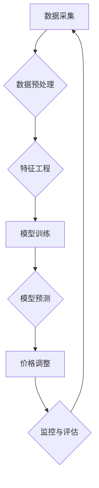

                 

## 基于大模型的电商智能定价系统设计与实现

> 关键词：大模型、电商、智能定价、机器学习、预测模型、价格优化、数据分析

## 1. 背景介绍

在当今数据爆炸的时代，电商平台面临着日益激烈的竞争压力。如何制定精准、高效的定价策略，成为提升利润率、增强市场竞争力的关键。传统的定价方法往往依赖于人工经验和市场调研，缺乏数据驱动和智能化，难以适应快速变化的市场环境。

基于大模型的智能定价系统，利用机器学习、深度学习等人工智能技术，从海量商品数据、市场趋势、用户行为等多方面进行分析，构建精准的预测模型，实现自动化的定价决策。这种智能定价系统能够有效解决传统定价方法的局限性，为电商平台带来以下优势：

* **提高定价准确性:** 通过分析海量数据，识别商品的价值、市场需求和竞争对手价格等关键因素，制定更精准的定价策略。
* **优化利润率:** 根据预测模型的分析结果，动态调整商品价格，最大化利润空间。
* **提升用户体验:** 提供更合理的商品价格，增强用户购物体验，提高用户粘性。
* **降低人工成本:** 自动化定价决策，减少人工干预，降低人力成本。

## 2. 核心概念与联系

### 2.1 大模型

大模型是指参数量巨大、训练数据海量的人工智能模型。近年来，随着深度学习技术的进步，大模型在自然语言处理、计算机视觉、语音识别等领域取得了突破性进展。大模型的强大能力使其能够学习复杂的模式和关系，为智能定价系统提供强大的数据分析和预测能力。

### 2.2 电商平台数据

电商平台拥有海量用户行为数据、商品信息数据、市场趋势数据等，这些数据是构建智能定价系统的基础。

* **用户行为数据:** 包括用户浏览记录、购买记录、评价记录等，可以反映用户对商品的兴趣、偏好和购买意愿。
* **商品信息数据:** 包括商品名称、描述、价格、库存等，可以帮助系统了解商品的属性和价值。
* **市场趋势数据:** 包括竞争对手价格、市场需求变化等，可以帮助系统了解市场环境和竞争态势。

### 2.3 智能定价系统架构

基于大模型的电商智能定价系统通常采用以下架构：



**数据采集:** 从电商平台和外部数据源收集相关数据。

**数据预处理:** 对收集到的数据进行清洗、转换、格式化等处理，使其适合模型训练。

**特征工程:** 从原始数据中提取有价值的特征，用于模型训练和预测。

**模型训练:** 利用大模型和机器学习算法，训练预测模型，用于预测商品价格。

**模型预测:** 将最新数据输入到训练好的模型中，预测商品的最佳价格。

**价格调整:** 根据模型预测结果，动态调整商品价格。

**监控与评估:** 监控系统运行情况，评估模型性能，并进行模型更新和优化。

## 3. 核心算法原理 & 具体操作步骤

### 3.1 算法原理概述

基于大模型的智能定价系统通常采用以下核心算法：

* **回归算法:** 用于预测商品价格的数值结果。常见的回归算法包括线性回归、逻辑回归、支持向量机回归等。
* **树模型:** 用于构建决策树，根据商品特征和市场条件，预测商品价格。常见的树模型包括决策树、随机森林、梯度提升树等。
* **神经网络:** 用于学习复杂的非线性关系，预测商品价格。常见的深度学习模型包括多层感知机、卷积神经网络、循环神经网络等。

### 3.2 算法步骤详解

1. **数据收集和预处理:** 从电商平台和外部数据源收集相关数据，并进行清洗、转换、格式化等处理。
2. **特征工程:** 从原始数据中提取有价值的特征，例如商品属性、用户行为、市场趋势等。
3. **模型选择和训练:** 根据实际需求选择合适的算法模型，并利用训练数据进行模型训练。
4. **模型评估和优化:** 使用测试数据评估模型性能，并根据评估结果进行模型优化，例如调整模型参数、增加训练数据等。
5. **模型部署和预测:** 将训练好的模型部署到生产环境中，并根据实时数据进行价格预测。
6. **价格调整和监控:** 根据模型预测结果，动态调整商品价格，并监控系统运行情况，及时进行模型更新和优化。

### 3.3 算法优缺点

| 算法类型 | 优点 | 缺点 |
|---|---|---|
| 回归算法 | 计算简单，易于理解和实现 | 难以处理非线性关系 |
| 树模型 | 可以处理非线性关系，解释性强 | 容易过拟合 |
| 神经网络 | 可以学习复杂的非线性关系，预测精度高 | 计算复杂，训练时间长，解释性差 |

### 3.4 算法应用领域

* **电商平台:** 智能定价、促销策略优化、库存管理等
* **金融行业:** 贷款风险评估、信用评分、投资策略制定等
* **医疗行业:** 疾病诊断、药物研发、医疗资源配置等
* **制造业:** 产品定价、生产计划优化、质量控制等

## 4. 数学模型和公式 & 详细讲解 & 举例说明

### 4.1 数学模型构建

智能定价系统的核心是构建一个能够预测商品价格的数学模型。常见的数学模型包括线性回归模型、逻辑回归模型、决策树模型、随机森林模型等。

**线性回归模型:**

假设商品价格 $p$ 与特征 $x_1, x_2, ..., x_n$ 的关系可以用线性方程表示：

$$p = \beta_0 + \beta_1x_1 + \beta_2x_2 + ... + \beta_nx_n + \epsilon$$

其中：

* $\beta_0, \beta_1, ..., \beta_n$ 是模型参数，需要通过训练数据进行估计。
* $x_1, x_2, ..., x_n$ 是商品特征，例如商品属性、用户行为、市场趋势等。
* $\epsilon$ 是误差项，代表模型预测结果与实际价格之间的偏差。

**逻辑回归模型:**

用于预测商品价格是否属于某个特定区间，例如高价区间、中价区间、低价区间。逻辑回归模型将商品特征映射到一个概率值，表示商品价格属于特定区间的概率。

### 4.2 公式推导过程

线性回归模型的参数估计可以通过最小二乘法进行。最小二乘法旨在找到一组参数，使得模型预测结果与实际价格之间的误差平方和最小。

**损失函数:**

$$L(\beta) = \sum_{i=1}^{N}(p_i - \hat{p}_i)^2$$

其中：

* $N$ 是训练样本数量。
* $p_i$ 是第 $i$ 个样本的实际价格。
* $\hat{p}_i$ 是模型预测的第 $i$ 个样本的价格。

**参数估计:**

通过求解损失函数的最小值，可以得到模型参数的估计值。

### 4.3 案例分析与讲解

假设我们想要预测电商平台上某款商品的价格。我们可以收集以下特征数据：

* 商品属性：商品类别、品牌、尺寸、颜色等。
* 用户行为：用户浏览记录、购买记录、评价记录等。
* 市场趋势：竞争对手价格、市场需求变化等。

我们可以使用线性回归模型或逻辑回归模型来预测商品价格。

## 5. 项目实践：代码实例和详细解释说明

### 5.1 开发环境搭建

* Python 3.x
* TensorFlow 或 PyTorch
* Pandas、NumPy 等数据处理库
* Scikit-learn 等机器学习库

### 5.2 源代码详细实现

```python
import pandas as pd
from sklearn.linear_model import LinearRegression

# 加载数据
data = pd.read_csv('电商数据.csv')

# 特征工程
X = data[['商品类别', '品牌', '尺寸', '颜色']]
y = data['价格']

# 模型训练
model = LinearRegression()
model.fit(X, y)

# 模型预测
new_data = pd.DataFrame({'商品类别': ['电子产品', '服装', '鞋子'],
                         '品牌': ['苹果', '耐克', '阿迪达斯'],
                         '尺寸': ['16寸', 'M码', '42码'],
                         '颜色': ['黑色', '白色', '红色']})
predicted_prices = model.predict(new_data)

# 打印预测结果
print(predicted_prices)
```

### 5.3 代码解读与分析

* 数据加载：使用 Pandas 库加载电商数据。
* 特征工程：从原始数据中提取有价值的特征，例如商品属性、用户行为等。
* 模型训练：使用 Scikit-learn 库的线性回归模型进行模型训练。
* 模型预测：使用训练好的模型预测新数据的商品价格。
* 结果输出：打印预测结果。

### 5.4 运行结果展示

运行代码后，将输出预测的商品价格。

## 6. 实际应用场景

### 6.1 电商平台定价策略

基于大模型的智能定价系统可以帮助电商平台制定更精准的定价策略，例如：

* **动态调整商品价格:** 根据市场需求、竞争对手价格、用户行为等因素，动态调整商品价格，最大化利润空间。
* **个性化定价:** 根据用户的购买历史、浏览记录、偏好等信息，为不同用户提供个性化的价格，提高用户体验和转化率。
* **促销策略优化:** 利用大模型预测用户对促销活动的敏感度，优化促销策略，提高促销效果。

### 6.2 库存管理优化

智能定价系统可以结合库存数据，预测商品的需求量，帮助电商平台优化库存管理，避免库存积压或缺货。

### 6.3 市场趋势分析

智能定价系统可以分析市场趋势数据，例如竞争对手价格、用户搜索热词等，帮助电商平台了解市场动态，及时调整商品策略。

### 6.4 未来应用展望

随着人工智能技术的不断发展，基于大模型的智能定价系统将有更广泛的应用场景，例如：

* **跨境电商:** 帮助跨境电商平台根据不同国家和地区的市场需求，制定精准的定价策略。
* **定制化商品:** 为用户提供定制化商品，根据用户的需求和喜好，动态调整商品价格。
* **虚拟商品:** 为虚拟商品，例如游戏道具、虚拟货币等，制定智能定价策略。

## 7. 工具和资源推荐

### 7.1 学习资源推荐

* **书籍:**
    * 《深度学习》
    * 《机器学习实战》
    * 《Python机器学习》
* **在线课程:**
    * Coursera
    * edX
    * Udacity

### 7.2 开发工具推荐

* **Python:** 
* **TensorFlow:** 
* **PyTorch:** 
* **Scikit-learn:** 
* **Pandas:** 
* **NumPy:**

### 7.3 相关论文推荐

* **Attention Is All You Need:** https://arxiv.org/abs/1706.03762
* **BERT: Pre-training of Deep Bidirectional Transformers for Language Understanding:** https://arxiv.org/abs/1810.04805
* **Generative Pre-trained Transformer 3 (GPT-3):** https://openai.com/blog/gpt-3/

## 8. 总结：未来发展趋势与挑战

### 8.1 研究成果总结

基于大模型的电商智能定价系统取得了显著的成果，能够有效提高定价准确性、优化利润率、提升用户体验。

### 8.2 未来发展趋势

* **模型更深更广:** 探索更深层次、更广范围的大模型，提升预测精度和泛化能力。
* **多模态融合:** 将文本、图像、音频等多模态数据融合到智能定价系统中，获得更全面的信息。
* **解释性增强:** 研究更易于解释的模型，提高用户对智能定价系统的信任度。
* **个性化定制:** 为不同用户提供更个性化的定价策略，提升用户体验和忠诚度。

### 8.3 面临的挑战

* **数据质量:** 智能定价系统依赖于高质量的数据，数据不完整、不准确会影响模型性能。
* **模型解释性:** 大模型的复杂性使得模型解释性差，难以理解模型的决策过程。
* **伦理问题:** 智能定价系统可能会导致价格歧视等伦理问题，需要谨慎设计和使用。

### 8.4 研究展望

未来，基于大模型的电商智能定价系统将朝着更智能、更精准、更可解释的方向发展，为电商平台和用户带来更多价值。


## 9. 附录：常见问题与解答

**Q1: 智能定价系统会取代人工定价吗？**

A1: 智能定价系统可以辅助人工定价，提高效率和准确性，但不会完全取代人工定价。人工定价仍然需要考虑一些无法用数据量化的因素，例如品牌形象、市场策略等。

**Q2: 智能定价系统如何保证价格公平？**

A2: 智能定价系统需要遵循公平公正的算法设计原则，避免价格歧视等问题。同时，需要定期监控系统运行情况，及时发现和解决潜在问题。

**Q3: 如何评估智能定价系统的性能？**

A3: 可以使用多种指标来评估智能定价系统的性能，例如预测精度、利润率、用户满意度等。

**作者：禅与计算机程序设计艺术 / Zen and the Art of Computer Programming**<end_of_turn>

