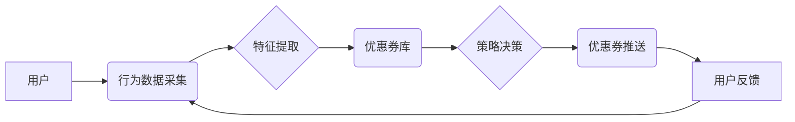

                 

## 基于强化学习的个性化优惠券分发策略

> 关键词：强化学习、优惠券分发、个性化推荐、用户行为预测、深度学习

## 1. 背景介绍

在当今数据爆炸的时代，企业积累了海量用户数据，如何有效利用这些数据提升营销效果成为关键问题。优惠券作为一种常见的营销工具，能够有效刺激消费，但传统的优惠券分发策略往往缺乏针对性，导致资源浪费和效果不佳。

个性化优惠券分发策略旨在根据用户的行为特征、偏好和购买历史等信息，精准推送合适的优惠券，从而提高用户转化率和营销 ROI。传统的个性化推荐系统主要依赖于基于内容的过滤和协同过滤等方法，但这些方法难以捕捉用户行为的复杂性和动态性。

强化学习 (Reinforcement Learning, RL) 作为一种机器学习范式，能够学习用户行为的动态模式，并通过试错机制不断优化优惠券分发策略。基于 RL 的个性化优惠券分发策略能够更好地适应用户需求变化，实现更精准的推荐和更高的营销效果。

## 2. 核心概念与联系

### 2.1 强化学习

强化学习是一种基于交互学习的机器学习方法，其核心思想是通过奖励机制引导智能体在环境中采取最优行动。

在 RL 系统中，智能体 (Agent) 与环境 (Environment) 进行交互。智能体根据环境的当前状态采取行动，环境会根据行动的结果给予智能体奖励或惩罚。智能体的目标是通过不断学习和调整策略，最大化累积的奖励。

### 2.2 优惠券分发策略

优惠券分发策略是指企业根据用户特征和行为，选择合适的优惠券进行推送的算法和流程。传统的优惠券分发策略通常基于以下因素：

* 用户基本信息：年龄、性别、地域等
* 用户行为历史：购买记录、浏览记录、收藏记录等
* 优惠券属性：折扣力度、有效期、适用范围等

### 2.3 个性化推荐

个性化推荐是指根据用户的兴趣、偏好和行为特征，推荐个性化的商品、服务或内容。个性化推荐能够提高用户体验，提升用户满意度和转化率。

**核心架构流程图**



## 3. 核心算法原理 & 具体操作步骤

### 3.1 算法原理概述

基于强化学习的个性化优惠券分发策略将优惠券分发问题视为一个强化学习问题。

* **状态空间:** 用户的特征向量和优惠券库信息
* **动作空间:**  推送给用户的优惠券
* **奖励函数:**  用户点击、领取、使用优惠券的概率或转化率

通过训练 RL 算法，学习一个策略函数，该函数能够根据当前状态预测最优的优惠券推送动作，从而最大化奖励。

### 3.2 算法步骤详解

1. **数据收集:** 收集用户行为数据，包括用户基本信息、购买记录、浏览记录、优惠券领取和使用记录等。
2. **特征提取:** 从用户行为数据中提取特征，例如用户年龄、性别、购买频率、偏好商品类别等。
3. **优惠券库构建:** 建立优惠券库，包含优惠券的属性信息，例如折扣力度、有效期、适用范围等。
4. **模型训练:** 使用 RL 算法训练模型，例如 Q-learning、Deep Q-Network (DQN) 等。
5. **策略部署:** 将训练好的模型部署到线上系统，根据用户特征和优惠券库信息，预测最优的优惠券推送动作。
6. **效果评估:**  持续监控模型效果，并根据实际数据进行模型调整和优化。

### 3.3 算法优缺点

**优点:**

* **个性化推荐:**  能够根据用户的行为特征和偏好，精准推送优惠券。
* **动态优化:**  能够根据用户行为变化，动态调整优惠券分发策略。
* **数据驱动:**  基于用户行为数据进行训练和优化，能够不断提升推荐效果。

**缺点:**

* **数据依赖:**  需要大量用户行为数据进行训练，否则模型效果难以保证。
* **计算复杂度:**  RL 算法训练过程计算复杂度较高，需要强大的计算资源支持。
* **黑盒问题:**  RL 模型的决策过程相对复杂，难以解释模型的决策逻辑。

### 3.4 算法应用领域

基于强化学习的个性化优惠券分发策略能够应用于以下领域:

* 电子商务平台
* 线上旅游平台
* 金融服务平台
* 社交媒体平台

## 4. 数学模型和公式 & 详细讲解 & 举例说明

### 4.1 数学模型构建

强化学习模型的核心是状态-动作-奖励 (State-Action-Reward) 三元组。

* **状态 (State):**  用户当前的状态，例如用户特征向量、优惠券库信息等。
* **动作 (Action):**  智能体采取的动作，例如推送给用户的优惠券。
* **奖励 (Reward):**  用户对动作的反馈，例如用户点击、领取、使用优惠券的概率或转化率。

### 4.2 公式推导过程

常用的 RL 算法之一是 Q-learning 算法。Q-learning 算法的目标是学习一个 Q 函数，该函数能够估计在当前状态下采取某个动作的长期奖励期望。

Q 函数的更新公式如下:

$$Q(s, a) = Q(s, a) + \alpha [r + \gamma \max_{a'} Q(s', a') - Q(s, a)]$$

其中:

* $Q(s, a)$ 是在状态 $s$ 下采取动作 $a$ 的 Q 值。
* $\alpha$ 是学习率，控制着学习速度。
* $r$ 是当前状态下采取动作 $a$ 得到的奖励。
* $\gamma$ 是折扣因子，控制着未来奖励的权重。
* $s'$ 是采取动作 $a$ 后进入的下一个状态。
* $\max_{a'} Q(s', a')$ 是在下一个状态 $s'$ 下采取所有动作的 Q 值的最大值。

### 4.3 案例分析与讲解

假设一个电商平台想要使用 Q-learning 算法进行个性化优惠券分发。

* **状态:** 用户的年龄、性别、购买历史、浏览记录等特征向量。
* **动作:** 推送给用户的优惠券类型 (例如折扣券、满减券、积分券)。
* **奖励:** 用户点击、领取、使用优惠券的概率或转化率。

通过训练 Q-learning 算法，模型能够学习到不同用户类型下，不同优惠券类型的推送效果。例如，对于年龄较小的用户，可能更倾向于推送折扣券；对于购买频率较高的用户，可能更倾向于推送积分券。

## 5. 项目实践：代码实例和详细解释说明

### 5.1 开发环境搭建

* Python 3.x
* TensorFlow 或 PyTorch 深度学习框架
* NumPy 科学计算库
* Pandas 数据处理库

### 5.2 源代码详细实现

```python
import tensorflow as tf

# 定义 Q 网络模型
class QNetwork(tf.keras.Model):
    def __init__(self, state_size, action_size):
        super(QNetwork, self).__init__()
        self.dense1 = tf.keras.layers.Dense(64, activation='relu')
        self.dense2 = tf.keras.layers.Dense(32, activation='relu')
        self.output = tf.keras.layers.Dense(action_size)

    def call(self, state):
        x = self.dense1(state)
        x = self.dense2(x)
        return self.output(x)

# 定义强化学习算法
class DQNAgent:
    def __init__(self, state_size, action_size, learning_rate=0.001, gamma=0.95, epsilon=1.0, epsilon_decay=0.995, epsilon_min=0.01):
        self.state_size = state_size
        self.action_size = action_size
        self.learning_rate = learning_rate
        self.gamma = gamma
        self.epsilon = epsilon
        self.epsilon_decay = epsilon_decay
        self.epsilon_min = epsilon_min
        self.q_network = QNetwork(state_size, action_size)
        self.optimizer = tf.keras.optimizers.Adam(learning_rate=self.learning_rate)

    def choose_action(self, state):
        if tf.random.uniform(()) < self.epsilon:
            return tf.random.uniform(shape=(1,), minval=0, maxval=self.action_size, dtype=tf.int32)
        else:
            q_values = self.q_network(state)
            return tf.argmax(q_values, axis=1)

    def train(self, state, action, reward, next_state, done):
        with tf.GradientTape() as tape:
            q_values = self.q_network(state)
            target_q = reward + self.gamma * tf.reduce_max(self.q_network(next_state), axis=1) * (1 - done)
            loss = tf.keras.losses.MeanSquaredError()(target_q, q_values[0, action])
        gradients = tape.gradient(loss, self.q_network.trainable_variables)
        self.optimizer.apply_gradients(zip(gradients, self.q_network.trainable_variables))

        self.epsilon = max(self.epsilon * self.epsilon_decay, self.epsilon_min)

### 5.3 代码解读与分析

* **QNetwork:** 定义了 Q 网络模型，用于估计在当前状态下采取某个动作的 Q 值。
* **DQNAgent:** 定义了强化学习算法，包含了初始化、选择动作、训练等方法。
* **choose_action:** 根据 epsilon-greedy 策略选择动作。
* **train:** 使用梯度下降算法更新 Q 网络模型的参数。

### 5.4 运行结果展示

通过训练 DQNAgent，可以得到一个能够预测用户行为的 Q 函数。

可以使用该 Q 函数来预测不同用户类型下，不同优惠券类型的推送效果，并根据预测结果进行个性化优惠券分发。

## 6. 实际应用场景

### 6.1 电子商务平台

电商平台可以利用 RL 算法，根据用户的购买历史、浏览记录、购物车内容等信息，精准推送优惠券，提高用户转化率和复购率。

### 6.2 线上旅游平台

旅游平台可以根据用户的旅行偏好、目的地、出行时间等信息，推荐个性化的优惠券，例如机票折扣、酒店优惠、景点门票减免等。

### 6.3 金融服务平台

金融服务平台可以根据用户的消费习惯、风险偏好、投资目标等信息，推荐个性化的金融产品优惠券，例如信用卡积分、理财产品优惠、贷款利率减免等。

### 6.4 未来应用展望

随着人工智能技术的不断发展，基于 RL 的个性化优惠券分发策略将有更广泛的应用场景，例如：

* **内容推荐:**  根据用户的阅读习惯、兴趣爱好等信息，推荐个性化的文章、视频、音乐等内容。
* **广告投放:**  根据用户的兴趣、行为特征等信息，精准推送广告，提高广告点击率和转化率。
* **医疗保健:**  根据用户的病史、症状、生活习惯等信息，推荐个性化的医疗服务和健康产品。

## 7. 工具和资源推荐

### 7.1 学习资源推荐

* **书籍:**
    * Reinforcement Learning: An Introduction by Richard S. Sutton and Andrew G. Barto
    * Deep Reinforcement Learning Hands-On by Maxim Lapan
* **在线课程:**
    * Coursera: Reinforcement Learning Specialization by David Silver
    * Udacity: Deep Reinforcement Learning Nanodegree

### 7.2 开发工具推荐

* **Python:**  Python 是 RL 开发的常用语言，拥有丰富的库和工具支持。
* **TensorFlow:**  TensorFlow 是 Google 开发的开源深度学习框架，支持 RL 算法的实现。
* **PyTorch:**  PyTorch 是 Facebook 开发的开源深度学习框架，也支持 RL 算法的实现。

### 7.3 相关论文推荐

* Deep Q-Network (DQN)
* Dueling Network Architectures for Deep Reinforcement Learning
* Proximal Policy Optimization Algorithms

## 8. 总结：未来发展趋势与挑战

### 8.1 研究成果总结

基于强化学习的个性化优惠券分发策略取得了显著的成果，能够有效提高优惠券的转化率和营销效果。

### 8.2 未来发展趋势

* **模型复杂度提升:**  利用更复杂的深度学习模型，例如 Transformer、Graph Neural Networks 等，提升模型的学习能力和预测精度。
* **多智能体强化学习:**  研究多智能体协同学习的策略，例如多用户协同推荐、多平台联合营销等。
* **联邦学习:**  利用联邦学习技术，保护用户隐私，实现个性化推荐的隐私安全。

### 8.3 面临的挑战

* **数据稀疏性:**  某些用户类型或优惠券类型的数据可能稀疏，导致模型训练效果不佳。
* **计算资源限制:**  训练复杂的 RL 模型需要大量的计算资源，成本较高。
* **解释性问题:**  RL 模型的决策过程相对复杂，难以解释模型的决策逻辑，缺乏透明度。

### 8.4 研究展望

未来，基于强化学习的个性化优惠券分发策略将继续朝着更智能、更精准、更安全的方向发展，为企业提供更有效的营销解决方案。


## 9. 附录：常见问题与解答

**Q1:  强化学习与传统推荐算法相比，有哪些优势？**

**A1:**  强化学习能够根据用户行为动态调整推荐策略，适应用户需求变化，而传统推荐算法往往依赖静态数据，难以捕捉用户行为的动态性。

**Q2:  如何解决数据稀疏性问题？**

**A2:**  可以使用数据增强技术，例如样本重采样、迁移学习等，增加训练数据量。

**Q3:  如何提高 RL 模型的解释性？**

**A3:**  可以使用可解释机器学习 (Explainable AI) 技术，例如 LIME、SHAP 等，解释 RL 模型的决策逻辑。


作者：禅与计算机程序设计艺术 / Zen and the Art of Computer Programming<end_of_turn>

