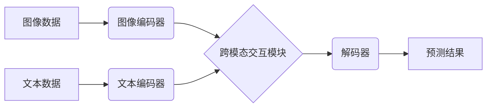

                 

## 多模态AI 图像、音频、视频处理

> 关键词：多模态学习、图像处理、音频处理、视频处理、深度学习、Transformer、自然语言处理

## 1. 背景介绍

随着人工智能技术的飞速发展，多模态学习（Multimodal Learning）作为一种能够处理多种数据类型（如图像、文本、音频、视频等）的学习范式，逐渐成为研究热点。传统人工智能系统通常只处理单一模态数据，而多模态学习则能够融合不同模态的信息，构建更完整、更丰富的知识表示，从而提升模型的理解能力和应用场景。

多模态AI在各个领域都展现出巨大的潜力，例如：

* **计算机视觉:**  结合图像和文本信息，实现更精准的图像识别、物体检测、场景理解等任务。
* **自然语言处理:**  利用图像、音频等多模态信息，提升文本理解、情感分析、对话系统等任务的性能。
* **人机交互:**  构建更自然、更智能的人机交互方式，例如语音控制、图像识别控制等。
* **医疗诊断:**  结合患者的影像数据、病历信息、语音记录等，辅助医生进行更准确的诊断和治疗方案制定。

## 2. 核心概念与联系

多模态学习的核心是融合不同模态数据的信息，构建一个统一的表示空间。

**2.1 多模态数据融合策略**

常见的多模态数据融合策略包括：

* **早期融合:** 将不同模态数据在特征提取阶段进行融合，例如将图像特征和文本特征进行拼接。
* **晚期融合:** 将不同模态数据分别进行特征提取，然后在分类或预测阶段进行融合。
* **跨模态注意力机制:** 利用注意力机制学习不同模态数据之间的关系，动态地分配不同模态数据的权重。

**2.2 多模态学习架构**

多模态学习架构通常由以下几个部分组成：

* **模态编码器:**  负责将不同模态数据编码成特征向量。
* **跨模态交互模块:**  负责融合不同模态的特征向量，学习不同模态之间的关系。
* **解码器:**  负责根据融合后的特征向量进行预测或分类。

**2.3 Mermaid 流程图**



## 3. 核心算法原理 & 具体操作步骤

### 3.1 算法原理概述

**3.1.1  Transformer模型**

Transformer模型是一种基于注意力机制的深度学习模型，在自然语言处理领域取得了巨大成功。其优势在于能够捕捉长距离依赖关系，并能够并行处理数据，从而提高训练效率。

**3.1.2  多模态Transformer**

多模态Transformer模型将Transformer模型扩展到处理多模态数据，例如图像、文本、音频等。其核心思想是将不同模态的数据编码成特征向量，然后利用跨模态注意力机制学习不同模态之间的关系，最终进行预测或分类。

### 3.2 算法步骤详解

1. **数据预处理:** 将图像、文本、音频等数据进行预处理，例如图像裁剪、文本分词、音频降噪等。
2. **模态编码:** 使用不同的编码器将不同模态数据编码成特征向量。例如，可以使用卷积神经网络（CNN）对图像进行编码，使用Recurrent Neural Network（RNN）或Transformer对文本进行编码，使用音频特征提取模型对音频进行编码。
3. **跨模态交互:** 利用跨模态注意力机制学习不同模态特征之间的关系，融合不同模态的信息。
4. **解码:** 使用解码器根据融合后的特征向量进行预测或分类。

### 3.3 算法优缺点

**优点:**

* 能够处理多种数据类型，提升模型的理解能力。
* 利用注意力机制可以学习不同模态之间的关系，提高融合效果。
* 能够应用于多种场景，例如图像识别、文本理解、人机交互等。

**缺点:**

* 训练数据量大，需要大量的多模态数据进行训练。
* 模型复杂度高，训练时间长。
* 跨模态融合策略的选择对模型性能影响较大。

### 3.4 算法应用领域

* **计算机视觉:** 图像识别、物体检测、场景理解、图像 Captioning
* **自然语言处理:** 文本分类、情感分析、机器翻译、对话系统
* **人机交互:** 语音控制、图像识别控制、虚拟现实
* **医疗诊断:** 辅助医生进行诊断和治疗方案制定
* **自动驾驶:** 识别道路场景、交通标志、行人等

## 4. 数学模型和公式 & 详细讲解 & 举例说明

### 4.1 数学模型构建

多模态Transformer模型的数学模型可以概括为以下公式：

$$
\mathbf{H} = \text{MultimodalEncoder}(\mathbf{I}, \mathbf{T})
$$

其中：

* $\mathbf{H}$ 表示融合后的多模态特征向量。
* $\mathbf{I}$ 表示图像特征向量。
* $\mathbf{T}$ 表示文本特征向量。
* $\text{MultimodalEncoder}$ 表示多模态编码器，它包含跨模态注意力机制。

### 4.2 公式推导过程

跨模态注意力机制的计算过程可以概括为以下公式：

$$
\mathbf{A} = \text{softmax}\left(\frac{\mathbf{I} \mathbf{W}_I + \mathbf{T} \mathbf{W}_T}{\sqrt{d_k}}\right)
$$

其中：

* $\mathbf{A}$ 表示注意力权重矩阵。
* $\mathbf{W}_I$ 和 $\mathbf{W}_T$ 表示图像特征向量和文本特征向量对应的权重矩阵。
* $d_k$ 表示每个特征向量的维度。

### 4.3 案例分析与讲解

假设我们有一个图像和一个文本描述，我们需要学习它们之间的关系。

* 图像特征向量 $\mathbf{I}$ 可以通过CNN提取得到。
* 文本特征向量 $\mathbf{T}$ 可以通过Transformer提取得到。
* 跨模态注意力机制可以学习图像和文本之间的关系，例如，如果图像中有一只猫，而文本描述中也提到“猫”，那么注意力权重会将图像和文本的对应部分加权更高。

最终，融合后的多模态特征向量 $\mathbf{H}$ 可以用于后续的预测或分类任务。

## 5. 项目实践：代码实例和详细解释说明

### 5.1 开发环境搭建

* Python 3.7+
* PyTorch 1.7+
* CUDA 10.2+

### 5.2 源代码详细实现

```python
import torch
import torch.nn as nn

class MultimodalEncoder(nn.Module):
    def __init__(self, image_dim, text_dim, hidden_dim):
        super(MultimodalEncoder, self).__init__()
        self.image_encoder = nn.Linear(image_dim, hidden_dim)
        self.text_encoder = nn.Linear(text_dim, hidden_dim)
        self.attention = nn.MultiheadAttention(hidden_dim, num_heads=8)

    def forward(self, image_features, text_features):
        image_encoded = self.image_encoder(image_features)
        text_encoded = self.text_encoder(text_features)
        
        # 跨模态注意力机制
        attention_output, _ = self.attention(image_encoded, text_encoded, text_encoded)
        
        # 融合特征
        fused_features = image_encoded + attention_output
        return fused_features

# 实例化模型
model = MultimodalEncoder(image_dim=1024, text_dim=512, hidden_dim=256)

# 输入数据
image_features = torch.randn(1, 1024)
text_features = torch.randn(1, 512)

# 前向传播
output = model(image_features, text_features)

print(output.shape)
```

### 5.3 代码解读与分析

* `MultimodalEncoder` 类定义了多模态编码器，包含图像编码器、文本编码器和跨模态注意力机制。
* `image_encoder` 和 `text_encoder` 使用线性层将图像特征和文本特征编码成隐藏维度。
* `attention` 使用多头注意力机制学习图像和文本之间的关系。
* `forward` 方法将图像特征和文本特征输入模型，并输出融合后的多模态特征向量。

### 5.4 运行结果展示

运行上述代码，输出结果为融合后的多模态特征向量的形状，例如`(1, 256)`。

## 6. 实际应用场景

### 6.1 图像字幕生成

结合图像和文本信息，自动生成图像的描述性字幕。例如，对于一张包含猫的图片，可以生成字幕“一只可爱的猫咪在草地上玩耍”。

### 6.2 视频问答

利用视频内容和文本问题，回答用户关于视频内容的问题。例如，用户问“视频中发生了什么？”，系统可以根据视频内容和文本描述生成答案。

### 6.3 多模态搜索

根据用户输入的图像、文本、音频等多模态查询，从海量数据中检索出最相关的结果。例如，用户上传一张图片，并输入“寻找类似的衣服”，系统可以根据图像特征和文本信息检索出类似的服装。

### 6.4 未来应用展望

* **更智能的人机交互:**  构建更自然、更智能的人机交互方式，例如通过语音、图像、手势等多种方式进行交互。
* **个性化教育:**  根据学生的学习风格和需求，提供个性化的学习内容和教学方式。
* **增强现实和虚拟现实:**  利用多模态信息增强现实和虚拟现实体验，例如在虚拟环境中进行更真实的互动。

## 7. 工具和资源推荐

### 7.1 学习资源推荐

* **书籍:**
    * 《深度学习》 - Ian Goodfellow, Yoshua Bengio, Aaron Courville
    * 《Transformer 详解》 - Jay Alammar
* **在线课程:**
    * Coursera: Deep Learning Specialization
    * fast.ai: Practical Deep Learning for Coders
* **博客和网站:**
    * Jay Alammar's Blog: https://jalammar.github.io/
    * Towards Data Science: https://towardsdatascience.com/

### 7.2 开发工具推荐

* **框架:**
    * PyTorch: https://pytorch.org/
    * TensorFlow: https://www.tensorflow.org/
* **库:**
    * OpenCV: https://opencv.org/
    * Librosa: https://librosa.org/
* **工具:**
    * Jupyter Notebook: https://jupyter.org/

### 7.3 相关论文推荐

* **Attention Is All You Need:** https://arxiv.org/abs/1706.03762
* **BERT: Pre-training of Deep Bidirectional Transformers for Language Understanding:** https://arxiv.org/abs/1810.04805
* **Vision Transformer (ViT):** https://arxiv.org/abs/2010.11929

## 8. 总结：未来发展趋势与挑战

### 8.1 研究成果总结

多模态AI在图像、音频、视频处理等领域取得了显著进展，例如图像字幕生成、视频问答、多模态搜索等应用场景取得了突破。

### 8.2 未来发展趋势

* **更强大的多模态模型:**  研究更强大的多模态模型，例如能够处理更多模态数据、更复杂的关系、更长距离依赖的模型。
* **更有效的跨模态融合策略:**  探索更有效的跨模态融合策略，例如利用更先进的注意力机制、图神经网络等。
* **更广泛的应用场景:**  将多模态AI应用于更广泛的场景，例如医疗诊断、教育、娱乐等。

### 8.3 面临的挑战

* **数据获取和标注:**  多模态数据获取和标注成本高，需要大量的标注数据进行训练。
* **模型复杂度和训练效率:**  多模态模型复杂度高，训练时间长，需要更高效的训练方法。
* **跨模态知识表示:**  如何有效地表示不同模态之间的知识关系，仍然是一个挑战。

### 8.4 研究展望

未来，多模态AI将继续朝着更智能、更通用、更安全的方向发展，为人类社会带来更多价值。


## 9. 附录：常见问题与解答

**Q1: 多模态学习和多任务学习有什么区别？**

**A1:** 多模态学习处理多种数据类型，例如图像、文本、音频等，而多任务学习处理同一类型数据，但多个不同的任务，例如图像分类和物体检测。

**Q2: 如何选择合适的跨模态融合策略？**

**A2:** 选择合适的跨模态融合策略取决于具体应用场景和数据特点。例如，对于图像和文本的融合，可以使用注意力机制，而对于图像和音频的融合，可以使用时空融合方法。

**Q3: 多模态AI的伦理问题有哪些？**

**A3:** 多模态AI的伦理问题包括数据隐私、算法偏见、信息操纵等。需要在开发和应用多模态AI时，充分考虑这些伦理问题，并制定相应的规章制度和伦理准则。


作者：禅与计算机程序设计艺术 / Zen and the Art of Computer Programming<end_of_turn>

