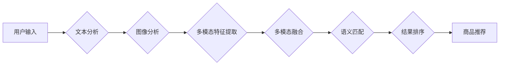

                 

## 多模态搜索:图文结合的AI电商新体验

> 关键词：多模态搜索、图像搜索、文本搜索、深度学习、推荐系统、电商体验、用户体验

## 1. 背景介绍

随着电商行业的蓬勃发展，用户对商品搜索的需求日益增长。传统的文本搜索方式存在着局限性，无法完全满足用户多样化的搜索需求。例如，用户可能通过图片描述、商品风格或场景来寻找心仪的商品，而传统的文本搜索无法有效理解这些非文本信息。

多模态搜索技术应运而生，它旨在融合文本和图像等多种模态信息，为用户提供更精准、更便捷的商品搜索体验。通过学习不同模态之间的语义关联，多模态搜索系统能够理解用户意图，并从海量商品库中精准匹配符合用户需求的商品。

## 2. 核心概念与联系

多模态搜索的核心概念是融合不同模态信息，构建一个统一的语义表示空间。

**2.1  模态信息**

模态信息是指不同形式的数据表示，例如文本、图像、音频、视频等。

**2.2  语义关联**

语义关联是指不同模态信息之间存在的语义联系。例如，一张商品图片与其对应的文本描述之间存在着语义关联，用户可以通过图片搜索找到与图片内容相关的商品信息。

**2.3  多模态融合**

多模态融合是指将不同模态信息融合在一起，构建一个统一的语义表示空间。

**2.4  多模态检索**

多模态检索是指在多模态语义表示空间中，根据用户查询进行商品检索。

**2.4.1  Mermaid 流程图**



## 3. 核心算法原理 & 具体操作步骤

### 3.1  算法原理概述

多模态搜索的核心算法原理是将不同模态信息转化为统一的语义表示，并通过语义相似度计算进行检索。常用的算法包括：

* **深度学习模型:** 

深度学习模型能够学习不同模态之间的语义关联，并构建一个多模态语义表示空间。常用的深度学习模型包括：

    * **CNN (卷积神经网络):** 用于提取图像特征。
    * **RNN (循环神经网络):** 用于提取文本特征。
    * **Transformer:** 用于处理序列数据，例如文本和图像的描述。

* **特征融合方法:** 

将不同模态的特征融合在一起，构建一个多模态特征向量。常用的特征融合方法包括：

    * **Early Fusion:** 在特征提取阶段将不同模态特征进行拼接或融合。
    * **Late Fusion:** 在特征匹配阶段将不同模态特征进行融合。
    * **Hybrid Fusion:** 将 Early Fusion 和 Late Fusion 结合起来。

### 3.2  算法步骤详解

1. **数据预处理:** 对文本和图像数据进行预处理，例如文本分词、图像裁剪、尺寸调整等。
2. **特征提取:** 使用深度学习模型提取文本和图像的特征向量。
3. **特征融合:** 将文本和图像的特征向量进行融合，构建一个多模态特征向量。
4. **语义匹配:** 使用余弦相似度等方法计算用户查询与商品特征之间的语义相似度。
5. **结果排序:** 根据语义相似度对商品进行排序，并返回用户查询结果。

### 3.3  算法优缺点

**优点:**

* 能够理解用户意图，提供更精准的商品搜索结果。
* 能够扩展搜索功能，支持图像、语音等多种模态查询。
* 能够提升用户体验，提供更便捷、更直观的搜索方式。

**缺点:**

* 需要大量的训练数据，训练成本较高。
* 算法复杂度较高，推理速度相对较慢。
* 多模态语义关联的学习仍然是一个挑战。

### 3.4  算法应用领域

多模态搜索技术在电商、医疗、教育、金融等多个领域都有广泛的应用。

* **电商:** 图像搜索、商品推荐、个性化购物体验。
* **医疗:** 病例诊断、医学图像分析、药物搜索。
* **教育:** 教材搜索、学习资源推荐、个性化学习体验。
* **金融:** 欺诈检测、风险评估、客户服务。

## 4. 数学模型和公式 & 详细讲解 & 举例说明

### 4.1  数学模型构建

多模态搜索的数学模型通常基于向量空间模型，将文本和图像特征转化为向量表示，并通过余弦相似度等方法计算语义相似度。

**4.1.1  文本特征向量:**

使用词嵌入模型 (例如 Word2Vec 或 GloVe) 将文本单词映射到低维向量空间，构建文本特征向量。

**4.1.2  图像特征向量:**

使用卷积神经网络 (CNN) 提取图像特征，构建图像特征向量。

**4.1.3  多模态特征融合:**

将文本特征向量和图像特征向量进行融合，构建一个多模态特征向量。常用的融合方法包括：

* **加权平均:**  $f_{multimodal} = \alpha * f_{text} + (1-\alpha) * f_{image}$

* **拼接:**  $f_{multimodal} = [f_{text}, f_{image}]$

**4.1.4  语义相似度计算:**

使用余弦相似度计算用户查询与商品特征之间的语义相似度。

$$
similarity(q, d) = \frac{q \cdot d}{||q|| ||d||}
$$

其中，$q$ 是用户查询的特征向量，$d$ 是商品特征向量。

### 4.2  公式推导过程

余弦相似度的推导过程如下：

1. **定义向量点积:**  $q \cdot d = \sum_{i=1}^{n} q_i * d_i$

2. **定义向量模:**  $||q|| = \sqrt{\sum_{i=1}^{n} q_i^2}$

3. **将点积和模数代入余弦相似度公式:**

$$
similarity(q, d) = \frac{q \cdot d}{||q|| ||d||} = \frac{\sum_{i=1}^{n} q_i * d_i}{\sqrt{\sum_{i=1}^{n} q_i^2} \sqrt{\sum_{i=1}^{n} d_i^2}}
$$

### 4.3  案例分析与讲解

假设用户查询一张图片，该图片描述了一只白色的猫咪。

1. **文本特征提取:** 使用词嵌入模型将“白色的猫咪”映射到文本特征向量。

2. **图像特征提取:** 使用CNN提取图片特征，构建图像特征向量。

3. **多模态特征融合:** 将文本特征向量和图像特征向量进行加权平均融合，构建多模态特征向量。

4. **语义相似度计算:** 计算用户查询的多模态特征向量与商品特征向量的余弦相似度。

5. **结果排序:** 根据语义相似度对商品进行排序，并返回与“白色的猫咪”相关的商品信息。

## 5. 项目实践：代码实例和详细解释说明

### 5.1  开发环境搭建

* **操作系统:** Ubuntu 18.04
* **Python 版本:** 3.7
* **深度学习框架:** TensorFlow 2.0
* **其他依赖库:** numpy, pandas, matplotlib

### 5.2  源代码详细实现

```python
# 导入必要的库
import tensorflow as tf
from tensorflow.keras.applications import ResNet50
from tensorflow.keras.preprocessing import image
from tensorflow.keras.applications.resnet50 import preprocess_input, decode_predictions

# 定义图像特征提取函数
def extract_image_features(image_path):
    img = image.load_img(image_path, target_size=(224, 224))
    x = image.img_to_array(img)
    x = np.expand_dims(x, axis=0)
    x = preprocess_input(x)
    model = ResNet50(weights='imagenet', include_top=False)
    features = model.predict(x)
    return features

# 定义文本特征提取函数
def extract_text_features(text):
    # 使用词嵌入模型提取文本特征
    # ...

# 定义多模态特征融合函数
def fuse_features(image_features, text_features):
    # 使用加权平均或拼接等方法融合特征
    # ...

# 定义语义相似度计算函数
def calculate_similarity(query_features, document_features):
    # 使用余弦相似度计算语义相似度
    # ...

# 示例代码
image_path = 'path/to/image.jpg'
text_query = '白色的猫咪'

image_features = extract_image_features(image_path)
text_features = extract_text_features(text_query)
fused_features = fuse_features(image_features, text_features)

# ... 使用语义相似度计算和结果排序
```

### 5.3  代码解读与分析

* **图像特征提取:** 使用预训练的 ResNet50 模型提取图像特征。
* **文本特征提取:** 使用词嵌入模型 (例如 Word2Vec 或 GloVe) 提取文本特征。
* **多模态特征融合:** 使用加权平均或拼接等方法将文本和图像特征融合在一起。
* **语义相似度计算:** 使用余弦相似度计算用户查询与商品特征之间的语义相似度。

### 5.4  运行结果展示

运行代码后，将返回与用户查询相关的商品信息，并根据语义相似度进行排序。

## 6. 实际应用场景

### 6.1  电商平台

* **图像搜索:** 用户可以通过上传图片或拍摄图片来搜索心仪的商品。
* **商品推荐:** 根据用户的浏览历史、购买记录和搜索行为，推荐与用户兴趣相关的商品。
* **个性化购物体验:** 提供个性化的商品推荐和购物建议，提升用户购物体验。

### 6.2  医疗领域

* **病例诊断:** 医生可以通过上传病历图片或描述来搜索相似病例，辅助诊断。
* **医学图像分析:** 使用多模态搜索技术分析医学图像，例如 X 光片、CT 扫描等，辅助医生进行疾病诊断和治疗。
* **药物搜索:** 用户可以通过描述症状或上传图片来搜索相关的药物信息。

### 6.3  教育领域

* **教材搜索:** 学生可以通过搜索图片或文本关键词来查找相关的教材和学习资源。
* **学习资源推荐:** 根据学生的学习进度和兴趣，推荐相关的学习资源和课程。
* **个性化学习体验:** 提供个性化的学习路径和学习建议，提升学生的学习效率。

### 6.4  未来应用展望

多模态搜索技术在未来将有更广泛的应用场景，例如：

* **智能家居:** 用户可以通过语音、图像或手势来控制智能家居设备。
* **自动驾驶:** 自动驾驶系统可以使用多模态信息来感知周围环境，例如图像、雷达数据和激光雷达数据。
* **虚拟现实:** 多模态搜索技术可以帮助用户在虚拟现实环境中更方便地搜索和交互信息。

## 7. 工具和资源推荐

### 7.1  学习资源推荐

* **书籍:**
    * Deep Learning with Python by Francois Chollet
    * Hands-On Machine Learning with Scikit-Learn, Keras & TensorFlow by Aurélien Géron
* **在线课程:**
    * TensorFlow Tutorials: https://www.tensorflow.org/tutorials
    * Deep Learning Specialization by Andrew Ng: https://www.deeplearning.ai/

### 7.2  开发工具推荐

* **深度学习框架:** TensorFlow, PyTorch, Keras
* **图像处理库:** OpenCV, Pillow
* **自然语言处理库:** NLTK, spaCy

### 7.3  相关论文推荐

* **Multimodal Deep Learning: A Survey** by Xiaolong Wang et al.
* **Show, Attend and Tell: Neural Image Captioning with Visual Attention** by Oriol Vinyals et al.
* **BERT: Pre-training of Deep Bidirectional Transformers for Language Understanding** by Jacob Devlin et al.

## 8. 总结：未来发展趋势与挑战

### 8.1  研究成果总结

多模态搜索技术取得了显著的进展，能够有效融合文本和图像等多种模态信息，为用户提供更精准、更便捷的搜索体验。

### 8.2  未来发展趋势

* **跨模态语义理解:** 提升模型对不同模态之间的语义关联的理解能力。
* **低资源场景下的多模态搜索:** 研究如何在低资源场景下进行多模态搜索，例如缺乏标注数据的场景。
* **实时多模态搜索:** 研究如何实现实时多模态搜索，例如在视频直播场景中。

### 8.3  面临的挑战

* **数据标注:** 多模态数据标注成本高，难以获取高质量的标注数据。
* **模型复杂度:** 多模态搜索模型通常比较复杂，训练和推理成本较高。
* **跨模态语义关联:** 不同模态之间的语义关联复杂，难以准确建模。

### 8.4  研究展望

未来，多模态搜索技术将继续发展，并应用于更多领域，为用户提供更智能、更便捷的体验。


## 9. 附录：常见问题与解答

**Q1: 多模态搜索与传统文本搜索有什么区别？**

**A1:** 多模态搜索能够融合文本和图像等多种模态信息，而传统文本搜索只依赖文本信息。多模态搜索能够理解用户意图，提供更精准的搜索结果。

**Q2: 多模态搜索的训练数据需要多么庞大？**

**A2:** 多模态搜索的训练数据需要比传统文本搜索数据更庞大，因为需要包含多种模态信息。

**Q3: 多模态搜索的应用场景有哪些？**

**A3:** 多模态搜索的应用场景非常广泛，例如电商、医疗、教育、金融等多个领域。

**Q4: 多模态搜索技术面临哪些挑战？**

**A4:** 多模态搜索技术面临的数据标注成本高、模型复杂度高、跨模态语义关联复杂等挑战。


作者：禅与计算机程序设计艺术 / Zen and the Art of Computer Programming 
<end_of_turn>

