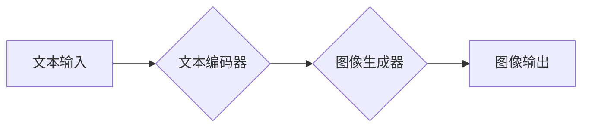

                 

## 大模型在商品图片生成中的应用

> 关键词：大模型、商品图片生成、文本到图像、扩散模型、生成对抗网络、图像合成、电商应用

## 1. 背景介绍

随着人工智能技术的飞速发展，大模型在各个领域展现出强大的应用潜力。其中，文本到图像生成技术作为人工智能领域的一项重要突破，在商品图片生成领域也取得了显著进展。传统的商品图片生成方式通常依赖于人工设计和编辑，效率低下且成本高昂。而大模型驱动的文本到图像生成技术能够根据文本描述自动生成高质量的商品图片，极大地提高了效率和降低了成本。

电商平台作为商品图片应用最为广泛的场景之一，对高质量、多样化的商品图片有着巨大的需求。大模型在商品图片生成中的应用能够有效解决以下问题：

* **提高效率:** 自动生成商品图片，节省人工设计和编辑的时间和成本。
* **增强多样性:** 根据不同的文本描述生成多种风格和特色的商品图片，满足不同用户的需求。
* **降低成本:** 减少对专业摄影师和图像编辑人员的依赖，降低商品图片制作成本。
* **个性化定制:** 根据用户的个性化需求生成定制化的商品图片，提升用户体验。

## 2. 核心概念与联系

### 2.1 文本到图像生成

文本到图像生成是指根据自然语言文本描述自动生成相应的图像。该技术的核心是将文本信息转换为图像信息，需要跨越语言理解、图像理解和图像生成等多个环节。

### 2.2 大模型

大模型是指参数量巨大、训练数据海量的人工智能模型。大模型能够学习到更丰富的知识和模式，从而在各种任务中表现出更强大的能力。

### 2.3 核心架构

大模型在商品图片生成中的应用主要基于以下核心架构：



**文本编码器:** 将文本描述转换为可供图像生成器理解的向量表示。

**图像生成器:** 根据文本编码器输出的向量表示，生成相应的图像。

**图像解码器:** 将图像生成器输出的向量表示转换为可视化的图像。

## 3. 核心算法原理 & 具体操作步骤

### 3.1 算法原理概述

大模型在商品图片生成中的应用主要采用以下两种主流算法：

* **生成对抗网络 (GAN):** GAN 由两个网络组成：生成器和判别器。生成器负责生成图像，判别器负责判断图像是否为真实图像。两者在对抗博弈中相互学习，最终生成器能够生成逼真的图像。
* **扩散模型:** 扩散模型通过逐步添加噪声将图像转换为纯噪声，然后训练一个逆过程，将纯噪声还原为图像。该模型能够生成高分辨率、高质量的图像。

### 3.2 算法步骤详解

**生成对抗网络 (GAN):**

1. **初始化生成器和判别器:** 随机初始化生成器和判别器的参数。
2. **训练判别器:** 使用真实图像和生成器生成的图像训练判别器，使其能够区分真实图像和生成图像。
3. **训练生成器:** 使用判别器反馈的信息训练生成器，使其能够生成更逼真的图像。
4. **重复步骤2和3:** 直到生成器能够生成与真实图像难以区分的图像。

**扩散模型:**

1. **前向过程:** 将图像逐步添加噪声，直到变成纯噪声。
2. **训练逆过程:** 使用训练数据中的图像和对应的噪声，训练一个逆过程，将纯噪声还原为图像。
3. **生成图像:** 使用训练好的逆过程，从纯噪声开始逐步去除噪声，最终生成图像。

### 3.3 算法优缺点

**生成对抗网络 (GAN):**

* **优点:** 可以生成逼真的图像，具有较高的多样性。
* **缺点:** 训练过程比较复杂，容易陷入局部最优解，生成图像的质量难以控制。

**扩散模型:**

* **优点:** 生成图像的质量较高，训练过程相对稳定。
* **缺点:** 生成图像的速度相对较慢，生成图像的多样性相对较低。

### 3.4 算法应用领域

* **电商平台:** 自动生成商品图片，提高效率和降低成本。
* **游戏开发:** 生成游戏场景、角色和道具。
* **影视制作:** 生成电影特效和场景。
* **艺术创作:** 生成艺术作品和创意设计。

## 4. 数学模型和公式 & 详细讲解 & 举例说明

### 4.1 数学模型构建

**生成对抗网络 (GAN):**

* **判别器:** 判别器是一个分类器，其目标是区分真实图像和生成图像。判别器的输出是一个概率值，表示图像为真实图像的概率。

* **生成器:** 生成器是一个生成器，其目标是生成逼真的图像。生成器的输入是一个随机噪声向量，输出是一个图像。

**扩散模型:**

* **前向过程:** 将图像逐步添加噪声，可以使用以下公式表示：

$$
x_t = \sqrt{1-\beta_t}x_{t-1} + \sqrt{\beta_t}\epsilon_t
$$

其中，$x_t$ 是第t步的图像，$x_{t-1}$ 是前一步的图像，$\beta_t$ 是噪声添加系数，$\epsilon_t$ 是高斯噪声。

* **逆过程:** 将纯噪声还原为图像，可以使用以下公式表示：

$$
x_{t-1} = \frac{x_t - \sqrt{\beta_t}\epsilon_t}{\sqrt{1-\beta_t}}
$$

### 4.2 公式推导过程

**生成对抗网络 (GAN):**

* 判别器的损失函数通常使用二分类交叉熵损失函数：

$$
L_D(D,G) = -\frac{1}{m}\sum_{i=1}^{m} [y_i \log(D(x_i)) + (1-y_i) \log(1-D(G(z_i)))]
$$

其中，$m$ 是真实图像的数量，$y_i$ 是真实图像的标签，$D(x_i)$ 是判别器对真实图像$x_i$的预测概率，$G(z_i)$ 是生成器生成的图像。

* 生成器的损失函数通常使用判别器输出的概率值作为反馈，目标是让判别器误判生成图像为真实图像：

$$
L_G(D,G) = -\frac{1}{m}\sum_{i=1}^{m} \log(D(G(z_i)))
$$

**扩散模型:**

* 扩散模型的损失函数通常使用均方误差损失函数，目标是让逆过程能够将纯噪声还原为原始图像：

$$
L(θ) = \mathbb{E}_{x, \epsilon} [||x_0 - x_T(x_T, \epsilon)||^2]
$$

其中，$θ$ 是模型参数，$x_0$ 是原始图像，$x_T$ 是纯噪声，$x_T(x_T, \epsilon)$ 是逆过程生成的图像。

### 4.3 案例分析与讲解

**生成对抗网络 (GAN):**

* **DeepFake:** GAN 可以用于生成逼真的视频，例如DeepFake技术，可以将一个人替换成另一个人的脸，用于制作虚假视频。

* **图像风格迁移:** GAN 可以用于将一张图像的风格迁移到另一张图像，例如将一幅油画风格的图像迁移到照片风格。

**扩散模型:**

* **DALL-E 2:** DALL-E 2 是一个基于扩散模型的文本到图像生成模型，能够根据文本描述生成高质量的图像。

* **Stable Diffusion:** Stable Diffusion 是一个开源的扩散模型，能够生成高质量的图像，并支持多种文本描述格式。

## 5. 项目实践：代码实例和详细解释说明

### 5.1 开发环境搭建

* **操作系统:** Ubuntu 20.04 LTS
* **Python 版本:** 3.8
* **深度学习框架:** PyTorch 1.10.0
* **其他依赖:** torchvision, numpy, matplotlib

### 5.2 源代码详细实现

```python
# 导入必要的库
import torch
import torch.nn as nn

# 定义生成器网络
class Generator(nn.Module):
    def __init__(self):
        super(Generator, self).__init__()
        # 定义网络结构
        # ...

    def forward(self, z):
        # 生成图像
        # ...

# 定义判别器网络
class Discriminator(nn.Module):
    def __init__(self):
        super(Discriminator, self).__init__()
        # 定义网络结构
        # ...

    def forward(self, x):
        # 判断图像是否为真实图像
        # ...

# 实例化生成器和判别器
generator = Generator()
discriminator = Discriminator()

# 定义优化器和损失函数
optimizer_G = torch.optim.Adam(generator.parameters(), lr=0.0002)
optimizer_D = torch.optim.Adam(discriminator.parameters(), lr=0.0002)
criterion = nn.BCELoss()

# 训练循环
for epoch in range(num_epochs):
    # ...
```

### 5.3 代码解读与分析

* **网络结构:** 代码中定义了生成器和判别器网络，网络结构可以根据实际需求进行调整。
* **优化器和损失函数:** 使用Adam优化器和二分类交叉熵损失函数训练模型。
* **训练循环:** 训练循环中，使用真实图像和生成器生成的图像训练判别器，使用判别器反馈的信息训练生成器。

### 5.4 运行结果展示

训练完成后，可以使用生成器生成新的图像。生成的图像可以保存为文件或显示在屏幕上。

## 6. 实际应用场景

### 6.1 电商平台

* **商品图片自动生成:** 根据商品描述自动生成商品图片，节省人工成本和时间。
* **个性化商品图片定制:** 根据用户的喜好和需求生成个性化的商品图片，提升用户体验。
* **虚拟试衣间:** 使用生成图像技术实现虚拟试衣间，让用户在购买前就能看到商品的效果。

### 6.2 游戏开发

* **场景和角色生成:** 自动生成游戏场景和角色，节省游戏开发时间和成本。
* **道具和物品生成:** 根据游戏设定自动生成道具和物品，增加游戏内容的多样性。
* **动态场景生成:** 使用生成图像技术实现动态场景生成，提升游戏体验。

### 6.3 影视制作

* **特效和场景生成:** 使用生成图像技术生成电影特效和场景，降低制作成本。
* **角色动画生成:** 使用生成图像技术生成角色动画，提升动画制作效率。
* **虚拟演员生成:** 使用生成图像技术生成虚拟演员，用于拍摄电影和电视剧。

### 6.4 未来应用展望

* **更逼真的图像生成:** 未来大模型将能够生成更加逼真的图像，更加接近真实世界。
* **更丰富的图像多样性:** 未来大模型将能够生成更加多样化的图像，满足更广泛的应用需求。
* **更智能的图像生成:** 未来大模型将能够根据用户需求进行更智能的图像生成，例如根据用户描述生成特定风格的图像。

## 7. 工具和资源推荐

### 7.1 学习资源推荐

* **书籍:**
    * 《深度学习》 by Ian Goodfellow, Yoshua Bengio, and Aaron Courville
    * 《Generative Deep Learning》 by David Foster
* **在线课程:**
    * Coursera: Deep Learning Specialization
    * Udacity: Deep Learning Nanodegree
* **博客和网站:**
    * OpenAI Blog
    * Google AI Blog
    * Towards Data Science

### 7.2 开发工具推荐

* **深度学习框架:** PyTorch, TensorFlow
* **图像处理库:** OpenCV, Pillow
* **云计算平台:** AWS, Google Cloud, Azure

### 7.3 相关论文推荐

* **Generative Adversarial Networks** by Ian Goodfellow et al. (2014)
* **Diffusion Models Beat GANs on Image Synthesis** by Jonathan Ho et al. (2020)
* **DALL-E 2: Hierarchical Text-Conditional Image Generation with CLIP Latents** by OpenAI (2022)

## 8. 总结：未来发展趋势与挑战

### 8.1 研究成果总结

大模型在商品图片生成领域取得了显著进展，能够自动生成高质量、多样化的商品图片，极大地提高了效率和降低了成本。

### 8.2 未来发展趋势

* **更高质量的图像生成:** 未来大模型将能够生成更加逼真的图像，更加接近真实世界。
* **更丰富的图像多样性:** 未来大模型将能够生成更加多样化的图像，满足更广泛的应用需求。
* **更智能的图像生成:** 未来大模型将能够根据用户需求进行更智能的图像生成，例如根据用户描述生成特定风格的图像。
* **跨模态生成:** 未来大模型将能够跨越文本、图像、音频等多种模态进行生成，例如根据文本描述生成图像和音频。

### 8.3 面临的挑战

* **模型训练成本:** 大模型的训练成本非常高，需要大量的计算资源和训练数据。
* **模型安全性:** 大模型可能被用于生成虚假信息，需要加强模型安全性研究。
* **模型可解释性:** 大模型的决策过程难以理解，需要提高模型的可解释性。

### 8.4 研究展望

未来，大模型在商品图片生成领域将继续发展，并应用于更多场景。研究者将继续探索更高效、更安全、更智能的大模型算法，并解决大模型面临的挑战。

## 9. 附录：常见问题与解答

**Q1: 大模型的训练数据来源是什么？**

A1: 大模型的训练数据通常来自公开的互联网数据，例如文本、图像、音频等。

**Q2: 如何评估大模型的性能？**

A2: 大模型的性能可以评估指标，例如图像质量、多样性、生成速度等。

**Q3: 如何使用大模型生成商品图片？**

A3: 可以使用开源的代码库或平台，例如Hugging Face，来使用大模型生成商品图片。


作者：禅与计算机程序设计艺术 / Zen and the Art of Computer Programming<end_of_turn>

