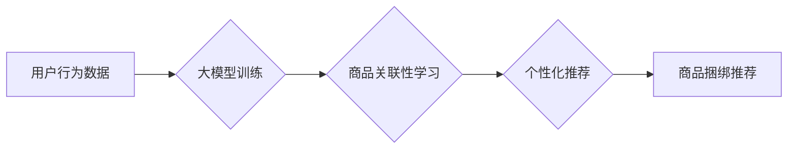

                 

## 大模型在商品捆绑推荐中的创新应用

> 关键词：大模型、商品捆绑推荐、深度学习、Transformer、强化学习、个性化推荐

## 1. 背景介绍

在当今电子商务时代，商品捆绑推荐已成为提升用户购物体验、增加销售额的重要策略。传统的商品捆绑推荐方法主要依赖于规则引擎或基于协同过滤的算法，这些方法往往难以捕捉用户复杂的需求和商品之间的潜在关联性。近年来，随着深度学习技术的快速发展，大模型在自然语言处理、计算机视觉等领域取得了突破性进展，为商品捆绑推荐带来了新的机遇。

大模型，指的是拥有海量参数和训练数据的大规模神经网络模型。其强大的学习能力和泛化能力使其能够从海量商品数据中挖掘出更深层的模式和关系，从而实现更精准、更个性化的商品捆绑推荐。

## 2. 核心概念与联系

### 2.1 商品捆绑推荐

商品捆绑推荐是指将多个相关商品组合在一起，以优惠的价格或套餐形式推荐给用户。其目标是提高用户的购买意愿，增加销售额，并提升用户购物体验。

### 2.2 大模型

大模型是指参数量巨大、训练数据庞大的深度学习模型。其强大的学习能力使其能够从海量数据中提取复杂特征，并进行复杂的推理和预测。

### 2.3 核心概念联系

大模型在商品捆绑推荐中的应用，主要体现在以下几个方面：

* **数据挖掘:** 大模型能够从海量商品数据中挖掘出用户购买行为、商品属性、用户偏好等深层特征，为商品捆绑推荐提供更丰富的输入信息。
* **关联性学习:** 大模型能够学习商品之间的潜在关联性，例如用户购买商品A往往也会购买商品B，从而推荐更符合用户需求的商品组合。
* **个性化推荐:** 大模型能够根据用户的历史购买记录、浏览记录、兴趣偏好等信息，个性化推荐商品捆绑方案。

**Mermaid 流程图**



## 3. 核心算法原理 & 具体操作步骤

### 3.1 算法原理概述

大模型在商品捆绑推荐中的应用主要基于以下核心算法：

* **Transformer模型:** Transformer模型是一种强大的深度学习模型，其自注意力机制能够有效捕捉商品之间的长距离依赖关系，从而实现更精准的商品关联性学习。
* **强化学习:** 强化学习算法能够通过与环境交互学习最优策略，在商品捆绑推荐中，可以将推荐结果作为环境，用户点击行为作为奖励信号，训练模型学习出最优的商品捆绑策略。

### 3.2 算法步骤详解

**基于Transformer模型的商品捆绑推荐算法步骤:**

1. **数据预处理:** 收集用户行为数据、商品属性数据等，并进行清洗、转换、编码等预处理操作。
2. **Transformer模型训练:** 使用预处理后的数据训练Transformer模型，学习商品之间的关联性。
3. **商品组合生成:** 根据用户特征和模型训练结果，生成多个可能的商品组合。
4. **推荐排序:** 使用排序算法对商品组合进行排序，选择最优的推荐结果。

**基于强化学习的商品捆绑推荐算法步骤:**

1. **环境定义:** 将商品捆绑推荐系统定义为一个强化学习环境，用户点击行为作为奖励信号。
2. **策略网络训练:** 使用强化学习算法训练策略网络，学习出最优的商品捆绑策略。
3. **推荐策略执行:** 根据策略网络的输出，选择最优的商品捆绑方案进行推荐。
4. **奖励反馈:** 收集用户点击行为数据，作为奖励信号反馈给策略网络，更新策略网络参数。

### 3.3 算法优缺点

**Transformer模型:**

* **优点:** 能够有效捕捉商品之间的长距离依赖关系，学习更深层的商品关联性。
* **缺点:** 训练成本高，需要大量的计算资源和训练数据。

**强化学习:**

* **优点:** 可以学习到最优的商品捆绑策略，提高推荐效果。
* **缺点:** 需要大量的用户交互数据进行训练，训练过程复杂。

### 3.4 算法应用领域

* **电子商务平台:** 商品捆绑推荐可以帮助电商平台提升销售额、提高用户购物体验。
* **内容推荐系统:** 商品捆绑推荐可以应用于内容推荐系统，例如推荐用户可能感兴趣的书籍、电影等。
* **个性化营销:** 商品捆绑推荐可以用于个性化营销，例如推荐用户可能需要的产品组合。

## 4. 数学模型和公式 & 详细讲解 & 举例说明

### 4.1 数学模型构建

**商品关联性学习模型:**

假设我们有N个商品，每个商品都有一个特征向量$x_i$，其中$i=1,2,...,N$。商品之间的关联性可以用余弦相似度来度量:

$$
\text{similarity}(x_i, x_j) = \frac{x_i \cdot x_j}{||x_i|| ||x_j||}
$$

其中，$x_i \cdot x_j$表示$x_i$和$x_j$的点积，$||x_i||$和$||x_j||$分别表示$x_i$和$x_j$的范数。

**强化学习模型:**

强化学习模型可以表示为一个状态-动作-奖励的系统。

* 状态: 当前的商品捆绑方案。
* 动作: 选择一个商品添加到捆绑方案中。
* 奖励: 用户点击商品捆绑方案的奖励。

强化学习算法的目标是学习出一个策略函数，该函数能够根据当前状态选择最优的动作，从而最大化累积奖励。

### 4.2 公式推导过程

**Transformer模型的注意力机制:**

Transformer模型的注意力机制可以用来计算商品之间的相关性。注意力机制的核心思想是，对于每个商品，它会根据其他商品的信息来计算一个权重，然后根据这些权重来加权求和其他商品的信息，从而得到一个新的表示。

注意力机制的公式如下:

$$
\text{Attention}(Q, K, V) = \text{softmax}(\frac{Q K^T}{\sqrt{d_k}}) V
$$

其中，$Q$, $K$, $V$分别表示查询矩阵、键矩阵和值矩阵。

### 4.3 案例分析与讲解

**案例:** 假设我们有一个电商平台，需要推荐用户购买的商品组合。

* **数据:** 我们收集了用户的购买记录、商品属性数据等。
* **模型:** 我们使用Transformer模型来学习商品之间的关联性。
* **推荐:** 根据用户的历史购买记录和模型训练结果，我们推荐用户购买相关的商品组合。

例如，如果用户购买了笔记本电脑，模型可能会推荐用户购买鼠标、键盘、电脑包等商品。

## 5. 项目实践：代码实例和详细解释说明

### 5.1 开发环境搭建

* **操作系统:** Ubuntu 20.04
* **Python版本:** 3.8
* **深度学习框架:** PyTorch 1.8
* **其他依赖库:** numpy, pandas, matplotlib

### 5.2 源代码详细实现

```python
import torch
import torch.nn as nn

class Transformer(nn.Module):
    def __init__(self, input_size, hidden_size, num_layers, num_heads):
        super(Transformer, self).__init__()
        self.embedding = nn.Embedding(input_size, hidden_size)
        self.transformer_encoder = nn.TransformerEncoder(nn.TransformerEncoderLayer(hidden_size, num_heads), num_layers)

    def forward(self, x):
        x = self.embedding(x)
        x = self.transformer_encoder(x)
        return x

# 实例化模型
model = Transformer(input_size=10000, hidden_size=512, num_layers=6, num_heads=8)

# 定义损失函数和优化器
criterion = nn.MSELoss()
optimizer = torch.optim.Adam(model.parameters(), lr=0.001)

# 训练模型
for epoch in range(10):
    # 前向传播
    outputs = model(inputs)
    # 计算损失
    loss = criterion(outputs, targets)
    # 反向传播
    optimizer.zero_grad()
    loss.backward()
    # 更新参数
    optimizer.step()

```

### 5.3 代码解读与分析

* **Transformer模型:** 代码中定义了一个Transformer模型，包含嵌入层、Transformer编码器等部分。
* **数据预处理:** 代码中没有展示数据预处理部分，但需要根据实际数据进行相应的预处理操作，例如将商品特征向量化、将用户行为数据转换为数字格式等。
* **训练模型:** 代码中展示了模型训练的基本流程，包括前向传播、计算损失、反向传播和更新参数。

### 5.4 运行结果展示

训练完成后，可以使用测试数据评估模型的性能，例如计算准确率、召回率等指标。

## 6. 实际应用场景

### 6.1 电商平台商品捆绑推荐

电商平台可以利用大模型技术，根据用户的购买历史、浏览记录、兴趣偏好等信息，推荐用户购买相关的商品组合，例如：

* **搭配推荐:** 推荐用户购买相匹配的商品组合，例如手机和手机壳、电脑和鼠标等。
* **套餐推荐:** 推荐用户购买价格优惠的商品套餐，例如手机、耳机、充电宝等。
* **个性化推荐:** 根据用户的个性化需求，推荐用户购买定制化的商品组合。

### 6.2 内容推荐系统

大模型也可以应用于内容推荐系统，例如推荐用户可能感兴趣的书籍、电影、音乐等。

* **书籍推荐:** 根据用户的阅读历史、喜欢的作者、喜欢的类型等信息，推荐用户可能感兴趣的书籍组合。
* **电影推荐:** 根据用户的观看历史、喜欢的类型、喜欢的演员等信息，推荐用户可能感兴趣的电影组合。
* **音乐推荐:** 根据用户的听歌历史、喜欢的歌手、喜欢的类型等信息，推荐用户可能感兴趣的音乐组合。

### 6.3 个性化营销

大模型可以帮助企业进行个性化营销，例如推荐用户可能需要的产品组合。

* **会员推荐:** 根据会员的购买历史、浏览记录、兴趣偏好等信息，推荐会员可能需要的商品组合。
* **促销推荐:** 根据用户的购买习惯和市场趋势，推荐用户可能感兴趣的促销商品组合。
* **定制化推荐:** 根据用户的个性化需求，推荐用户定制化的商品组合。

### 6.4 未来应用展望

随着大模型技术的不断发展，其在商品捆绑推荐领域的应用前景十分广阔。未来，大模型可能能够：

* **更精准的个性化推荐:** 通过更深入的理解用户需求，提供更精准的商品捆绑推荐。
* **更丰富的商品组合:** 学习出更丰富的商品组合，满足用户多样化的需求。
* **更智能的交互体验:** 与用户进行更智能的交互，例如通过对话方式进行商品捆绑推荐。

## 7. 工具和资源推荐

### 7.1 学习资源推荐

* **书籍:**
    * 《深度学习》
    * 《Transformer进阶指南》
* **在线课程:**
    * Coursera: 深度学习
    * Udacity: 自然语言处理
* **博客:**
    * The Gradient
    * Towards Data Science

### 7.2 开发工具推荐

* **深度学习框架:** PyTorch, TensorFlow
* **自然语言处理库:** Hugging Face Transformers
* **数据可视化工具:** Matplotlib, Seaborn

### 7.3 相关论文推荐

* **Attention Is All You Need:** https://arxiv.org/abs/1706.03762
* **BERT: Pre-training of Deep Bidirectional Transformers for Language Understanding:** https://arxiv.org/abs/1810.04805
* **XLNet: Generalized Autoregressive Pretraining for Language Understanding:** https://arxiv.org/abs/1906.08237

## 8. 总结：未来发展趋势与挑战

### 8.1 研究成果总结

大模型在商品捆绑推荐领域取得了显著的成果，能够实现更精准、更个性化的推荐，提升用户购物体验和商家销售额。

### 8.2 未来发展趋势

* **模型规模和能力提升:** 未来，大模型的规模和能力将会进一步提升，能够学习出更深层的商品关联性，提供更精准的推荐。
* **多模态融合:** 大模型将融合文本、图像、视频等多模态数据，提供更丰富的商品信息和推荐体验。
* **解释性增强:** 研究者将致力于提高大模型的解释性，让用户能够更好地理解推荐结果背后的逻辑。

### 8.3 面临的挑战

* **数据获取和隐私保护:** 大模型训练需要海量数据，如何获取高质量数据并保护用户隐私是一个重要的挑战。
* **计算资源需求:** 大模型训练需要大量的计算资源，如何降低训练成本是一个重要的研究方向。
* **模型可解释性:** 大模型的决策过程往往难以理解，如何提高模型的可解释性是一个重要的挑战。

### 8.4 研究展望

未来，大模型在商品捆绑推荐领域将继续发挥重要作用，并与其他技术融合，例如强化学习、联邦学习等，实现更智能、更个性化的推荐体验。


## 9. 附录：常见问题与解答

**Q1: 大模型训练需要多少数据？**

A1: 大模型训练需要海量数据，通常需要百万甚至数十亿条数据才能达到较好的效果。

**Q2: 如何评估大模型的推荐效果？**

A2: 大模型的推荐效果可以通过多种指标评估，例如准确率、召回率、点击率、转化率等。

**Q3: 如何保护用户隐私？**

A3: 在使用大模型进行商品捆绑推荐时，需要采取措施保护用户隐私，例如数据匿名化、差分隐私等技术。


作者：禅与计算机程序设计艺术 / Zen and the Art of Computer Programming<end_of_turn>

