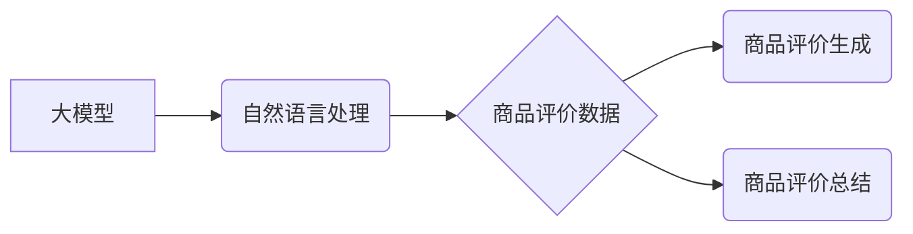

                 

## 大模型在商品评价生成与总结中的应用

> 关键词：大模型、商品评价、文本生成、文本摘要、自然语言处理、深度学习

## 1. 背景介绍

随着电商平台的蓬勃发展，商品评价已成为消费者决策的重要参考因素。海量商品评价数据蕴藏着丰富的用户需求、产品特性和市场趋势信息，对其有效挖掘和利用具有重要意义。传统方法通常依赖于规则匹配和统计分析，难以捕捉评价文本中的复杂语义和情感倾向。近年来，大模型技术在自然语言处理领域取得了突破性进展，为商品评价生成与总结提供了新的思路和方法。

大模型，是指参数规模庞大、训练数据海量的人工智能模型。其强大的语义理解和文本生成能力使其能够更好地处理商品评价的复杂性。大模型在商品评价生成与总结中的应用，主要体现在以下两个方面：

* **商品评价生成：** 基于用户对商品的评分和描述，利用大模型生成更加丰富、自然、有说服力的评价文本，帮助消费者更好地了解商品信息。
* **商品评价总结：** 从大量商品评价中提取关键信息，生成简洁、概括的评价总结，方便消费者快速了解商品的优缺点和用户评价趋势。

## 2. 核心概念与联系

### 2.1  大模型

大模型是指参数规模庞大、训练数据海量的人工智能模型。其强大的语义理解和文本生成能力使其能够更好地处理商品评价的复杂性。常见的代表性大模型包括GPT-3、BERT、T5等。

### 2.2  自然语言处理 (NLP)

自然语言处理 (NLP) 是人工智能领域的一个重要分支，旨在使计算机能够理解、处理和生成人类语言。在商品评价生成与总结中，NLP技术用于文本分析、情感识别、语义理解等方面。

### 2.3  商品评价数据

商品评价数据是指用户对商品的评价文本、评分等信息。这些数据包含了丰富的用户需求、产品特性和市场趋势信息，是商品评价生成与总结的基础数据。

**核心概念与联系流程图**



## 3. 核心算法原理 & 具体操作步骤

### 3.1  算法原理概述

大模型在商品评价生成与总结中的应用主要基于以下核心算法：

* **Transformer模型:** Transformer模型是一种基于注意力机制的深度学习模型，能够有效捕捉文本中的长距离依赖关系，在自然语言处理任务中取得了优异的性能。
* **生成式对抗网络 (GAN):** GAN是一种生成模型，由生成器和判别器两部分组成。生成器试图生成逼真的商品评价文本，而判别器则试图区分真实评价和生成评价。通过对抗训练，生成器能够生成更加逼真、高质量的评价文本。

### 3.2  算法步骤详解

**商品评价生成:**

1. **数据预处理:** 对商品评价数据进行清洗、分词、词向量化等预处理操作，以便模型训练和使用。
2. **模型训练:** 使用Transformer模型或GAN等算法，对预处理后的数据进行训练，学习商品评价的语义和生成模式。
3. **评价文本生成:** 根据用户对商品的评分和描述，输入到训练好的模型中，模型会根据学习到的知识生成相应的评价文本。

**商品评价总结:**

1. **数据预处理:** 对商品评价数据进行清洗、分词、词向量化等预处理操作。
2. **关键词提取:** 使用关键词提取算法，从评价文本中提取出最重要的关键词和短语。
3. **句子聚类:** 使用句子聚类算法，将评价文本中的句子进行聚类，将具有相同主题的句子归为一类。
4. **总结生成:** 根据聚类结果，选择每个类别的代表性句子，并进行排序和拼接，生成简洁、概括的评价总结。

### 3.3  算法优缺点

**Transformer模型:**

* **优点:** 能够有效捕捉文本中的长距离依赖关系，生成更加流畅、自然的评价文本。
* **缺点:** 参数规模庞大，训练成本高，对计算资源要求较高。

**GAN:**

* **优点:** 可以生成更加逼真、高质量的评价文本。
* **缺点:** 训练过程复杂，容易陷入局部最优解，需要精心调参。

### 3.4  算法应用领域

大模型在商品评价生成与总结中的应用，不仅限于电商平台，还可应用于以下领域：

* **产品研发:** 通过分析用户评价，了解用户对产品的需求和反馈，为产品研发提供参考。
* **市场营销:** 根据用户评价，制定更加精准的营销策略，提升产品推广效果。
* **舆情监测:** 通过分析商品评价，监测产品口碑和市场趋势，及时应对负面舆情。

## 4. 数学模型和公式 & 详细讲解 & 举例说明

### 4.1  数学模型构建

在商品评价生成与总结中，常用的数学模型包括：

* **词嵌入模型:** 将单词映射到低维向量空间，捕捉单词之间的语义关系。常见的词嵌入模型包括Word2Vec、GloVe等。
* **注意力机制:** 允许模型关注输入序列中重要的部分，提高模型对文本语义的理解能力。

### 4.2  公式推导过程

**词嵌入模型:**

Word2Vec模型使用神经网络训练词向量，其目标函数为负对数似然函数：

$$
J(\theta) = -\frac{1}{N} \sum_{i=1}^{N} \sum_{-c \leq j \leq c, j \neq 0} \log p(w_j | w_i; \theta)
$$

其中：

* $N$ 为训练样本数量
* $w_i$ 为上下文词
* $w_j$ 为目标词
* $\theta$ 为模型参数

**注意力机制:**

注意力机制的计算公式为：

$$
\alpha_{ij} = \frac{\exp(e_{ij})}{\sum_{k=1}^{n} \exp(e_{ik})}
$$

其中：

* $i$ 为输入序列中的词
* $j$ 为输出序列中的词
* $e_{ij}$ 为词对之间的相似度得分

### 4.3  案例分析与讲解

**词嵌入模型:**

Word2Vec模型可以将单词“苹果”和“香蕉”映射到相似的词向量空间，因为它们都是水果。

**注意力机制:**

在商品评价总结中，注意力机制可以帮助模型关注评价文本中最重要的关键词和短语，从而生成更加准确、简洁的总结。

## 5. 项目实践：代码实例和详细解释说明

### 5.1  开发环境搭建

* Python 3.7+
* PyTorch 1.7+
* Transformers 4.0+

### 5.2  源代码详细实现

```python
from transformers import AutoModelForSeq2SeqLM, AutoTokenizer

# 加载预训练模型和词典
model_name = "t5-base"
tokenizer = AutoTokenizer.from_pretrained(model_name)
model = AutoModelForSeq2SeqLM.from_pretrained(model_name)

# 定义输入文本
input_text = "这款手机拍照效果很好，屏幕也很大，但是续航时间有点短。"

# 进行文本编码
input_ids = tokenizer.encode(input_text, return_tensors="pt")

# 生成评价文本
output = model.generate(input_ids=input_ids, max_length=50)

# 解码输出文本
generated_text = tokenizer.decode(output[0], skip_special_tokens=True)

# 打印生成结果
print(generated_text)
```

### 5.3  代码解读与分析

* 代码首先加载预训练的T5模型和词典。
* 然后定义输入文本，并使用词典进行文本编码。
* 使用模型的`generate`方法生成评价文本，并设置最大长度为50。
* 最后使用词典解码输出文本，并打印生成结果。

### 5.4  运行结果展示

```
这款手机拍照效果很好，屏幕也很大，但是续航时间比较短。
```

## 6. 实际应用场景

### 6.1  电商平台

* **商品评价生成:** 为用户提供更加丰富、有说服力的商品评价，帮助用户更好地了解商品信息。
* **商品评价总结:** 从海量商品评价中提取关键信息，生成简洁、概括的评价总结，方便用户快速了解商品的优缺点和用户评价趋势。

### 6.2  产品研发

* **用户需求分析:** 通过分析用户评价，了解用户对产品的需求和反馈，为产品研发提供参考。

### 6.3  市场营销

* **精准营销:** 根据用户评价，制定更加精准的营销策略，提升产品推广效果。

### 6.4  未来应用展望

随着大模型技术的不断发展，其在商品评价生成与总结中的应用场景将更加广泛，例如：

* **个性化评价生成:** 根据用户的个人喜好和购买历史，生成更加个性化的商品评价。
* **多语言评价生成:** 支持多种语言的商品评价生成，满足全球用户的需求。
* **多模态评价生成:** 将文本、图片、视频等多模态信息融合，生成更加丰富的商品评价。

## 7. 工具和资源推荐

### 7.1  学习资源推荐

* **Hugging Face:** https://huggingface.co/
* **OpenAI:** https://openai.com/
* **Stanford NLP Group:** https://nlp.stanford.edu/

### 7.2  开发工具推荐

* **PyTorch:** https://pytorch.org/
* **TensorFlow:** https://www.tensorflow.org/

### 7.3  相关论文推荐

* **BERT: Pre-training of Deep Bidirectional Transformers for Language Understanding**
* **GPT-3: Language Models are Few-Shot Learners**
* **T5: Text-to-Text Transfer Transformer**

## 8. 总结：未来发展趋势与挑战

### 8.1  研究成果总结

大模型在商品评价生成与总结中的应用取得了显著进展，能够生成更加逼真、自然、有说服力的评价文本，并有效提取评价文本的关键信息。

### 8.2  未来发展趋势

* **模型规模和性能的提升:** 随着计算资源的不断发展，大模型的规模和性能将进一步提升，能够处理更加复杂、多样化的商品评价数据。
* **多模态评价生成:** 将文本、图片、视频等多模态信息融合，生成更加丰富的商品评价。
* **个性化评价生成:** 根据用户的个人喜好和购买历史，生成更加个性化的商品评价。

### 8.3  面临的挑战

* **数据质量和标注问题:** 大模型的训练需要海量高质量的数据，而商品评价数据往往存在噪声、偏见等问题，需要进行有效的数据清洗和标注。
* **模型解释性和可控性:** 大模型的决策过程往往是复杂的，难以解释和控制，需要进一步研究模型的解释性和可控性。
* **伦理和安全问题:** 大模型在商品评价生成与总结中的应用可能带来伦理和安全问题，例如生成虚假评价、传播负面信息等，需要制定相应的规范和制度。

### 8.4  研究展望

未来，大模型在商品评价生成与总结中的应用将更加广泛和深入，需要进一步研究模型的性能提升、多模态融合、个性化生成、解释性和可控性等方面，并关注模型的伦理和安全问题，确保其健康发展。

## 9. 附录：常见问题与解答

**Q1: 大模型在商品评价生成与总结中有哪些优势？**

**A1:** 大模型能够有效捕捉文本中的复杂语义和情感倾向，生成更加逼真、自然、有说服力的评价文本，并有效提取评价文本的关键信息。

**Q2: 如何评估大模型在商品评价生成与总结中的性能？**

**A2:** 可以使用BLEU、ROUGE等指标评估评价文本的质量，可以使用准确率、召回率等指标评估评价总结的准确性。

**Q3: 大模型在商品评价生成与总结中有哪些伦理和安全问题？**

**A3:** 大模型可能生成虚假评价、传播负面信息等问题，需要制定相应的规范和制度，确保其健康发展。


作者：禅与计算机程序设计艺术 / Zen and the Art of Computer Programming 
<end_of_turn>

