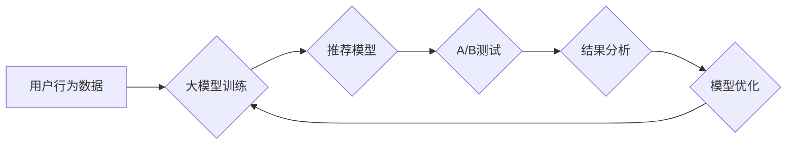

                 

## 大模型在推荐系统A/B测试中的应用

> 关键词：大模型、推荐系统、A/B测试、机器学习、模型优化、个性化推荐、在线学习

## 1. 背景介绍

推荐系统是互联网时代的重要组成部分，其核心目标是根据用户的历史行为、偏好和上下文信息，预测用户对特定物品的兴趣，并提供个性化的推荐结果。传统的推荐系统主要依赖于基于内容的过滤、协同过滤等方法，但随着数据量的爆炸式增长和用户行为的多样性增加，这些方法逐渐难以满足用户的个性化需求。

近年来，大模型技术在自然语言处理、计算机视觉等领域取得了突破性进展，其强大的学习能力和泛化能力为推荐系统带来了新的机遇。大模型能够学习到更深层的用户特征和物品语义，从而提供更精准、更个性化的推荐结果。

A/B测试是互联网产品开发中常用的评估方法，通过对比两个或多个版本的产品，分析用户行为差异，从而选择最佳版本。在推荐系统领域，A/B测试可以用于评估不同推荐算法、模型参数、推荐策略等的效果，帮助优化推荐系统的性能。

## 2. 核心概念与联系

### 2.1 推荐系统

推荐系统旨在根据用户的历史行为、偏好和上下文信息，预测用户对特定物品的兴趣，并提供个性化的推荐结果。

### 2.2 大模型

大模型是指参数量巨大、训练数据量庞大的深度学习模型。大模型能够学习到更深层的用户特征和物品语义，从而提供更精准、更个性化的推荐结果。

### 2.3 A/B测试

A/B测试是一种用于比较两个或多个版本的产品效果的实验方法。通过随机将用户分配到不同的版本，并分析用户行为差异，从而选择最佳版本。

**大模型在推荐系统A/B测试中的应用流程:**



## 3. 核心算法原理 & 具体操作步骤

### 3.1 算法原理概述

大模型在推荐系统A/B测试中的应用主要基于以下核心算法原理：

* **深度学习:** 大模型通常采用深度神经网络结构，能够学习到更深层的用户特征和物品语义。
* **强化学习:** 强化学习算法可以根据用户反馈，不断优化推荐模型的策略，提高推荐效果。
* **在线学习:** 在线学习算法可以实时更新推荐模型，适应用户行为的变化。

### 3.2 算法步骤详解

1. **数据收集和预处理:** 收集用户行为数据，例如点击、购买、浏览等行为，并进行预处理，例如数据清洗、特征提取等。
2. **大模型训练:** 使用收集到的数据训练大模型，例如BERT、GPT等，学习用户特征和物品语义。
3. **推荐模型构建:** 基于训练好的大模型，构建推荐模型，例如基于用户的协同过滤、基于内容的过滤等。
4. **A/B测试设计:** 设计A/B测试方案，例如比较不同推荐算法、模型参数、推荐策略等的效果。
5. **用户分组:** 将用户随机分配到不同的测试组，每个组使用不同的推荐模型或策略。
6. **数据收集和分析:** 收集测试组的用户行为数据，例如点击率、转化率等，并进行分析，比较不同版本的效果。
7. **模型优化:** 根据A/B测试结果，优化推荐模型的参数、策略等，提高推荐效果。

### 3.3 算法优缺点

**优点:**

* **精准度高:** 大模型能够学习到更深层的用户特征和物品语义，从而提供更精准的推荐结果。
* **个性化强:** 大模型可以根据用户的历史行为和偏好，提供个性化的推荐结果。
* **可扩展性强:** 大模型可以处理海量数据，并适应用户行为的变化。

**缺点:**

* **训练成本高:** 大模型的训练需要大量的计算资源和时间。
* **数据依赖性强:** 大模型的性能取决于训练数据的质量和数量。
* **解释性差:** 大模型的决策过程较为复杂，难以解释其推荐结果背后的逻辑。

### 3.4 算法应用领域

大模型在推荐系统A/B测试中的应用领域广泛，例如：

* **电商推荐:** 推荐商品、优惠券、促销活动等。
* **内容推荐:** 推荐新闻、视频、音乐、书籍等。
* **社交推荐:** 推荐好友、群组、活动等。
* **广告推荐:** 推荐广告、推广活动等。

## 4. 数学模型和公式 & 详细讲解 & 举例说明

### 4.1 数学模型构建

大模型在推荐系统A/B测试中的应用通常基于以下数学模型：

* **协同过滤模型:** 预测用户对物品的评分或点击概率，基于用户的历史行为和与之相似用户的行为。
* **内容过滤模型:** 预测用户对物品的兴趣，基于物品的特征和用户的偏好。
* **深度学习模型:** 使用深度神经网络结构，学习用户特征和物品语义，预测用户对物品的兴趣。

### 4.2 公式推导过程

例如，协同过滤模型中的协同过滤算法可以使用矩阵分解的方法，将用户-物品交互矩阵分解成两个低维矩阵，分别表示用户特征和物品特征。

$$
R = U \cdot V^T
$$

其中：

* $R$ 是用户-物品交互矩阵。
* $U$ 是用户特征矩阵。
* $V^T$ 是物品特征矩阵的转置。

通过最小化矩阵分解误差，可以得到用户特征矩阵和物品特征矩阵，从而预测用户对物品的评分或点击概率。

### 4.3 案例分析与讲解

例如，假设我们有一个电商平台，想要通过A/B测试比较两种不同的推荐算法：基于用户的协同过滤算法和基于内容的过滤算法。

我们可以将用户随机分配到两个测试组，分别使用两种算法进行推荐。然后，收集测试组的用户点击率、转化率等数据，并进行分析，比较两种算法的效果。

如果基于用户的协同过滤算法的点击率和转化率更高，则说明该算法更适合该电商平台的用户群体。

## 5. 项目实践：代码实例和详细解释说明

### 5.1 开发环境搭建

* Python 3.x
* TensorFlow 或 PyTorch
* scikit-learn

### 5.2 源代码详细实现

```python
# 导入必要的库
import pandas as pd
from sklearn.model_selection import train_test_split
from sklearn.metrics import mean_squared_error

# 加载用户-物品交互数据
data = pd.read_csv('user_item_interactions.csv')

# 将数据分为训练集和测试集
train_data, test_data = train_test_split(data, test_size=0.2)

# 构建协同过滤模型
from sklearn.metrics.pairwise import cosine_similarity
user_item_matrix = train_data.pivot_table(index='user_id', columns='item_id', values='rating')
user_similarity = cosine_similarity(user_item_matrix)

# 预测用户对物品的评分
def predict_rating(user_id, item_id):
    # 计算用户与其他用户的相似度
    user_similarity_scores = user_similarity[user_id]
    # 计算用户对物品的预测评分
    predicted_rating = np.dot(user_similarity_scores, user_item_matrix.loc[:, item_id]) / np.sum(user_similarity_scores)
    return predicted_rating

# 评估模型性能
predictions = [predict_rating(user_id, item_id) for user_id, item_id in test_data[['user_id', 'item_id']].values]
rmse = np.sqrt(mean_squared_error(test_data['rating'], predictions))
print(f'RMSE: {rmse}')
```

### 5.3 代码解读与分析

* 代码首先导入必要的库，然后加载用户-物品交互数据。
* 接着，将数据分为训练集和测试集。
* 然后，构建协同过滤模型，并使用cosine_similarity计算用户之间的相似度。
* 接着，定义一个函数`predict_rating`，用于预测用户对物品的评分。
* 最后，评估模型性能，并打印RMSE值。

### 5.4 运行结果展示

运行代码后，会输出模型的RMSE值，该值越低，模型的性能越好。

## 6. 实际应用场景

### 6.1 电商推荐

大模型在电商推荐系统中可以用于推荐商品、优惠券、促销活动等。例如，亚马逊使用大模型来推荐商品，根据用户的浏览历史、购买记录、评价等信息，提供个性化的商品推荐。

### 6.2 内容推荐

大模型在内容推荐系统中可以用于推荐新闻、视频、音乐、书籍等。例如，Netflix使用大模型来推荐电影和电视剧，根据用户的观看历史、评分等信息，提供个性化的内容推荐。

### 6.3 社交推荐

大模型在社交推荐系统中可以用于推荐好友、群组、活动等。例如，Facebook使用大模型来推荐好友，根据用户的兴趣爱好、社交关系等信息，提供个性化的好友推荐。

### 6.4 未来应用展望

大模型在推荐系统A/B测试中的应用前景广阔，未来可能在以下方面得到进一步发展：

* **更精准的推荐:** 大模型能够学习到更深层的用户特征和物品语义，从而提供更精准的推荐结果。
* **更个性化的推荐:** 大模型可以根据用户的历史行为和偏好，提供更个性化的推荐结果。
* **更智能的推荐:** 大模型可以根据用户的上下文信息，例如时间、地点、设备等，提供更智能的推荐结果。

## 7. 工具和资源推荐

### 7.1 学习资源推荐

* **书籍:**
    * Deep Learning by Ian Goodfellow, Yoshua Bengio, and Aaron Courville
    * Hands-On Machine Learning with Scikit-Learn, Keras & TensorFlow by Aurélien Géron
* **在线课程:**
    * TensorFlow Tutorials: https://www.tensorflow.org/tutorials
    * PyTorch Tutorials: https://pytorch.org/tutorials/

### 7.2 开发工具推荐

* **TensorFlow:** https://www.tensorflow.org/
* **PyTorch:** https://pytorch.org/
* **scikit-learn:** https://scikit-learn.org/

### 7.3 相关论文推荐

* **BERT: Pre-training of Deep Bidirectional Transformers for Language Understanding**
* **GPT-3: Language Models are Few-Shot Learners**
* **Deep Learning for Recommender Systems**

## 8. 总结：未来发展趋势与挑战

### 8.1 研究成果总结

大模型在推荐系统A/B测试中的应用取得了显著成果，能够提供更精准、更个性化的推荐结果，提升用户体验。

### 8.2 未来发展趋势

未来，大模型在推荐系统A/B测试中的应用将朝着以下方向发展：

* **模型规模更大:** 大模型的规模将继续扩大，学习能力和泛化能力将进一步提升。
* **模型架构更复杂:** 大模型的架构将更加复杂，例如多模态大模型，能够处理文本、图像、音频等多种数据类型。
* **模型训练更高效:** 大模型的训练方法将更加高效，例如分布式训练、迁移学习等。

### 8.3 面临的挑战

大模型在推荐系统A/B测试中的应用也面临一些挑战：

* **数据隐私:** 大模型的训练需要大量用户数据，如何保护用户隐私是一个重要问题。
* **模型解释性:** 大模型的决策过程较为复杂，难以解释其推荐结果背后的逻辑，这可能会导致用户对推荐结果的信任度降低。
* **模型公平性:** 大模型可能会存在偏见，导致推荐结果不公平，例如性别、种族等方面的偏见。

### 8.4 研究展望

未来，需要进一步研究大模型在推荐系统A/B测试中的应用，解决上述挑战，并探索新的应用场景。


## 9. 附录：常见问题与解答

**Q1: 大模型的训练成本很高，如何降低训练成本？**

**A1:** 可以采用以下方法降低大模型的训练成本：

* **模型压缩:** 使用模型剪枝、量化等技术压缩模型规模，减少模型参数量。
* **知识蒸馏:** 使用小模型学习大模型的知识，从而降低训练成本。
* **分布式训练:** 将模型训练任务分发到多个机器上进行并行训练，缩短训练时间。

**Q2: 如何评估大模型在推荐系统A/B测试中的效果？**

**A2:** 可以使用以下指标评估大模型在推荐系统A/B测试中的效果：

* **点击率 (CTR):** 用户点击推荐结果的比例。
* **转化率 (CVR):** 用户完成目标行为 (例如购买商品) 的比例。
* **平均评分 (MRR):** 用户对推荐结果的平均评分。
* **用户满意度:** 通过问卷调查等方式收集用户对推荐结果的满意度。


作者：禅与计算机程序设计艺术 / Zen and the Art of Computer Programming 
<end_of_turn>

