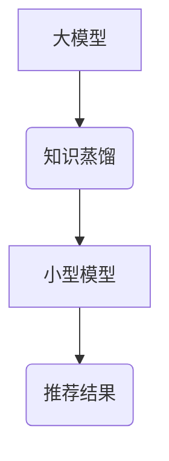

                 

## 大模型在推荐系统中的知识蒸馏技术

> 关键词：知识蒸馏、大模型、推荐系统、模型压缩、迁移学习

## 1. 背景介绍

推荐系统作为信息过滤和个性化服务的重要组成部分，在电商、社交媒体、视频平台等领域发挥着越来越重要的作用。随着用户需求的不断变化和数据量的激增，推荐系统的准确性和效率面临着新的挑战。大模型凭借其强大的学习能力和泛化能力，在自然语言处理、计算机视觉等领域取得了显著的成果。然而，大模型的训练成本高、部署复杂，难以在资源有限的场景中应用。

知识蒸馏技术作为一种模型压缩方法，旨在将大模型的知识迁移到小型模型中，从而实现模型压缩、加速和部署简化。在推荐系统领域，知识蒸馏技术可以有效地利用大模型的知识，构建更轻量级、更高效的推荐模型，满足实际应用场景的需求。

## 2. 核心概念与联系

### 2.1 知识蒸馏原理

知识蒸馏的核心思想是将大模型的知识“蒸馏”到小型模型中。大模型作为“教师模型”，拥有丰富的知识和表达能力；小型模型作为“学生模型”，具有更低的计算复杂度和部署成本。知识蒸馏通过调整教师模型和学生模型的输出分布，使得学生模型能够学习到教师模型的知识，从而达到模型压缩的目的。

### 2.2 推荐系统中的知识蒸馏

在推荐系统中，知识蒸馏可以应用于以下场景：

* **模型压缩:** 将大型的推荐模型压缩成更小的模型，降低部署成本和计算资源消耗。
* **迁移学习:** 将预训练的大模型的知识迁移到新的推荐任务中，提高模型的泛化能力和效率。
* **个性化推荐:** 利用知识蒸馏技术构建个性化的推荐模型，根据用户的偏好和行为进行精准推荐。

### 2.3  知识蒸馏架构



## 3. 核心算法原理 & 具体操作步骤

### 3.1 算法原理概述

知识蒸馏算法的核心是通过最小化教师模型和学生模型的输出分布之间的差异来学习知识。常用的损失函数包括交叉熵损失和KL散度。

* **交叉熵损失:** 衡量两个概率分布之间的差异，通常用于分类任务。
* **KL散度:** 衡量两个概率分布之间的相对熵，可以更好地捕捉教师模型和学生模型的差异。

### 3.2 算法步骤详解

1. **预训练大模型:** 使用大量的训练数据预训练一个大型的推荐模型，例如Transformer、BERT等。
2. **构建小型模型:** 根据任务需求构建一个小型模型，例如线性模型、神经网络等。
3. **知识蒸馏训练:** 使用预训练的大模型作为教师模型，将小型模型作为学生模型，并使用知识蒸馏损失函数进行训练。
4. **模型评估:** 使用测试集评估学生模型的性能，并与教师模型和原始小型模型进行比较。

### 3.3 算法优缺点

**优点:**

* **模型压缩:** 可以有效地压缩大模型，降低部署成本和计算资源消耗。
* **迁移学习:** 可以将预训练的大模型的知识迁移到新的推荐任务中，提高模型的泛化能力和效率。
* **性能提升:** 在某些情况下，知识蒸馏可以提高学生模型的性能，尤其是在数据有限的情况下。

**缺点:**

* **训练复杂度:** 知识蒸馏的训练过程相对复杂，需要调整多个超参数。
* **性能瓶颈:** 学生模型的性能可能仍然低于教师模型，尤其是在复杂的任务中。
* **数据依赖性:** 知识蒸馏的性能依赖于教师模型的预训练质量和训练数据。

### 3.4 算法应用领域

知识蒸馏技术在推荐系统领域具有广泛的应用前景，例如：

* **个性化推荐:** 构建个性化的推荐模型，根据用户的偏好和行为进行精准推荐。
* **内容推荐:** 推荐与用户兴趣相关的新闻、视频、商品等内容。
* **广告推荐:** 推送与用户需求相匹配的广告，提高广告点击率和转化率。

## 4. 数学模型和公式 & 详细讲解 & 举例说明

### 4.1 数学模型构建

知识蒸馏的目标是学习一个小型模型，使其能够模仿大模型的输出分布。假设教师模型的输出为 $p(y|x)$，学生模型的输出为 $q(y|x)$，其中 $x$ 为输入特征， $y$ 为输出标签。

知识蒸馏损失函数可以定义为：

$$L_{KD} = KL(p(y|x)||q(y|x))$$

其中 $KL(p||q)$ 为两个概率分布 $p$ 和 $q$ 之间的KL散度。

### 4.2 公式推导过程

KL散度公式如下：

$$KL(p||q) = \sum_{y} p(y|x) \log \frac{p(y|x)}{q(y|x)}$$

该公式表示教师模型的输出分布 $p(y|x)$ 与学生模型的输出分布 $q(y|x)$ 之间的差异。

### 4.3 案例分析与讲解

假设我们有一个推荐系统，教师模型是一个大型的Transformer模型，学生模型是一个小型的神经网络模型。

* 教师模型的输出是一个用户对商品的评分概率分布。
* 学生模型的输出也是一个用户对商品的评分概率分布。

通过知识蒸馏训练，学生模型可以学习到教师模型的评分分布，从而提高其推荐的准确性。

## 5. 项目实践：代码实例和详细解释说明

### 5.1 开发环境搭建

* Python 3.7+
* PyTorch 1.7+
* TensorFlow 2.0+
* CUDA 10.1+

### 5.2 源代码详细实现

```python
import torch
import torch.nn as nn

# 定义教师模型
class TeacherModel(nn.Module):
    # ...

# 定义学生模型
class StudentModel(nn.Module):
    # ...

# 定义知识蒸馏损失函数
def knowledge_distillation_loss(teacher_output, student_output, temperature=1.0):
    # ...

# 训练循环
for epoch in range(num_epochs):
    for batch in dataloader:
        # 前向传播
        teacher_output = teacher_model(batch)
        student_output = student_model(batch)

        # 计算损失
        loss = knowledge_distillation_loss(teacher_output, student_output)

        # 反向传播
        optimizer.zero_grad()
        loss.backward()
        optimizer.step()

```

### 5.3 代码解读与分析

* 教师模型和学生模型的定义取决于具体的推荐任务和模型架构。
* 知识蒸馏损失函数计算教师模型和学生模型的输出分布之间的差异。
* 训练循环中，教师模型和学生模型分别进行前向传播，计算损失，并进行反向传播和参数更新。

### 5.4 运行结果展示

* 通过评估学生模型在测试集上的性能，可以观察到知识蒸馏的效果。
* 可以比较学生模型的性能与教师模型和原始小型模型的性能，评估知识蒸馏的有效性。

## 6. 实际应用场景

### 6.1 个性化推荐

知识蒸馏可以用于构建个性化的推荐模型，根据用户的偏好和行为进行精准推荐。例如，可以将预训练的大模型的知识迁移到小型模型中，并根据用户的历史浏览记录、购买记录等信息进行个性化推荐。

### 6.2 内容推荐

知识蒸馏可以用于推荐与用户兴趣相关的新闻、视频、商品等内容。例如，可以将预训练的大模型的知识迁移到小型模型中，并根据用户的兴趣标签、阅读历史等信息进行内容推荐。

### 6.3 广告推荐

知识蒸馏可以用于推送与用户需求相匹配的广告，提高广告点击率和转化率。例如，可以将预训练的大模型的知识迁移到小型模型中，并根据用户的浏览历史、购买行为等信息进行广告推荐。

### 6.4 未来应用展望

随着大模型技术的不断发展，知识蒸馏技术在推荐系统领域的应用前景更加广阔。未来，知识蒸馏技术可以应用于以下领域：

* **多模态推荐:** 将文本、图像、视频等多模态数据融合，构建更智能的推荐模型。
* **实时推荐:** 利用知识蒸馏技术构建实时推荐模型，能够快速响应用户的需求。
* **联邦学习推荐:** 利用知识蒸馏技术在联邦学习框架下构建推荐模型，保护用户隐私。

## 7. 工具和资源推荐

### 7.1 学习资源推荐

* **论文:**
    * Hinton, G., Vinyals, O., & Dean, J. (2015). Distilling the knowledge in a neural network. arXiv preprint arXiv:1503.02531.
    * Buciluă, C., Caruana, R., & Niculescu-Mizil, A. (2006). Model compression. In Proceedings of the 12th ACM SIGKDD international conference on Knowledge discovery and data mining (pp. 535-544).
* **博客:**
    * https://towardsdatascience.com/knowledge-distillation-in-deep-learning-a-comprehensive-guide-927691028280
    * https://blog.paperspace.com/knowledge-distillation-tutorial/

### 7.2 开发工具推荐

* **PyTorch:** https://pytorch.org/
* **TensorFlow:** https://www.tensorflow.org/

### 7.3 相关论文推荐

* **BERT:** Devlin, J., Chang, M. W., Lee, K., & Toutanova, K. (2018). BERT: Pre-training of deep bidirectional transformers for language understanding. arXiv preprint arXiv:1810.04805.
* **Transformer:** Vaswani, A., Shazeer, N., Parmar, N., Uszkoreit, J., Jones, L., Gomez, A. N., ... & Polosukhin, I. (2017). Attention is all you need. In Advances in neural information processing systems (pp. 5998-6008).

## 8. 总结：未来发展趋势与挑战

### 8.1 研究成果总结

知识蒸馏技术在推荐系统领域取得了显著的成果，能够有效地压缩大模型，提高模型的效率和部署简化。

### 8.2 未来发展趋势

* **多模态知识蒸馏:** 将文本、图像、视频等多模态数据融合，构建更智能的推荐模型。
* **动态知识蒸馏:** 根据用户的行为和反馈动态调整知识蒸馏过程，提高模型的适应性。
* **联邦学习知识蒸馏:** 利用知识蒸馏技术在联邦学习框架下构建推荐模型，保护用户隐私。

### 8.3 面临的挑战

* **知识蒸馏效果的提升:** 提高知识蒸馏的效率和效果，使其能够更好地迁移大模型的知识。
* **模型泛化能力的增强:** 增强学生模型的泛化能力，使其能够更好地适应新的数据和任务。
* **计算资源的优化:** 优化知识蒸馏的训练过程，降低其对计算资源的需求。

### 8.4 研究展望

未来，知识蒸馏技术将继续发展，在推荐系统领域发挥越来越重要的作用。随着大模型技术的不断发展，知识蒸馏技术将更加智能、高效、个性化。

## 9. 附录：常见问题与解答

* **Q1: 知识蒸馏的训练过程复杂吗？**

A1: 知识蒸馏的训练过程相对复杂，需要调整多个超参数，例如温度参数、学习率等。

* **Q2: 知识蒸馏的效果如何？**

A2: 知识蒸馏的效果取决于教师模型的预训练质量、学生模型的架构、训练数据等因素。在某些情况下，知识蒸馏可以显著提高学生模型的性能。

* **Q3: 知识蒸馏有哪些应用场景？**

A3: 知识蒸馏在推荐系统领域具有广泛的应用场景，例如个性化推荐、内容推荐、广告推荐等。

作者：禅与计算机程序设计艺术 / Zen and the Art of Computer Programming 


<end_of_turn>

