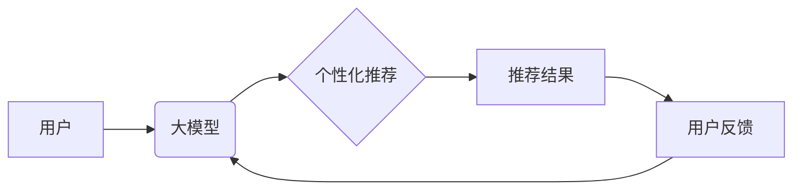

                 

## 大模型在推荐系统交互设计中的应用

> 关键词：大模型、推荐系统、交互设计、自然语言处理、用户体验、个性化推荐、多模态交互

## 1. 背景介绍

推荐系统作为信息过滤和个性化内容呈现的重要工具，在电商、社交媒体、视频平台等领域发挥着越来越重要的作用。传统的推荐系统主要依赖于协同过滤、内容过滤等方法，但随着用户行为数据量的激增和用户需求的多样化，这些方法逐渐面临挑战。

大模型的出现为推荐系统带来了新的机遇。大模型，指的是参数规模庞大、训练数据海量的人工智能模型，具备强大的泛化能力和学习能力。其在自然语言处理、图像识别、语音理解等领域取得了突破性进展，也为推荐系统交互设计提供了新的可能性。

## 2. 核心概念与联系

### 2.1  大模型

大模型是指参数数量超过数十亿甚至千亿的深度学习模型。其规模庞大，训练数据量巨大，能够学习到更复杂的模式和关系。

常见的代表性大模型包括：

* **GPT-3:** 由OpenAI开发，参数量达1750亿，擅长文本生成、翻译、问答等任务。
* **BERT:** 由Google开发，参数量达3.4亿，擅长理解上下文关系，在文本分类、信息检索等任务中表现出色。
* **DALL-E 2:** 由OpenAI开发，能够根据文本描述生成逼真的图像。

### 2.2  推荐系统

推荐系统旨在根据用户的历史行为、偏好和上下文信息，预测用户可能感兴趣的内容，并将其推荐给用户。

常见的推荐系统类型包括：

* **协同过滤:** 基于用户之间的相似性或物品之间的相似性进行推荐。
* **内容过滤:** 基于物品的特征和用户偏好进行推荐。
* **基于知识的推荐:** 基于用户和物品之间的知识图谱进行推荐。
* **混合推荐:** 结合多种推荐算法进行推荐。

### 2.3  交互设计

交互设计是指设计用户与系统之间交互的方式，以确保用户体验良好、操作便捷、目标达成。

在推荐系统中，交互设计涵盖了推荐结果的呈现、用户反馈的收集、个性化设置等多个方面。

### 2.4  大模型与推荐系统交互设计

大模型可以为推荐系统交互设计带来以下方面的提升：

* **更精准的个性化推荐:** 大模型能够学习到用户的更深层的兴趣和偏好，提供更精准的个性化推荐。
* **更自然的交互方式:** 大模型可以理解用户的自然语言输入，实现更自然的交互方式，例如语音搜索、聊天式推荐等。
* **更丰富的推荐内容:** 大模型可以生成文本、图像、视频等多模态内容，丰富推荐系统的表现形式。

**核心概念与架构流程图:**



## 3. 核心算法原理 & 具体操作步骤

### 3.1  算法原理概述

大模型在推荐系统交互设计中的应用主要基于以下核心算法：

* **Transformer:** Transformer是一种基于注意力机制的深度学习模型，能够有效地捕捉文本序列中的长距离依赖关系，在自然语言处理任务中表现出色。
* **BERT:** BERT是一种基于Transformer的预训练语言模型，能够理解上下文关系，在推荐系统中可以用于用户画像构建、物品描述理解等任务。
* **生成对抗网络 (GAN):** GAN是一种生成式模型，可以生成新的数据，例如文本、图像、视频等。在推荐系统中，GAN可以用于生成个性化推荐内容，例如推荐用户可能感兴趣的商品描述、新闻标题等。

### 3.2  算法步骤详解

**以Transformer为例，其在推荐系统交互设计中的应用步骤如下:**

1. **数据预处理:** 收集用户行为数据、物品信息等数据，并进行清洗、格式化等预处理操作。
2. **模型训练:** 使用Transformer模型对预处理后的数据进行训练，学习用户和物品之间的关系。
3. **推荐模型构建:** 根据训练结果，构建推荐模型，用于预测用户可能感兴趣的物品。
4. **个性化推荐:** 根据用户的历史行为、偏好等信息，利用推荐模型生成个性化推荐结果。
5. **交互设计:** 设计用户友好的交互界面，展示推荐结果，并收集用户反馈。

### 3.3  算法优缺点

**Transformer算法的优缺点:**

* **优点:** 能够有效地捕捉文本序列中的长距离依赖关系，在推荐系统中可以提高推荐精准度。
* **缺点:** 训练成本高，需要大量的计算资源和训练数据。

### 3.4  算法应用领域

Transformer算法在推荐系统交互设计中的应用领域广泛，包括：

* **个性化推荐:** 根据用户的兴趣和偏好，推荐个性化的商品、内容、服务等。
* **搜索推荐:** 在搜索结果中推荐相关商品、内容、服务等。
* **聊天机器人:** 利用Transformer模型构建聊天机器人，实现更自然的对话交互。
* **内容生成:** 利用Transformer模型生成个性化的推荐内容，例如商品描述、新闻标题等。

## 4. 数学模型和公式 & 详细讲解 & 举例说明

### 4.1  数学模型构建

在推荐系统中，大模型通常构建基于用户-物品交互矩阵的数学模型。

假设用户集合为U，物品集合为I，用户-物品交互矩阵为R，其中R(u,i)表示用户u对物品i的交互行为，例如评分、点击、购买等。

### 4.2  公式推导过程

基于用户-物品交互矩阵，可以使用协同过滤算法或内容过滤算法进行推荐。

**协同过滤算法:**

目标是找到与用户u兴趣相似的用户，并推荐他们喜欢的物品。

常用的协同过滤算法包括基于用户的协同过滤和基于物品的协同过滤。

**基于用户的协同过滤:**

计算用户u与其他用户之间的相似度，并根据相似度排序，推荐与相似用户喜欢的物品。

**基于物品的协同过滤:**

计算物品i与其他物品之间的相似度，并根据相似度排序，推荐与相似物品相关的物品。

**内容过滤算法:**

目标是根据物品的特征和用户的偏好进行推荐。

常用的内容过滤算法包括基于关键词匹配、基于分类标签匹配等。

### 4.3  案例分析与讲解

**举例说明:**

假设用户A喜欢电影类型为动作片的电影，用户B也喜欢动作片，并且还喜欢科幻片。

基于用户的协同过滤算法可以将用户A和用户B视为相似用户，并推荐用户B喜欢的科幻片给用户A。

## 5. 项目实践：代码实例和详细解释说明

### 5.1  开发环境搭建

推荐系统开发环境通常包括以下软件：

* **Python:** 作为推荐系统开发的主要编程语言。
* **深度学习框架:** 例如TensorFlow、PyTorch等，用于构建和训练大模型。
* **数据处理工具:** 例如Pandas、NumPy等，用于数据预处理和分析。
* **云计算平台:** 例如AWS、Azure、GCP等，用于提供计算资源和存储空间。

### 5.2  源代码详细实现

以下是一个使用PyTorch构建基于Transformer的推荐系统的简单代码示例：

```python
import torch
import torch.nn as nn

class Recommender(nn.Module):
    def __init__(self, embedding_dim, num_heads, num_layers):
        super(Recommender, self).__init__()
        self.embedding = nn.Embedding(num_users, embedding_dim)
        self.transformer = nn.Transformer(d_model=embedding_dim, nhead=num_heads, num_encoder_layers=num_layers)
        self.fc = nn.Linear(embedding_dim, num_items)

    def forward(self, user_ids, item_ids):
        user_embeddings = self.embedding(user_ids)
        item_embeddings = self.embedding(item_ids)
        output = self.transformer(user_embeddings, item_embeddings)
        output = self.fc(output[:, 0, :])
        return output

# ... 训练模型 ...

# ... 预测推荐结果 ...
```

### 5.3  代码解读与分析

* **Embedding层:** 将用户ID和物品ID映射到低维向量空间。
* **Transformer层:** 利用注意力机制学习用户和物品之间的关系。
* **全连接层:** 将Transformer输出映射到物品数量的预测概率。

### 5.4  运行结果展示

运行结果可以展示推荐模型的预测准确率、召回率等指标，以及推荐结果的个性化程度。

## 6. 实际应用场景

### 6.1  电商推荐

大模型可以为电商平台提供更精准的商品推荐，例如根据用户的浏览历史、购买记录、购物车内容等信息，推荐用户可能感兴趣的商品。

### 6.2  社交媒体推荐

大模型可以为社交媒体平台提供更个性化的内容推荐，例如根据用户的兴趣爱好、好友关系、社交行为等信息，推荐用户可能感兴趣的文章、视频、图片等内容。

### 6.3  视频平台推荐

大模型可以为视频平台提供更精准的视频推荐，例如根据用户的观看历史、点赞记录、评论内容等信息，推荐用户可能感兴趣的视频。

### 6.4  未来应用展望

大模型在推荐系统交互设计中的应用前景广阔，未来可能应用于以下领域:

* **多模态推荐:** 结合文本、图像、音频等多模态数据进行推荐，提供更丰富的用户体验。
* **个性化内容生成:** 利用大模型生成个性化的推荐内容，例如推荐用户可能感兴趣的商品描述、新闻标题等。
* **智能客服:** 利用大模型构建智能客服系统，为用户提供更便捷、更智能的推荐服务。

## 7. 工具和资源推荐

### 7.1  学习资源推荐

* **书籍:**
    * Deep Learning by Ian Goodfellow, Yoshua Bengio, and Aaron Courville
    * Natural Language Processing with PyTorch by Yoav Goldberg
* **在线课程:**
    * Stanford CS224N: Natural Language Processing with Deep Learning
    * DeepLearning.AI TensorFlow Specialization

### 7.2  开发工具推荐

* **深度学习框架:** TensorFlow, PyTorch, Keras
* **数据处理工具:** Pandas, NumPy
* **云计算平台:** AWS, Azure, GCP

### 7.3  相关论文推荐

* Attention Is All You Need (Vaswani et al., 2017)
* BERT: Pre-training of Deep Bidirectional Transformers for Language Understanding (Devlin et al., 2018)
* DALL-E 2: Hierarchical Text-Conditional Image Generation with CLIP Latents (Ramesh et al., 2022)

## 8. 总结：未来发展趋势与挑战

### 8.1  研究成果总结

大模型在推荐系统交互设计领域取得了显著进展，例如：

* **推荐精准度提升:** 大模型能够学习到更深层的用户兴趣和偏好，提高推荐精准度。
* **交互方式多样化:** 大模型可以理解自然语言输入，实现更自然的交互方式。
* **内容生成能力增强:** 大模型可以生成个性化的推荐内容，丰富推荐系统的表现形式。

### 8.2  未来发展趋势

未来，大模型在推荐系统交互设计领域的发展趋势包括：

* **多模态推荐:** 结合文本、图像、音频等多模态数据进行推荐，提供更丰富的用户体验。
* **个性化内容生成:** 利用大模型生成个性化的推荐内容，例如推荐用户可能感兴趣的商品描述、新闻标题等。
* **智能客服:** 利用大模型构建智能客服系统，为用户提供更便捷、更智能的推荐服务。

### 8.3  面临的挑战

大模型在推荐系统交互设计领域也面临一些挑战：

* **训练成本高:** 大模型训练需要大量的计算资源和训练数据。
* **数据隐私问题:** 大模型训练需要使用大量用户数据，需要解决数据隐私问题。
* **模型解释性:** 大模型的决策过程难以解释，需要提高模型的解释性。

### 8.4  研究展望

未来，需要进一步研究大模型在推荐系统交互设计领域的应用，例如：

* **开发更有效的训练方法:** 降低大模型训练成本，提高训练效率。
* **解决数据隐私问题:** 保护用户数据隐私，确保数据安全。
* **提高模型解释性:** 使大模型的决策过程更加透明，提高用户信任度。


## 9. 附录：常见问题与解答

**Q1: 大模型的训练需要多少数据？**

A1: 大模型的训练数据量通常在数十亿甚至千亿级别。

**Q2: 大模型的训练成本很高吗？**

A2: 是的，大模型的训练成本很高，需要大量的计算资源和时间。

**Q3: 如何解决大模型的数据隐私问题？**

A3: 可以采用数据加密、联邦学习等技术来保护用户数据隐私。

**Q4: 如何提高大模型的解释性？**

A4: 可以使用可解释机器学习方法，例如LIME、SHAP等，来解释大模型的决策过程。


作者：禅与计算机程序设计艺术 / Zen and the Art of Computer Programming 
<end_of_turn>

