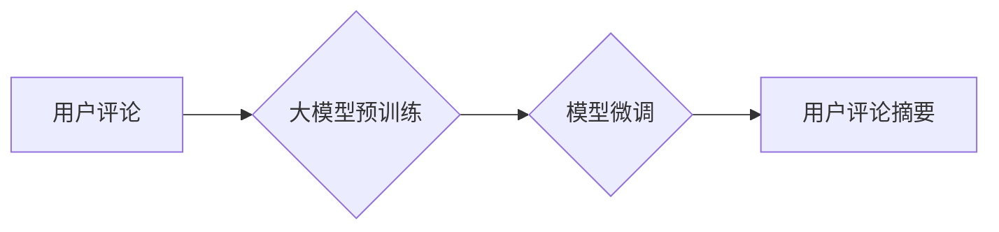

                 

## 大模型在用户评论摘要生成中的应用

> 关键词：大模型、用户评论、文本摘要、自然语言处理、Transformer、BERT、T5

## 1. 背景介绍

在互联网时代，用户评论作为一种重要的信息来源，为商家、产品和服务提供了宝贵的反馈。然而，海量用户评论的庞大体积和冗余信息，使得人们难以快速获取关键信息。因此，如何高效地提取用户评论的核心内容，生成简洁明了的摘要，成为了一个重要的研究课题。

传统的文本摘要方法主要依赖于关键词提取、句子排序等规则化方法，难以捕捉评论中的语义关系和上下文信息。近年来，随着深度学习技术的快速发展，大模型在自然语言处理领域取得了突破性进展，为用户评论摘要生成提供了新的思路和方法。

大模型，指的是参数规模庞大、训练数据海量的人工智能模型。它们能够学习到复杂的语言模式和语义关系，并应用于各种自然语言处理任务，例如文本分类、机器翻译、问答系统等。在用户评论摘要生成领域，大模型能够更好地理解评论的上下文信息，生成更准确、更流畅的摘要。

## 2. 核心概念与联系

### 2.1 用户评论摘要生成

用户评论摘要生成是指从大量的用户评论中提取关键信息，生成一个简洁、准确、概括的摘要。

### 2.2 大模型

大模型是指参数规模庞大、训练数据海量的人工智能模型。它们能够学习到复杂的语言模式和语义关系，并应用于各种自然语言处理任务。

### 2.3 Transformer

Transformer是一种基于注意力机制的深度学习模型，在自然语言处理领域取得了显著的成果。它能够有效地捕捉文本中的长距离依赖关系，并用于各种任务，例如机器翻译、文本摘要、问答系统等。

### 2.4 BERT

BERT（Bidirectional Encoder Representations from Transformers）是一种基于Transformer的预训练语言模型，在理解上下文信息方面表现出色。它通过双向编码的方式学习语言表示，能够更好地捕捉文本中的语义关系。

### 2.5 T5

T5（Text-to-Text Transfer Transformer）是一种基于Transformer的文本到文本转换模型，将各种自然语言处理任务统一转换为文本到文本的格式。它能够在不同的任务上进行微调，并取得优异的性能。

**Mermaid 流程图**



## 3. 核心算法原理 & 具体操作步骤

### 3.1 算法原理概述

大模型在用户评论摘要生成中的应用主要基于以下核心算法原理：

* **预训练语言模型:** 利用大规模文本数据预训练语言模型，例如BERT、RoBERTa等，学习到丰富的语言表示和语义理解能力。
* **文本编码:** 将用户评论文本编码成向量表示，以便大模型进行理解和处理。
* **注意力机制:** 利用注意力机制，让大模型关注评论中重要的信息，并生成更准确的摘要。
* **解码器:** 使用解码器生成摘要文本，并进行后续的优化和调整。

### 3.2 算法步骤详解

1. **数据预处理:** 对用户评论数据进行清洗、分词、标注等预处理操作，以便模型训练和使用。
2. **模型预训练:** 利用大规模文本数据预训练预训练语言模型，例如BERT、RoBERTa等。
3. **模型微调:** 将预训练模型微调到用户评论摘要生成任务上，使用用户评论数据进行训练和优化。
4. **文本编码:** 将用户评论文本输入到预训练模型中，获得文本的向量表示。
5. **注意力机制:** 利用注意力机制，让模型关注评论中重要的信息，并生成摘要的候选句子。
6. **解码器:** 使用解码器生成摘要文本，并进行后续的优化和调整。
7. **评估和优化:** 使用评价指标，例如BLEU、ROUGE等，评估模型的性能，并根据评估结果进行模型优化和调整。

### 3.3 算法优缺点

**优点:**

* 能够捕捉评论中的语义关系和上下文信息，生成更准确、更流畅的摘要。
* 训练数据规模大，模型参数规模大，能够学习到更丰富的语言表示。
* 能够应用于多种类型的用户评论，例如产品评论、电影评论、新闻评论等。

**缺点:**

* 训练成本高，需要大量的计算资源和时间。
* 模型参数规模大，部署成本高。
* 对于一些特定领域的评论，模型可能需要进行更细粒度的训练和调整。

### 3.4 算法应用领域

大模型在用户评论摘要生成领域的应用前景广阔，可以应用于以下领域:

* **电商平台:** 生成商品评论摘要，帮助用户快速了解商品的优缺点。
* **社交媒体:** 生成用户帖子摘要，帮助用户快速浏览和了解热门话题。
* **新闻媒体:** 生成新闻评论摘要，帮助用户了解新闻事件的舆情走向。
* **市场调研:** 分析用户评论，提取关键信息，帮助企业了解用户需求和市场趋势。

## 4. 数学模型和公式 & 详细讲解 & 举例说明

### 4.1 数学模型构建

用户评论摘要生成可以看作是一个文本到文本的转换任务，可以使用T5等基于Transformer的模型进行建模。

**输入:** 用户评论文本序列

**输出:** 摘要文本序列

**模型结构:**

* **编码器:** 使用Transformer编码器对用户评论文本进行编码，获得文本的隐藏表示。
* **解码器:** 使用Transformer解码器对编码后的文本进行解码，生成摘要文本序列。

### 4.2 公式推导过程

Transformer模型的核心是注意力机制，其计算公式如下：

$$
Attention(Q, K, V) = softmax(\frac{QK^T}{\sqrt{d_k}})V
$$

其中：

* $Q$：查询矩阵
* $K$：键矩阵
* $V$：值矩阵
* $d_k$：键向量的维度

注意力机制能够计算每个词与其他词之间的相关性，并根据相关性权重对信息进行加权求和，从而捕捉文本中的长距离依赖关系。

### 4.3 案例分析与讲解

假设我们有一个用户评论文本：

"这款手机拍照效果很好，屏幕也很大，但是续航时间比较短。"

使用Transformer模型进行编码后，每个词都会获得一个隐藏表示。注意力机制会计算每个词与其他词之间的相关性，例如，“拍照效果”和“很好”之间相关性较高，因此注意力机制会赋予它们更高的权重。解码器会根据注意力机制的输出，生成摘要文本：

"这款手机拍照效果好，屏幕大，但续航时间短。"

## 5. 项目实践：代码实例和详细解释说明

### 5.1 开发环境搭建

* Python 3.6+
* TensorFlow/PyTorch
* CUDA/cuDNN

### 5.2 源代码详细实现

```python
# 使用HuggingFace Transformers库加载预训练模型
from transformers import T5Tokenizer, T5ForConditionalGeneration

# 加载模型和词典
model_name = "t5-base"
tokenizer = T5Tokenizer.from_pretrained(model_name)
model = T5ForConditionalGeneration.from_pretrained(model_name)

# 定义输入文本
input_text = "这款手机拍照效果很好，屏幕也很大，但是续航时间比较短。"

# 对文本进行编码
input_ids = tokenizer.encode(input_text, return_tensors="pt")

# 使用模型生成摘要
output = model.generate(input_ids=input_ids, max_length=50)

# 将摘要解码成文本
summary_text = tokenizer.decode(output[0], skip_special_tokens=True)

# 打印摘要
print(summary_text)
```

### 5.3 代码解读与分析

* 使用HuggingFace Transformers库加载预训练模型，简化了模型的加载和使用过程。
* 对输入文本进行编码，将文本转换为模型可理解的格式。
* 使用模型生成摘要，并设置最大摘要长度。
* 将摘要解码成文本，并打印输出。

### 5.4 运行结果展示

```
这款手机拍照效果好，屏幕大，但续航时间短。
```

## 6. 实际应用场景

### 6.1 电商平台

* 生成商品评论摘要，帮助用户快速了解商品的优缺点。
* 提取用户评论中的关键词，用于商品推荐和搜索。
* 分析用户评论的情绪倾向，帮助商家了解用户对商品的满意度。

### 6.2 社交媒体

* 生成用户帖子摘要，帮助用户快速浏览和了解热门话题。
* 提取用户帖子中的关键词，用于话题推荐和搜索。
* 分析用户帖子的情绪倾向，帮助企业了解用户对品牌的认知和态度。

### 6.3 新闻媒体

* 生成新闻评论摘要，帮助用户了解新闻事件的舆情走向。
* 提取新闻评论中的关键词，用于新闻分类和推荐。
* 分析新闻评论的情绪倾向，帮助媒体了解公众对新闻事件的看法和态度。

### 6.4 未来应用展望

* **个性化摘要生成:** 根据用户的兴趣和偏好，生成个性化的摘要。
* **多模态摘要生成:** 将文本和图像等多模态信息融合，生成更丰富的摘要。
* **跨语言摘要生成:** 实现不同语言之间的摘要生成，打破语言障碍。

## 7. 工具和资源推荐

### 7.1 学习资源推荐

* **HuggingFace Transformers:** https://huggingface.co/docs/transformers/index
* **BERT论文:** https://arxiv.org/abs/1810.04805
* **T5论文:** https://arxiv.org/abs/1910.10683

### 7.2 开发工具推荐

* **TensorFlow:** https://www.tensorflow.org/
* **PyTorch:** https://pytorch.org/

### 7.3 相关论文推荐

* **BART: Denoising Sequence-to-Sequence Pre-training for Natural Language Generation, Translation, and Comprehension:** https://arxiv.org/abs/2006.12592
* **XLNet: Generalized Autoregressive Pretraining for Language Understanding:** https://arxiv.org/abs/1906.08237

## 8. 总结：未来发展趋势与挑战

### 8.1 研究成果总结

大模型在用户评论摘要生成领域取得了显著的成果，能够生成更准确、更流畅的摘要。

### 8.2 未来发展趋势

* **模型规模和性能的提升:** 随着计算资源的不断发展，大模型的规模和性能将进一步提升，能够生成更高质量的摘要。
* **个性化和多模态摘要生成:** 将用户个性化需求和多模态信息融入摘要生成，提供更丰富和个性化的摘要体验。
* **跨语言和跨领域摘要生成:** 实现不同语言和领域之间的摘要生成，打破语言和领域障碍。

### 8.3 面临的挑战

* **数据标注成本高:** 大模型的训练需要大量的标注数据，数据标注成本高昂。
* **模型解释性和可解释性:** 大模型的决策过程复杂，难以解释和理解，这限制了模型的应用和信任度。
* **公平性和偏见问题:** 大模型可能存在公平性和偏见问题，需要进行更深入的研究和解决。

### 8.4 研究展望

未来，大模型在用户评论摘要生成领域将继续发展，并应用于更广泛的场景。研究者将继续探索更有效的训练方法、更强大的模型架构和更完善的评估指标，以提高大模型的性能和可靠性。同时，也将关注大模型的解释性和可解释性，以及公平性和偏见问题，使其能够更好地服务于社会。

## 9. 附录：常见问题与解答

**Q1: 大模型的训练成本很高吗？**

A1: 是的，大模型的训练成本很高，需要大量的计算资源和时间。

**Q2: 如何评估大模型的摘要生成性能？**

A2: 常用的评估指标包括BLEU、ROUGE等。

**Q3: 大模型的摘要生成结果是否总是准确的？**

A3: 大模型的摘要生成结果通常比较准确，但并非总是准确的。由于大模型依赖于训练数据，如果训练数据存在偏差或错误，则生成的摘要也可能存在偏差或错误。

**作者：禅与计算机程序设计艺术 / Zen and the Art of Computer Programming**


<end_of_turn>

