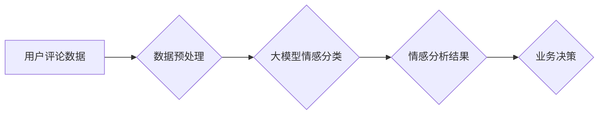

                 

## 大模型技术在电商平台用户情感分析中的应用

> 关键词：大模型、用户情感分析、电商平台、自然语言处理、深度学习、BERT、情感分类、文本理解

## 1. 背景介绍

在当今数据爆炸的时代，电商平台作为商业交易的重要阵地，积累了海量用户数据。其中，用户评论、评价、反馈等文本数据蕴含着丰富的用户情感信息。有效地分析用户情感，对于电商平台提升用户体验、优化产品、制定营销策略等方面至关重要。传统的人工标注和规则匹配方法在面对海量文本数据时效率低下，难以准确捕捉用户情感的细微变化。近年来，随着深度学习技术的快速发展，大模型技术在自然语言处理领域取得了突破性进展，为电商平台用户情感分析提供了新的思路和方法。

大模型是指参数规模庞大、训练数据海量的人工智能模型，其强大的学习能力和泛化能力使其能够更好地理解和处理复杂文本数据。在用户情感分析领域，大模型可以学习到更丰富的语义特征和情感表达模式，从而实现更准确、更细粒度的用户情感识别。

## 2. 核心概念与联系

### 2.1 用户情感分析

用户情感分析是指通过对用户文本数据进行分析，识别用户表达的情感倾向，例如正面、负面、中性等。它可以帮助电商平台了解用户对产品、服务、品牌的评价，并根据用户情感反馈进行相应的调整和改进。

### 2.2 大模型

大模型是指参数规模庞大、训练数据海量的人工智能模型。其强大的学习能力和泛化能力使其能够更好地理解和处理复杂文本数据。大模型通常采用深度学习架构，例如 Transformer，并通过大量的文本数据进行预训练，从而学习到丰富的语言表示和知识。

### 2.3 自然语言处理

自然语言处理 (NLP) 是人工智能的一个分支，旨在使计算机能够理解、处理和生成人类语言。它涵盖了多种任务，例如文本分类、情感分析、机器翻译、文本摘要等。大模型在 NLP 领域发挥着越来越重要的作用，例如在情感分析任务中，大模型可以学习到更丰富的语义特征和情感表达模式，从而实现更准确、更细粒度的用户情感识别。

**大模型技术在电商平台用户情感分析中的应用流程图**



## 3. 核心算法原理 & 具体操作步骤

### 3.1 算法原理概述

大模型在用户情感分析中的应用主要基于深度学习技术，特别是 Transformer 架构。Transformer 模型通过自注意力机制能够捕捉文本序列中长距离依赖关系，学习到更丰富的语义特征。在情感分类任务中，大模型通常采用以下步骤：

1. **文本预处理:** 对用户评论数据进行清洗、去停用词、分词等预处理操作，以便于模型训练和理解。
2. **特征提取:** 将预处理后的文本数据输入到预训练好的大模型中，提取文本的语义特征。
3. **情感分类:** 将提取到的语义特征输入到分类器中，进行情感分类，例如正面、负面、中性等。

### 3.2 算法步骤详解

1. **数据收集:** 从电商平台收集用户评论、评价、反馈等文本数据。
2. **数据清洗:** 去除无效信息，例如HTML标签、特殊字符等，并进行文本规范化处理。
3. **数据标注:** 对文本数据进行情感标注，例如标记每个评论的正面、负面或中性情感。
4. **模型选择:** 选择合适的预训练大模型，例如BERT、RoBERTa、XLNet等。
5. **模型微调:** 将预训练好的大模型微调到电商平台的用户情感分析任务上，使用标注好的数据进行训练。
6. **模型评估:** 使用测试数据评估模型的性能，例如准确率、召回率、F1-score等。
7. **模型部署:** 将训练好的模型部署到电商平台，用于实时分析用户情感。

### 3.3 算法优缺点

**优点:**

* **高准确率:** 大模型能够学习到更丰富的语义特征和情感表达模式，从而实现更准确的文本情感分类。
* **泛化能力强:** 预训练好的大模型在不同领域和任务上都具有较强的泛化能力，可以应用于不同的电商平台和用户群体。
* **自动化程度高:** 大模型的训练和部署可以自动化，降低了人工成本和时间投入。

**缺点:**

* **计算资源需求高:** 大模型的训练和部署需要大量的计算资源，例如GPU和TPU。
* **数据依赖性强:** 大模型的性能取决于训练数据的质量和数量，如果训练数据不足或质量较差，模型的性能会下降。
* **可解释性差:** 大模型的决策过程较为复杂，难以解释模型的预测结果，这可能会影响用户的信任度。

### 3.4 算法应用领域

大模型技术在用户情感分析领域具有广泛的应用场景，例如：

* **产品评价分析:** 分析用户对产品的评价，了解用户对产品的满意度和痛点，以便于产品改进和优化。
* **营销策略优化:** 分析用户对营销活动的反馈，了解用户对产品的兴趣和需求，以便于制定更有效的营销策略。
* **客户服务改进:** 分析用户对客服服务的评价，了解用户对客服服务的满意度和需求，以便于改进客服服务质量。
* **品牌形象管理:** 分析用户对品牌的评价，了解用户对品牌的认知和态度，以便于维护和提升品牌形象。

## 4. 数学模型和公式 & 详细讲解 & 举例说明

### 4.1 数学模型构建

在用户情感分析中，大模型通常采用分类模型进行情感分类。常见的分类模型包括逻辑回归、支持向量机、决策树等。这些模型都基于一定的数学公式，将文本特征映射到情感类别。

例如，逻辑回归模型使用 sigmoid 函数将文本特征线性组合的结果映射到0到1之间的概率值，表示文本属于不同情感类别的概率。

### 4.2 公式推导过程

假设我们有一个文本数据 $x$，它包含 $n$ 个词，每个词的词嵌入向量为 $w_i$。我们可以将文本 $x$ 表示为一个词嵌入向量序列：

$$
x = [w_1, w_2, ..., w_n]
$$

逻辑回归模型的预测公式为：

$$
P(y = 1|x) = \frac{1}{1 + e^{-(w^T x + b)}}
$$

其中：

* $y$ 是情感类别，取值为0或1，分别表示负面或正面情感。
* $w$ 是模型参数，是一个词嵌入向量序列的权重向量。
* $b$ 是模型偏置项。

### 4.3 案例分析与讲解

假设我们有一个文本数据 "这款手机拍照效果很棒"，它的词嵌入向量序列为：

$$
x = [w_{"这款"}, w_{"手机"}, w_{"拍照"}, w_{"效果"}, w_{"很棒"}]
$$

模型参数 $w$ 和偏置项 $b$ 经过训练后，我们可以将 $x$ 代入预测公式，计算出该文本属于正面情感的概率。如果概率大于某个阈值，则预测该文本为正面情感。

## 5. 项目实践：代码实例和详细解释说明

### 5.1 开发环境搭建

* Python 3.6+
* TensorFlow 或 PyTorch 深度学习框架
* NLTK 自然语言处理库
* HuggingFace Transformers 库

### 5.2 源代码详细实现

```python
from transformers import AutoModelForSequenceClassification, AutoTokenizer

# 加载预训练模型和词表
model_name = "bert-base-uncased"
tokenizer = AutoTokenizer.from_pretrained(model_name)
model = AutoModelForSequenceClassification.from_pretrained(model_name, num_labels=2)

# 预处理文本数据
def preprocess_text(text):
    return tokenizer(text, padding=True, truncation=True)

# 预测情感类别
def predict_sentiment(text):
    inputs = preprocess_text(text)
    outputs = model(**inputs)
    predicted_class = outputs.logits.argmax().item()
    return predicted_class

# 测试代码
text = "这款手机拍照效果很棒"
sentiment = predict_sentiment(text)
if sentiment == 1:
    print("正面情感")
else:
    print("负面情感")
```

### 5.3 代码解读与分析

* 该代码首先加载预训练的 BERT 模型和词表。
* 然后定义了一个 `preprocess_text` 函数，用于对文本数据进行预处理，包括分词、词嵌入等操作。
* `predict_sentiment` 函数用于预测文本的情感类别，它将预处理后的文本数据输入到模型中，并根据模型输出的概率值进行分类。
* 最后，测试代码示例演示了如何使用该模型预测文本的情感类别。

### 5.4 运行结果展示

运行该代码后，会输出 "正面情感"，表明模型成功预测了该文本为正面情感。

## 6. 实际应用场景

### 6.1 产品评价分析

电商平台可以利用大模型技术分析用户对产品的评价，了解用户对产品的满意度和痛点。例如，可以分析用户评论中出现的关键词，统计不同产品的正面、负面评价比例，并根据用户反馈进行产品改进和优化。

### 6.2 营销策略优化

电商平台可以利用大模型技术分析用户对营销活动的反馈，了解用户对产品的兴趣和需求。例如，可以分析用户对不同促销活动的评价，了解用户对不同产品折扣的敏感度，并根据用户反馈优化营销策略。

### 6.3 客户服务改进

电商平台可以利用大模型技术分析用户对客服服务的评价，了解用户对客服服务的满意度和需求。例如，可以分析用户对客服回复的满意度，识别用户提出的常见问题，并根据用户反馈改进客服服务流程和知识库。

### 6.4 未来应用展望

随着大模型技术的不断发展，其在电商平台用户情感分析领域的应用场景将更加广泛。例如，可以利用大模型技术实现更细粒度的用户情感分类，例如识别用户对产品的不同方面（例如外观、性能、价格等）的情感倾向；可以利用大模型技术进行用户情感预测，预测用户对未来产品的评价和购买意愿；可以利用大模型技术进行个性化情感分析，根据用户的历史行为和偏好进行个性化的情感分析和服务。

## 7. 工具和资源推荐

### 7.1 学习资源推荐

* **书籍:**
    * 《深度学习》 by Ian Goodfellow, Yoshua Bengio, and Aaron Courville
    * 《自然语言处理入门》 by Jacob Eisenstein
* **在线课程:**
    * Coursera: Natural Language Processing Specialization
    * Udacity: Deep Learning Nanodegree
* **博客和网站:**
    * HuggingFace Blog: https://huggingface.co/blog
    * TensorFlow Blog: https://blog.tensorflow.org/
    * PyTorch Blog: https://pytorch.org/blog/

### 7.2 开发工具推荐

* **深度学习框架:** TensorFlow, PyTorch
* **自然语言处理库:** NLTK, SpaCy, Gensim
* **预训练模型库:** HuggingFace Transformers

### 7.3 相关论文推荐

* Devlin, J., Chang, M. W., Lee, K., & Toutanova, K. (2018). Bert: Pre-training of deep bidirectional transformers for language understanding. arXiv preprint arXiv:1810.04805.
* Liu, B., Ott, M., Goyal, N., Du, J., Joshi, M., Chen, D., ... & Stoyanov, V. (2019). Roberta: A robustly optimized bert pretraining approach. arXiv preprint arXiv:1907.11692.

## 8. 总结：未来发展趋势与挑战

### 8.1 研究成果总结

大模型技术在电商平台用户情感分析领域取得了显著的成果，能够实现更准确、更细粒度的用户情感识别，并为电商平台提供更精准的业务决策支持。

### 8.2 未来发展趋势

* **模型规模和能力的提升:** 未来大模型的规模和能力将继续提升，能够学习到更丰富的语言表示和知识，从而实现更准确、更智能的用户情感分析。
* **多模态情感分析:** 未来大模型将融合文本、图像、音频等多模态数据，实现更全面的用户情感分析。
* **个性化情感分析:** 未来大模型将根据用户的历史行为和偏好进行个性化的情感分析，提供更精准的个性化服务。

### 8.3 面临的挑战

* **数据质量和隐私问题:** 大模型的训练需要海量高质量的数据，而电商平台的用户数据往往存在隐私问题，需要采取有效的措施保护用户隐私。
* **模型解释性和可信度:** 大模型的决策过程较为复杂，难以解释模型的预测结果，这可能会影响用户的信任度。
* **计算资源需求:** 大模型的训练和部署需要大量的计算资源，这对于中小电商平台来说是一个挑战。

### 8.4 研究展望

未来，大模型技术在电商平台用户情感分析领域将继续发挥重要作用，并与其他人工智能技术融合，例如机器学习、知识图谱等，实现更智能、更精准的用户情感分析和服务。


## 9. 附录：常见问题与解答

**Q1: 大模型的训练需要多少数据？**

A1: 大模型的训练需要海量数据，通常需要数十亿甚至数百亿个样本。

**Q2: 如何评估大模型的性能？**

A2: 大模型的性能通常使用准确率、召回率、F1-score等指标进行评估。

**Q3: 如何解决大模型的解释性和可信度问题？**

A3: 可以使用可解释机器学习方法，例如LIME、SHAP等，解释模型的预测结果。也可以通过模型的训练过程和数据分析，提高模型的可信度。


作者：禅与计算机程序设计艺术 / Zen and the Art of Computer Programming<end_of_turn>

