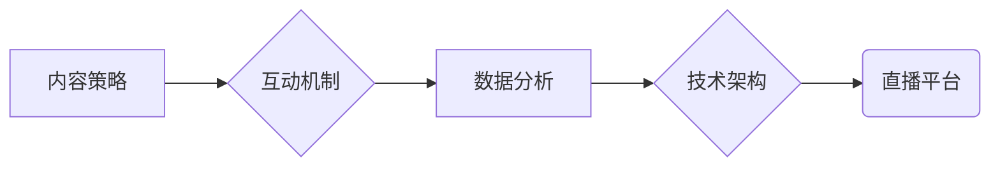

                 

## 如何利用直播平台增加课程影响

> 关键词：直播平台、课程影响力、互动式学习、数据分析、内容策略、技术架构、用户体验

### 1. 背景介绍

在线教育的蓬勃发展为学习者提供了更加灵活、便捷的学习方式。然而，传统的在线课程模式往往缺乏互动性，难以激发学生的学习兴趣和参与度。直播平台的出现为在线教育注入了一股新的活力，它通过实时互动、即时反馈等特性，有效提升了课程的参与度和学习效果。

直播平台的优势在于：

* **实时互动:** 直播平台允许老师和学生实时互动，解答疑问、进行讨论，营造更加活跃的学习氛围。
* **即时反馈:** 直播平台可以实时收集学生的反馈，帮助老师了解学生的学习情况，及时调整教学内容和方法。
* **增强参与度:** 直播平台的互动性可以有效提高学生的参与度，让他们更加积极主动地参与到学习过程中。
* **提升课程体验:** 直播平台可以利用多种技术手段，例如视频、音频、文字、动画等，打造更加生动、丰富的课程体验。

### 2. 核心概念与联系

直播平台的成功应用离不开以下核心概念的相互协作：

* **内容策略:**  精心设计的课程内容是直播平台的核心驱动力。内容需要符合目标用户的需求，并采用生动、易懂的表达方式，激发学生的学习兴趣。
* **互动机制:**  直播平台需要提供多种互动机制，例如问答、投票、聊天等，鼓励学生积极参与到课程中。
* **数据分析:**  直播平台需要收集和分析学生的学习数据，例如观看时长、互动频率、答题情况等，以便及时调整教学策略和内容。
* **技术架构:**  直播平台需要基于可靠的云计算、网络传输、视频处理等技术架构，确保直播的稳定性和流畅性。

**Mermaid 流程图:**



### 3. 核心算法原理 & 具体操作步骤

#### 3.1  算法原理概述

直播平台的核心算法主要围绕着以下几个方面：

* **实时视频编码和传输:**  利用H.264、H.265等视频编码标准，将视频信号压缩并传输到观看端。
* **实时音频编码和传输:**  利用AAC、Opus等音频编码标准，将音频信号压缩并传输到观看端。
* **互动机制处理:**  实时处理用户发送的文字、语音、视频等互动信息，并将其显示给其他用户。
* **数据分析和推荐:**  利用机器学习算法分析用户的学习行为，并推荐相关的课程内容和学习资源。

#### 3.2  算法步骤详解

1. **视频采集和编码:**  直播平台首先需要采集视频信号，并将其编码成压缩格式。
2. **音频采集和编码:**  同时采集音频信号，并将其编码成压缩格式。
3. **数据传输:**  将编码后的视频和音频数据传输到直播服务器。
4. **数据处理和转发:**  直播服务器接收数据后，进行处理和转发，将视频和音频数据分发到观看端。
5. **用户互动:**  观看端用户可以通过文字、语音、视频等方式与主播和其他用户互动。
6. **数据分析:**  直播平台收集用户的学习数据，并利用机器学习算法进行分析和推荐。

#### 3.3  算法优缺点

**优点:**

* **实时性强:**  直播平台可以实现实时视频和音频传输，满足用户对实时互动和信息获取的需求。
* **互动性高:**  直播平台提供多种互动机制，可以有效提高用户的参与度和学习兴趣。
* **数据分析能力强:**  直播平台可以收集和分析用户的学习数据，为教学和内容创作提供数据支持。

**缺点:**

* **技术复杂:**  直播平台的建设和维护需要复杂的网络传输、视频处理、数据分析等技术支持。
* **成本较高:**  直播平台的建设和运营成本较高，需要投入大量的资金和人力资源。
* **网络依赖性强:**  直播平台的稳定性和流畅性依赖于网络环境，网络拥堵或中断可能会影响直播体验。

#### 3.4  算法应用领域

直播平台的应用领域非常广泛，包括：

* **在线教育:**  直播平台可以用于在线课程讲授、答疑解惑、互动学习等。
* **企业培训:**  企业可以利用直播平台进行员工培训、知识分享、远程会议等。
* **医疗健康:**  直播平台可以用于远程医疗咨询、疾病科普、健康讲座等。
* **娱乐直播:**  直播平台可以用于游戏直播、音乐直播、舞蹈直播等娱乐活动。

### 4. 数学模型和公式 & 详细讲解 & 举例说明

#### 4.1  数学模型构建

直播平台的互动机制可以抽象为一个图论模型，其中用户和课程分别表示为节点，互动关系表示为边。

* **用户节点:**  每个用户都对应一个节点，节点属性包括用户ID、昵称、关注课程、参与互动等信息。
* **课程节点:**  每个课程都对应一个节点，节点属性包括课程ID、课程名称、课程内容、直播时间等信息。
* **互动边:**  用户与课程之间、用户与用户之间的互动关系表示为边，边属性包括互动类型、互动时间、互动内容等信息。

#### 4.2  公式推导过程

我们可以利用图论中的度数、路径长度等指标来衡量用户和课程之间的互动强度。

* **用户度数:**  用户度数表示用户与其他节点（课程或其他用户）连接的边数，可以反映用户的活跃度和影响力。
* **课程度数:**  课程度数表示课程与其他节点（用户或其他课程）连接的边数，可以反映课程的受欢迎程度和影响力。
* **路径长度:**  路径长度表示用户与课程之间需要经过的边数，可以反映用户与课程之间的距离和互动便捷性。

#### 4.3  案例分析与讲解

假设有一个在线编程课程，该课程的直播平台上有100个用户和10个课程。我们可以利用上述指标来分析用户和课程之间的互动关系。

* **用户度数:**  如果某个用户参与了多个课程的直播，并与其他用户进行了频繁的互动，那么该用户的度数就会较高。
* **课程度数:**  如果某个课程的直播观看人数较多，用户参与度高，那么该课程的度数就会较高。
* **路径长度:**  如果某个用户想要学习某个课程，但该课程的直播时间与用户的学习时间不匹配，那么用户与课程之间的路径长度就会较长。

通过分析这些指标，我们可以了解用户和课程之间的互动关系，并针对性地调整课程内容、直播时间、互动机制等，以提高课程的参与度和学习效果。

### 5. 项目实践：代码实例和详细解释说明

#### 5.1  开发环境搭建

直播平台的开发环境通常包括以下几个方面：

* **操作系统:**  Linux、Windows等
* **编程语言:**  Python、Java、C++等
* **数据库:**  MySQL、MongoDB等
* **云服务:**  AWS、Azure、GCP等

#### 5.2  源代码详细实现

由于篇幅限制，这里只提供一个简单的直播平台代码示例，用于演示直播功能的基本实现。

```python
# 使用 Python 的 Flask 框架实现简单的直播功能

from flask import Flask, render_template, Response
import cv2

app = Flask(__name__)

# 定义摄像头设备索引
camera_index = 0

# 定义视频捕获对象
cap = cv2.VideoCapture(camera_index)

@app.route('/')
def index():
    return render_template('index.html')

def generate_frames():
    while True:
        # 读取摄像头帧
        ret, frame = cap.read()
        if not ret:
            break
        # 将帧转换为 JPEG 格式
        ret, jpeg_encoded = cv2.imencode('.jpg', frame)
        # 返回 JPEG 编码帧
        yield (b'--frame\r\n'
               b'Content-Type: image/jpeg\r\n\r\n' + jpeg_encoded.tobytes() + b'\r\n')

@app.route('/video_feed')
def video_feed():
    return Response(generate_frames(),
                    mimetype='multipart/x-mixed-replace; boundary=frame')

if __name__ == '__main__':
    app.run(debug=True)
```

#### 5.3  代码解读与分析

* **摄像头捕获:**  代码使用 `cv2.VideoCapture` 对象捕获摄像头视频流。
* **帧编码:**  代码使用 `cv2.imencode` 函数将捕获的帧编码成 JPEG 格式。
* **视频流生成:**  `generate_frames` 函数循环读取摄像头帧，并将其编码成 JPEG 格式，返回给浏览器。
* **视频流传输:**  `video_feed` 路由函数返回 `generate_frames` 函数生成的视频流，浏览器可以实时播放视频。

#### 5.4  运行结果展示

运行上述代码后，访问 `http://127.0.0.1:5000/`，即可看到来自摄像头的实时视频流。

### 6. 实际应用场景

#### 6.1  在线教育平台

直播平台可以用于在线课程讲授、答疑解惑、互动学习等。例如，老师可以通过直播平台实时讲解课程内容，学生可以通过直播平台提问、参与讨论，提高学习兴趣和效果。

#### 6.2  企业培训平台

企业可以利用直播平台进行员工培训、知识分享、远程会议等。例如，公司可以邀请专家通过直播平台进行技术培训，员工可以实时观看和互动，提高学习效率。

#### 6.3  医疗健康平台

直播平台可以用于远程医疗咨询、疾病科普、健康讲座等。例如，医生可以通过直播平台与患者进行远程咨询，解答患者的健康问题，提高医疗服务效率。

#### 6.4  未来应用展望

随着直播技术的不断发展，直播平台将在更多领域得到应用，例如：

* **虚拟现实 (VR) 直播:**  利用 VR 技术，打造沉浸式的直播体验，例如虚拟旅游、虚拟演唱会等。
* **增强现实 (AR) 直播:**  利用 AR 技术，将虚拟内容叠加到现实世界中，例如虚拟试衣、虚拟家居装修等。
* **人工智能 (AI) 直播:**  利用 AI 技术，实现智能化直播，例如自动字幕、智能问答、个性化推荐等。

### 7. 工具和资源推荐

#### 7.1  学习资源推荐

* **书籍:**  《直播平台技术架构》、《视频直播技术详解》
* **在线课程:**  Coursera、Udemy 等平台上的直播平台相关课程
* **技术博客:**  阿里云、腾讯云、AWS 等云服务商的技术博客

#### 7.2  开发工具推荐

* **编程语言:**  Python、Java、C++
* **视频处理库:**  OpenCV、FFmpeg
* **云服务平台:**  AWS、Azure、GCP

#### 7.3  相关论文推荐

* **实时视频流处理技术研究**
* **直播平台架构设计与实现**
* **基于云计算的直播平台技术**

### 8. 总结：未来发展趋势与挑战

#### 8.1  研究成果总结

直播平台技术已经取得了长足的进步，能够实现实时视频和音频传输、互动机制、数据分析等功能。

#### 8.2  未来发展趋势

直播平台的发展趋势包括：

* **更高质量的视频和音频体验:**  利用更高码率、更高分辨率的视频编码标准，以及更先进的音频处理技术，提供更加流畅、清晰的直播体验。
* **更丰富的互动功能:**  开发更加智能、便捷的互动功能，例如虚拟现实 (VR) 直播、增强现实 (AR) 直播、人工智能 (AI) 直播等。
* **更个性化的内容推荐:**  利用机器学习算法分析用户的学习行为，提供更加个性化的课程推荐和学习资源。

#### 8.3  面临的挑战

直播平台的发展也面临着一些挑战：

* **网络带宽和延迟:**  直播平台对网络带宽和延迟要求较高，网络拥堵或延迟可能会影响直播体验。
* **数据安全和隐私保护:**  直播平台收集大量的用户数据，需要加强数据安全和隐私保护措施。
* **内容监管和版权保护:**  直播平台需要加强内容监管和版权保护，防止出现违法和侵权内容。

#### 8.4  研究展望

未来，直播平台技术将继续发展，并应用于更多领域。研究者需要关注以下几个方面：

* **开发更加高效、低延迟的视频和音频编码技术。**
* **设计更加智能、便捷的互动机制。**
* **构建更加安全、可靠的直播平台架构。**
* **探索直播平台在教育、医疗、娱乐等领域的应用场景。**

### 9. 附录：常见问题与解答

* **Q1: 直播平台的搭建成本高吗？**

A1: 直播平台的搭建成本取决于平台的规模、功能和技术架构。小型直播平台的搭建成本相对较低，而大型直播平台的搭建成本则较高。

* **Q2: 直播平台需要哪些技术人员？**

A2: 直播平台的开发和维护需要以下技术人员：

* **前端开发工程师:**  负责直播平台的界面设计和开发。
* **后端开发工程师:**  负责直播平台的服务器端逻辑和数据处理。
* **视频处理工程师:**  负责视频编码、解码和传输。
* **数据库工程师:**  负责直播平台的数据存储和管理。
* **网络工程师:**  负责直播平台的网络架构和安全。

* **Q3: 直播平台如何保证直播质量？**

A3: 直播平台可以通过以下方式保证直播质量：

* **选择可靠的网络服务商。**
* **使用高效的视频编码和传输技术。**
* **进行实时监控和故障处理。**
* **优化直播平台的服务器配置。**


作者：禅与计算机程序设计艺术 / Zen and the Art of Computer Programming<end_of_turn>

