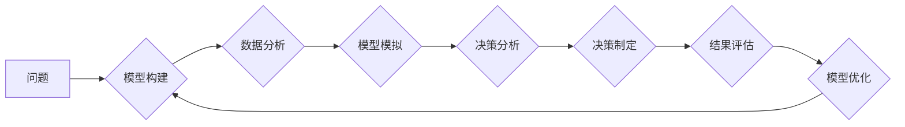

                 

## 如何将模型思维应用于实际管理

> 关键词：模型思维、系统思考、管理决策、人工智能、数据驱动、优化算法、实践案例、未来趋势

## 1. 背景介绍

在当今数据爆炸和技术飞速发展的时代，传统的管理模式面临着越来越大的挑战。传统的管理思维往往局限于局部视角，难以有效应对复杂、动态的业务环境。而模型思维，作为一种系统化的思考方式，为我们提供了全新的视角和工具，帮助我们更好地理解和管理复杂系统。

模型思维的核心在于将复杂问题抽象成模型，并通过模型分析、模拟和优化，从而获得更深入的洞察和更有效的解决方案。这种思维方式不仅适用于技术领域，也能够有效应用于实际管理中。

## 2. 核心概念与联系

### 2.1 模型思维的定义

模型思维是指用抽象的符号、结构和规则来代表现实世界中的复杂系统，并通过对模型的分析、模拟和优化，来理解、预测和控制系统的行为。

### 2.2 模型思维与管理决策

模型思维可以帮助管理者更好地进行决策，其主要优势在于：

* **系统化思考:** 模型思维鼓励我们从系统角度看待问题，而非局限于局部视角，从而更全面地了解问题本质。
* **数据驱动:** 模型思维依赖于数据驱动，通过对数据的分析和建模，可以获得更准确的决策依据。
* **模拟与预测:** 模型可以模拟不同决策情境下的结果，帮助管理者预测决策的潜在影响，并选择最优方案。
* **优化与改进:** 模型可以帮助管理者识别系统中的瓶颈和改进点，并通过优化模型参数，不断提升系统的效率和效益。

**模型思维与管理决策的联系**



## 3. 核心算法原理 & 具体操作步骤

### 3.1 算法原理概述

在实际应用中，模型思维通常结合各种算法和技术，例如机器学习、数据挖掘、优化算法等，来构建和优化模型。

* **机器学习:** 用于从数据中学习模式和规律，构建预测模型。
* **数据挖掘:** 用于从海量数据中发现隐藏的知识和洞察。
* **优化算法:** 用于寻找模型参数的最佳组合，以提高模型的预测精度和决策效果。

### 3.2 算法步骤详解

1. **问题定义:** 明确需要解决的问题，并将其转化为模型可以处理的形式。
2. **数据收集:** 收集与问题相关的相关数据，并进行清洗和预处理。
3. **模型选择:** 根据问题的性质和数据特点，选择合适的模型类型。
4. **模型训练:** 使用训练数据训练模型，并调整模型参数，以提高模型的预测精度。
5. **模型评估:** 使用测试数据评估模型的性能，并进行必要的调整和优化。
6. **模型部署:** 将训练好的模型部署到实际应用场景中，并进行监控和维护。

### 3.3 算法优缺点

**优点:**

* **数据驱动:** 基于数据分析和建模，决策更科学、更客观。
* **预测能力:** 可以预测未来趋势和潜在风险，帮助管理者提前做出应对措施。
* **优化效率:** 可以识别系统瓶颈和改进点，提高系统的效率和效益。

**缺点:**

* **数据依赖:** 模型的准确性依赖于数据的质量和完整性。
* **模型复杂性:** 构建和维护复杂的模型需要专业知识和技术能力。
* **解释性:** 一些模型的决策过程难以解释，难以获得管理者的信任。

### 3.4 算法应用领域

模型思维和相关算法广泛应用于各个管理领域，例如：

* **市场营销:** 预测客户行为、优化广告投放、精准营销。
* **人力资源:** 人才招聘、员工培训、绩效评估。
* **财务管理:** 财务预测、风险管理、投资决策。
* **供应链管理:** 库存优化、物流配送、风险控制。

## 4. 数学模型和公式 & 详细讲解 & 举例说明

### 4.1 数学模型构建

在模型思维中，数学模型是描述系统行为的抽象表示。模型的构建需要根据问题的具体情况，选择合适的数学语言和符号，并建立系统变量、关系和约束条件。

例如，在预测销售额的模型中，我们可以使用线性回归模型，将销售额作为因变量，并将时间、广告投入、市场价格等因素作为自变量。

### 4.2 公式推导过程

线性回归模型的公式如下：

$$y = \beta_0 + \beta_1x_1 + \beta_2x_2 + ... + \beta_nx_n + \epsilon$$

其中：

* $y$ 是销售额
* $x_1, x_2, ..., x_n$ 是自变量，例如时间、广告投入、市场价格等
* $\beta_0, \beta_1, ..., \beta_n$ 是模型参数，需要通过数据拟合得到
* $\epsilon$ 是误差项

### 4.3 案例分析与讲解

假设我们想要预测某产品的销售额，并收集了以下数据：

| 时间 (月) | 广告投入 (万元) | 市场价格 (元) | 销售额 (万元) |
|---|---|---|---|
| 1 | 1 | 100 | 5 |
| 2 | 2 | 90 | 8 |
| 3 | 3 | 80 | 12 |
| 4 | 4 | 70 | 16 |
| 5 | 5 | 60 | 20 |

我们可以使用线性回归模型来预测销售额。通过对数据进行拟合，我们可以得到模型参数：

* $\beta_0 = -1$
* $\beta_1 = 1.5$
* $\beta_2 = 0.2$

因此，预测模型的公式为：

$$y = -1 + 1.5x_1 + 0.2x_2$$

其中，$x_1$ 是广告投入，$x_2$ 是市场价格。

## 5. 项目实践：代码实例和详细解释说明

### 5.1 开发环境搭建

本项目使用 Python 语言进行开发，所需的库包括：

* NumPy: 用于数值计算
* Pandas: 用于数据处理
* Scikit-learn: 用于机器学习

### 5.2 源代码详细实现

```python
import numpy as np
from sklearn.linear_model import LinearRegression

# 数据准备
data = {
    '时间': [1, 2, 3, 4, 5],
    '广告投入': [1, 2, 3, 4, 5],
    '市场价格': [100, 90, 80, 70, 60],
    '销售额': [5, 8, 12, 16, 20]
}
df = pd.DataFrame(data)

# 特征选择
X = df[['广告投入', '市场价格']]
y = df['销售额']

# 模型训练
model = LinearRegression()
model.fit(X, y)

# 模型评估
# ...

# 预测
new_data = [[3, 80]]
prediction = model.predict(new_data)
print(f'预测销售额: {prediction[0]}')
```

### 5.3 代码解读与分析

* 数据准备: 将数据加载到 Pandas DataFrame 中。
* 特征选择: 选择需要用于模型训练的特征变量。
* 模型训练: 使用 Scikit-learn 的 LinearRegression 类训练线性回归模型。
* 模型评估: 使用测试数据评估模型的性能，例如计算 R-squared 值。
* 预测: 使用训练好的模型预测新的数据。

### 5.4 运行结果展示

运行代码后，会输出预测的销售额。

## 6. 实际应用场景

### 6.1 案例分析

* **电商平台:** 利用模型思维预测用户购买行为，优化商品推荐和营销策略。
* **金融机构:** 利用模型思维评估风险，优化投资组合和贷款决策。
* **医疗机构:** 利用模型思维预测疾病风险，优化医疗资源配置和患者治疗方案。

### 6.2 未来应用展望

随着人工智能技术的不断发展，模型思维将在更多领域得到应用，例如：

* **个性化定制:** 根据用户的需求和喜好，提供个性化的产品和服务。
* **智能决策:** 利用模型思维辅助管理者做出更科学、更有效的决策。
* **自动控制:** 利用模型思维实现对复杂系统的自动控制和优化。

## 7. 工具和资源推荐

### 7.1 学习资源推荐

* **书籍:**
    * 《模型思维》
    * 《思考，快与慢》
    * 《数据科学方法》
* **在线课程:**
    * Coursera: 数据科学、机器学习
    * edX: 算法、人工智能
* **网站:**
    * Towards Data Science
    * Analytics Vidhya

### 7.2 开发工具推荐

* **Python:** 广泛应用于数据科学和机器学习领域。
* **R:** 专注于统计分析和数据可视化。
* **Jupyter Notebook:** 用于交互式编程和数据分析。

### 7.3 相关论文推荐

* 《模型思维的应用》
* 《人工智能与管理决策》
* 《数据驱动决策的挑战与机遇》

## 8. 总结：未来发展趋势与挑战

### 8.1 研究成果总结

模型思维为管理决策提供了全新的视角和工具，能够帮助管理者更好地理解和应对复杂、动态的业务环境。

### 8.2 未来发展趋势

* 模型思维将更加深入地融入到各个管理领域，并与其他新兴技术，例如区块链、云计算等相结合，形成更加强大的管理工具。
* 模型思维的应用将更加注重个性化和定制化，能够根据用户的需求和喜好提供更加精准的解决方案。
* 模型思维的解释性和可解释性将得到进一步提升，帮助管理者更好地理解模型的决策过程，并获得更高的信任。

### 8.3 面临的挑战

* 模型思维的应用需要专业知识和技术能力，需要加强人才培养和技术支持。
* 模型的准确性依赖于数据的质量和完整性，需要加强数据管理和数据治理。
* 模型的决策过程难以解释，需要加强模型的可解释性研究。

### 8.4 研究展望

未来，我们将继续深入研究模型思维的理论和应用，探索其在管理决策、组织管理、战略规划等方面的更多应用场景，并致力于推动模型思维的普及和应用，帮助企业更好地应对未来挑战。

## 9. 附录：常见问题与解答

* **什么是模型思维？**

模型思维是指用抽象的符号、结构和规则来代表现实世界中的复杂系统，并通过对模型的分析、模拟和优化，来理解、预测和控制系统的行为。

* **模型思维的优势是什么？**

模型思维可以帮助管理者更好地进行决策，其主要优势在于：

* **系统化思考:** 从系统角度看待问题，而非局限于局部视角。
* **数据驱动:** 基于数据分析和建模，决策更科学、更客观。
* **预测能力:** 可以预测未来趋势和潜在风险。
* **优化效率:** 可以识别系统瓶颈和改进点，提高系统的效率和效益。

* **如何应用模型思维？**

应用模型思维需要以下步骤：

1. **问题定义:** 明确需要解决的问题。
2. **数据收集:** 收集与问题相关的相关数据。
3. **模型选择:** 选择合适的模型类型。
4. **模型训练:** 使用训练数据训练模型。
5. **模型评估:** 使用测试数据评估模型的性能。
6. **模型部署:** 将训练好的模型部署到实际应用场景中。


作者：禅与计算机程序设计艺术 / Zen and the Art of Computer Programming 
<end_of_turn>

