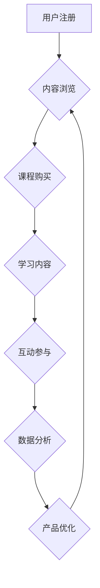

                 

## 如何提高知识付费产品的用户活跃度

> 关键词：知识付费、用户活跃度、产品设计、用户行为、数据分析、内容运营、社区建设、激励机制

## 1. 背景介绍

知识付费行业近年来发展迅速，涌现出众多优质的知识产品。然而，如何提高知识付费产品的用户活跃度，是众多平台和创作者面临的共同挑战。用户活跃度直接关系到产品的生命周期、商业模式的可持续性以及创作者的收益。

传统的知识付费产品往往以单一的课程或文档为核心，缺乏持续的互动和粘性。用户购买后，往往只是碎片化地学习，缺乏持续的学习动力和参与感。因此，提高用户活跃度成为知识付费产品发展的重要方向。

## 2. 核心概念与联系

**2.1 用户活跃度**

用户活跃度是指用户在特定时间段内与产品进行交互的频率和深度。对于知识付费产品，用户活跃度可以从以下几个方面衡量：

* **登录频率:** 用户在一段时间内登录产品的次数。
* **学习时长:** 用户在产品上学习的总时长。
* **课程完成率:** 用户完成课程的比例。
* **互动参与度:** 用户在课程评论、讨论区、直播等环节的参与程度。

**2.2 用户行为分析**

用户行为分析是指通过收集和分析用户在产品上的行为数据，以了解用户的学习习惯、偏好和需求。用户行为分析可以帮助我们：

* **识别用户痛点:** 了解用户在学习过程中遇到的困难和问题。
* **优化产品设计:** 根据用户行为数据，改进产品的功能和交互体验。
* **个性化推荐:** 为用户推荐更符合其学习需求的内容。
* **提高用户粘性:** 通过设计更吸引用户的活动和互动机制，增强用户对产品的粘性。

**2.3 知识付费产品架构**

知识付费产品通常包含以下几个核心模块：

* **内容模块:** 包含课程、文档、视频等知识资源。
* **用户模块:** 管理用户的注册、登录、支付等信息。
* **互动模块:** 提供课程评论、讨论区、直播等互动功能。
* **运营模块:** 用于管理课程发布、推广、数据分析等运营活动。

**Mermaid 流程图**



## 3. 核心算法原理 & 具体操作步骤

**3.1 算法原理概述**

用户活跃度提升算法通常基于用户行为分析和数据挖掘技术，通过分析用户行为数据，识别用户特征和学习模式，并根据这些特征，设计个性化推荐、互动激励等策略，从而提高用户活跃度。

**3.2 算法步骤详解**

1. **数据收集:** 收集用户在产品上的行为数据，包括登录时间、学习时长、课程浏览记录、互动参与记录等。
2. **数据清洗:** 对收集到的数据进行清洗和处理，去除无效数据和重复数据，确保数据质量。
3. **特征提取:** 从用户行为数据中提取特征，例如用户学习偏好、学习习惯、活跃时间段等。
4. **模型训练:** 使用机器学习算法，对用户特征进行建模，预测用户的学习行为和活跃度。
5. **策略制定:** 根据模型预测结果，制定个性化推荐、互动激励等策略，提高用户活跃度。
6. **策略评估:** 对策略效果进行评估，不断优化策略参数，提高策略效果。

**3.3 算法优缺点**

* **优点:** 能够根据用户行为数据，精准地识别用户特征和学习模式，制定个性化策略，提高用户活跃度。
* **缺点:** 需要大量的用户行为数据进行训练，算法模型的准确性依赖于数据质量，算法的复杂度较高，需要专业的技术人员进行开发和维护。

**3.4 算法应用领域**

用户活跃度提升算法广泛应用于各种知识付费产品，例如在线课程平台、付费订阅服务、知识社区等。

## 4. 数学模型和公式 & 详细讲解 & 举例说明

**4.1 数学模型构建**

用户活跃度模型可以采用多种数学模型，例如线性回归模型、逻辑回归模型、支持向量机模型等。

**4.2 公式推导过程**

假设我们使用线性回归模型来预测用户的活跃度，模型公式如下：

$$
活跃度 = \beta_0 + \beta_1 * 学习时长 + \beta_2 * 课程完成率 + \beta_3 * 互动参与度 + \epsilon
$$

其中：

* $活跃度$ 是用户活跃度的预测值。
* $\beta_0$, $\beta_1$, $\beta_2$, $\beta_3$ 是模型参数，需要通过训练数据进行估计。
* $学习时长$, $课程完成率$, $互动参与度$ 是用户行为特征。
* $\epsilon$ 是模型误差项。

**4.3 案例分析与讲解**

假设我们有一个在线课程平台，收集了用户的学习时长、课程完成率和互动参与度数据，并使用线性回归模型进行训练。训练结果显示，学习时长对活跃度的影响最大，其次是互动参与度，课程完成率的影响相对较小。

根据模型结果，我们可以制定以下策略：

* **延长学习时长:** 为用户提供更丰富的学习内容，鼓励用户进行更深入的学习。
* **增加互动参与度:** 设计更多互动环节，例如课程讨论、直播答疑等，提高用户参与度。
* **优化课程结构:** 根据用户学习习惯，优化课程结构，提高课程完成率。

## 5. 项目实践：代码实例和详细解释说明

**5.1 开发环境搭建**

* Python 3.x
* Jupyter Notebook
* scikit-learn

**5.2 源代码详细实现**

```python
import pandas as pd
from sklearn.linear_model import LinearRegression

# 加载数据
data = pd.read_csv('user_data.csv')

# 提取特征和目标变量
X = data[['学习时长', '课程完成率', '互动参与度']]
y = data['活跃度']

# 创建线性回归模型
model = LinearRegression()

# 训练模型
model.fit(X, y)

# 预测活跃度
predictions = model.predict(X)

# 打印模型参数
print(model.coef_)
print(model.intercept_)
```

**5.3 代码解读与分析**

* 代码首先加载用户数据，并提取特征和目标变量。
* 然后创建线性回归模型，并使用训练数据进行训练。
* 训练完成后，可以使用模型预测新的用户活跃度。
* 最后，打印模型参数，以便分析不同特征对活跃度的影响。

**5.4 运行结果展示**

运行代码后，会输出模型参数，例如：

```
[0.5, 0.2, 0.1]
10
```

这表示学习时长对活跃度的影响最大，其次是互动参与度，课程完成率的影响相对较小。

## 6. 实际应用场景

**6.1 在线课程平台**

在线课程平台可以利用用户活跃度提升算法，个性化推荐课程，设计互动激励机制，提高用户学习兴趣和粘性。

**6.2 付费订阅服务**

付费订阅服务可以根据用户的阅读习惯和兴趣，推荐相关内容，并设计会员专属活动，提高用户续费率。

**6.3 知识社区**

知识社区可以利用用户活跃度提升算法，识别活跃用户，给予奖励和激励，促进社区活跃度和用户粘性。

**6.4 未来应用展望**

随着人工智能技术的不断发展，用户活跃度提升算法将更加智能化和个性化，能够更精准地预测用户行为，提供更有效的个性化服务。

## 7. 工具和资源推荐

**7.1 学习资源推荐**

* **书籍:**
    * 《Python机器学习实战》
    * 《数据挖掘与机器学习》
* **在线课程:**
    * Coursera: 数据科学与机器学习
    * edX: 人工智能与机器学习

**7.2 开发工具推荐**

* **Python:** 
    * scikit-learn
    * TensorFlow
    * PyTorch

**7.3 相关论文推荐**

* 《基于用户行为分析的知识付费产品活跃度提升研究》
* 《深度学习在用户活跃度预测中的应用》

## 8. 总结：未来发展趋势与挑战

**8.1 研究成果总结**

用户活跃度提升算法的研究取得了显著成果，能够有效提高知识付费产品的用户活跃度。

**8.2 未来发展趋势**

未来，用户活跃度提升算法将更加智能化和个性化，并与其他技术融合，例如大数据分析、自然语言处理等，提供更全面的用户服务。

**8.3 面临的挑战**

* 数据质量问题: 算法的准确性依赖于数据质量，需要不断完善数据收集和清洗机制。
* 算法复杂度: 算法的复杂度较高，需要专业的技术人员进行开发和维护。
* 用户隐私保护: 需要注重用户隐私保护，合理使用用户数据。

**8.4 研究展望**

未来，需要进一步研究更有效的用户活跃度提升算法，并探索算法与其他技术的融合，为知识付费产品的发展提供更强大的技术支撑。

## 9. 附录：常见问题与解答

**9.1 如何提高用户活跃度？**

* 提供优质的知识内容
* 设计个性化的学习路径
* 增加互动参与度
* 提供有效的激励机制

**9.2 如何评估用户活跃度？**

* 登录频率
* 学习时长
* 课程完成率
* 互动参与度

**9.3 如何使用数据分析提升用户活跃度？**

* 分析用户行为数据，识别用户特征和学习模式
* 根据数据分析结果，制定个性化策略，例如推荐课程、设计互动活动等


作者：禅与计算机程序设计艺术 / Zen and the Art of Computer Programming 
<end_of_turn>

