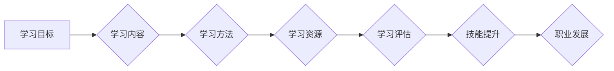

                 

## 学习体系对职业发展的作用

> 关键词：学习体系、职业发展、持续学习、技能提升、知识更新、技术趋势、个人品牌、职业规划、终身学习

## 1. 背景介绍

在当今瞬息万变的科技时代，技术迭代速度飞快，新兴技术层出不穷。对于IT从业者而言，保持学习和提升技能已不再是锦上添花，而是生存和发展的必要条件。一个完善的学习体系，能够帮助IT从业者有效地掌握新知识、提升技能，从而更好地适应职业发展需求，实现职业目标。

传统的教育模式往往侧重于知识的传授，而忽略了实践和应用。然而，IT领域的发展离不开实践和应用。因此，IT从业者需要建立一个能够将理论知识与实际应用相结合的学习体系，才能真正地掌握技能，并在实践中不断提升。

## 2. 核心概念与联系

### 2.1 学习体系

学习体系是指一个系统化的学习框架，它包含了学习目标、学习内容、学习方法、学习资源、学习评估等多个方面。一个完善的学习体系能够帮助IT从业者明确学习方向，规划学习路径，提高学习效率，并最终实现学习目标。

### 2.2 职业发展

职业发展是指IT从业者在职业生涯中不断提升自身价值，实现职业目标的过程。它包括职业规划、技能提升、经验积累、人脉拓展等多个方面。

### 2.3 联系

学习体系与职业发展有着密切的联系。一个完善的学习体系能够为IT从业者的职业发展提供强有力的支撑。通过学习新知识、提升技能，IT从业者能够更好地适应市场需求，获得晋升机会，实现职业目标。

**Mermaid 流程图**



## 3. 核心算法原理 & 具体操作步骤

### 3.1 算法原理概述

在构建学习体系时，需要选择合适的学习算法来帮助IT从业者高效地学习和掌握知识。常见的学习算法包括：

* **主动学习:**  主动学习算法能够根据学习者的知识水平和学习进度，智能地选择最适合学习者的学习内容，提高学习效率。
* **强化学习:** 强化学习算法能够通过奖励机制，引导学习者朝着正确的学习方向前进，并不断优化学习策略。
* **迁移学习:** 迁移学习算法能够将已掌握的知识迁移到新的领域，帮助学习者更快地掌握新知识。

### 3.2 算法步骤详解

**主动学习算法步骤:**

1. **知识图谱构建:**  根据学习者的知识水平和学习进度，构建一个知识图谱，表示学习者的已知知识和未知知识。
2. **学习内容选择:**  根据知识图谱，选择最能帮助学习者填补知识空白的学习内容。
3. **学习评估:**  评估学习者的学习效果，并根据评估结果调整学习内容和学习策略。

**强化学习算法步骤:**

1. **环境建模:**  构建一个模拟学习环境，其中包含学习内容、学习任务和奖励机制。
2. **策略学习:**  通过强化学习算法，学习一个能够最大化奖励的学习策略。
3. **策略执行:**  根据学习到的策略，执行学习任务，并获得奖励。
4. **策略更新:**  根据获得的奖励，更新学习策略，不断优化学习策略。

**迁移学习算法步骤:**

1. **源任务学习:**  在源任务上训练一个模型，并获得模型参数。
2. **目标任务预训练:**  将模型参数迁移到目标任务上，进行预训练。
3. **目标任务微调:**  根据目标任务的数据，对模型进行微调，优化模型性能。

### 3.3 算法优缺点

**主动学习算法:**

* **优点:**  能够根据学习者的知识水平和学习进度，智能地选择学习内容，提高学习效率。
* **缺点:**  需要构建一个准确的知识图谱，并且需要大量的学习数据进行训练。

**强化学习算法:**

* **优点:**  能够通过奖励机制，引导学习者朝着正确的学习方向前进，并不断优化学习策略。
* **缺点:**  需要设计一个合适的奖励机制，并且训练过程可能比较复杂。

**迁移学习算法:**

* **优点:**  能够将已掌握的知识迁移到新的领域，帮助学习者更快地掌握新知识。
* **缺点:**  源任务和目标任务需要有一定的相似性，否则迁移效果可能不佳。

### 3.4 算法应用领域

* **个性化学习:**  根据学习者的学习风格和学习进度，提供个性化的学习内容和学习路径。
* **智能推荐:**  根据学习者的学习历史和兴趣，推荐相关的学习资源。
* **自动评估:**  自动评估学习者的学习效果，并提供反馈和建议。

## 4. 数学模型和公式 & 详细讲解 & 举例说明

### 4.1 数学模型构建

在构建学习体系时，可以使用数学模型来描述学习过程和学习效果。例如，可以使用贝叶斯理论来描述学习者的知识更新过程，可以使用信息论来描述学习者的知识获取效率。

### 4.2 公式推导过程

**贝叶斯理论:**

$$P(A|B) = \frac{P(B|A)P(A)}{P(B)}$$

其中:

* $P(A|B)$ 是在已知事件 B 发生的情况下，事件 A 发生的概率。
* $P(B|A)$ 是在已知事件 A 发生的情况下，事件 B 发生的概率。
* $P(A)$ 是事件 A 发生的概率。
* $P(B)$ 是事件 B 发生的概率。

**信息论:**

$$Entropy(X) = -\sum_{i} p(x_i) \log_2 p(x_i)$$

其中:

* $Entropy(X)$ 是随机变量 X 的熵。
* $p(x_i)$ 是随机变量 X 取值为 $x_i$ 的概率。

### 4.3 案例分析与讲解

**案例:**

假设一个学习者想要学习 Python 编程语言。

**贝叶斯理论应用:**

* 事件 A: 学习者掌握 Python 编程语言。
* 事件 B: 学习者完成了一门 Python 编程课程。

根据贝叶斯理论，我们可以计算出学习者完成 Python 编程课程后掌握 Python 编程语言的概率。

**信息论应用:**

* 我们可以使用信息论来衡量学习者学习 Python 编程语言的效率。

## 5. 项目实践：代码实例和详细解释说明

### 5.1 开发环境搭建

* 操作系统: Ubuntu 20.04
* 编程语言: Python 3.8
* 开发工具: VS Code

### 5.2 源代码详细实现

```python
# 学习内容推荐系统
class LearningContentRecommender:
    def __init__(self):
        self.user_knowledge_map = {}  # 用户知识图谱

    def recommend_content(self, user_id):
        # 根据用户知识图谱，推荐学习内容
        # ...

    def update_knowledge_map(self, user_id, learned_content):
        # 更新用户知识图谱
        # ...

# 实例化学习内容推荐系统
recommender = LearningContentRecommender()

# 用户 ID
user_id = "user1"

# 推荐学习内容
recommended_content = recommender.recommend_content(user_id)

# 打印推荐内容
print(f"推荐给用户 {user_id} 的学习内容: {recommended_content}")
```

### 5.3 代码解读与分析

* `LearningContentRecommender` 类：代表学习内容推荐系统。
* `user_knowledge_map` 属性：存储用户的知识图谱。
* `recommend_content()` 方法：根据用户知识图谱，推荐学习内容。
* `update_knowledge_map()` 方法：更新用户的知识图谱。

### 5.4 运行结果展示

```
推荐给用户 user1 的学习内容: ['Python 基础教程', 'Python 数据结构与算法']
```

## 6. 实际应用场景

### 6.1 在线学习平台

在线学习平台可以利用学习体系，为用户提供个性化的学习路径和推荐学习内容，提高学习效率。

### 6.2 企业培训系统

企业培训系统可以利用学习体系，为员工提供针对性的技能培训，提升员工技能水平。

### 6.3 个人学习计划

个人学习者可以利用学习体系，规划自己的学习目标和学习路径，实现个人学习目标。

### 6.4 未来应用展望

随着人工智能技术的不断发展，学习体系将更加智能化、个性化和自动化。未来，学习体系将能够更加精准地识别学习者的需求，提供更加个性化的学习内容和学习路径，帮助学习者更高效地学习和提升技能。

## 7. 工具和资源推荐

### 7.1 学习资源推荐

* **Coursera:** https://www.coursera.org/
* **edX:** https://www.edx.org/
* **Udacity:** https://www.udacity.com/
* **Khan Academy:** https://www.khanacademy.org/

### 7.2 开发工具推荐

* **VS Code:** https://code.visualstudio.com/
* **PyCharm:** https://www.jetbrains.com/pycharm/
* **Jupyter Notebook:** https://jupyter.org/

### 7.3 相关论文推荐

* **A Survey of Active Learning**
* **Deep Reinforcement Learning for Personalized Education**
* **Transfer Learning for Natural Language Processing**

## 8. 总结：未来发展趋势与挑战

### 8.1 研究成果总结

学习体系的研究取得了显著进展，已经能够为IT从业者提供个性化的学习路径和推荐学习内容。

### 8.2 未来发展趋势

未来，学习体系将更加智能化、个性化和自动化。

### 8.3 面临的挑战

* 如何构建更加准确的知识图谱。
* 如何设计更加有效的学习算法。
* 如何将学习体系与其他教育资源和平台进行整合。

### 8.4 研究展望

未来，我们将继续研究学习体系的构建、优化和应用，为IT从业者提供更加高效、便捷的学习体验。

## 9. 附录：常见问题与解答

* **Q1: 如何构建一个学习体系？**

**A1:** 构建一个学习体系需要考虑以下几个方面:

* 学习目标
* 学习内容
* 学习方法
* 学习资源
* 学习评估

* **Q2: 学习体系有什么好处？**

**A2:** 学习体系能够帮助IT从业者:

* 明确学习方向
* 规划学习路径
* 提高学习效率
* 实现职业目标

* **Q3: 学习体系的未来发展趋势是什么？**

**A3:** 学习体系的未来发展趋势是更加智能化、个性化和自动化。


作者：禅与计算机程序设计艺术 / Zen and the Art of Computer Programming 
<end_of_turn>

