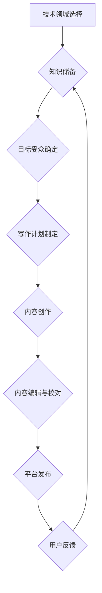

                 

## 技术写作：程序员的副业选择

> 关键词：技术写作，程序员副业，技术博客，技术文档，技术书籍，知识分享，副业收入

### 1. 背景介绍

在当今科技飞速发展的时代，程序员的需求量持续增长，同时也涌现出许多优秀的程序员希望将自己的技术知识和经验转化为可观的副业收入。技术写作成为了一个备受关注的选项，它不仅能够帮助程序员分享知识、提升个人品牌，还能带来稳定的经济回报。

然而，技术写作并非易事。它需要程序员具备扎实的技术功底、清晰的表达能力以及对目标受众的深入理解。想要在技术写作领域取得成功，需要付出大量的努力和时间。

### 2. 核心概念与联系

技术写作涵盖了多种形式，包括技术博客文章、技术文档、技术书籍、在线教程等。这些形式各有特点，但都围绕着将复杂的技术知识以易于理解的方式传达给目标受众这一核心目标。

**技术写作流程图:**

### 3. 核心算法原理 & 具体操作步骤

**3.1 算法原理概述**

技术写作的本质是一种信息传递和知识组织的算法。它需要程序员将复杂的知识结构分解成易于理解的逻辑单元，并通过清晰的语言和结构将这些单元串联起来，形成一个完整的知识体系。

**3.2 算法步骤详解**

1. **技术领域选择:** 程序员需要根据自己的技术背景和兴趣选择一个合适的技术领域进行写作。
2. **知识储备:** 在选定的技术领域进行深入学习和研究，积累足够的知识储备。
3. **目标受众确定:** 明确目标受众的背景、需求和阅读习惯，以便针对性地进行写作。
4. **写作计划制定:** 制定详细的写作计划，包括文章主题、结构、内容框架等。
5. **内容创作:** 根据写作计划进行内容创作，使用清晰简洁的语言，并辅以图表、代码示例等辅助工具。
6. **内容编辑与校对:** 对完成的稿件进行反复编辑和校对，确保内容准确、完整、通顺。
7. **平台发布:** 选择合适的平台发布文章，例如技术博客、技术社区、在线教程平台等。
8. **用户反馈:** 收集用户反馈，并根据反馈进行文章的改进和更新。

**3.3 算法优缺点**

* **优点:** 技术写作能够帮助程序员分享知识、提升个人品牌、获得副业收入。
* **缺点:** 技术写作需要付出大量的努力和时间，并且竞争激烈。

**3.4 算法应用领域**

技术写作的应用领域非常广泛，包括软件开发、网络安全、数据科学、人工智能等。

### 4. 数学模型和公式 & 详细讲解 & 举例说明

**4.1 数学模型构建**

技术写作的成功与否可以看作是一个信息传递的数学模型。我们可以用以下公式来表示：

$$
信息传递效率 = \frac{知识理解度 * 阅读体验}{时间成本}
$$

其中：

* 知识理解度：读者理解文章内容的程度。
* 阅读体验：读者阅读文章的舒适度和愉悦度。
* 时间成本：读者阅读文章所花费的时间。

**4.2 公式推导过程**

这个公式的推导过程基于以下假设：

* 读者希望从文章中获得有价值的知识。
* 读者希望阅读文章是一个愉快的体验。
* 读者的时间成本是有限的。

**4.3 案例分析与讲解**

假设一篇技术博客文章，其知识理解度为 80%，阅读体验为 90%，读者阅读所花费的时间为 30 分钟。那么，该文章的信息传递效率为：

$$
信息传递效率 = \frac{0.8 * 0.9}{0.5} = 1.44
$$

这个结果表明，该文章的信息传递效率较高。

### 5. 项目实践：代码实例和详细解释说明

**5.1 开发环境搭建**

技术写作的开发环境搭建相对简单，主要需要准备以下工具：

* 文本文档编辑器：例如 Sublime Text、VS Code 等。
* Markdown 编辑器：例如 Typora、MarkText 等。
* 版本控制系统：例如 Git。

**5.2 源代码详细实现**

技术写作本身并不需要编写代码，但程序员可以利用代码示例来辅助解释技术概念。例如，在编写一篇关于数据结构的文章时，可以编写一段代码来演示链表的实现。

**5.3 代码解读与分析**

程序员需要对代码进行详细解读和分析，并用通俗易懂的语言解释代码的功能和原理。

**5.4 运行结果展示**

程序员可以将代码运行结果展示出来，以便读者更直观地理解代码的功能。

### 6. 实际应用场景

技术写作的应用场景非常广泛，包括：

* **技术博客:** 程序员可以利用技术博客平台分享自己的技术经验和见解，并与其他程序员进行交流。
* **技术文档:** 程序员可以编写技术文档来帮助用户理解和使用软件产品。
* **技术书籍:** 程序员可以编写技术书籍来深入探讨某个技术领域。
* **在线教程:** 程序员可以编写在线教程来教授他人学习某个技术。

**6.4 未来应用展望**

随着人工智能技术的不断发展，技术写作将更加智能化和自动化。例如，我们可以利用人工智能技术自动生成技术文档、翻译技术文章等。

### 7. 工具和资源推荐

**7.1 学习资源推荐**

* **书籍:** 《技术写作》
* **网站:**  
    *  [https://www.oreilly.com/](https://www.oreilly.com/)
    *  [https://www.packtpub.com/](https://www.packtpub.com/)

**7.2 开发工具推荐**

* **Markdown 编辑器:** Typora、MarkText
* **版本控制系统:** Git

**7.3 相关论文推荐**

*  [https://dl.acm.org/](https://dl.acm.org/)

### 8. 总结：未来发展趋势与挑战

**8.1 研究成果总结**

技术写作已经成为程序员副业的重要选择，它能够帮助程序员分享知识、提升个人品牌、获得副业收入。

**8.2 未来发展趋势**

未来，技术写作将更加智能化和自动化，人工智能技术将扮演越来越重要的角色。

**8.3 面临的挑战**

技术写作领域竞争激烈，程序员需要不断提升自己的写作能力和专业知识。

**8.4 研究展望**

未来，我们需要研究如何更好地利用人工智能技术来辅助技术写作，并探索新的技术写作模式。

### 9. 附录：常见问题与解答

**常见问题:**

* 如何提高技术写作的质量？
* 如何找到合适的技术写作平台？
* 如何获得技术写作的收入？

**解答:**

* 提高技术写作的质量需要不断学习和练习，并注重细节处理。
* 选择合适的技术写作平台需要根据自己的技术领域和目标受众进行选择。
* 技术写作的收入可以通过广告、赞助、付费订阅等方式获得。

作者：禅与计算机程序设计艺术 / Zen and the Art of Computer Programming 
<end_of_turn>

