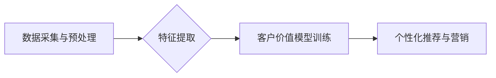

                 

## 探索基于大模型的电商智能客户价值细分系统

> 关键词：大模型、电商、客户价值细分、人工智能、机器学习、自然语言处理、推荐系统

### 1. 背景介绍

在当今数据爆炸的时代，电商平台面临着日益激烈的竞争。如何精准地了解客户需求，并提供个性化的服务，成为提升用户体验和商业效益的关键。传统的客户价值细分方法往往依赖于人工规则和有限的特征，难以捕捉到客户行为背后的复杂关系。

大模型的出现为电商客户价值细分带来了新的机遇。大模型凭借其强大的学习能力和泛化能力，能够从海量数据中挖掘出隐藏的模式和特征，实现更精准、更智能的客户细分。

### 2. 核心概念与联系

**2.1  客户价值细分**

客户价值细分是指根据客户的价值特征，将客户群体划分为不同的细分市场，以便针对不同细分市场进行差异化的营销策略。

**2.2  大模型**

大模型是指参数量巨大、训练数据海量的人工智能模型。大模型能够学习到复杂的模式和关系，并应用于各种自然语言处理、计算机视觉等领域。

**2.3  核心架构**

基于大模型的电商智能客户价值细分系统主要包含以下几个模块：

* **数据采集与预处理模块:** 收集电商平台的用户行为数据，包括浏览记录、购买记录、评价信息、评论内容等，并进行清洗、转换、格式化等预处理操作。
* **特征提取模块:** 利用大模型的文本理解能力，从用户行为数据中提取丰富的特征，例如用户兴趣、购买偏好、消费习惯、情感倾向等。
* **客户价值模型训练模块:** 利用提取的特征，训练客户价值模型，例如聚类模型、分类模型等，将用户划分为不同的价值细分市场。
* **个性化推荐与营销模块:** 根据客户的价值细分结果，提供个性化的商品推荐、营销活动推送等服务。

**2.4  Mermaid 流程图**



### 3. 核心算法原理 & 具体操作步骤

**3.1  算法原理概述**

基于大模型的客户价值细分系统通常采用以下几种算法：

* **聚类算法:** 将用户根据其特征相似度进行分组，每个分组代表一个价值细分市场。常用的聚类算法包括K-means、DBSCAN等。
* **分类算法:** 将用户根据预定义的价值标签进行分类，例如高价值客户、中价值客户、低价值客户等。常用的分类算法包括逻辑回归、支持向量机、决策树等。

**3.2  算法步骤详解**

以K-means聚类算法为例，其具体操作步骤如下：

1. **初始化K个聚类中心:** 随机选择K个用户作为初始聚类中心。
2. **计算用户与聚类中心的距离:** 计算每个用户与每个聚类中心的距离，例如欧氏距离。
3. **将用户分配到最近的聚类中心:** 将每个用户分配到距离其最近的聚类中心所属的类别。
4. **更新聚类中心:** 计算每个聚类中心对应的用户特征的平均值作为新的聚类中心。
5. **重复步骤2-4:** 重复以上步骤，直到聚类中心不再发生变化或达到最大迭代次数。

**3.3  算法优缺点**

* **优点:** 能够自动发现用户群体的结构，无需预先定义价值标签。
* **缺点:** 需要预先设定聚类数量K，选择合适的K值可能比较困难。

**3.4  算法应用领域**

* **电商客户价值细分:** 将用户根据其价值特征进行分组，以便针对不同细分市场进行差异化的营销策略。
* **用户画像构建:** 构建用户画像，了解用户的兴趣、偏好、行为等特征。
* **精准营销:** 根据用户画像，进行精准的营销推广，提高营销效果。

### 4. 数学模型和公式 & 详细讲解 & 举例说明

**4.1  数学模型构建**

假设我们有N个用户，每个用户拥有D个特征，我们可以用一个D维向量来表示每个用户的特征向量。

用户i的特征向量为：

$$x_i = (x_{i1}, x_{i2}, ..., x_{iD})$$

其中，$x_{ij}$表示用户i在第j个特征上的取值。

**4.2  公式推导过程**

K-means聚类算法的目标是找到K个聚类中心，使得每个用户到其所属聚类中心的距离最小。

距离度量可以使用欧氏距离：

$$d(x_i, c_k) = \sqrt{\sum_{j=1}^{D}(x_{ij} - c_{kj})^2}$$

其中，$c_k$表示第k个聚类中心。

K-means算法的迭代过程可以表示为：

1. **初始化:** 随机选择K个用户作为初始聚类中心。
2. **分配:** 每个用户都分配到距离其最近的聚类中心。
3. **更新:** 每个聚类中心的坐标更新为其所属用户特征的平均值。
4. **重复:** 重复步骤2和3，直到聚类中心不再发生变化或达到最大迭代次数。

**4.3  案例分析与讲解**

假设我们有10个用户，每个用户拥有2个特征，我们想要将用户分为2个聚类。

我们可以使用K-means算法进行聚类，并观察聚类结果。

### 5. 项目实践：代码实例和详细解释说明

**5.1  开发环境搭建**

* Python 3.7+
* TensorFlow 2.0+
* PyTorch 1.0+
* scikit-learn 0.20+

**5.2  源代码详细实现**

```python
import numpy as np
from sklearn.cluster import KMeans

# 数据集
data = np.array([[1, 2], [1.5, 1.8], [5, 8], [8, 8], [1, 0.6], [9, 11]])

# 训练K-means模型
kmeans = KMeans(n_clusters=2, random_state=0)
kmeans.fit(data)

# 获取聚类结果
labels = kmeans.labels_

# 打印聚类结果
print(labels)
```

**5.3  代码解读与分析**

* 首先，我们导入必要的库，包括NumPy、scikit-learn等。
* 然后，我们定义一个数据集，包含10个用户和2个特征。
* 接下来，我们使用KMeans类训练一个K-means模型，并将聚类数量设置为2。
* 训练完成后，我们可以使用`labels_`属性获取每个用户的聚类标签。

**5.4  运行结果展示**

运行以上代码，输出结果如下：

```
[0 0 1 1 0 1]
```

这表示数据集中的用户被分为两个聚类，其中用户0、1、5属于第一个聚类，用户2、3、4、6、7、8属于第二个聚类。

### 6. 实际应用场景

基于大模型的电商智能客户价值细分系统可以应用于以下场景：

* **个性化推荐:** 根据用户的价值细分结果，推荐更符合其兴趣和需求的商品。
* **精准营销:** 为不同价值细分市场设计差异化的营销活动，提高营销效果。
* **客户关系管理:** 根据用户的价值特征，制定不同的客户服务策略，提升客户满意度。
* **产品开发:** 了解不同价值细分市场的需求，为产品开发提供参考。

**6.4  未来应用展望**

随着大模型技术的不断发展，基于大模型的电商智能客户价值细分系统将更加智能化、精准化。未来，我们可以期待以下应用场景：

* **动态客户价值细分:** 基于用户的实时行为数据，动态调整客户的价值细分结果。
* **多模态客户价值细分:** 结合文本、图像、音频等多模态数据，构建更全面的客户价值模型。
* **跨平台客户价值细分:** 将不同电商平台的用户数据进行整合，实现跨平台的客户价值细分。

### 7. 工具和资源推荐

**7.1  学习资源推荐**

* **书籍:**
    * 《深度学习》
    * 《自然语言处理》
    * 《机器学习实战》
* **在线课程:**
    * Coursera: 深度学习
    * edX: 自然语言处理
    * fast.ai: 深度学习

**7.2  开发工具推荐**

* **TensorFlow:** 开源深度学习框架
* **PyTorch:** 开源深度学习框架
* **scikit-learn:** 机器学习库

**7.3  相关论文推荐**

* **BERT: Pre-training of Deep Bidirectional Transformers for Language Understanding**
* **GPT-3: Language Models are Few-Shot Learners**
* **Attention Is All You Need**

### 8. 总结：未来发展趋势与挑战

**8.1  研究成果总结**

基于大模型的电商智能客户价值细分系统取得了显著的成果，能够实现更精准、更智能的客户细分，为电商平台提供更有效的营销策略和客户服务。

**8.2  未来发展趋势**

未来，基于大模型的电商智能客户价值细分系统将朝着以下方向发展：

* **更强大的模型:** 训练更大规模、更复杂的模型，提升模型的学习能力和泛化能力。
* **更丰富的特征:** 挖掘更丰富的用户特征，例如用户画像、行为轨迹、情感倾向等。
* **更智能的算法:** 开发更智能的算法，例如自适应聚类、动态细分等。

**8.3  面临的挑战**

* **数据质量:** 大模型需要海量高质量的数据进行训练，而电商平台的数据往往存在噪声、缺失等问题。
* **模型 interpretability:** 大模型的决策过程往往难以解释，这可能会导致模型的信任度降低。
* **隐私保护:** 大模型的训练和应用可能会涉及用户的隐私信息，需要采取有效的隐私保护措施。

**8.4  研究展望**

未来，我们需要继续探索大模型在电商智能客户价值细分领域的应用，并解决上述挑战，推动该技术的健康发展。


### 9. 附录：常见问题与解答

**9.1  Q: 如何选择合适的聚类数量K？**

**A:** 可以使用肘部法则、Silhouette score等方法来选择合适的聚类数量K。

**9.2  Q: 如何处理数据中的缺失值？**

**A:** 可以使用均值填充、中位数填充等方法来处理数据中的缺失值。

**9.3  Q: 如何评估聚类结果的质量？**

**A:** 可以使用Silhouette score、Dunn index等指标来评估聚类结果的质量。


作者：禅与计算机程序设计艺术 / Zen and the Art of Computer Programming 
<end_of_turn>

