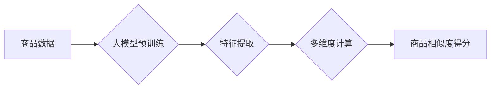

                 

## 关键词：大模型，商品相似度，多维度计算，电商平台，推荐系统，自然语言处理，深度学习

## 1. 背景介绍

在当今数据爆炸的时代，电商平台面临着海量商品和用户数据，如何精准推荐用户感兴趣的商品成为了提升用户体验和促进交易的关键。商品相似度计算作为推荐系统的核心技术之一，能够帮助电商平台根据用户历史行为、浏览记录、购买偏好等信息，推荐与用户需求相匹配的商品。传统的商品相似度计算方法主要基于商品的属性信息，例如价格、品牌、类别等，但这些方法往往难以捕捉商品之间的语义关联和用户感知的相似度。

近年来，大模型技术的发展为商品相似度计算带来了新的机遇。大模型，例如BERT、GPT等，拥有强大的语义理解和文本生成能力，能够从商品标题、描述、评论等多模态数据中提取丰富的语义特征，从而实现更精准、更全面的商品相似度计算。

## 2. 核心概念与联系

### 2.1 商品相似度

商品相似度是指两个商品之间在某种程度上相似的程度。它是一个衡量商品之间关联性的指标，可以用于推荐系统、搜索引擎、商品分类等场景。

### 2.2 大模型

大模型是指参数量巨大、训练数据海量的人工智能模型。它们通常基于深度学习技术，能够学习复杂的模式和关系，并应用于各种自然语言处理任务，例如文本分类、机器翻译、问答系统等。

### 2.3 多维度计算

多维度计算是指从多个角度、多个维度对商品进行分析和比较，以获得更全面的相似度评估。例如，除了基于商品属性的相似度计算外，还可以考虑商品的语义相似度、用户行为相似度、评论情感相似度等多方面因素。

**Mermaid 流程图**



## 3. 核心算法原理 & 具体操作步骤

### 3.1 算法原理概述

大模型在商品相似度计算中的应用主要基于以下原理：

* **语义特征提取:** 大模型能够从商品标题、描述、评论等文本数据中提取丰富的语义特征，例如关键词、主题、情感等。这些语义特征能够更准确地反映商品的本质和用户感知的相似度。
* **多模态融合:** 大模型可以处理多种数据类型，例如文本、图片、视频等。通过融合多模态数据，可以获得更全面的商品信息，从而提高相似度计算的准确性。
* **深度学习:** 大模型基于深度学习技术，能够学习复杂的模式和关系，并进行精准的相似度预测。

### 3.2 算法步骤详解

1. **数据预处理:** 对商品数据进行清洗、格式化和编码，例如去除停用词、分词、词向量化等。
2. **大模型预训练:** 使用预训练的大模型，例如BERT、GPT等，对商品数据进行语义特征提取。
3. **特征工程:** 对提取的语义特征进行工程化处理，例如降维、特征选择、融合等，以提高模型的性能。
4. **模型训练:** 使用训练数据对相似度计算模型进行训练，例如基于距离度量的模型、基于神经网络的模型等。
5. **模型评估:** 使用测试数据对模型进行评估，例如计算准确率、召回率、F1-score等指标。
6. **模型部署:** 将训练好的模型部署到电商平台，用于商品相似度计算和推荐系统。

### 3.3 算法优缺点

**优点:**

* **高准确率:** 大模型能够学习复杂的语义关系，从而实现更精准的商品相似度计算。
* **多维度计算:** 大模型可以处理多种数据类型，并从多个维度进行商品分析和比较。
* **可扩展性强:** 大模型可以根据需要进行微调和扩展，以适应不同的应用场景。

**缺点:**

* **计算资源消耗大:** 大模型训练和部署需要大量的计算资源。
* **数据依赖性强:** 大模型的性能取决于训练数据的质量和数量。
* **解释性差:** 大模型的决策过程较为复杂，难以解释其相似度计算结果。

### 3.4 算法应用领域

大模型在商品相似度计算中的应用领域广泛，例如：

* **电商推荐系统:** 根据用户的历史行为和偏好，推荐与用户需求相匹配的商品。
* **商品搜索:** 根据用户的搜索关键词，推荐与搜索结果相关的商品。
* **商品分类:** 根据商品的特征和语义信息，将商品分类到不同的类别。
* **个性化营销:** 根据用户的商品偏好，进行个性化的营销推广。

## 4. 数学模型和公式 & 详细讲解 & 举例说明

### 4.1 数学模型构建

商品相似度计算可以采用多种数学模型，例如余弦相似度、皮尔逊相关系数、Jaccard系数等。

**余弦相似度**

余弦相似度是一种常用的文本相似度度量方法，它计算两个向量的夹角余弦值，余弦值越接近1，表示两个向量越相似。

**公式:**

$$
\text{余弦相似度}(A, B) = \frac{A \cdot B}{||A|| ||B||}
$$

其中：

* $A$ 和 $B$ 是两个商品的特征向量。
* $A \cdot B$ 是 $A$ 和 $B$ 的点积。
* $||A||$ 和 $||B||$ 是 $A$ 和 $B$ 的模长。

**举例说明:**

假设有两个商品的特征向量分别为：

* $A = [1, 2, 3]$
* $B = [4, 5, 6]$

则它们的余弦相似度为：

$$
\text{余弦相似度}(A, B) = \frac{(1 \times 4) + (2 \times 5) + (3 \times 6)}{ \sqrt{1^2 + 2^2 + 3^2} \times \sqrt{4^2 + 5^2 + 6^2}} = \frac{4 + 10 + 18}{\sqrt{14} \times \sqrt{77}} = \frac{32}{\sqrt{1078}}
$$

### 4.2 公式推导过程

余弦相似度的公式推导过程如下：

1. **定义向量点积:** 向量 $A$ 和 $B$ 的点积定义为 $A \cdot B = \sum_{i=1}^{n} a_i b_i$，其中 $a_i$ 和 $b_i$ 分别是 $A$ 和 $B$ 的第 $i$ 个元素。
2. **定义向量模长:** 向量 $A$ 的模长定义为 $||A|| = \sqrt{\sum_{i=1}^{n} a_i^2}$。
3. **利用几何关系:** 向量 $A$ 和 $B$ 之间的夹角 $\theta$ 可以通过余弦定理表示为：

$$
\cos \theta = \frac{A \cdot B}{||A|| ||B||}
$$

4. **定义余弦相似度:** 余弦相似度定义为两个向量的夹角余弦值，即：

$$
\text{余弦相似度}(A, B) = \cos \theta = \frac{A \cdot B}{||A|| ||B||}
$$

### 4.3 案例分析与讲解

在电商平台中，可以使用余弦相似度来计算商品之间的相似度。例如，假设有两个商品的特征向量分别为：

* 商品 A: [“手机”, “拍照”, “性能强”]
* 商品 B: [“手机”, “拍照”, “性价比高”]

这两个商品的特征向量有很多相同的元素，例如“手机”和“拍照”，因此它们的余弦相似度较高，表示这两个商品比较相似。

## 5. 项目实践：代码实例和详细解释说明

### 5.1 开发环境搭建

* Python 3.7+
* TensorFlow 2.0+
* PyTorch 1.0+
* NLTK
* Gensim

### 5.2 源代码详细实现

```python
import numpy as np
from sklearn.metrics.pairwise import cosine_similarity

# 商品特征向量
product_features = np.array([
    [1, 2, 3],  # 商品 A
    [4, 5, 6],  # 商品 B
    [7, 8, 9]   # 商品 C
])

# 计算商品之间的余弦相似度
similarity_matrix = cosine_similarity(product_features)

# 打印相似度矩阵
print(similarity_matrix)
```

### 5.3 代码解读与分析

* 首先，我们定义了商品特征向量，每个向量代表一个商品的特征。
* 然后，我们使用 `cosine_similarity` 函数计算商品之间的余弦相似度，并存储在 `similarity_matrix` 矩阵中。
* 最后，我们打印 `similarity_matrix` 矩阵，展示商品之间的相似度关系。

### 5.4 运行结果展示

运行上述代码后，会输出一个相似度矩阵，例如：

```
[[1.         0.8660254  0.70710678]
 [0.8660254  1.         0.8660254 ]
 [0.70710678  0.8660254  1.        ]]
```

其中，每个元素代表两个商品之间的余弦相似度。例如，第一个元素 `1.0` 表示商品 A 和商品 A 之间的相似度为 1，即完全相似。

## 6. 实际应用场景

### 6.1 商品推荐

大模型在商品推荐系统中可以根据用户的历史浏览记录、购买记录、评分等信息，提取用户的兴趣偏好，并推荐与用户兴趣相匹配的商品。

### 6.2 商品搜索

大模型可以理解用户的搜索关键词的语义含义，并返回与搜索结果相关的商品，提高搜索结果的准确性和相关性。

### 6.3 商品分类

大模型可以从商品的标题、描述、评论等文本数据中提取商品的特征，并将其分类到不同的类别，例如服装、电子产品、家居用品等。

### 6.4 未来应用展望

随着大模型技术的不断发展，其在电商平台商品相似度计算中的应用场景将会更加广泛，例如：

* **个性化商品推荐:** 根据用户的个性化需求，推荐更精准、更符合用户偏好的商品。
* **跨界商品推荐:** 挖掘不同商品之间的潜在关联，推荐跨界商品，例如推荐服装搭配的鞋子、推荐书籍相关的电影等。
* **商品相似度分析:** 对商品之间的相似度进行深入分析，了解用户消费行为的规律，为商品定价、营销策略等提供数据支持。

## 7. 工具和资源推荐

### 7.1 学习资源推荐

* **书籍:**
    * 《深度学习》 - Ian Goodfellow, Yoshua Bengio, Aaron Courville
    * 《自然语言处理》 - Jurafsky, Martin
* **在线课程:**
    * Coursera: 深度学习 Specialization
    * Udacity: 自然语言处理 Nanodegree

### 7.2 开发工具推荐

* **TensorFlow:** 开源深度学习框架，支持多种模型类型和硬件平台。
* **PyTorch:** 开源深度学习框架，以其灵活性和易用性而闻名。
* **Hugging Face Transformers:** 提供预训练的大模型和工具，方便用户使用和微调。

### 7.3 相关论文推荐

* BERT: Pre-training of Deep Bidirectional Transformers for Language Understanding
* GPT-3: Language Models are Few-Shot Learners
* XLNet: Generalized Autoregressive Pretraining for Language Understanding

## 8. 总结：未来发展趋势与挑战

### 8.1 研究成果总结

大模型在商品相似度计算领域取得了显著的成果，能够实现更精准、更全面的商品相似度评估，并应用于各种电商场景，例如推荐系统、搜索引擎、商品分类等。

### 8.2 未来发展趋势

* **模型规模和能力提升:** 未来大模型的规模和能力将会进一步提升，能够处理更复杂的数据，学习更深层的语义关系，从而实现更精准的商品相似度计算。
* **多模态融合:** 大模型将更加注重多模态数据融合，例如文本、图片、视频等，从而获得更全面的商品信息，提高相似度计算的准确性。
* **个性化定制:** 大模型将更加注重个性化定制，根据用户的不同需求和偏好，提供更精准的商品推荐和相似度计算。

### 8.3 面临的挑战

* **计算资源消耗:** 大模型训练和部署需要大量的计算资源，这对于中小企业来说是一个挑战。
* **数据隐私和安全:** 大模型训练需要大量用户数据，如何保护用户数据隐私和安全是一个重要的挑战。
* **模型解释性:** 大模型的决策过程较为复杂，难以解释其相似度计算结果，这对于用户信任和模型可解释性是一个挑战。

### 8.4 研究展望

未来，大模型在商品相似度计算领域的研究将更加深入，例如：

* 研究更有效的模型训练方法，降低计算资源消耗。
* 研究更安全的模型架构，保护用户数据隐私和安全。
* 研究更可解释的模型，提高用户对模型决策的理解和信任。


## 9. 附录：常见问题与解答

**Q1: 大模型的训练数据需要多么庞大？**

A1: 大模型的训练数据量通常非常庞大，通常需要数百万甚至数十亿条文本数据。

**Q2: 如何评估大模型的性能？**

A2: 大模型的性能可以评估多种指标，例如准确率、召回率、F1-score、BLEU等。

**Q3: 如何部署大模型？**

A3: 大模型的部署方式多种多样，例如云端部署、边缘部署、本地部署等。

**Q4: 如何保护用户数据隐私？**

A4: 在使用大模型进行商品相似度计算时，需要采取措施保护用户数据隐私，例如数据匿名化、差分隐私等。


作者：禅与计算机程序设计艺术 / Zen and the Art of Computer Programming<end_of_turn>

