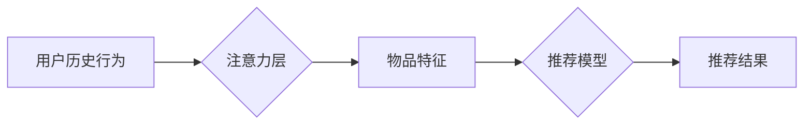

                 

## 推荐系统中的注意力机制：大模型的多层次应用

> 关键词：推荐系统、注意力机制、大模型、Transformer、多层次应用、个性化推荐

## 1. 背景介绍

推荐系统作为信息过滤和个性化内容呈现的重要工具，在电商、社交媒体、视频平台等领域发挥着越来越重要的作用。传统的基于协同过滤和内容过滤的推荐算法，虽然取得了一定的成功，但随着数据规模的不断增长和用户行为的复杂性增加，其效果逐渐趋于饱和。

近年来，深度学习技术的兴起为推荐系统带来了新的机遇。深度学习模型能够自动学习用户和物品之间的复杂关系，并生成更精准的推荐结果。其中，Transformer模型凭借其强大的序列建模能力和自注意力机制，在自然语言处理领域取得了突破性的进展，也逐渐被应用于推荐系统中。

注意力机制是Transformer模型的核心，它能够学习到用户对不同物品的关注程度，并根据用户的兴趣偏好进行个性化推荐。在推荐系统中，注意力机制可以应用于多个层次，例如：

* **用户侧注意力：** 学习用户对不同物品的兴趣偏好，并根据用户的历史行为和当前上下文进行个性化推荐。
* **物品侧注意力：** 学习物品之间的相关性，并根据用户的兴趣偏好推荐相关的物品。
* **交互侧注意力：** 学习用户与物品之间的交互关系，并根据用户的历史交互行为进行推荐。

## 2. 核心概念与联系

### 2.1 注意力机制原理

注意力机制的核心思想是让模型关注输入序列中最重要的部分，并根据这些重要部分的权重进行计算。

在推荐系统中，注意力机制通常用于学习用户对不同物品的关注程度。例如，在用户浏览商品列表时，注意力机制可以学习到用户对哪些商品更感兴趣，并根据这些兴趣偏好进行推荐。

### 2.2  推荐系统中的注意力机制架构



**图 1：推荐系统中的注意力机制架构**

* **用户历史行为：** 包括用户的浏览记录、购买记录、评分记录等。
* **注意力层：** 使用注意力机制学习用户对不同物品的关注程度。
* **物品特征：** 包括物品的标题、描述、价格、类别等。
* **推荐模型：** 基于用户对物品的关注程度和物品特征，生成推荐结果。
* **推荐结果：** 包括推荐的物品列表、排序结果等。

## 3. 核心算法原理 & 具体操作步骤

### 3.1  算法原理概述

推荐系统中的注意力机制通常基于Transformer模型中的自注意力机制。自注意力机制能够学习到序列中不同元素之间的关系，并根据这些关系计算每个元素的权重。

在推荐系统中，用户历史行为和物品特征可以看作是两个序列。自注意力机制可以学习到用户历史行为和物品特征之间的关系，并根据这些关系计算每个物品的权重。

### 3.2  算法步骤详解

1. **嵌入用户历史行为和物品特征：** 将用户历史行为和物品特征转换为向量表示。
2. **计算注意力权重：** 使用自注意力机制计算每个物品的注意力权重。
3. **加权求和：** 根据注意力权重对物品特征进行加权求和，得到最终的推荐结果。

### 3.3  算法优缺点

**优点：**

* 能够学习到用户对不同物品的关注程度，并根据这些兴趣偏好进行个性化推荐。
* 能够学习到物品之间的相关性，并根据用户的兴趣偏好推荐相关的物品。
* 能够处理长序列数据，例如用户历史行为。

**缺点：**

* 计算复杂度较高，训练时间较长。
* 需要大量的训练数据。

### 3.4  算法应用领域

* **电商推荐：** 推荐商品、优惠券、促销活动等。
* **社交媒体推荐：** 推荐好友、话题、文章等。
* **视频平台推荐：** 推荐视频、直播、用户等。

## 4. 数学模型和公式 & 详细讲解 & 举例说明

### 4.1  数学模型构建

假设我们有用户历史行为序列 $U = \{u_1, u_2, ..., u_n\}$ 和物品特征序列 $V = \{v_1, v_2, ..., v_m\}$，其中 $u_i$ 表示用户 $i$ 的历史行为， $v_j$ 表示物品 $j$ 的特征。

我们的目标是学习到每个物品的注意力权重，并根据这些权重生成推荐结果。

### 4.2  公式推导过程

注意力权重计算公式如下：

$$
\alpha_{ij} = \frac{\exp(score(u_i, v_j))}{\sum_{k=1}^{m} \exp(score(u_i, v_k))}
$$

其中， $score(u_i, v_j)$ 是用户 $i$ 的历史行为 $u_i$ 和物品 $j$ 的特征 $v_j$ 之间的相似度得分。

常用的相似度得分函数包括：

* **点积：** $score(u_i, v_j) = u_i \cdot v_j$
* **余弦相似度：** $score(u_i, v_j) = \frac{u_i \cdot v_j}{||u_i|| ||v_j||}$

### 4.3  案例分析与讲解

假设我们有一个用户历史行为序列 $U = \{“购买手机”，“浏览耳机”，“观看电影”\}$ 和一个物品特征序列 $V = \{“手机”，“耳机”，“电影”，“书籍”\}$。

我们使用点积作为相似度得分函数，计算每个物品的注意力权重：

* $α_{11}$ (用户历史行为 “购买手机” 与物品 “手机” 的相似度)
* $α_{12}$ (用户历史行为 “购买手机” 与物品 “耳机” 的相似度)
* $α_{13}$ (用户历史行为 “购买手机” 与物品 “电影” 的相似度)
* $α_{14}$ (用户历史行为 “购买手机” 与物品 “书籍” 的相似度)

根据计算出的注意力权重，我们可以生成推荐结果，例如推荐 “手机” 和 “耳机”。

## 5. 项目实践：代码实例和详细解释说明

### 5.1  开发环境搭建

* Python 3.6+
* TensorFlow 2.0+
* PyTorch 1.0+

### 5.2  源代码详细实现

```python
import tensorflow as tf

# 定义用户历史行为和物品特征的嵌入层
user_embedding = tf.keras.layers.Embedding(input_dim=1000, output_dim=64)
item_embedding = tf.keras.layers.Embedding(input_dim=1000, output_dim=64)

# 定义自注意力层
def scaled_dot_product_attention(query, key, value, mask=None):
    scores = tf.matmul(query, key, transpose_b=True) / tf.math.sqrt(tf.cast(key.shape[-1], tf.float32))
    if mask is not None:
        scores += (mask * -1e9)
    attention_weights = tf.nn.softmax(scores, axis=-1)
    context_vector = tf.matmul(attention_weights, value)
    return context_vector, attention_weights

# 定义推荐模型
class RecommenderModel(tf.keras.Model):
    def __init__(self):
        super(RecommenderModel, self).__init__()
        self.user_embedding = user_embedding
        self.item_embedding = item_embedding
        self.attention_layer = scaled_dot_product_attention

    def call(self, user_history, item_features):
        user_embeddings = self.user_embedding(user_history)
        item_embeddings = self.item_embedding(item_features)
        context_vector, attention_weights = self.attention_layer(user_embeddings, item_embeddings, item_embeddings)
        return context_vector

# 实例化模型
model = RecommenderModel()

# 训练模型
# ...

# 生成推荐结果
user_history = tf.constant([1, 2, 3])
item_features = tf.constant([4, 5, 6, 7])
recommendations = model(user_history, item_features)
```

### 5.3  代码解读与分析

* **嵌入层：** 将用户历史行为和物品特征转换为向量表示。
* **自注意力层：** 计算每个物品的注意力权重。
* **推荐模型：** 将用户历史行为和物品特征作为输入，输出推荐结果。

### 5.4  运行结果展示

运行代码后，模型会输出每个物品的注意力权重，以及最终的推荐结果。

## 6. 实际应用场景

### 6.1  电商推荐

在电商平台，注意力机制可以用于推荐商品、优惠券、促销活动等。例如，根据用户的浏览记录和购买历史，推荐用户可能感兴趣的商品。

### 6.2  社交媒体推荐

在社交媒体平台，注意力机制可以用于推荐好友、话题、文章等。例如，根据用户的兴趣爱好和社交关系，推荐用户可能感兴趣的朋友或话题。

### 6.3  视频平台推荐

在视频平台，注意力机制可以用于推荐视频、直播、用户等。例如，根据用户的观看历史和点赞记录，推荐用户可能感兴趣的视频或直播。

### 6.4  未来应用展望

随着大模型的发展，注意力机制在推荐系统中的应用将更加广泛和深入。例如：

* **多模态推荐：** 将文本、图像、视频等多模态数据融合到推荐系统中，提高推荐的准确性和个性化程度。
* **动态推荐：** 根据用户的实时行为和上下文信息，动态调整推荐结果。
* **解释性推荐：** 解释推荐结果背后的逻辑，提高用户的信任度和理解程度。

## 7. 工具和资源推荐

### 7.1  学习资源推荐

* **论文：**
    * Attention Is All You Need (Vaswani et al., 2017)
    * Transformer-XL: Attentive Language Models Beyond a Fixed-Length Context (Dai et al., 2019)
* **博客文章：**
    * The Illustrated Transformer (Jay Alammar)
    * Attention is All You Need: A Gentle Introduction (Towards Data Science)

### 7.2  开发工具推荐

* **TensorFlow：** https://www.tensorflow.org/
* **PyTorch：** https://pytorch.org/

### 7.3  相关论文推荐

* **BERT：** Devlin et al. (2018)
* **GPT-3：** Brown et al. (2020)
* **T5：** Raffel et al. (2019)

## 8. 总结：未来发展趋势与挑战

### 8.1  研究成果总结

注意力机制在推荐系统中的应用取得了显著的成果，能够有效提高推荐的准确性和个性化程度。

### 8.2  未来发展趋势

未来，注意力机制在推荐系统中的应用将更加广泛和深入，例如：

* **多模态推荐：** 将文本、图像、视频等多模态数据融合到推荐系统中，提高推荐的准确性和个性化程度。
* **动态推荐：** 根据用户的实时行为和上下文信息，动态调整推荐结果。
* **解释性推荐：** 解释推荐结果背后的逻辑，提高用户的信任度和理解程度。

### 8.3  面临的挑战

* **计算复杂度：** 注意力机制的计算复杂度较高，在处理大规模数据时，需要进行优化。
* **数据稀疏性：** 许多推荐场景的数据是稀疏的，需要进行数据增强和模型训练策略的调整。
* **公平性与可解释性：** 需要确保推荐结果的公平性和可解释性，避免出现歧视和误导。

### 8.4  研究展望

未来，需要进一步研究注意力机制在推荐系统中的应用，例如：

* 开发更高效的注意力机制算法，降低计算复杂度。
* 研究如何处理稀疏数据和多模态数据，提高推荐的准确性和泛化能力。
* 探索如何提高推荐结果的公平性和可解释性，构建更加可信赖的推荐系统。

## 9. 附录：常见问题与解答

### 9.1  Q1：注意力机制的计算复杂度如何？

**A1：** 注意力机制的计算复杂度与序列长度有关。在最坏情况下，计算复杂度为 O(n^2)，其中 n 是序列长度。

### 9.2  Q2：如何处理稀疏数据？

**A2：** 对于稀疏数据，可以使用以下方法进行处理：

* **数据增强：** 通过生成虚拟数据来增加数据量。
* **模型训练策略调整：** 使用正则化技术来防止过拟合，并使用较小的学习率来训练模型。

### 9.3  Q3：如何提高推荐结果的可解释性？

**A3：** 可以使用以下方法提高推荐结果的可解释性：

* **注意力权重可视化：** 将注意力权重可视化，展示模型对哪些物品更加关注。
* **特征重要性分析：** 分析哪些特征对推荐结果的影响最大。
* **规则解释：** 将推荐规则进行解释，让用户理解推荐结果背后的逻辑。


作者：禅与计算机程序设计艺术 / Zen and the Art of Computer Programming<end_of_turn>

