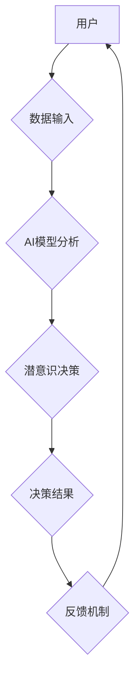

                 

## 数字直觉训练法：AI辅助的潜意识决策强化

> 关键词：人工智能、潜意识决策、直觉训练、深度学习、神经网络、决策强化、数据分析、认知科学

## 1. 背景介绍

在当今数据爆炸的时代，人类面临着前所未有的信息量和决策复杂度。传统的理性决策模型，依赖于逻辑推理和分析，在面对海量数据和瞬息万变的复杂环境时，显得捉襟见肘。越来越多的研究表明，潜意识决策在许多情况下比理性决策更快速、更有效。潜意识决策不受逻辑思维的束缚，能够从海量数据中提取出隐藏的模式和关联，并做出更符合直觉的判断。

然而，潜意识决策往往难以被意识感知和解释，其背后的机制也尚不明确。如何有效地训练和增强潜意识决策能力，成为人工智能和认知科学领域的重要课题。

## 2. 核心概念与联系

**2.1 潜意识决策**

潜意识决策是指在个体意识感知不到的情况下，由潜意识进行的决策过程。它不受逻辑推理和理性分析的控制，而是基于个体过去的经验、情感、直觉等因素进行判断。

**2.2 数字直觉**

数字直觉是指在处理数字信息时，基于潜意识的快速、直观的判断能力。它类似于人类在处理非数字信息时的直觉，能够从数据中提取出隐藏的模式和关联，并做出快速、准确的判断。

**2.3 AI辅助**

人工智能技术可以帮助我们更好地理解和训练潜意识决策。通过深度学习算法，我们可以从海量数据中学习到潜意识决策的模式和规律，并将其应用于实际决策场景中。

**2.4 决策强化**

决策强化是指通过反馈机制，不断调整和优化决策策略的过程。在数字直觉训练中，我们可以利用AI算法对用户的决策进行评估，并提供相应的反馈，从而帮助用户不断提升数字直觉的准确性和效率。

**2.5 架构图**



## 3. 核心算法原理 & 具体操作步骤

**3.1 算法原理概述**

数字直觉训练法主要基于深度学习算法，特别是卷积神经网络（CNN）和循环神经网络（RNN）。

* **CNN**擅长提取图像、文本等数据中的特征，可以用于识别数字模式和关联。
* **RNN**擅长处理序列数据，可以用于学习用户的决策历史和行为模式，并预测未来的决策倾向。

通过训练这些深度学习模型，我们可以建立一个能够模拟和增强潜意识决策的AI系统。

**3.2 算法步骤详解**

1. **数据收集和预处理:** 收集大量用户在数字决策场景下的行为数据，包括决策结果、决策时间、相关上下文信息等。对数据进行清洗、格式化和特征提取。
2. **模型构建:** 根据具体应用场景，选择合适的深度学习模型架构，例如CNN、RNN或其组合。
3. **模型训练:** 使用收集到的数据训练深度学习模型，通过调整模型参数，使其能够准确地预测用户的潜意识决策结果。
4. **模型评估:** 使用独立的数据集评估模型的性能，例如准确率、召回率、F1-score等。
5. **模型部署:** 将训练好的模型部署到实际应用场景中，例如决策辅助系统、智能推荐系统等。
6. **反馈机制:** 收集用户在使用系统时的反馈信息，并将其反馈到模型训练过程中，不断优化模型的性能。

**3.3 算法优缺点**

**优点:**

* **高效准确:** 深度学习算法能够从海量数据中提取出隐藏的模式和关联，并做出快速、准确的预测。
* **可扩展性强:** 深度学习模型可以轻松地扩展到处理更大的数据量和更复杂的决策场景。
* **持续学习:** 通过反馈机制，深度学习模型可以不断学习和优化，提高决策准确性。

**缺点:**

* **数据依赖:** 深度学习算法需要大量的数据进行训练，否则模型性能会下降。
* **黑盒效应:** 深度学习模型的决策过程往往难以被解释，这可能会导致用户对模型的信任度降低。
* **计算资源需求:** 训练深度学习模型需要大量的计算资源，这可能会增加成本和时间投入。

**3.4 算法应用领域**

数字直觉训练法在以下领域具有广泛的应用前景：

* **金融投资:** 帮助投资者识别市场趋势和做出更准确的投资决策。
* **医疗诊断:** 辅助医生诊断疾病，提高诊断准确率。
* **风险管理:** 识别潜在的风险，并制定相应的应对措施。
* **营销推广:** 预测用户的消费行为，优化营销策略。
* **教育培训:** 帮助学生提高学习效率，个性化学习方案。

## 4. 数学模型和公式 & 详细讲解 & 举例说明

**4.1 数学模型构建**

数字直觉训练法的核心数学模型是基于深度学习算法，例如卷积神经网络（CNN）和循环神经网络（RNN）。

* **CNN模型:**

CNN模型利用卷积核提取图像、文本等数据中的特征，并通过池化层降低数据维度。其数学模型可以表示为：

$$
y = f(W * x + b)
$$

其中：

* $y$ 是输出特征图
* $x$ 是输入数据
* $W$ 是卷积核权重
* $b$ 是偏置项
* $f$ 是激活函数

* **RNN模型:**

RNN模型利用循环结构处理序列数据，其数学模型可以表示为：

$$
h_t = f(W_{xh} * x_t + W_{hh} * h_{t-1} + b_h)
$$

$$
y_t = g(W_{hy} * h_t + b_y)
$$

其中：

* $h_t$ 是时间步t的隐藏状态
* $x_t$ 是时间步t的输入数据
* $W_{xh}$, $W_{hh}$, $W_{hy}$ 是权重矩阵
* $b_h$, $b_y$ 是偏置项
* $f$, $g$ 是激活函数

**4.2 公式推导过程**

深度学习模型的训练过程本质上是通过优化模型参数，使得模型的预测结果与真实结果之间的误差最小化。常用的优化算法包括梯度下降法、Adam优化器等。

**4.3 案例分析与讲解**

例如，在金融投资领域，我们可以使用CNN模型分析股票价格的历史数据，识别潜在的投资趋势。使用RNN模型分析用户的投资行为历史，预测用户的未来投资决策。

## 5. 项目实践：代码实例和详细解释说明

**5.1 开发环境搭建**

* 操作系统：Linux/macOS/Windows
* Python版本：3.6+
* 深度学习框架：TensorFlow/PyTorch
* 其他依赖库：NumPy、Pandas、Matplotlib等

**5.2 源代码详细实现**

```python
# 使用TensorFlow构建CNN模型
import tensorflow as tf

model = tf.keras.models.Sequential([
    tf.keras.layers.Conv2D(32, (3, 3), activation='relu', input_shape=(28, 28, 1)),
    tf.keras.layers.MaxPooling2D((2, 2)),
    tf.keras.layers.Conv2D(64, (3, 3), activation='relu'),
    tf.keras.layers.MaxPooling2D((2, 2)),
    tf.keras.layers.Flatten(),
    tf.keras.layers.Dense(10, activation='softmax')
])

# 编译模型
model.compile(optimizer='adam',
              loss='sparse_categorical_crossentropy',
              metrics=['accuracy'])

# 训练模型
model.fit(x_train, y_train, epochs=10)

# 使用模型预测
predictions = model.predict(x_test)
```

**5.3 代码解读与分析**

这段代码使用TensorFlow构建了一个简单的CNN模型，用于分类手写数字。

* `tf.keras.models.Sequential` 创建了一个顺序模型，即层级结构。
* `tf.keras.layers.Conv2D` 添加卷积层，用于提取图像特征。
* `tf.keras.layers.MaxPooling2D` 添加池化层，用于降低数据维度。
* `tf.keras.layers.Flatten` 将多维数据转换为一维数据。
* `tf.keras.layers.Dense` 添加全连接层，用于分类。
* `model.compile` 编译模型，指定优化器、损失函数和评价指标。
* `model.fit` 训练模型，使用训练数据进行训练。
* `model.predict` 使用训练好的模型进行预测。

**5.4 运行结果展示**

训练完成后，我们可以使用测试数据评估模型的性能，例如准确率、召回率等。

## 6. 实际应用场景

**6.1 金融投资**

数字直觉训练法可以帮助投资者识别市场趋势和做出更准确的投资决策。例如，可以训练一个模型，分析股票价格的历史数据，识别潜在的投资机会。

**6.2 医疗诊断**

数字直觉训练法可以辅助医生诊断疾病，提高诊断准确率。例如，可以训练一个模型，分析患者的医学影像数据，识别潜在的病灶。

**6.3 风险管理**

数字直觉训练法可以识别潜在的风险，并制定相应的应对措施。例如，可以训练一个模型，分析用户的信用记录和行为数据，识别潜在的欺诈风险。

**6.4 未来应用展望**

随着人工智能技术的不断发展，数字直觉训练法的应用场景将会更加广泛。例如，可以应用于个性化教育、智能客服、自动驾驶等领域。

## 7. 工具和资源推荐

**7.1 学习资源推荐**

* **书籍:**
    * 《深度学习》 by Ian Goodfellow, Yoshua Bengio, Aaron Courville
    * 《动手学深度学习》 by Aurélien Géron
* **在线课程:**
    * Coursera: Deep Learning Specialization
    * Udacity: Deep Learning Nanodegree
* **开源项目:**
    * TensorFlow: https://www.tensorflow.org/
    * PyTorch: https://pytorch.org/

**7.2 开发工具推荐**

* **编程语言:** Python
* **深度学习框架:** TensorFlow, PyTorch
* **数据处理库:** NumPy, Pandas
* **可视化库:** Matplotlib, Seaborn

**7.3 相关论文推荐**

* **《ImageNet Classification with Deep Convolutional Neural Networks》** by Alex Krizhevsky, Ilya Sutskever, Geoffrey E. Hinton
* **《Attention Is All You Need》** by Ashish Vaswani, Noam Shazeer, Niki Parmar, Jakob Uszkoreit, Llion Jones, Aidan N. Gomez, Łukasz Kaiser, Illia Polosukhin

## 8. 总结：未来发展趋势与挑战

**8.1 研究成果总结**

数字直觉训练法在人工智能和认知科学领域取得了显著的进展。深度学习算法能够有效地模拟和增强潜意识决策能力，并应用于多个领域。

**8.2 未来发展趋势**

* **模型复杂度提升:** 未来将开发更复杂、更强大的深度学习模型，能够处理更复杂的数据和更复杂的决策场景。
* **解释性增强:** 研究如何提高深度学习模型的解释性，使得用户的决策更加透明和可信。
* **跨模态融合:** 将不同模态的数据融合在一起，例如文本、图像、音频等，构建更全面的数字直觉模型。
* **个性化定制:** 根据用户的个人特征和需求，定制个性化的数字直觉训练方案。

**8.3 面临的挑战**

* **数据获取和隐私保护:** 深度学习模型需要大量的数据进行训练，如何获取高质量的数据，并保护用户隐私是一个重要的挑战。
* **算法可解释性:** 深度学习模型的决策过程往往难以被解释，如何提高模型的解释性，增强用户的信任度是一个重要的研究方向。
* **伦理问题:** 数字直觉训练法可能会对用户的决策自由造成影响，如何确保其伦理合规使用是一个需要认真考虑的问题。

**8.4 研究展望**

数字直觉训练法是一个充满挑战和机遇的领域，未来将会有更多的研究和应用涌现。相信随着技术的不断发展，数字直觉训练法将为人类决策提供更强大的工具，帮助我们更好地应对复杂的世界。

## 9. 附录：常见问题与解答

**9.1 如何评估数字直觉训练法的效果？**

可以使用多种指标来评估数字直觉训练法的效果，例如准确率、召回率、F1-score、AUC等。

**9.2 数字直觉训练法是否会取代人类的决策能力？**

数字直觉训练法可以辅助人类决策，但不会取代人类的决策能力。人类的决策能力仍然是不可替代的，因为它包含了丰富的经验、情感和伦理判断。

**9.3 数字直觉训练法的应用场景有哪些？**

数字直觉训练法可以应用于金融投资、医疗诊断、风险管理、个性化教育、智能客服、自动驾驶等多个领域。


作者：禅与计算机程序设计艺术 / Zen and the Art of Computer Programming 
<end_of_turn>

