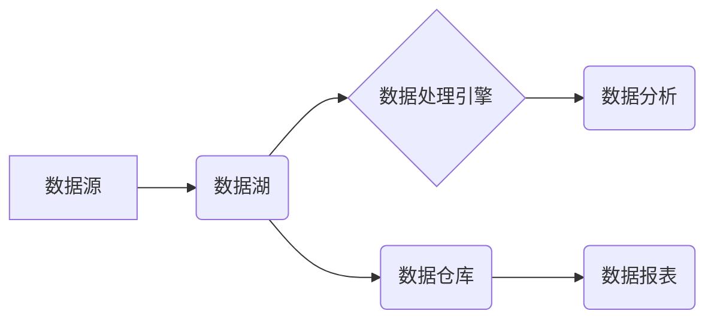

                 

## 数据湖架构：大规模数据存储和分析

> 关键词：数据湖、数据仓库、数据存储、数据分析、大数据、Hadoop、Spark、数据治理

## 1. 背景介绍

随着互联网、物联网、移动互联网等技术的快速发展，海量数据正在以指数级增长。企业和组织需要高效地存储、管理和分析这些数据，以挖掘数据价值、洞察市场趋势、优化业务运营。传统的数据库架构难以满足大规模数据存储和分析的需求，因此数据湖架构应运而生。

数据湖是一种新型的数据存储架构，它以其灵活、可扩展、成本效益高等特点，成为大数据时代的数据存储和分析的首选方案。数据湖的核心思想是将各种类型的数据，包括结构化数据、半结构化数据和非结构化数据，以原始格式存储在分布式文件系统中，并通过数据处理引擎进行分析和挖掘。

## 2. 核心概念与联系

### 2.1 数据湖的概念

数据湖是一种用于存储海量数据的分布式存储系统，它以其灵活性和可扩展性而闻名。数据湖不事先定义数据结构，而是将数据以原始格式存储，并通过数据处理引擎进行分析和挖掘。

### 2.2 数据仓库的概念

数据仓库是一种集成的、面向分析的数据库系统，它用于存储历史数据，并提供数据分析和报表功能。数据仓库通常采用星型或雪花型模型，数据结构预先定义，并经过清洗、转换和加载（ETL）过程。

### 2.3 数据湖与数据仓库的关系

数据湖和数据仓库都是用于数据存储和分析的系统，但它们在架构、数据类型、数据处理方式等方面存在差异。

* **数据类型:** 数据湖支持多种数据类型，包括结构化数据、半结构化数据和非结构化数据，而数据仓库主要存储结构化数据。
* **数据结构:** 数据湖不事先定义数据结构，数据以原始格式存储，而数据仓库采用预定义的数据结构，例如星型或雪花型模型。
* **数据处理方式:** 数据湖通过数据处理引擎进行数据分析和挖掘，而数据仓库通常采用SQL查询进行数据分析。

数据湖和数据仓库可以相互补充，形成一个完整的企业数据管理体系。数据湖可以作为数据仓库的数据源，提供海量数据支持；数据仓库可以对数据湖中的数据进行清洗、转换和加载，并提供数据分析和报表功能。



## 3. 核心算法原理 & 具体操作步骤

### 3.1 算法原理概述

数据湖架构的核心算法原理是分布式存储和并行处理。数据湖将数据存储在分布式文件系统中，例如HDFS，并使用分布式数据处理引擎，例如Spark，进行数据分析和挖掘。

分布式存储可以提高数据存储容量和可用性，并降低存储成本。并行处理可以大幅提高数据处理速度，满足大规模数据分析的需求。

### 3.2 算法步骤详解

1. **数据采集:** 从各种数据源收集数据，包括数据库、日志文件、传感器数据等。
2. **数据存储:** 将数据存储在分布式文件系统中，例如HDFS。
3. **数据处理:** 使用分布式数据处理引擎，例如Spark，对数据进行清洗、转换、聚合等操作。
4. **数据分析:** 使用数据分析工具，例如Hive、Pig，对数据进行分析和挖掘，获取数据 insights。
5. **数据可视化:** 将数据分析结果可视化，例如使用Tableau、Power BI，帮助用户理解数据。

### 3.3 算法优缺点

**优点:**

* **灵活:** 支持多种数据类型，包括结构化数据、半结构化数据和非结构化数据。
* **可扩展:** 可以根据数据量和处理需求进行扩展。
* **成本效益高:** 使用开源技术，降低存储和处理成本。
* **实时分析:** 支持实时数据处理和分析。

**缺点:**

* **数据治理:** 需要建立完善的数据治理机制，确保数据质量和安全。
* **数据管理:** 需要专业的技术人员进行数据管理和维护。
* **查询性能:** 对复杂查询可能存在性能瓶颈。

### 3.4 算法应用领域

数据湖架构广泛应用于以下领域:

* **金融:** 风险管理、欺诈检测、客户分析
* **电商:** 商品推荐、用户画像、营销分析
* **医疗:** 疾病诊断、药物研发、患者管理
* **制造业:** 设备监控、生产优化、质量控制
* **互联网:** 内容推荐、用户行为分析、广告投放

## 4. 数学模型和公式 & 详细讲解 & 举例说明

### 4.1 数学模型构建

数据湖架构的数学模型可以抽象为一个分布式数据存储和处理系统，其中包括数据节点、计算节点和数据流。

* **数据节点:** 负责存储数据，可以是HDFS节点、S3节点等。
* **计算节点:** 负责处理数据，可以是Spark节点、Hadoop节点等。
* **数据流:** 指数据在数据节点和计算节点之间传输的过程。

数据湖架构的数学模型可以描述数据存储、数据处理和数据分析的流程，并可以用于分析系统性能、优化系统配置等。

### 4.2 公式推导过程

数据湖架构的性能可以根据以下公式进行评估:

* **吞吐量:** 指单位时间内处理的数据量，单位为GB/s。
* **延迟:** 指数据处理完成所需的时间，单位为毫秒。
* **资源利用率:** 指系统资源的利用率，例如CPU利用率、内存利用率等。

这些指标可以根据系统配置、数据规模、算法复杂度等因素进行计算。

### 4.3 案例分析与讲解

假设一个电商公司需要分析用户购买行为，数据湖架构可以帮助他们实现以下功能:

* **数据存储:** 将用户购买记录、商品信息、用户画像等数据存储在HDFS中。
* **数据处理:** 使用Spark进行数据清洗、转换和聚合，例如计算每个用户的购买频率、平均购买金额等。
* **数据分析:** 使用Hive进行数据分析，例如分析用户购买偏好、商品热销情况等。
* **数据可视化:** 使用Tableau将数据分析结果可视化，帮助用户了解用户购买行为趋势。

通过数据湖架构，电商公司可以高效地分析用户购买行为，优化商品推荐、营销策略等，提高商业效益。

## 5. 项目实践：代码实例和详细解释说明

### 5.1 开发环境搭建

数据湖架构的开发环境通常包括以下组件:

* **分布式文件系统:** HDFS、S3等
* **数据处理引擎:** Spark、Hadoop等
* **数据分析工具:** Hive、Pig等
* **数据可视化工具:** Tableau、Power BI等

具体环境搭建步骤可以参考相关文档和教程。

### 5.2 源代码详细实现

以下是一个使用Spark进行数据处理的简单代码示例:

```python
from pyspark.sql import SparkSession

# 创建SparkSession
spark = SparkSession.builder.appName("DataLakeExample").getOrCreate()

# 读取数据
df = spark.read.csv("data.csv", header=True, inferSchema=True)

# 计算平均购买金额
average_purchase_amount = df.agg({"purchase_amount": "avg"}).collect()[0][0]

# 打印结果
print(f"平均购买金额: {average_purchase_amount}")

# 关闭SparkSession
spark.stop()
```

### 5.3 代码解读与分析

* **创建SparkSession:** 创建SparkSession对象，用于连接Spark集群。
* **读取数据:** 使用`spark.read.csv()`方法读取CSV文件，并进行数据类型推断。
* **计算平均购买金额:** 使用`df.agg()`方法对`purchase_amount`列进行平均计算，并使用`collect()`方法获取结果。
* **打印结果:** 打印平均购买金额。
* **关闭SparkSession:** 关闭SparkSession对象，释放资源。

### 5.4 运行结果展示

运行上述代码后，将输出平均购买金额的值。

## 6. 实际应用场景

数据湖架构在各个行业都有广泛的应用场景，例如:

### 6.1 金融行业

* **风险管理:** 使用数据湖存储和分析客户交易数据、市场数据等，识别潜在风险，降低风险损失。
* **欺诈检测:** 使用数据湖分析用户行为数据、交易数据等，识别欺诈行为，保护用户资产安全。
* **客户分析:** 使用数据湖分析客户画像数据、购买行为数据等，了解客户需求，提供个性化服务。

### 6.2 电商行业

* **商品推荐:** 使用数据湖分析用户购买历史、浏览记录等数据，推荐个性化商品，提高转化率。
* **用户画像:** 使用数据湖分析用户行为数据、购买数据等，构建用户画像，精准营销。
* **营销分析:** 使用数据湖分析营销活动数据、用户反馈数据等，评估营销效果，优化营销策略。

### 6.3 医疗行业

* **疾病诊断:** 使用数据湖分析患者病历数据、基因数据等，辅助医生进行疾病诊断。
* **药物研发:** 使用数据湖分析临床试验数据、患者数据等，加速药物研发进程。
* **患者管理:** 使用数据湖分析患者健康数据、医疗记录等，提供个性化医疗服务。

### 6.4 未来应用展望

随着人工智能、机器学习等技术的不断发展，数据湖架构将在未来发挥更重要的作用。例如:

* **实时数据分析:** 使用流式处理技术，实现对实时数据的分析和处理，例如监控设备状态、预测用户行为等。
* **人工智能应用:** 使用机器学习算法，对数据湖中的数据进行分析和挖掘，例如自动识别图像、预测文本内容等。
* **数据治理:** 使用数据治理工具，加强对数据湖中的数据的管理和控制，确保数据质量和安全。

## 7. 工具和资源推荐

### 7.1 学习资源推荐

* **Hadoop官方文档:** https://hadoop.apache.org/docs/
* **Spark官方文档:** https://spark.apache.org/docs/latest/
* **数据湖架构书籍:** 《数据湖架构：大规模数据存储和分析》

### 7.2 开发工具推荐

* **HDFS:** Apache Hadoop Distributed File System
* **Spark:** Apache Spark
* **Hive:** Apache Hive
* **Pig:** Apache Pig
* **Tableau:** Tableau Software
* **Power BI:** Microsoft Power BI

### 7.3 相关论文推荐

* **The Data Lake Architecture:** https://www.oreilly.com/library/view/the-data-lake/9781491961517/
* **Spark: The Definitive Guide:** https://www.oreilly.com/library/view/spark-the-definitive/9781491956332/

## 8. 总结：未来发展趋势与挑战

### 8.1 研究成果总结

数据湖架构已经成为大数据时代的数据存储和分析的首选方案，它具有灵活、可扩展、成本效益高等特点，并广泛应用于各个行业。

### 8.2 未来发展趋势

* **实时数据分析:** 使用流式处理技术，实现对实时数据的分析和处理。
* **人工智能应用:** 使用机器学习算法，对数据湖中的数据进行分析和挖掘。
* **数据治理:** 使用数据治理工具，加强对数据湖中的数据的管理和控制。

### 8.3 面临的挑战

* **数据质量:** 数据湖需要处理海量数据，数据质量问题需要得到有效解决。
* **数据安全:** 数据湖中的数据需要得到有效保护，防止数据泄露和滥用。
* **数据治理:** 数据湖需要建立完善的数据治理机制，确保数据质量、安全和一致性。

### 8.4 研究展望

未来，数据湖架构将继续发展和完善，并与人工智能、机器学习等新技术深度融合，为企业和组织提供更强大的数据分析和决策支持能力。

## 9. 附录：常见问题与解答

### 9.1 数据湖与数据仓库的区别是什么？

数据湖和数据仓库都是用于数据存储和分析的系统，但它们在架构、数据类型、数据处理方式等方面存在差异。数据湖支持多种数据类型，包括结构化数据、半结构化数据和非结构化数据，而数据仓库主要存储结构化数据。数据湖不事先定义数据结构，数据以原始格式存储，而数据仓库采用预定义的数据结构，例如星型或雪花型模型。

### 9.2 数据湖的优势是什么？

数据湖的优势包括:

* **灵活:** 支持多种数据类型。
* **可扩展:** 可以根据数据量和处理需求进行扩展。
* **成本效益高:** 使用开源技术，降低存储和处理成本。
* **实时分析:** 支持实时数据处理和分析。

### 9.3 数据湖的缺点是什么？

数据湖的缺点包括:

* **数据治理:** 需要建立完善的数据治理机制，确保数据质量和安全。
* **数据管理:** 需要专业的技术人员进行数据管理和维护。
* **查询性能:** 对复杂查询可能存在性能瓶颈。

### 9.4 如何搭建数据湖环境？

搭建数据湖环境需要选择合适的分布式文件系统、数据处理引擎、数据分析工具等组件。具体步骤可以参考相关文档和教程。

### 9.5 数据湖的应用场景有哪些？

数据湖广泛应用于各个行业，例如金融、电商、医疗等，用于风险管理、欺诈检测、客户分析、商品推荐、用户画像、营销分析、疾病诊断、药物研发、患者管理等。


作者：禅与计算机程序设计艺术 / Zen and the Art of Computer Programming 
<end_of_turn>

