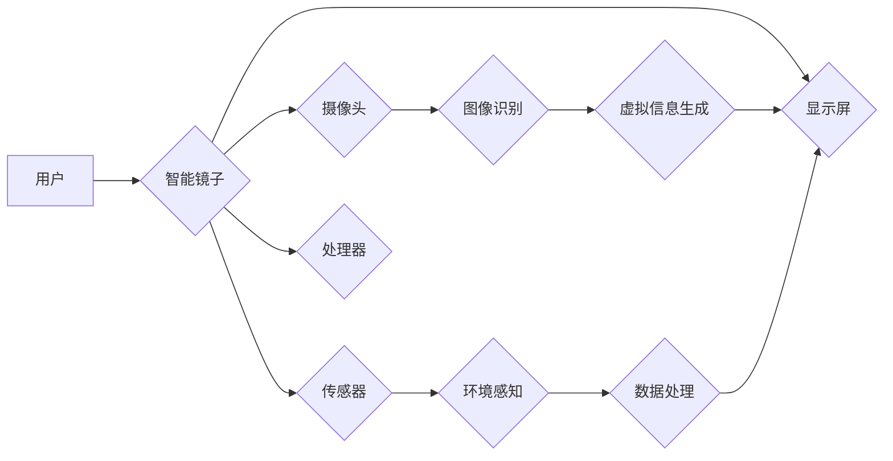

                 

## 智能镜子创业：增强现实的生活应用

> 关键词：增强现实 (AR)、智能镜子、用户体验 (UX)、计算机视觉、深度学习、物联网 (IoT)、创业

## 1. 背景介绍

智能镜子正在从一个简单的反射表面演变为一个充满互动性和实用性的智能设备。增强现实 (AR) 技术的快速发展为智能镜子的功能注入了一股强劲动力，使其不再仅仅是化妆或查看时间的功能，而是成为连接现实世界和数字世界的桥梁。

近年来，AR 技术在消费电子产品、游戏、教育和医疗等领域取得了显著进展。智能镜子的AR应用，将为用户带来全新的体验，例如：

* **虚拟试衣间:** 用户可以通过AR技术在智能镜前试穿不同的衣服，无需实际穿戴，便可直观地看到效果，提升购物体验。
* **个性化美容指导:** 智能镜子可以识别用户的肤质、肤色等信息，并提供个性化的护肤建议和化妆指导，帮助用户打造完美妆容。
* **实时健康监测:** 智能镜子可以结合传感器和AI算法，实时监测用户的体温、心率、血氧等健康指标，并提供健康建议和提醒。
* **智能家居控制:** 用户可以通过智能镜子控制家居设备，例如灯光、空调、窗帘等，实现便捷的智能家居体验。

这些应用场景展现了智能镜子在日常生活中的巨大潜力，也为创业者提供了广阔的市场空间。

## 2. 核心概念与联系

**2.1 增强现实 (AR)**

增强现实 (AR) 技术是指在现实世界中叠加虚拟信息，以增强用户对现实世界的感知和理解。AR技术通常通过摄像头、传感器和显示设备实现，将虚拟图像、音频、触觉等信息与现实世界融合，创造出一种沉浸式的体验。

**2.2 智能镜子**

智能镜子是一种集成了传感器、处理器、显示屏等技术的镜子，能够感知环境、处理信息并提供交互式服务。智能镜子的核心功能是将AR技术与镜子结合，将虚拟信息叠加在镜面反射的现实世界之上，为用户提供更丰富的体验。

**2.3 架构图**



**2.4 核心概念联系**

智能镜子通过摄像头捕捉用户的实时图像，传感器感知环境信息，处理器进行数据处理和分析，最终将虚拟信息叠加在显示屏上，为用户提供AR体验。

## 3. 核心算法原理 & 具体操作步骤

**3.1 算法原理概述**

智能镜子的AR功能主要依赖于计算机视觉和深度学习算法。

* **计算机视觉:** 用于识别和理解图像信息，例如人脸识别、物体识别、场景理解等。
* **深度学习:** 用于训练模型，识别和预测图像中的物体、场景和行为。

**3.2 算法步骤详解**

1. **图像采集:** 摄像头捕捉用户的实时图像。
2. **图像预处理:** 对图像进行尺寸调整、灰度化、去噪等预处理，提高算法的精度。
3. **特征提取:** 使用计算机视觉算法提取图像中的特征，例如边缘、纹理、颜色等。
4. **物体识别:** 使用深度学习模型识别图像中的物体，例如人脸、衣服、家具等。
5. **场景理解:** 根据识别到的物体和环境信息，理解用户的场景和意图。
6. **虚拟信息生成:** 根据场景理解和用户意图，生成相应的虚拟信息，例如虚拟试衣、虚拟化妆、虚拟指示等。
7. **虚拟信息叠加:** 将虚拟信息叠加在原始图像上，显示在智能镜的屏幕上。

**3.3 算法优缺点**

* **优点:**

    * 能够提供更加逼真的AR体验。
    * 可以根据用户的场景和意图提供个性化的服务。
    * 具有广泛的应用场景。

* **缺点:**

    * 算法复杂度高，需要强大的计算能力。
    * 数据训练量大，需要大量的标注数据。
    * 算法精度受图像质量和环境因素影响。

**3.4 算法应用领域**

* **零售:** 虚拟试衣间、商品推荐
* **美容:** 个性化化妆指导、虚拟试妆
* **医疗:** 虚拟手术模拟、病灶识别
* **教育:** 虚拟实验、互动学习
* **家居:** 智能家居控制、虚拟家居设计

## 4. 数学模型和公式 & 详细讲解 & 举例说明

**4.1 数学模型构建**

AR技术的核心是将虚拟信息与现实世界融合，需要建立数学模型来描述虚拟信息在现实世界中的位置、大小、方向等属性。常用的数学模型包括：

* **投影模型:** 用于描述虚拟信息在相机镜头上的投影位置。
* **坐标系转换:** 用于将虚拟信息坐标系转换为现实世界坐标系。
* **深度估计:** 用于估计虚拟信息与相机的距离。

**4.2 公式推导过程**

投影模型的推导过程较为复杂，涉及到相机内参、外参、三维空间坐标等概念。

**4.3 案例分析与讲解**

假设我们想要在智能镜上显示一个虚拟的圆形，圆心坐标为(x, y, z)，半径为r。

* 首先，需要将虚拟圆形的坐标系转换为相机坐标系。
* 然后，使用投影模型计算虚拟圆形在相机镜头上的投影位置。
* 最后，将投影位置转换为显示屏上的像素坐标，并绘制虚拟圆形。

## 5. 项目实践：代码实例和详细解释说明

**5.1 开发环境搭建**

* 操作系统: Ubuntu 20.04
* 编程语言: Python
* 框架: OpenCV, TensorFlow
* 硬件: Raspberry Pi 4

**5.2 源代码详细实现**

```python
import cv2
import numpy as np

# 加载预训练的物体识别模型
model = tf.keras.models.load_model('object_detection_model.h5')

# 打开摄像头
cap = cv2.VideoCapture(0)

while True:
    # 读取摄像头图像
    ret, frame = cap.read()

    # 进行图像预处理
    gray = cv2.cvtColor(frame, cv2.COLOR_BGR2GRAY)
    blurred = cv2.GaussianBlur(gray, (5, 5), 0)

    # 检测物体
    detections = model.predict(frame)

    # 绘制检测结果
    for detection in detections:
        # 获取物体的位置和类别
        x, y, w, h, class_id = detection

        # 绘制矩形框
        cv2.rectangle(frame, (x, y), (x + w, y + h), (0, 255, 0), 2)

        # 显示物体类别
        label = class_names[class_id]
        cv2.putText(frame, label, (x, y - 10), cv2.FONT_HERSHEY_SIMPLEX, 0.5, (0, 255, 0), 2)

    # 显示图像
    cv2.imshow('Smart Mirror', frame)

    # 退出条件
    if cv2.waitKey(1) & 0xFF == ord('q'):
        break

# 释放资源
cap.release()
cv2.destroyAllWindows()
```

**5.3 代码解读与分析**

* 代码首先加载预训练的物体识别模型。
* 然后打开摄像头，读取摄像头图像。
* 进行图像预处理，例如灰度化、模糊化等。
* 使用物体识别模型检测图像中的物体，并获取物体的位置和类别。
* 绘制矩形框和文本标签，显示检测结果。
* 最后显示图像，并设置退出条件。

**5.4 运行结果展示**

运行代码后，智能镜将显示摄像头图像，并识别出图像中的物体，并在图像上绘制矩形框和文本标签。

## 6. 实际应用场景

**6.1 智能家居控制**

用户可以通过智能镜子控制家居设备，例如灯光、空调、窗帘等，实现便捷的智能家居体验。例如，用户可以通过语音指令或触摸操作，控制智能镜上的虚拟按钮，调节房间的温度、亮度等。

**6.2 个性化美容指导**

智能镜子可以识别用户的肤质、肤色等信息，并提供个性化的护肤建议和化妆指导，帮助用户打造完美妆容。例如，智能镜子可以识别用户的肤色，推荐适合的粉底色号，并提供化妆步骤和技巧。

**6.3 虚拟试衣间**

用户可以通过AR技术在智能镜前试穿不同的衣服，无需实际穿戴，便可直观地看到效果，提升购物体验。例如，用户可以通过智能镜上的虚拟试衣间，试穿不同的服装，并查看不同搭配的效果。

**6.4 未来应用展望**

随着AR技术的不断发展，智能镜子的应用场景将更加丰富，例如：

* **远程医疗:** 智能镜子可以帮助医生远程诊断患者，并提供个性化的治疗建议。
* **远程教育:** 智能镜子可以为学生提供沉浸式的学习体验，例如虚拟实验室、虚拟博物馆等。
* **虚拟社交:** 智能镜子可以帮助用户进行虚拟社交，例如与远方的朋友进行视频通话，或参加虚拟会议。

## 7. 工具和资源推荐

**7.1 学习资源推荐**

* **书籍:**

    * 《增强现实技术》
    * 《深度学习》

* **在线课程:**

    * Coursera: AR/VR Development Specialization
    * Udacity: Intro to Augmented Reality

**7.2 开发工具推荐**

* **ARKit (iOS)**
* **ARCore (Android)**
* **Unity3D**
* **Unreal Engine**

**7.3 相关论文推荐**

* **A Survey of Augmented Reality Technologies**
* **Deep Learning for Object Detection**

## 8. 总结：未来发展趋势与挑战

**8.1 研究成果总结**

智能镜子结合AR技术，为用户提供更加便捷、智能、个性化的体验。

**8.2 未来发展趋势**

* **更逼真的AR体验:** 随着AR技术的进步，智能镜子的AR体验将更加逼真，用户将更加沉浸地体验虚拟世界。
* **更广泛的应用场景:** 智能镜子的应用场景将更加广泛，例如远程医疗、远程教育、虚拟社交等。
* **更智能的交互方式:** 智能镜子将支持更智能的交互方式，例如语音控制、手势识别等。

**8.3 面临的挑战**

* **算法精度:** AR算法的精度仍然存在提升空间，需要进一步研究和优化。
* **计算能力:** AR应用需要强大的计算能力，需要开发更加高效的算法和硬件。
* **隐私安全:** 智能镜子的数据收集和使用需要考虑隐私安全问题。

**8.4 研究展望**

未来，智能镜子将成为连接现实世界和数字世界的桥梁，为用户带来更加便捷、智能、个性化的体验。


## 9. 附录：常见问题与解答

**9.1 如何搭建智能镜子的开发环境？**

* 选择合适的操作系统，例如Ubuntu 20.04。
* 安装必要的软件，例如Python、OpenCV、TensorFlow等。
* 连接摄像头和显示屏。

**9.2 如何选择合适的AR开发框架？**

* ARKit (iOS) 和 ARCore (Android) 是主流的移动AR开发框架。
* Unity3D 和 Unreal Engine 是更加强大的游戏引擎，也支持AR开发。

**9.3 如何保护智能镜子的数据安全？**

* 使用加密技术保护用户数据。
* 明确用户数据的使用政策。
* 遵守相关数据安全法规。


作者：禅与计算机程序设计艺术 / Zen and the Art of Computer Programming 
<end_of_turn>

