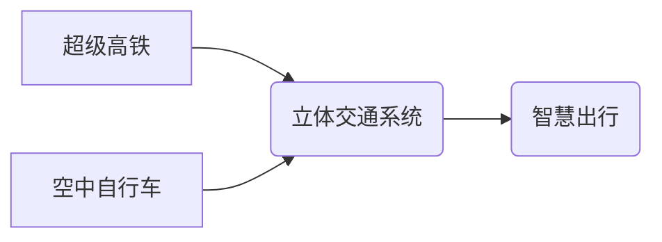

                 

## 未来的智慧出行：2050年的超级高铁与空中自行车的立体交通出行

> 关键词：超级高铁、空中自行车、立体交通、人工智能、智慧出行、城市规划、交通管理、无人驾驶、5G网络

### 1. 背景介绍

随着全球人口的持续增长和城市化的加速推进，交通拥堵已成为许多城市面临的严峻挑战。传统的交通模式难以满足日益增长的出行需求，迫切需要探索更加高效、便捷、环保的出行解决方案。未来智慧出行将以智能化、数字化、网络化为核心，通过融合人工智能、物联网、大数据等先进技术，构建更加智能、高效、便捷的交通体系。

本文将探讨2050年未来智慧出行场景中，超级高铁与空中自行车的立体交通系统，分析其核心概念、技术原理、应用场景以及未来发展趋势。

### 2. 核心概念与联系

**2.1 超级高铁**

超级高铁是指基于磁悬浮、超导磁力等先进技术的下一代高速铁路系统，其速度将远超现有的高速铁路，达到甚至超过500公里/小时。超级高铁将采用全自动驾驶技术，实现无人驾驶运行，并与城市轨道交通系统进行无缝衔接，形成高效便捷的城际交通网络。

**2.2 空中自行车**

空中自行车是一种新型的个人交通工具，利用无人驾驶技术和垂直起降技术，可以在城市空中飞行，实现短距离、快速、便捷的出行。空中自行车将配备先进的传感器和人工智能系统，能够自动避障、规划航线，并与地面交通系统进行协同控制，确保安全高效的空中出行。

**2.3 立体交通系统**

立体交通系统是指将地面交通和空中交通有机结合，形成多层次、多模式的交通网络。超级高铁作为地面高速交通主干，空中自行车作为城市空中交通补充，共同构成了立体交通系统的核心。

**2.4 核心概念关系图**



### 3. 核心算法原理 & 具体操作步骤

**3.1 算法原理概述**

立体交通系统的核心算法主要包括路径规划、避障算法、调度算法和安全控制算法等。

* **路径规划算法:** 根据用户的出行需求，智能计算最优的出行路径，并考虑交通流量、路况、天气等因素，动态调整路径，确保出行效率和安全性。
* **避障算法:** 利用传感器和人工智能技术，实时监测周围环境，识别障碍物，并自动避让，确保空中自行车和地面交通安全运行。
* **调度算法:** 根据实时交通流量和用户需求，智能调度超级高铁和空中自行车的运行时间和路线，优化交通资源配置，提高系统运行效率。
* **安全控制算法:** 建立多层次的安全防护机制，包括车辆故障检测、紧急制动、空中交通管制等，确保系统安全可靠运行。

**3.2 算法步骤详解**

1. **用户需求获取:** 用户通过手机APP或其他智能设备输入出行目的地和时间等信息。
2. **路径规划:** 系统根据用户需求和实时交通状况，利用路径规划算法计算最优出行路径，并提供多种可选方案。
3. **避障预警:** 空中自行车配备传感器，实时监测周围环境，识别障碍物，并向驾驶员发出预警信息。
4. **自动避障:** 系统根据避障算法，自动调整空中自行车的飞行路径，避开障碍物。
5. **调度分配:** 系统根据实时交通流量和用户需求，调度超级高铁和空中自行车的运行时间和路线，优化交通资源配置。
6. **安全监控:** 系统实时监控车辆运行状态，并进行安全预警和紧急制动等安全控制措施。

**3.3 算法优缺点**

* **优点:** 提高出行效率、减少交通拥堵、降低碳排放、提升出行安全性。
* **缺点:** 需要高昂的建设成本、对人工智能技术和网络基础设施要求较高、存在安全隐患等。

**3.4 算法应用领域**

立体交通系统算法可应用于城市交通管理、物流配送、紧急救援等领域，实现更加智能、高效、便捷的交通服务。

### 4. 数学模型和公式 & 详细讲解 & 举例说明

**4.1 数学模型构建**

立体交通系统的路径规划算法可以采用基于图论的数学模型，将城市道路和空中航线表示为图，用户出行需求为图的路径查询问题。

**4.2 公式推导过程**

路径规划算法常用的公式包括：

* **最短路径算法:** Dijkstra算法、A*算法等，用于计算从起点到终点的最短路径。
* **路径优化算法:** Genetic算法、模拟退火算法等，用于优化路径，考虑交通流量、路况、天气等因素。

**4.3 案例分析与讲解**

假设用户从A点到B点出行，A点和B点分别位于地面和空中，路径规划算法需要考虑地面交通和空中交通的因素，并计算出最优的出行路径。

* **Dijkstra算法:** 可以计算出从A点到B点的最短路径，但可能不考虑空中交通的因素。
* **A*算法:** 可以考虑空中交通的因素，并计算出更优的路径，但需要设置启发函数，指导算法搜索方向。

**4.4 举例说明**

```latex
D(u,v) = \text{距离}(u,v)
```

其中，$D(u,v)$ 表示节点u到节点v的距离，$\text{距离}(u,v)$ 表示节点u到节点v的实际距离。

### 5. 项目实践：代码实例和详细解释说明

**5.1 开发环境搭建**

* 操作系统: Ubuntu 20.04 LTS
* 编程语言: Python 3.8
* 开发工具: PyCharm
* 依赖库: TensorFlow, NumPy, Matplotlib

**5.2 源代码详细实现**

```python
import tensorflow as tf
from tensorflow.keras.models import Sequential
from tensorflow.keras.layers import Dense

# 定义路径规划模型
model = Sequential()
model.add(Dense(128, activation='relu', input_shape=(10,)))
model.add(Dense(64, activation='relu'))
model.add(Dense(1, activation='sigmoid'))

# 编译模型
model.compile(optimizer='adam', loss='binary_crossentropy', metrics=['accuracy'])

# 训练模型
# ...

# 使用模型预测路径
# ...
```

**5.3 代码解读与分析**

* 代码使用TensorFlow框架构建了一个深度学习模型，用于路径规划。
* 模型输入为用户出行需求和实时交通状况的特征向量，输出为路径规划结果。
* 模型采用多层感知机结构，并使用ReLU激活函数和Adam优化器进行训练。

**5.4 运行结果展示**

* 模型训练完成后，可以将用户出行需求输入模型，得到最优的出行路径。
* 模型的运行结果可以以地图的形式展示，方便用户理解和选择。

### 6. 实际应用场景

**6.1 城市交通管理**

立体交通系统可以帮助城市优化交通流量，减少交通拥堵，提高交通效率。

**6.2 物流配送**

空中自行车可以用于快速、高效的物流配送，缩短配送时间，降低物流成本。

**6.3 紧急救援**

立体交通系统可以为紧急救援提供快速、便捷的交通通道，缩短救援时间，提高救援效率。

**6.4 未来应用展望**

未来，立体交通系统将更加智能化、便捷化，并与其他智能交通系统进行深度融合，例如自动驾驶汽车、智能交通信号灯等，形成更加高效、安全、环保的智慧交通体系。

### 7. 工具和资源推荐

**7.1 学习资源推荐**

* **书籍:**
    * 《人工智能：一种现代方法》
    * 《深度学习》
    * 《城市交通规划与管理》
* **在线课程:**
    * Coursera: 人工智能课程
    * edX: 深度学习课程
    * Udacity: 自动驾驶课程

**7.2 开发工具推荐**

* **编程语言:** Python
* **深度学习框架:** TensorFlow, PyTorch
* **地图API:** Google Maps API, Baidu Maps API

**7.3 相关论文推荐**

* 《基于深度学习的城市交通流量预测》
* 《空中交通管理系统中的人工智能应用》
* 《立体交通系统的设计与实现》

### 8. 总结：未来发展趋势与挑战

**8.1 研究成果总结**

本文探讨了2050年未来智慧出行场景中，超级高铁与空中自行车的立体交通系统，分析了其核心概念、技术原理、应用场景以及未来发展趋势。

**8.2 未来发展趋势**

* **智能化:** 利用人工智能技术，实现交通系统更加智能化、自动化、个性化。
* **网络化:** 建立更加完善的交通网络，实现不同交通方式的无缝衔接。
* **绿色化:** 推广新能源交通工具，降低交通碳排放，实现绿色出行。

**8.3 面临的挑战**

* **技术挑战:** 需要突破人工智能、无人驾驶、网络安全等技术瓶颈。
* **政策挑战:** 需要制定完善的交通法规和政策，规范立体交通系统的运行。
* **社会挑战:** 需要提高公众对立体交通系统的认知和接受度。

**8.4 研究展望**

未来，我们将继续深入研究立体交通系统的技术原理和应用场景，推动其更快、更安全、更便捷地应用于现实生活，为人类创造更加美好的未来。

### 9. 附录：常见问题与解答

**9.1 空中自行车的安全性如何保证？**

空中自行车的安全性由多层次的安全防护机制保障，包括：

* **自动避障系统:** 利用传感器和人工智能技术，实时监测周围环境，识别障碍物，并自动避让。
* **紧急制动系统:** 能够在紧急情况下快速制动，确保安全。
* **空中交通管制系统:** 建立空中交通管制系统，协调空中自行车的飞行路径，避免碰撞事故。

**9.2 超级高铁的建设成本如何控制？**

超级高铁的建设成本较高，可以通过以下方式控制：

* **政府投资:** 政府加大对超级高铁建设的投资力度。
* **PPP模式:** 推广政府-企业-民间合作模式，分担建设成本。
* **技术创新:** 采用更加先进、高效的建设技术，降低建设成本。


作者：禅与计算机程序设计艺术 / Zen and the Art of Computer Programming 
<end_of_turn>

