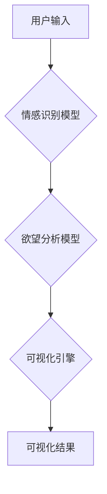

                 

## 欲望的可视化：AI呈现内心世界

> 关键词：人工智能、情感识别、欲望可视化、神经网络、数据分析、机器学习、深度学习、心理学、人机交互

## 1. 背景介绍

人类历史悠久，对自身内心世界的探索从未停止。从古希腊哲学家对“灵魂”的探讨，到现代心理学对“意识”的研究，我们始终试图理解和解读自己的情感、欲望和动机。而随着人工智能技术的飞速发展，我们拥有了前所未有的工具，可以更深入地探索内心世界的奥秘。

近年来，人工智能领域取得了令人瞩目的进展，特别是深度学习技术的突破，使得机器能够识别图像、语音、文本等复杂数据，并从中提取出丰富的语义信息。这为我们提供了新的视角，可以利用人工智能技术来分析和理解人类的情感和欲望。

“欲望的可视化”的概念正是基于这一背景而提出的。它试图利用人工智能技术，将人类的内心世界，即其潜意识、欲望和动机，以可视化的形式呈现出来。这种可视化不仅可以帮助我们更好地理解自己，还可以为心理治疗、市场营销、人机交互等领域提供新的应用场景。

## 2. 核心概念与联系

**2.1 核心概念**

* **情感识别:** 指的是机器能够识别和理解人类的情感，例如快乐、悲伤、愤怒、恐惧等。
* **欲望分析:** 指的是机器能够分析人类的欲望和动机，例如对物质、权力、爱情、成就等方面的追求。
* **可视化呈现:** 指的是将情感识别和欲望分析的结果以图形、图表、动画等形式呈现出来，以便人类更容易理解和解读。

**2.2 架构图**



**2.3 联系**

情感识别和欲望分析是“欲望的可视化”的核心技术。情感识别模型可以从用户的语言、表情、生理信号等方面识别用户的当前情绪状态。欲望分析模型则可以根据用户的行为、选择、消费习惯等方面分析用户的潜在欲望和动机。

可视化引擎将情感识别和欲望分析的结果进行整合和呈现，以直观易懂的方式展示用户的内心世界。

## 3. 核心算法原理 & 具体操作步骤

**3.1 算法原理概述**

“欲望的可视化”算法通常基于深度学习技术，利用神经网络模型来识别情感和分析欲望。

* **情感识别算法:** 常用的情感识别算法包括卷积神经网络（CNN）、循环神经网络（RNN）和长短期记忆网络（LSTM）。这些算法可以从用户的文本、语音、图像等数据中提取特征，并将其映射到情感类别。
* **欲望分析算法:** 欲望分析算法通常基于强化学习技术，通过训练模型来预测用户的行为和选择。模型会根据用户的历史行为和环境信息，学习用户的喜好和偏好，从而预测用户的潜在欲望。

**3.2 算法步骤详解**

1. **数据收集:** 收集用户的文本、语音、图像、行为等数据，并进行预处理，例如文本清洗、图像裁剪等。
2. **模型训练:** 利用深度学习算法训练情感识别和欲望分析模型。训练过程中，模型会学习从数据中提取特征并进行分类或预测。
3. **模型评估:** 使用测试数据评估模型的性能，例如准确率、召回率、F1-score等。
4. **可视化设计:** 设计可视化方案，将情感识别和欲望分析的结果以图形、图表、动画等形式呈现出来。
5. **系统部署:** 将训练好的模型和可视化系统部署到实际应用场景中。

**3.3 算法优缺点**

**优点:**

* **高精度:** 深度学习算法能够实现高精度的情感识别和欲望分析。
* **自动化:** 模型训练和可视化呈现都是自动化流程，可以节省人力成本。
* **个性化:** 可以根据用户的个人特征和行为数据，提供个性化的可视化结果。

**缺点:**

* **数据依赖:** 深度学习算法需要大量的训练数据，否则模型性能会下降。
* **解释性差:** 深度学习模型的内部机制比较复杂，难以解释模型的决策过程。
* **伦理问题:** “欲望的可视化”技术可能会引发伦理问题，例如隐私泄露、信息操控等。

**3.4 算法应用领域**

* **心理治疗:** 可以帮助心理治疗师更好地理解患者的内心世界，从而提供更有效的治疗方案。
* **市场营销:** 可以帮助企业了解消费者的需求和喜好，从而进行更精准的营销推广。
* **人机交互:** 可以帮助开发更人性化的交互系统，例如虚拟助手、游戏角色等。

## 4. 数学模型和公式 & 详细讲解 & 举例说明

**4.1 数学模型构建**

情感识别和欲望分析模型通常基于神经网络，其数学模型可以表示为多层感知机（MLP）或卷积神经网络（CNN）。

* **多层感知机 (MLP):**

MLP 由多个全连接层组成，每一层都包含多个神经元。每个神经元接收来自上一层的输出，并对其进行加权求和和激活函数处理。

* **卷积神经网络 (CNN):**

CNN 是一种专门用于处理图像数据的网络结构，其核心是卷积层和池化层。卷积层使用卷积核对图像进行卷积操作，提取图像特征。池化层对卷积层的输出进行降维，减少计算量。

**4.2 公式推导过程**

由于篇幅限制，这里只列举一些关键公式，详细推导过程可以参考相关文献。

* **激活函数:**

常用的激活函数包括 sigmoid 函数、ReLU 函数等。

* **损失函数:**

损失函数用于衡量模型预测结果与真实值的差异。常用的损失函数包括交叉熵损失函数、均方误差损失函数等。

* **梯度下降算法:**

梯度下降算法用于优化模型参数，使其能够最小化损失函数。

**4.3 案例分析与讲解**

假设我们训练了一个情感识别模型，用于识别用户文本中的情感类别（例如快乐、悲伤、愤怒）。我们可以使用测试数据来评估模型的性能。

例如，如果模型预测用户文本“今天天气真好”的情感类别为“快乐”，而真实情感类别也为“快乐”，则模型预测正确。

我们可以计算模型的准确率、召回率、F1-score等指标来评估模型的性能。

## 5. 项目实践：代码实例和详细解释说明

**5.1 开发环境搭建**

* **操作系统:** Linux 或 macOS
* **编程语言:** Python
* **深度学习框架:** TensorFlow 或 PyTorch
* **其他工具:** Jupyter Notebook、Git

**5.2 源代码详细实现**

```python
# 导入必要的库
import tensorflow as tf

# 定义情感识别模型
model = tf.keras.models.Sequential([
    tf.keras.layers.Embedding(input_dim=10000, output_dim=128),
    tf.keras.layers.LSTM(units=64),
    tf.keras.layers.Dense(units=3, activation='softmax')
])

# 编译模型
model.compile(optimizer='adam',
              loss='sparse_categorical_crossentropy',
              metrics=['accuracy'])

# 训练模型
model.fit(x_train, y_train, epochs=10)

# 评估模型
loss, accuracy = model.evaluate(x_test, y_test)
print('Loss:', loss)
print('Accuracy:', accuracy)
```

**5.3 代码解读与分析**

* **Embedding 层:** 将文本单词映射到低维向量空间。
* **LSTM 层:** 用于处理文本序列数据，提取文本的上下文信息。
* **Dense 层:** 全连接层，用于分类情感类别。
* **softmax 激活函数:** 将输出值映射到概率分布，表示每个情感类别的置信度。

**5.4 运行结果展示**

训练完成后，我们可以使用模型对新的文本数据进行预测，并查看模型的预测结果。

## 6. 实际应用场景

**6.1 心理治疗**

“欲望的可视化”技术可以帮助心理治疗师更好地理解患者的内心世界，例如识别患者的情绪状态、分析患者的潜意识欲望，从而提供更有效的治疗方案。

**6.2 市场营销**

企业可以利用“欲望的可视化”技术来分析消费者的需求和喜好，从而进行更精准的营销推广。例如，可以根据用户的购买历史和浏览记录，预测用户的潜在欲望，并针对性地推送广告或产品推荐。

**6.3 人机交互**

“欲望的可视化”技术可以帮助开发更人性化的交互系统，例如虚拟助手、游戏角色等。例如，虚拟助手可以根据用户的语气和表情，识别用户的意图，并提供更精准的回复。

**6.4 未来应用展望**

随着人工智能技术的不断发展， “欲望的可视化”技术将会在更多领域得到应用，例如教育、医疗、娱乐等。

## 7. 工具和资源推荐

**7.1 学习资源推荐**

* **书籍:**

* “深度学习” by Ian Goodfellow, Yoshua Bengio, and Aaron Courville
* “神经网络与深度学习” by Michael Nielsen

* **在线课程:**

* Coursera: 深度学习 Specialization
* edX: Artificial Intelligence

**7.2 开发工具推荐**

* **深度学习框架:** TensorFlow, PyTorch
* **数据处理工具:** Pandas, NumPy
* **可视化工具:** Matplotlib, Seaborn

**7.3 相关论文推荐**

* “Attention Is All You Need” by Vaswani et al.
* “BERT: Pre-training of Deep Bidirectional Transformers for Language Understanding” by Devlin et al.

## 8. 总结：未来发展趋势与挑战

**8.1 研究成果总结**

“欲望的可视化”技术取得了显著的进展，能够实现高精度的情感识别和欲望分析。

**8.2 未来发展趋势**

* **更精准的预测:** 利用更先进的深度学习算法和更大的数据规模，提高情感识别和欲望分析的精度。
* **更丰富的可视化方式:** 开发更直观、更生动的可视化方式，更好地呈现用户的内心世界。
* **更个性化的体验:** 根据用户的个人特征和行为数据，提供更个性化的可视化体验。

**8.3 面临的挑战**

* **数据隐私:** “欲望的可视化”技术需要收集大量的用户数据，如何保护用户隐私是一个重要的挑战。
* **算法解释性:** 深度学习模型的内部机制比较复杂，难以解释模型的决策过程，这可能会导致模型的可信度问题。
* **伦理问题:** “欲望的可视化”技术可能会引发伦理问题，例如信息操控、歧视等，需要谨慎对待。

**8.4 研究展望**

未来， “欲望的可视化”技术将继续朝着更精准、更个性化、更安全的方向发展，并将在更多领域得到应用，为人类更好地理解自身内心世界提供新的工具和方法。

## 9. 附录：常见问题与解答

**9.1 如何保护用户隐私？**

在开发 “欲望的可视化”系统时，需要采取多种措施来保护用户隐私，例如：

* **数据匿名化:** 将用户数据进行匿名处理，去除任何可以识别用户的个人信息。
* **数据加密:** 使用加密技术保护用户数据的安全传输和存储。
* **用户授权:** 在收集用户数据之前，需要获得用户的明确授权。

**9.2 如何解释模型的决策过程？**

目前，深度学习模型的解释性仍然是一个挑战。一些研究者正在开发新的方法来解释模型的决策过程，例如：

* **可解释性模型:** 开发更易于解释的模型结构，例如规则模型、决策树等。
* **模型可视化:** 使用可视化技术来展示模型的内部结构和决策过程。
* **注意力机制:** 利用注意力机制来识别模型关注的关键特征，从而解释模型的决策过程。


作者：禅与计算机程序设计艺术 / Zen and the Art of Computer Programming 
<end_of_turn>

