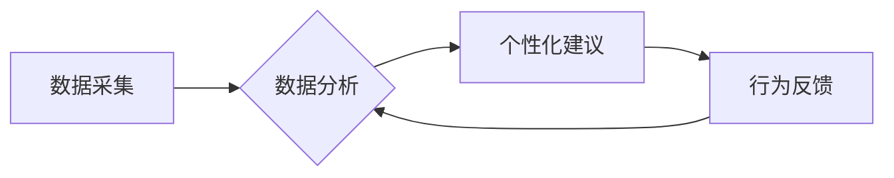

                 

## 欲望的智能调节：AI辅助的自我管理

> 关键词：人工智能、自我管理、欲望调节、行为分析、机器学习、个性化推荐、伦理问题

### 1. 背景介绍

在当今信息爆炸的时代，我们被无休止的欲望所包围。从物质享受到精神追求，欲望驱动着我们的行为，也常常成为我们难以控制的枷锁。然而，过度追求欲望往往会导致焦虑、压力、甚至精神崩溃。如何有效地调节欲望，实现自我管理，已成为现代社会面临的重要挑战。

人工智能（AI）技术的快速发展为我们提供了新的可能性。AI能够通过分析海量数据，识别个人行为模式，并提供个性化的建议和干预措施。因此，AI辅助的自我管理，特别是针对欲望调节的应用，具有巨大的潜力。

### 2. 核心概念与联系

**2.1 欲望的本质**

欲望是一种复杂的心理状态，它包含了对特定目标的强烈渴望和追求。欲望的产生与我们的生物本能、社会文化、个人经历等多种因素有关。

**2.2 自我管理的概念**

自我管理是指个体能够有效地控制自己的行为、情绪和思想，以实现既定的目标。它涉及到自我认知、自我调节、自我激励等多个方面。

**2.3 AI辅助自我管理的框架**

AI辅助的自我管理框架主要包括以下几个环节：

* **数据采集:** 收集用户的行为数据，例如消费记录、社交媒体活动、睡眠情况等。
* **数据分析:** 利用机器学习算法分析用户数据，识别用户的行为模式和欲望驱动因素。
* **个性化建议:** 根据用户的行为特征和欲望倾向，提供个性化的建议和干预措施。
* **行为反馈:** 收集用户的行为反馈，不断优化AI模型的准确性和有效性。

**2.4  AI辅助欲望调节的流程图**



### 3. 核心算法原理 & 具体操作步骤

**3.1 算法原理概述**

AI辅助欲望调节的核心算法主要包括：

* **强化学习:** 通过奖励和惩罚机制，训练AI模型学习用户的行为模式，并预测用户的欲望倾向。
* **深度学习:** 利用多层神经网络，从海量数据中提取更深层次的特征，提高AI模型的预测精度。
* **自然语言处理:** 分析用户的文本数据，例如日记、聊天记录等，识别用户的内心想法和欲望驱动因素。

**3.2 算法步骤详解**

1. **数据预处理:** 收集用户的行为数据，进行清洗、转换和特征提取。
2. **模型训练:** 利用强化学习、深度学习等算法，训练AI模型，使其能够预测用户的欲望倾向。
3. **个性化建议生成:** 根据用户的行为特征和欲望倾向，生成个性化的建议和干预措施。
4. **行为反馈收集:** 收集用户的行为反馈，例如是否遵循建议、行为变化情况等。
5. **模型优化:** 利用用户的行为反馈，不断优化AI模型的准确性和有效性。

**3.3 算法优缺点**

**优点:**

* **个性化:** AI模型可以根据用户的个人特征和行为模式，提供个性化的建议和干预措施。
* **精准度:** 利用机器学习算法，AI模型能够识别用户的行为模式和欲望驱动因素，提高建议的精准度。
* **效率:** AI模型可以自动分析海量数据，快速生成个性化建议，提高自我管理的效率。

**缺点:**

* **数据依赖:** AI模型的性能依赖于数据的质量和数量。
* **隐私风险:** 收集用户的行为数据可能会带来隐私风险。
* **伦理问题:** AI辅助自我管理可能会引发伦理问题，例如过度干预个人自由、数据滥用等。

**3.4 算法应用领域**

AI辅助欲望调节的应用领域广泛，包括：

* **健康管理:** 帮助用户控制饮食、运动、睡眠等行为，改善健康状况。
* **情绪调节:** 帮助用户识别和管理负面情绪，提高心理健康水平。
* **学习效率:** 帮助用户提高学习效率，克服拖延症等问题。
* **职业发展:** 帮助用户设定职业目标，制定职业规划，提高职业竞争力。

### 4. 数学模型和公式 & 详细讲解 & 举例说明

**4.1 数学模型构建**

我们可以用马尔可夫决策过程（MDP）来建模AI辅助欲望调节的过程。

* 状态空间：用户当前的行为状态，例如是否正在消费、是否正在学习等。
* 动作空间：用户可以采取的行动，例如购买商品、开始学习、进行运动等。
* 转移概率：从一个状态到另一个状态的概率，取决于用户的行为选择。
* 奖励函数：根据用户的行为和状态，给予相应的奖励或惩罚。

**4.2 公式推导过程**

目标是找到一个策略，使得用户在长期的互动过程中获得最大的总奖励。可以使用动态规划算法或强化学习算法来求解最优策略。

**Bellman方程:**

$$
V(s) = \max_a \sum_{s'} P(s'|s,a) [R(s,a,s') + \gamma V(s')]
$$

其中：

* $V(s)$ 是状态 $s$ 的价值函数。
* $a$ 是用户可以采取的行动。
* $P(s'|s,a)$ 是从状态 $s$ 执行动作 $a$ 进入状态 $s'$ 的概率。
* $R(s,a,s')$ 是执行动作 $a$ 从状态 $s$ 到状态 $s'$ 的奖励。
* $\gamma$ 是折扣因子，控制未来奖励的权重。

**4.3 案例分析与讲解**

假设我们想用AI辅助用户控制饮食，减少高糖分的摄入。我们可以将用户的饮食行为建模为一个MDP，其中状态空间是用户的血糖水平，动作空间是用户的饮食选择（例如选择高糖分食物、选择低糖分食物）。

通过收集用户的饮食数据和血糖水平数据，我们可以训练一个AI模型，学习用户的饮食行为模式和血糖水平变化规律。然后，AI模型可以根据用户的当前血糖水平和饮食选择，提供个性化的建议，例如提醒用户选择低糖分食物、避免过度摄入糖分等。

### 5. 项目实践：代码实例和详细解释说明

**5.1 开发环境搭建**

* Python 3.x
* TensorFlow 或 PyTorch
* Jupyter Notebook

**5.2 源代码详细实现**

```python
# 导入必要的库
import tensorflow as tf

# 定义模型结构
model = tf.keras.models.Sequential([
    tf.keras.layers.Dense(64, activation='relu', input_shape=(10,)),
    tf.keras.layers.Dense(32, activation='relu'),
    tf.keras.layers.Dense(1, activation='sigmoid')
])

# 编译模型
model.compile(optimizer='adam', loss='binary_crossentropy', metrics=['accuracy'])

# 训练模型
model.fit(X_train, y_train, epochs=10)

# 预测
predictions = model.predict(X_test)
```

**5.3 代码解读与分析**

这段代码定义了一个简单的深度学习模型，用于预测用户的欲望倾向。

* `tf.keras.models.Sequential` 创建了一个顺序模型，其中层级依次连接。
* `tf.keras.layers.Dense` 定义了全连接层，每个神经元都连接到上一层的每个神经元。
* `activation='relu'` 使用ReLU激活函数，提高模型的非线性表达能力。
* `input_shape=(10,)` 指定输入数据的形状，这里假设每个用户的行为特征有10个维度。
* `optimizer='adam'` 使用Adam优化器，更新模型参数。
* `loss='binary_crossentropy'` 使用二分类交叉熵损失函数，衡量模型预测结果与真实标签之间的差异。
* `metrics=['accuracy']` 使用准确率作为评估指标。

**5.4 运行结果展示**

训练完成后，我们可以使用测试数据评估模型的性能。

```python
# 评估模型
loss, accuracy = model.evaluate(X_test, y_test)
print('Loss:', loss)
print('Accuracy:', accuracy)
```

模型的输出结果将显示出预测准确率等指标，可以评估模型的性能。

### 6. 实际应用场景

**6.1 健康管理**

AI辅助的欲望调节可以帮助用户控制饮食、运动、睡眠等行为，改善健康状况。例如，AI可以根据用户的饮食习惯和健康目标，推荐个性化的食谱和运动计划，并提醒用户按计划执行。

**6.2 情绪调节**

AI可以分析用户的文本数据，识别用户的负面情绪，并提供相应的建议和干预措施。例如，AI可以提醒用户进行深呼吸、冥想或进行户外活动，帮助用户缓解压力和焦虑。

**6.3 学习效率**

AI可以帮助用户设定学习目标、制定学习计划，并提醒用户按计划学习。AI还可以根据用户的学习进度和表现，提供个性化的学习建议，提高学习效率。

**6.4 未来应用展望**

随着AI技术的不断发展，AI辅助欲望调节的应用场景将会更加广泛。例如，AI可以帮助用户管理时间、提高工作效率、提升人际关系等。

### 7. 工具和资源推荐

**7.1 学习资源推荐**

* **书籍:**

    * 《深度学习》
    * 《强化学习：原理、算法和应用》
    * 《机器学习》

* **在线课程:**

    * Coursera
    * edX
    * Udacity

**7.2 开发工具推荐**

* **Python:** 广泛应用于AI开发，拥有丰富的库和工具。
* **TensorFlow:** 开源深度学习框架，提供强大的模型构建和训练功能。
* **PyTorch:** 开源深度学习框架，以其灵活性和易用性而闻名。

**7.3 相关论文推荐**

* **Deep Reinforcement Learning for Personalized Education**
* **Towards Personalized Health Interventions with Reinforcement Learning**
* **A Survey of Reinforcement Learning for Human Behavior Modeling**

### 8. 总结：未来发展趋势与挑战

**8.1 研究成果总结**

AI辅助欲望调节的研究取得了显著进展，已经能够在健康管理、情绪调节、学习效率等领域提供有效的解决方案。

**8.2 未来发展趋势**

* **模型精度提升:** 利用更先进的算法和更大的数据集，提高AI模型的预测精度。
* **个性化程度增强:** 更加深入地了解用户的个人特征和需求，提供更加个性化的建议和干预措施。
* **跨领域应用扩展:** 将AI辅助欲望调节应用到更多领域，例如金融、教育、娱乐等。

**8.3 面临的挑战**

* **数据隐私保护:** 收集和使用用户的行为数据需要严格遵守隐私保护原则。
* **算法伦理问题:** AI辅助欲望调节可能会引发伦理问题，例如过度干预个人自由、数据滥用等。
* **技术可解释性:** AI模型的决策过程往往难以理解，需要提高模型的可解释性。

**8.4 研究展望**

未来，AI辅助欲望调节的研究将更加注重数据隐私保护、算法伦理和技术可解释性。同时，也会探索更先进的算法和应用场景，为人类提供更加有效的自我管理工具。

### 9. 附录：常见问题与解答

**9.1 如何保证AI辅助欲望调节的安全性？**

* 严格遵守数据隐私保护原则，确保用户的个人信息安全。
* 开发透明可解释的AI模型，避免算法黑箱问题。
* 建立完善的监管机制，防止AI技术被滥用。

**9.2 AI辅助欲望调节会取代人类的自我管理能力吗？**

AI辅助欲望调节旨在帮助人类更好地管理自己的欲望，而不是取代人类的自我管理能力。AI只是一个工具，最终的决策权仍然掌握在人类手中。

**9.3 AI辅助欲望调节的成本如何？**

AI辅助欲望调节的成本取决于具体的应用场景和技术方案。一般来说，开发和部署AI模型需要一定的技术投入，但随着技术的成熟，成本将会逐渐降低。


作者：禅与计算机程序设计艺术 / Zen and the Art of Computer Programming 
<end_of_turn>

