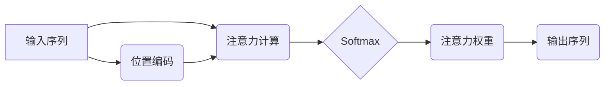

                 

## 1. 背景介绍

深度学习的蓬勃发展为人工智能领域带来了革命性的变革。其中，Transformer模型凭借其强大的序列建模能力，在自然语言处理、机器翻译、文本摘要等领域取得了突破性的进展。Transformer模型的核心在于**注意力机制**，它赋予模型理解文本语义的全新能力，并有效解决了传统RNN模型在长序列处理上的瓶颈。

注意力机制的核心思想是让模型关注输入序列中与当前任务最相关的部分，从而提高模型的理解力和预测精度。而**softmax**函数和**位置编码器**则是注意力机制中不可或缺的组成部分，它们分别负责分配注意力权重和处理序列中的位置信息。

本文将深入探讨注意力机制、softmax函数和位置编码器的原理和应用，并通过代码实例和实际应用场景，帮助读者更好地理解这些关键概念。

## 2. 核心概念与联系

### 2.1 注意力机制

注意力机制的本质是学习一个权重向量，用于衡量输入序列中每个元素对当前任务的 relevance。 

想象一下，我们阅读一篇长文章，想要理解某个特定句子。我们不会把整篇文章都看一遍，而是会集中注意力在与该句子相关的部分。注意力机制正是模仿了这种人类的阅读习惯，通过学习权重向量，让模型聚焦于与当前任务最相关的输入信息。

### 2.2 Softmax函数

Softmax函数是一种归一化函数，用于将一个向量中的元素映射到一个概率分布。在注意力机制中，Softmax函数用于计算每个输入元素的注意力权重。

假设我们有一个输入序列，长度为n，每个元素都有一个对应的得分。Softmax函数会将这些得分转换为一个概率分布，其中每个元素的概率代表其对当前任务的注意力程度。

### 2.3 位置编码器

在处理序列数据时，位置信息往往至关重要。例如，在翻译句子时，单词的顺序会影响翻译结果。然而，传统的RNN模型无法直接处理位置信息。

位置编码器旨在为每个输入元素添加位置信息，从而帮助模型理解序列的顺序关系。常见的编码方式包括绝对位置编码和相对位置编码。

**核心概念关系图:**



## 3. 核心算法原理 & 具体操作步骤

### 3.1 算法原理概述

注意力机制的核心算法是计算每个输入元素与当前输出元素之间的相关性，并根据相关性分配注意力权重。

常见的注意力机制类型包括：

* **自注意力 (Self-Attention):**  计算序列中每个元素与自身和其他元素之间的相关性。
* **交叉注意力 (Cross-Attention):** 计算两个不同序列之间元素的相关性。

### 3.2 算法步骤详解

**自注意力机制的具体步骤如下：**

1. **计算查询 (Query)、键 (Key) 和值 (Value) 向量:** 将输入序列中的每个元素映射到三个不同的向量空间：查询空间、键空间和值空间。
2. **计算注意力权重:** 使用查询向量和键向量之间的点积计算注意力权重。
3. **应用 softmax 函数:** 对注意力权重进行归一化，得到每个元素的注意力概率分布。
4. **加权求和:** 将值向量与注意力概率分布进行加权求和，得到最终的输出向量。

### 3.3 算法优缺点

**优点:**

* 能够捕捉序列中长距离依赖关系。
* 能够学习到每个元素的重要性权重。
* 能够并行计算，提高训练效率。

**缺点:**

* 计算复杂度较高。
* 对于长序列数据，计算量会指数级增长。

### 3.4 算法应用领域

注意力机制广泛应用于自然语言处理、计算机视觉、语音识别等领域，例如：

* **机器翻译:** 捕捉源语言和目标语言之间的语义关系。
* **文本摘要:** 识别文本中最关键的信息。
* **图像识别:** 关注图像中与目标物体相关的区域。

## 4. 数学模型和公式 & 详细讲解 & 举例说明

### 4.1 数学模型构建

假设我们有一个输入序列 X = {x1, x2, ..., xn}，其中每个元素 xi 是一个向量。

**自注意力机制的数学模型可以表示为：**

```latex
Attention(Q, K, V) = softmax(Q K^T / sqrt(d_k)) V
```

其中：

* Q 是查询矩阵，维度为 (n, d_q)
* K 是键矩阵，维度为 (n, d_k)
* V 是值矩阵，维度为 (n, d_v)
* d_q, d_k, d_v 分别是查询、键和值向量的维度
* softmax 函数将注意力权重归一化到概率分布

### 4.2 公式推导过程

**注意力权重的计算过程:**

1. 计算查询向量 qi 和键向量 kj 之间的点积:

```latex
score_{i,j} = q_i^T k_j
```

2. 对所有 score 进行缩放:

```latex
scaled_score_{i,j} = score_{i,j} / sqrt(d_k)
```

3. 应用 softmax 函数:

```latex
attention_{i,j} = softmax(scaled_score_{i,j})
```

**最终输出的计算过程:**

1. 将注意力权重与值向量进行加权求和:

```latex
output_i = \sum_{j=1}^{n} attention_{i,j} v_j
```

### 4.3 案例分析与讲解

**举例说明:**

假设我们有一个输入序列 X = {"我", "爱", "学习", "编程"}，每个单词都对应一个向量表示。

1. 计算查询、键和值矩阵。
2. 计算每个单词之间的注意力权重。
3. 根据注意力权重，将值向量加权求和，得到最终的输出向量。

通过分析输出向量，我们可以了解模型对每个单词的关注程度，从而更好地理解句子语义。

## 5. 项目实践：代码实例和详细解释说明

### 5.1 开发环境搭建

* Python 3.6+
* TensorFlow 或 PyTorch

### 5.2 源代码详细实现

```python
import tensorflow as tf

# 定义自注意力机制
def self_attention(query, key, value, mask=None):
    # 计算注意力权重
    attention_weights = tf.matmul(query, key, transpose_b=True) / tf.math.sqrt(tf.cast(key.shape[-1], tf.float32))
    if mask is not None:
        attention_weights += (mask * -1e9)
    attention_weights = tf.nn.softmax(attention_weights, axis=-1)
    # 加权求和
    output = tf.matmul(attention_weights, value)
    return output

# 示例用法
query = tf.random.normal((4, 8))
key = tf.random.normal((4, 8))
value = tf.random.normal((4, 8))
output = self_attention(query, key, value)
print(output.shape)
```

### 5.3 代码解读与分析

* `self_attention` 函数实现了一个基本的自注意力机制。
* `query`, `key`, `value` 分别代表查询矩阵、键矩阵和值矩阵。
* `mask` 用于屏蔽某些元素，例如在机器翻译中，屏蔽源语言中已经翻译过的单词。
* `tf.matmul` 函数用于计算矩阵乘法。
* `tf.nn.softmax` 函数用于计算注意力权重。
* `tf.cast` 函数用于将数据类型转换为浮点数。

### 5.4 运行结果展示

运行上述代码，输出结果为 `(4, 8)`，表示注意力机制的输出维度与值矩阵相同。

## 6. 实际应用场景

### 6.1 自然语言处理

* **机器翻译:** 捕捉源语言和目标语言之间的语义关系，提高翻译质量。
* **文本摘要:** 识别文本中最关键的信息，生成简洁的摘要。
* **问答系统:** 理解用户问题，从文本库中找到最相关的答案。

### 6.2 计算机视觉

* **图像识别:** 关注图像中与目标物体相关的区域，提高识别精度。
* **目标检测:** 识别图像中的多个目标物体，并定位其边界框。
* **图像 Captioning:** 根据图像内容生成文字描述。

### 6.3 语音识别

* **语音转文本:** 将语音信号转换为文本，提高语音识别准确率。
* **语音合成:** 根据文本生成语音信号，实现人机交互。

### 6.4 未来应用展望

注意力机制在人工智能领域具有广阔的应用前景，未来可能在以下领域得到更广泛的应用:

* **医疗诊断:** 分析病历和医学影像，辅助医生进行诊断。
* **金融风险管理:** 识别金融市场中的风险因素，降低投资风险。
* **个性化推荐:** 根据用户的兴趣和行为，推荐个性化的商品和服务。

## 7. 工具和资源推荐

### 7.1 学习资源推荐

* **论文:**
    * "Attention Is All You Need" (Vaswani et al., 2017)
    * "BERT: Pre-training of Deep Bidirectional Transformers for Language Understanding" (Devlin et al., 2018)
* **书籍:**
    * "Deep Learning" (Goodfellow et al., 2016)
    * "Speech and Language Processing" (Jurafsky & Martin, 2023)
* **在线课程:**
    * Coursera: "Natural Language Processing Specialization"
    * Stanford CS224N: "Natural Language Processing with Deep Learning"

### 7.2 开发工具推荐

* **TensorFlow:** 开源深度学习框架，支持多种注意力机制实现。
* **PyTorch:** 开源深度学习框架，灵活易用，适合研究和开发。
* **Hugging Face Transformers:** 提供预训练的 Transformer 模型和工具，方便快速应用注意力机制。

### 7.3 相关论文推荐

* "Transformer-XL: Attentive Language Models Beyond a Fixed-Length Context" (Dai et al., 2019)
* "Longformer: The Long-Document Transformer" (Beltagy et al., 2020)
* "Reformer: The Efficient Transformer" (Kitaev et al., 2020)

## 8. 总结：未来发展趋势与挑战

### 8.1 研究成果总结

注意力机制的提出和发展，为深度学习带来了革命性的变革，显著提升了模型的性能和能力。

### 8.2 未来发展趋势

* **效率提升:** 研究更高效的注意力机制，降低计算复杂度，提高训练速度。
* **鲁棒性增强:** 研究更鲁棒的注意力机制，提高模型对噪声和异常数据的影响抵抗力。
* **跨模态应用:** 将注意力机制应用于跨模态任务，例如图像-文本对齐、视频理解等。

### 8.3 面临的挑战

* **长序列处理:** 对于非常长的序列数据，注意力机制的计算复杂度仍然是一个挑战。
* **可解释性:** 注意力机制的内部机制相对复杂，提高模型的可解释性仍然是一个研究方向。
* **数据效率:** 注意力机制通常需要大量的训练数据，如何提高模型的数据效率是一个重要问题。

### 8.4 研究展望

未来，注意力机制的研究将继续深入，探索更强大的模型架构、更有效的训练方法和更广泛的应用场景。

## 9. 附录：常见问题与解答

**Q1: 注意力机制和RNN模型相比有什么优势？**

**A1:** 注意力机制能够捕捉序列中长距离依赖关系，而RNN模型在处理长序列数据时容易出现梯度消失或爆炸问题。

**Q2: 如何选择合适的注意力机制？**

**A2:** 选择合适的注意力机制取决于具体的应用场景和数据特点。例如，对于机器翻译任务，通常使用自注意力机制；对于图像识别任务，则可能使用交叉注意力机制。

**Q3: 如何理解注意力权重？**

**A3:** 注意力权重代表了模型对每个输入元素的关注程度。权重越高，表示模型对该元素的关注程度越强。

**作者：禅与计算机程序设计艺术 / Zen and the Art of Computer Programming**<end_of_turn>

