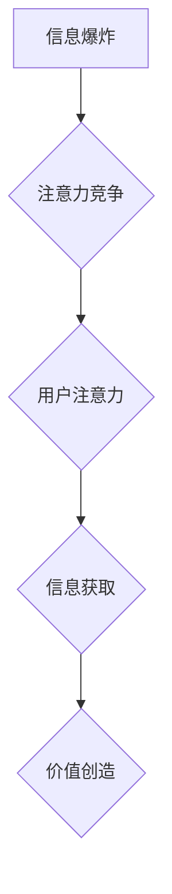
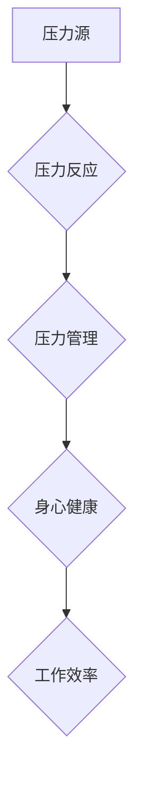

                 

## 1. 背景介绍

在当今信息爆炸的时代，我们每个人都被无休止的数字信息所包围。从智能手机的推送通知到社交媒体的动态更新，从电子邮件的轰炸到网络新闻的滚动，信息无处不在，无时不刻地 vying for our attention。这种信息过载状态，我们称之为“注意力经济”。

注意力经济的核心概念是，注意力是稀缺的资源，而信息竞争者则争夺着这份宝贵的资源。在这样的环境下，个人如何有效地管理自己的注意力，成为了一个至关重要的议题。

个人压力管理与注意力经济息息相关。当我们被过多的信息所淹没时，我们的注意力会被分散，难以集中精力完成任务，这会导致焦虑、压力和疲劳。反过来，压力也会影响我们的注意力，让我们更加容易分心，难以做出明智的决策。

## 2. 核心概念与联系

### 2.1 注意力经济

注意力经济是指在信息爆炸的时代，注意力成为一种稀缺资源，而信息提供者为了获取用户的注意力而进行竞争的经济模式。

**核心要素：**

* **注意力：** 作为一种有限的资源，注意力是人们对特定信息或任务的集中和投入。
* **信息过载：**  信息爆炸导致人们面临着大量的、不断涌入的信息，难以有效地处理和筛选。
* **竞争：** 信息提供者为了获取用户的注意力，不断地进行竞争，例如通过推送通知、个性化推荐、内容吸引力等方式。

**架构图：**



### 2.2 个人压力管理

个人压力管理是指个体通过各种方法和技巧，有效地应对压力，保持身心健康和工作效率。

**核心要素：**

* **压力源：**  包括工作、学习、人际关系、生活环境等方面。
* **压力反应：**  包括生理、心理、行为等方面的变化。
* **压力应对：**  包括认知、行为、情绪调节等方面的策略。

**架构图：**



### 2.3 联系

注意力经济和个人压力管理之间存在着密切的联系。

* **注意力经济导致压力：** 信息过载和注意力竞争会让人感到焦虑、压力和疲劳。
* **压力影响注意力：** 压力会让我们更加容易分心，难以集中精力。
* **压力管理提升注意力：** 通过有效的压力管理，我们可以更好地控制注意力，提高工作效率。

## 3. 核心算法原理 & 具体操作步骤

### 3.1 算法原理概述

注意力机制是一种模仿人类注意力机制的算法，它能够帮助模型更好地关注输入数据中重要的信息，从而提高模型的性能。

注意力机制的核心思想是，在处理输入数据时，模型会为每个数据元素分配一个权重，权重高的数据元素会被模型更加关注，权重低的则会被忽略。

### 3.2 算法步骤详解

1. **计算注意力权重：**  根据输入数据和模型的当前状态，计算每个数据元素的注意力权重。
2. **加权求和：**  将每个数据元素与其注意力权重相乘，然后对所有数据元素进行加权求和，得到一个新的表示。
3. **输出结果：**  使用新的表示作为模型的输出。

### 3.3 算法优缺点

**优点：**

* 可以有效地提高模型的性能，尤其是在处理长序列数据时。
* 可以帮助模型更好地理解输入数据的语义。
* 可以解释模型的决策过程，提高模型的可解释性。

**缺点：**

* 计算复杂度较高，训练时间较长。
* 需要大量的训练数据才能达到最佳效果。

### 3.4 算法应用领域

注意力机制在自然语言处理、计算机视觉、机器翻译、语音识别等领域都有广泛的应用。

## 4. 数学模型和公式 & 详细讲解 & 举例说明

### 4.1 数学模型构建

注意力机制的数学模型可以表示为：

$$
\text{Attention}(Q, K, V) = \text{softmax}\left(\frac{Q K^T}{\sqrt{d_k}}\right) V
$$

其中：

* $Q$：查询矩阵
* $K$：键矩阵
* $V$：值矩阵
* $d_k$：键向量的维度
* $\text{softmax}$：softmax函数

### 4.2 公式推导过程

注意力机制的公式推导过程可以分为以下几个步骤：

1. 计算查询向量 $Q$ 和键向量 $K$ 的点积。
2. 对点积进行归一化，得到注意力权重。
3. 使用注意力权重对值向量 $V$ 进行加权求和，得到最终的输出。

### 4.3 案例分析与讲解

假设我们有一个句子 "The cat sat on the mat"，我们想要计算每个词语对句子整体语义的贡献。

我们可以将句子中的每个词语作为查询向量 $Q$，键向量 $K$ 和值向量 $V$。然后，使用注意力机制计算每个词语的注意力权重，权重高的词语对句子整体语义的贡献更大。

例如，"sat" 这个词语的注意力权重可能比 "the" 或 "mat" 更高，因为 "sat" 是句子中的核心动词，对句子的整体语义有更大的影响。

## 5. 项目实践：代码实例和详细解释说明

### 5.1 开发环境搭建

* Python 3.6+
* TensorFlow 2.0+
* PyTorch 1.0+

### 5.2 源代码详细实现

```python
import tensorflow as tf

# 定义注意力机制层
class AttentionLayer(tf.keras.layers.Layer):
    def __init__(self, units):
        super(AttentionLayer, self).__init__()
        self.Wq = tf.keras.layers.Dense(units)
        self.Wk = tf.keras.layers.Dense(units)
        self.Wv = tf.keras.layers.Dense(units)
        self.dense = tf.keras.layers.Dense(units)

    def call(self, inputs):
        Q = self.Wq(inputs)
        K = self.Wk(inputs)
        V = self.Wv(inputs)
        attention_weights = tf.matmul(Q, K, transpose_b=True) / tf.math.sqrt(tf.cast(tf.shape(Q)[-1], tf.float32))
        attention_weights = tf.nn.softmax(attention_weights, axis=-1)
        output = tf.matmul(attention_weights, V)
        return self.dense(output)

# 实例化注意力机制层
attention_layer = AttentionLayer(units=128)

# 输入数据
inputs = tf.random.normal(shape=(32, 10, 64))

# 通过注意力机制层进行处理
outputs = attention_layer(inputs)

# 打印输出结果
print(outputs.shape)
```

### 5.3 代码解读与分析

* 我们定义了一个 `AttentionLayer` 类，实现了注意力机制的计算过程。
* 该类中，我们使用三个全连接层分别对查询向量、键向量和值向量进行线性变换。
* 然后，我们计算查询向量和键向量的点积，并对结果进行归一化，得到注意力权重。
* 最后，我们使用注意力权重对值向量进行加权求和，得到最终的输出。

### 5.4 运行结果展示

运行上述代码，会输出一个形状为 `(32, 10, 128)` 的张量，表示经过注意力机制处理后的输出。

## 6. 实际应用场景

### 6.1  新闻推荐系统

注意力机制可以帮助新闻推荐系统更好地理解用户的阅读偏好，并推荐更相关的新闻内容。

### 6.2  搜索引擎

注意力机制可以帮助搜索引擎更好地理解用户的搜索意图，并返回更相关的搜索结果。

### 6.3  机器翻译

注意力机制可以帮助机器翻译系统更好地关注源语言和目标语言之间的对应关系，从而提高翻译质量。

### 6.4  未来应用展望

注意力机制在未来将有更广泛的应用，例如：

* **个性化教育：** 根据学生的学习进度和理解能力，提供个性化的学习内容和辅导。
* **医疗诊断：** 帮助医生更好地分析病人的症状和检查结果，提高诊断准确率。
* **自动驾驶：** 帮助自动驾驶系统更好地感知周围环境，提高安全性。

## 7. 工具和资源推荐

### 7.1 学习资源推荐

* **书籍：**
    * 《深度学习》
    * 《Attention Is All You Need》
* **在线课程：**
    * Coursera: Deep Learning Specialization
    * Udacity: Deep Learning Nanodegree

### 7.2 开发工具推荐

* **TensorFlow:** https://www.tensorflow.org/
* **PyTorch:** https://pytorch.org/

### 7.3 相关论文推荐

* 《Attention Is All You Need》
* 《BERT: Pre-training of Deep Bidirectional Transformers for Language Understanding》

## 8. 总结：未来发展趋势与挑战

### 8.1 研究成果总结

注意力机制在近年来取得了显著的进展，并在多个领域取得了优异的性能。

### 8.2 未来发展趋势

* **更有效的注意力机制：** 研究更有效的注意力机制，例如自注意力机制、多头注意力机制等。
* **注意力机制的解释性：** 研究注意力机制的解释性，使其更易于理解和应用。
* **注意力机制的泛化能力：** 研究注意力机制的泛化能力，使其能够应用于更多不同的领域。

### 8.3 面临的挑战

* **计算复杂度：** 注意力机制的计算复杂度较高，在处理大规模数据时会面临挑战。
* **参数量：** 注意力机制的参数量较大，需要大量的训练数据才能达到最佳效果。
* **可解释性：** 注意力机制的决策过程相对复杂，其可解释性仍有待提高。

### 8.4 研究展望

未来，注意力机制的研究将继续朝着更有效、更可解释、更具泛化能力的方向发展。


## 9. 附录：常见问题与解答

**Q1：注意力机制是如何工作的？**

A1：注意力机制模仿了人类的注意力机制，它能够帮助模型更好地关注输入数据中重要的信息。

**Q2：注意力机制有哪些应用场景？**

A2：注意力机制在自然语言处理、计算机视觉、机器翻译、语音识别等领域都有广泛的应用。

**Q3：注意力机制的优缺点是什么？**

A3：注意力机制的优点是能够提高模型的性能，尤其是在处理长序列数据时；缺点是计算复杂度较高，需要大量的训练数据才能达到最佳效果。


作者：禅与计算机程序设计艺术 / Zen and the Art of Computer Programming 
<end_of_turn>

