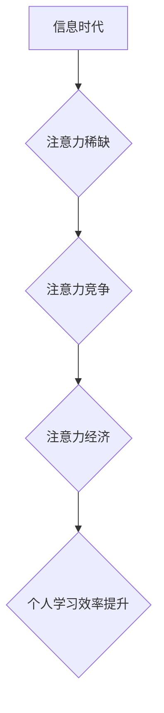

                 

## 1. 背景介绍

在当今信息爆炸的时代，我们每天都被海量的信息所包围。从新闻推送到社交媒体，从邮件通知到在线课程，信息无处不在，却并非都真正地被我们所吸收和理解。这种信息过载状态，导致我们难以集中注意力，学习效率不断下降。

个人学习效率的提升，一直是人们孜孜以求的目标。然而，传统的学习方法往往难以应对信息时代带来的挑战。我们需要一种新的学习模式，一种能够帮助我们有效地筛选信息、集中注意力、提升学习效率的方法。

注意力经济的概念应运而生。它强调了在信息时代，注意力是稀缺的资源，而有效地管理和利用注意力，是提升个人学习效率的关键。

## 2. 核心概念与联系

### 2.1 注意力经济

注意力经济是指在信息时代，注意力成为一种稀缺资源，而能够有效地获取和利用注意力的人或组织，就拥有了巨大的竞争优势。

**核心原理：**

* **注意力是有限的：** 人类的大脑只能同时处理有限的信息量，注意力就像一个有限的“电池”，需要不断充电和管理。
* **注意力是可训练的：** 通过训练和练习，我们可以提高注意力集中能力，延长注意力持续时间。
* **注意力是可交易的：** 信息提供者通过各种手段，例如推送通知、标题设计、内容形式等，试图吸引用户的注意力，从而获取用户的关注和消费。

**架构图：**



### 2.2 个人学习效率

个人学习效率是指在给定的时间内，完成学习任务的效率。它受多种因素影响，包括注意力、记忆力、学习方法、学习环境等。

**核心要素：**

* **时间管理：**合理规划学习时间，避免拖延和浪费时间。
* **注意力集中：**排除干扰，集中精力学习，提高学习效率。
* **记忆力提升：**运用有效的记忆技巧，帮助记忆和理解知识。
* **学习方法选择：**根据自身特点和学习目标，选择合适的学习方法。

## 3. 核心算法原理 & 具体操作步骤

### 3.1 算法原理概述

注意力机制是一种模仿人类注意力机制的算法，它能够帮助模型专注于输入数据中最重要的部分，从而提高学习效率。

**核心思想：**

* **赋予不同输入元素不同的权重：**注意力机制通过计算每个输入元素的重要性权重，将重要信息加权突出，将无关信息淡化。
* **动态调整权重：**注意力权重不是静态的，而是根据输入数据和模型的学习过程动态调整的。

### 3.2 算法步骤详解

1. **计算注意力权重：**

   * 将输入数据映射到一个隐藏空间。
   * 计算每个输入元素与模型的“查询”向量之间的相似度。
   * 通过softmax函数将相似度转换为注意力权重，使得权重之和为1。

2. **加权求和：**

   * 将注意力权重与输入数据相乘，得到加权后的输入数据。
   * 对加权后的输入数据进行求和，得到最终的输出。

### 3.3 算法优缺点

**优点：**

* **提高学习效率：**注意力机制能够帮助模型专注于重要信息，提高学习效率。
* **提升模型性能：**在许多任务中，注意力机制能够显著提升模型的性能。
* **解释性强：**注意力权重可以直观地反映模型对输入数据的关注程度，提高模型的可解释性。

**缺点：**

* **计算复杂度高：**注意力机制的计算复杂度较高，尤其是在处理长序列数据时。
* **参数量大：**注意力机制需要更多的参数，这可能会增加模型的训练难度。

### 3.4 算法应用领域

注意力机制在自然语言处理、计算机视觉、机器翻译、语音识别等领域都有广泛的应用。

## 4. 数学模型和公式 & 详细讲解 & 举例说明

### 4.1 数学模型构建

注意力机制的数学模型可以概括为以下公式：

$$
\text{Attention}(Q, K, V) = \text{softmax}\left(\frac{Q K^T}{\sqrt{d_k}}\right) V
$$

其中：

* $Q$：查询向量
* $K$：键向量
* $V$：值向量
* $d_k$：键向量的维度
* $\text{softmax}$：softmax函数

### 4.2 公式推导过程

1. **计算相似度：**

   $QK^T$ 计算查询向量与键向量的点积，表示两者之间的相似度。

2. **归一化：**

   将点积除以 $\sqrt{d_k}$，可以防止梯度爆炸。

3. **softmax函数：**

   将归一化后的相似度通过softmax函数转换为注意力权重，使得权重之和为1。

### 4.3 案例分析与讲解

假设我们有一个句子“我爱学习编程”，我们想要计算每个单词对句子整体语义的贡献。

* $Q$：查询向量表示句子整体的语义。
* $K$：键向量表示每个单词的语义。
* $V$：值向量表示每个单词的词向量。

通过计算注意力权重，我们可以发现“学习”和“编程”这两个单词对句子整体语义的贡献最大，而“我”和“爱”这两个单词的贡献相对较小。

## 5. 项目实践：代码实例和详细解释说明

### 5.1 开发环境搭建

* Python 3.x
* TensorFlow 或 PyTorch

### 5.2 源代码详细实现

```python
import tensorflow as tf

# 定义注意力机制层
class AttentionLayer(tf.keras.layers.Layer):
    def __init__(self, units):
        super(AttentionLayer, self).__init__()
        self.Wq = tf.keras.layers.Dense(units)
        self.Wk = tf.keras.layers.Dense(units)
        self.Wv = tf.keras.layers.Dense(units)
        self.softmax = tf.keras.layers.Softmax()

    def call(self, inputs):
        Q = self.Wq(inputs)
        K = self.Wk(inputs)
        V = self.Wv(inputs)
        attention_weights = self.softmax(tf.matmul(Q, K, transpose_b=True) / tf.math.sqrt(tf.cast(units, tf.float32)))
        output = tf.matmul(attention_weights, V)
        return output

# 使用注意力机制层
model = tf.keras.Sequential([
    tf.keras.layers.Embedding(input_dim=10000, output_dim=128),
    AttentionLayer(units=64),
    tf.keras.layers.Dense(units=10, activation='softmax')
])
```

### 5.3 代码解读与分析

* `AttentionLayer` 类定义了一个注意力机制层，包含三个稠密层用于计算查询、键和值向量，以及一个softmax函数用于计算注意力权重。
* `call` 方法实现注意力机制的计算过程。
* `model` 是一个简单的文本分类模型，包含嵌入层、注意力机制层和全连接输出层。

### 5.4 运行结果展示

通过训练和测试模型，我们可以观察到注意力机制能够提高模型的性能。

## 6. 实际应用场景

### 6.1 在线学习平台

* 个性化学习推荐：根据用户的学习历史和行为数据，利用注意力机制推荐最适合用户的学习内容。
* 智能答疑系统：利用注意力机制分析用户的提问，并从知识库中找到最相关的答案。

### 6.2 内容创作平台

* 文章推荐：根据用户的阅读偏好，利用注意力机制推荐最相关的文章。
* 内容生成：利用注意力机制生成更吸引用户的文章标题、摘要和内容。

### 6.3 人工智能助手

* 语音识别：利用注意力机制提高语音识别的准确率。
* 自然语言理解：利用注意力机制更好地理解用户的自然语言输入。

### 6.4 未来应用展望

注意力机制在未来将有更广泛的应用，例如：

* **医疗诊断：**利用注意力机制分析病人的医学影像和病历，提高诊断的准确率。
* **金融风险管理：**利用注意力机制分析金融数据的异常行为，降低金融风险。
* **自动驾驶：**利用注意力机制帮助自动驾驶汽车更好地感知周围环境。

## 7. 工具和资源推荐

### 7.1 学习资源推荐

* **书籍：**
    * 《深度学习》
    * 《Attention Is All You Need》
* **在线课程：**
    * Coursera
    * edX
    * fast.ai

### 7.2 开发工具推荐

* **TensorFlow:** https://www.tensorflow.org/
* **PyTorch:** https://pytorch.org/

### 7.3 相关论文推荐

* **Attention Is All You Need:** https://arxiv.org/abs/1706.03762
* **BERT: Pre-training of Deep Bidirectional Transformers for Language Understanding:** https://arxiv.org/abs/1810.04805

## 8. 总结：未来发展趋势与挑战

### 8.1 研究成果总结

注意力机制在近年来取得了显著的进展，并在许多领域取得了优异的性能。

### 8.2 未来发展趋势

* **更有效的注意力机制：**研究更有效的注意力机制，例如自注意力机制、多头注意力机制等。
* **注意力机制的泛化性：**提高注意力机制的泛化能力，使其能够应用于更多领域。
* **注意力机制的可解释性：**提高注意力机制的可解释性，帮助人们更好地理解模型的决策过程。

### 8.3 面临的挑战

* **计算复杂度：**注意力机制的计算复杂度较高，尤其是在处理长序列数据时。
* **参数量：**注意力机制需要更多的参数，这可能会增加模型的训练难度。
* **数据依赖性：**注意力机制的性能依赖于数据的质量和数量。

### 8.4 研究展望

未来，注意力机制的研究将继续深入，并应用于更多领域，为人工智能的发展做出更大的贡献。

## 9. 附录：常见问题与解答

**Q1：注意力机制与传统机器学习模型有什么区别？**

**A1：**传统机器学习模型通常将所有输入数据都平等地对待，而注意力机制能够根据输入数据的不同重要性，赋予不同的权重，从而提高学习效率。

**Q2：注意力机制的计算复杂度如何？**

**A2：**注意力机制的计算复杂度较高，尤其是在处理长序列数据时。

**Q3：注意力机制的应用领域有哪些？**

**A3：**注意力机制在自然语言处理、计算机视觉、机器翻译、语音识别等领域都有广泛的应用。


作者：禅与计算机程序设计艺术 / Zen and the Art of Computer Programming 
<end_of_turn>

