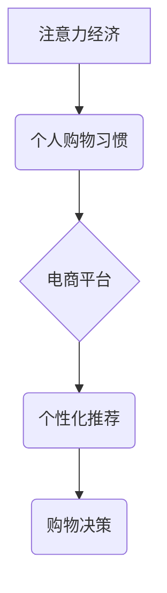

                 

## 1. 背景介绍

在当今数字时代，信息爆炸和网络技术的飞速发展，人们面临着前所未有的信息过载。注意力，作为人类认知的核心资源，变得越来越稀缺。 

**注意力经济** 这一概念应运而生，它指出，在信息过剩的时代，人们的注意力成为了最宝贵的资源。 拥有和控制注意力，就拥有了巨大的商业价值。 

电商平台、社交媒体、搜索引擎等互联网巨头，都在积极争夺用户的注意力。他们通过各种手段，例如个性化推荐、推送通知、限时抢购等，试图吸引用户的眼球，并引导他们进行消费行为。

这种注意力经济的竞争，也深刻地影响着人们的个人购物习惯。 传统的线下购物模式，已经逐渐被线上购物模式所取代。 

人们越来越倾向于在网上浏览商品、比较价格、阅读评价，最终完成购买决策。 

## 2. 核心概念与联系

### 2.1 注意力经济

注意力经济是指在信息时代，人们的注意力成为最稀缺的资源，而拥有和控制注意力的人或组织，就拥有了巨大的商业价值。

### 2.2 个人购物习惯

个人购物习惯是指个人在购物过程中所表现出的行为模式，包括购物频率、购物方式、购物偏好、购物决策等。

### 2.3 关系图



## 3. 核心算法原理 & 具体操作步骤

### 3.1 算法原理概述

在电商平台中，个性化推荐算法是核心算法之一，它通过分析用户的历史浏览记录、购买行为、评价等数据，预测用户可能感兴趣的商品，并将其推荐给用户。

常见的个性化推荐算法包括：

* **基于内容的推荐算法:** 根据商品的属性和用户过去的喜好进行推荐。
* **基于协同过滤的推荐算法:** 根据其他用户对商品的评价和购买行为进行推荐。
* **基于深度学习的推荐算法:** 利用深度神经网络对用户和商品进行特征提取，并进行推荐。

### 3.2 算法步骤详解

以基于协同过滤的推荐算法为例，其具体操作步骤如下：

1. **数据收集:** 收集用户对商品的评分、购买记录、浏览记录等数据。
2. **数据预处理:** 对收集到的数据进行清洗、转换、填充等预处理操作。
3. **用户-商品矩阵构建:** 将用户和商品信息构建成一个用户-商品矩阵，其中每个元素表示用户对商品的评分或购买行为。
4. **相似度计算:** 计算用户之间的相似度或商品之间的相似度。常用的相似度计算方法包括余弦相似度、皮尔逊相关系数等。
5. **推荐生成:** 根据用户与其他用户的相似度或用户与商品的相似度，生成推荐列表。

### 3.3 算法优缺点

**优点:**

* 可以推荐用户可能感兴趣的商品，提高用户体验。
* 可以挖掘用户潜在的兴趣，发现新的商品。

**缺点:**

* 数据稀疏性问题: 当用户对商品的评分或购买行为较少时，难以计算出准确的相似度。
* 冷启动问题: 新用户或新商品难以获得推荐。
* 算法复杂度高: 计算用户相似度或商品相似度需要消耗大量的计算资源。

### 3.4 算法应用领域

个性化推荐算法广泛应用于电商平台、社交媒体、音乐平台、视频平台等领域，例如：

* **商品推荐:** 根据用户的兴趣和购买历史推荐商品。
* **内容推荐:** 根据用户的阅读习惯和观看历史推荐文章、视频等内容。
* **广告推荐:** 根据用户的兴趣和行为特征推荐广告。

## 4. 数学模型和公式 & 详细讲解 & 举例说明

### 4.1 数学模型构建

基于协同过滤的推荐算法，可以构建如下数学模型：

* **用户相似度:**

$$
Sim(u_i, u_j) = \frac{\sum_{m=1}^{M} r_{i,m} * r_{j,m}}{\sqrt{\sum_{m=1}^{M} r_{i,m}^2} * \sqrt{\sum_{m=1}^{M} r_{j,m}^2}}
$$

其中:

* $u_i$ 和 $u_j$ 表示两个用户。
* $r_{i,m}$ 和 $r_{j,m}$ 表示用户 $u_i$ 和 $u_j$ 对商品 $m$ 的评分或购买行为。
* $M$ 表示商品总数。

* **商品相似度:**

$$
Sim(i, j) = \frac{\sum_{u=1}^{N} r_{u,i} * r_{u,j}}{\sqrt{\sum_{u=1}^{N} r_{u,i}^2} * \sqrt{\sum_{u=1}^{N} r_{u,j}^2}}
$$

其中:

* $i$ 和 $j$ 表示两个商品。
* $r_{u,i}$ 和 $r_{u,j}$ 表示用户 $u$ 对商品 $i$ 和 $j$ 的评分或购买行为。
* $N$ 表示用户总数。

### 4.2 公式推导过程

上述公式的推导过程基于余弦相似度的计算方法。余弦相似度可以度量两个向量的夹角大小，夹角越小，相似度越高。

在用户-商品矩阵中，每个用户和商品可以看作是一个向量，向量的每个元素表示用户对商品的评分或购买行为。

因此，用户相似度和商品相似度都可以用余弦相似度来计算。

### 4.3 案例分析与讲解

假设有两个用户 $u_1$ 和 $u_2$，他们对三个商品 $m_1$, $m_2$, $m_3$ 的评分如下：

| 用户 | $m_1$ | $m_2$ | $m_3$ |
|---|---|---|---|
| $u_1$ | 5 | 3 | 4 |
| $u_2$ | 4 | 5 | 3 |

我们可以计算 $u_1$ 和 $u_2$ 的用户相似度:

$$
Sim(u_1, u_2) = \frac{(5*4) + (3*5) + (4*3)}{\sqrt{(5^2 + 3^2 + 4^2)} * \sqrt{(4^2 + 5^2 + 3^2)}} = 0.8
$$

结果表明，$u_1$ 和 $u_2$ 的相似度为 0.8，说明他们具有相似的购物偏好。

## 5. 项目实践：代码实例和详细解释说明

### 5.1 开发环境搭建

* Python 3.x
* Pandas
* Scikit-learn

### 5.2 源代码详细实现

```python
import pandas as pd
from sklearn.metrics.pairwise import cosine_similarity

# 加载用户-商品评分数据
data = pd.read_csv('ratings.csv')

# 构建用户-商品矩阵
user_item_matrix = data.pivot_table(index='user_id', columns='item_id', values='rating')

# 计算用户相似度
user_similarity = cosine_similarity(user_item_matrix)

# 获取用户 $u_1$ 的相似用户
similar_users = user_similarity[0].argsort()[:-6:-1]  # 排序并获取前 5 个相似用户

# 推荐商品
recommended_items = []
for user_id in similar_users:
    rated_items = data[data['user_id'] == user_id]['item_id'].tolist()
    for item_id in rated_items:
        if item_id not in recommended_items:
            recommended_items.append(item_id)

# 打印推荐商品
print(f'推荐给用户 {user_id} 的商品: {recommended_items}')
```

### 5.3 代码解读与分析

* 首先，我们加载用户-商品评分数据，并构建用户-商品矩阵。
* 然后，我们使用 cosine_similarity 函数计算用户之间的相似度。
* 接着，我们获取用户 $u_1$ 的相似用户，并根据这些用户的评分记录，推荐商品。

### 5.4 运行结果展示

运行上述代码，可以得到用户 $u_1$ 的推荐商品列表。

## 6. 实际应用场景

### 6.1 电商平台

电商平台可以利用个性化推荐算法，推荐用户可能感兴趣的商品，提高用户体验和转化率。例如，淘宝、京东、亚马逊等平台都使用个性化推荐算法，为用户提供个性化的商品推荐。

### 6.2 社交媒体

社交媒体平台可以利用个性化推荐算法，推荐用户可能感兴趣的内容，例如文章、视频、图片等。例如，Facebook、Twitter、Instagram 等平台都使用个性化推荐算法，为用户提供个性化的内容推荐。

### 6.3 音乐平台

音乐平台可以利用个性化推荐算法，推荐用户可能喜欢的音乐，例如歌曲、专辑、艺术家等。例如，Spotify、Apple Music、网易云音乐等平台都使用个性化推荐算法，为用户提供个性化的音乐推荐。

### 6.4 未来应用展望

随着人工智能技术的不断发展，个性化推荐算法将会更加智能化、精准化。未来，个性化推荐算法将会应用于更多领域，例如教育、医疗、金融等。

## 7. 工具和资源推荐

### 7.1 学习资源推荐

* **书籍:**
    * 《推荐系统实践》
    * 《机器学习》
* **在线课程:**
    * Coursera: Recommender Systems
    * Udacity: Machine Learning Engineer Nanodegree

### 7.2 开发工具推荐

* **Python:**
    * Pandas
    * Scikit-learn
    * TensorFlow
    * PyTorch

### 7.3 相关论文推荐

* **Collaborative Filtering for Implicit Feedback Datasets**
* **Matrix Factorization Techniques for Recommender Systems**
* **Deep Learning for Recommender Systems**

## 8. 总结：未来发展趋势与挑战

### 8.1 研究成果总结

注意力经济与个人购物习惯的变化，推动了个性化推荐算法的发展。 基于协同过滤的推荐算法，能够有效地推荐用户可能感兴趣的商品，提高用户体验和转化率。

### 8.2 未来发展趋势

* **更精准的推荐:** 利用深度学习等先进算法，实现更精准的个性化推荐。
* **多模态推荐:** 融合文本、图像、视频等多模态数据，提供更丰富的推荐体验。
* **解释性推荐:** 解释推荐结果背后的逻辑，提高用户对推荐结果的信任度。

### 8.3 面临的挑战

* **数据稀疏性:** 如何解决数据稀疏性问题，提高推荐算法的准确性。
* **冷启动问题:** 如何解决新用户和新商品的冷启动问题，提供有效的推荐。
* **用户隐私保护:** 如何平衡个性化推荐和用户隐私保护，确保用户数据安全。

### 8.4 研究展望

未来，个性化推荐算法将会更加智能化、精准化，并应用于更多领域。 

## 9. 附录：常见问题与解答

**Q1: 什么是注意力经济？**

A1: 注意力经济是指在信息时代，人们的注意力成为最稀缺的资源，而拥有和控制注意力的人或组织，就拥有了巨大的商业价值。

**Q2: 基于协同过滤的推荐算法是如何工作的？**

A2: 基于协同过滤的推荐算法，通过分析用户对商品的评分或购买行为，计算用户之间的相似度或商品之间的相似度，并根据相似度推荐商品。

**Q3: 个性化推荐算法有哪些应用场景？**

A3: 个性化推荐算法广泛应用于电商平台、社交媒体、音乐平台、视频平台等领域。

**作者：禅与计算机程序设计艺术 / Zen and the Art of Computer Programming**<end_of_turn>

