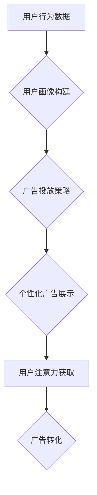

                 

##  注意力经济与在线广告：如何有效地针对受众而不牺牲用户体验

> 关键词：注意力经济、在线广告、用户体验、精准营销、深度学习、推荐系统、A/B测试、隐私保护

## 1. 背景介绍

在数字时代，信息爆炸式增长，用户每天面临着海量信息的选择和处理。这使得“注意力”成为一种稀缺资源，被誉为“21世纪最宝贵的资产”。 

注意力经济的概念应运而生，它强调了在信息过载的时代，获取和保持用户注意力至关重要。对于在线广告而言，注意力经济的到来带来了巨大的挑战和机遇。一方面，广告主需要更有效地抓住用户的注意力，提升广告的曝光率和转化率；另一方面，用户对广告的接受度越来越低，过度广告轰炸会带来负面体验，甚至导致用户流失。

如何平衡广告主需求和用户体验，在注意力经济下实现精准营销，是当前在线广告行业面临的重大课题。

## 2. 核心概念与联系

### 2.1 注意力经济

注意力经济是指在信息时代，人们对信息的获取和处理能力有限，而注意力是获取和处理信息的关键资源。因此，拥有和控制注意力就拥有了巨大的价值。

### 2.2 在线广告

在线广告是指在互联网平台上投放的广告，通过各种形式，如搜索结果、网站banner、社交媒体广告等，向目标用户展示广告信息，从而实现广告主的营销目标。

### 2.3 用户体验

用户体验是指用户使用产品或服务时所感受到的整体感受，包括易用性、可用性、美观度、效率等方面。良好的用户体验可以提升用户满意度和忠诚度，而糟糕的用户体验则会导致用户流失和品牌损害。

### 2.4 精准营销

精准营销是指根据用户画像、行为数据等信息，对目标用户进行个性化营销，提高营销效率和转化率。

**Mermaid 流程图**



## 3. 核心算法原理 & 具体操作步骤

### 3.1 算法原理概述

在注意力经济下，精准营销的核心算法主要基于深度学习和推荐系统技术。

* **深度学习**：通过多层神经网络，从海量用户数据中学习用户特征和行为模式，实现对用户画像的精准构建。
* **推荐系统**：根据用户画像和广告信息，预测用户对广告的兴趣和点击概率，从而实现个性化广告推荐。

### 3.2 算法步骤详解

1. **数据收集与预处理**: 收集用户行为数据，如浏览记录、点击记录、购买记录等，并进行清洗、转换和特征提取。
2. **用户画像构建**: 利用深度学习算法，如卷积神经网络（CNN）和循环神经网络（RNN），从用户行为数据中学习用户特征，构建用户画像。
3. **广告特征提取**: 对广告信息进行提取，包括广告标题、描述、图片、视频等，并进行文本处理和特征编码。
4. **推荐模型训练**: 利用深度学习算法，如深度神经网络（DNN）和梯度提升树（GBDT），训练推荐模型，预测用户对广告的兴趣和点击概率。
5. **个性化广告推荐**: 根据用户画像和广告特征，推荐个性化广告给用户。
6. **A/B测试**: 对不同的广告策略进行A/B测试，优化推荐模型和广告内容，提升广告效果。

### 3.3 算法优缺点

**优点**:

* **精准度高**: 基于深度学习和推荐系统，可以精准地识别用户兴趣和需求，推荐更符合用户偏好的广告。
* **个性化强**: 可以根据用户的不同特征和行为，提供个性化的广告体验，提升用户参与度和转化率。
* **自动化程度高**: 可以自动化地完成广告投放和优化，降低人工成本。

**缺点**:

* **数据依赖性强**: 需要海量用户数据进行训练，否则模型效果难以保证。
* **算法复杂度高**: 深度学习算法训练复杂，需要强大的计算资源和专业技术。
* **隐私安全问题**: 需要收集和处理用户隐私数据，需要做好数据安全和隐私保护工作。

### 3.4 算法应用领域

* **搜索引擎广告**: 根据用户搜索关键词，推荐相关广告。
* **社交媒体广告**: 根据用户的兴趣爱好和社交关系，推荐个性化广告。
* **电商广告**: 根据用户的购买历史和浏览记录，推荐相关商品广告。
* **内容平台广告**: 根据用户的阅读习惯和观看记录，推荐相关内容广告。

## 4. 数学模型和公式 & 详细讲解 & 举例说明

### 4.1 数学模型构建

在注意力经济下，用户对广告的注意力可以看作是一个概率分布，其值代表用户在特定时间段内关注广告的可能性。

我们可以用以下数学模型来表示用户对广告的注意力：

$$
P(A|U) = \frac{e^{f(A,U)}}{\sum_{i=1}^{N} e^{f(A_i,U)}}
$$

其中：

* $P(A|U)$ 表示用户 $U$ 对广告 $A$ 的注意力概率。
* $f(A,U)$ 表示用户 $U$ 对广告 $A$ 的兴趣得分，可以由用户画像、广告特征和上下文信息等因素决定。
* $N$ 表示所有候选广告的数量。

### 4.2 公式推导过程

该公式基于softmax函数，将所有候选广告的兴趣得分转化为概率分布。

* **兴趣得分计算**: 兴趣得分 $f(A,U)$ 可以通过机器学习模型训练得到，例如深度神经网络。模型输入用户画像和广告特征，输出用户对广告的兴趣得分。
* **概率归一化**: softmax函数将所有兴趣得分归一化到0到1之间，保证所有广告的注意力概率之和为1。

### 4.3 案例分析与讲解

假设有两个广告 $A_1$ 和 $A_2$，用户 $U$ 的兴趣得分分别为 $f(A_1,U) = 5$ 和 $f(A_2,U) = 3$。

则用户对 $A_1$ 和 $A_2$ 的注意力概率分别为：

$$
P(A_1|U) = \frac{e^{5}}{\sum_{i=1}^{2} e^{f(A_i,U)}} = \frac{e^{5}}{e^{5} + e^{3}}
$$

$$
P(A_2|U) = \frac{e^{3}}{\sum_{i=1}^{2} e^{f(A_i,U)}} = \frac{e^{3}}{e^{5} + e^{3}}
$$

可以看出，用户对 $A_1$ 的注意力概率更高，因为其兴趣得分更高。

## 5. 项目实践：代码实例和详细解释说明

### 5.1 开发环境搭建

* **操作系统**: Ubuntu 20.04 LTS
* **编程语言**: Python 3.8
* **深度学习框架**: TensorFlow 2.0
* **数据处理库**: Pandas, NumPy
* **机器学习库**: Scikit-learn

### 5.2 源代码详细实现

```python
import tensorflow as tf
from tensorflow.keras.models import Sequential
from tensorflow.keras.layers import Dense, Embedding, LSTM

# 数据预处理
# ...

# 建立推荐模型
model = Sequential()
model.add(Embedding(input_dim=vocab_size, output_dim=embedding_dim))
model.add(LSTM(units=128))
model.add(Dense(units=num_classes, activation='softmax'))

# 模型编译
model.compile(optimizer='adam', loss='categorical_crossentropy', metrics=['accuracy'])

# 模型训练
model.fit(X_train, y_train, epochs=10, batch_size=32)

# 模型评估
loss, accuracy = model.evaluate(X_test, y_test)
print('Test Loss:', loss)
print('Test Accuracy:', accuracy)

# 模型预测
predictions = model.predict(X_new)
```

### 5.3 代码解读与分析

* **数据预处理**: 将用户行为数据和广告信息转换为模型可识别的格式，例如将文本转换为词向量。
* **模型构建**: 使用深度学习框架构建推荐模型，例如使用嵌入层、LSTM层和全连接层。
* **模型编译**: 设置模型的优化器、损失函数和评价指标。
* **模型训练**: 使用训练数据训练模型，并调整模型参数。
* **模型评估**: 使用测试数据评估模型的性能。
* **模型预测**: 使用训练好的模型预测用户对广告的兴趣概率。

### 5.4 运行结果展示

* **训练过程**: 监控模型的损失函数和准确率的变化，观察模型训练效果。
* **测试结果**: 展示模型在测试数据上的损失函数和准确率，评估模型的泛化能力。
* **预测结果**: 展示模型预测的用户对广告的兴趣概率，并进行可视化分析。

## 6. 实际应用场景

### 6.1 搜索引擎广告

* **精准推荐**: 根据用户的搜索关键词和历史搜索记录，推荐与用户需求相关的广告。
* **个性化广告**: 根据用户的兴趣爱好和浏览习惯，推荐个性化的广告内容。

### 6.2 社交媒体广告

* **兴趣匹配**: 根据用户的兴趣爱好和社交关系，推荐与用户兴趣相关的广告。
* **内容推荐**: 根据用户的阅读习惯和观看记录，推荐与用户内容相关的广告。

### 6.3 电商广告

* **商品推荐**: 根据用户的购买历史和浏览记录，推荐与用户需求相关的商品广告。
* **促销活动**: 推送与用户兴趣相关的促销活动信息，提高用户参与度。

### 6.4 未来应用展望

* **增强现实广告**: 利用增强现实技术，将广告融入用户现实世界，提供更沉浸式的广告体验。
* **虚拟现实广告**: 利用虚拟现实技术，创造虚拟广告场景，提供更具互动性的广告体验。
* **个性化广告内容**: 利用人工智能技术，根据用户的个性化需求，生成个性化的广告内容。

## 7. 工具和资源推荐

### 7.1 学习资源推荐

* **书籍**:
    * 《深度学习》
    * 《推荐系统实践》
    * 《机器学习》
* **在线课程**:
    * Coursera: 深度学习
    * Udacity: 机器学习工程师
    * edX: 推荐系统

### 7.2 开发工具推荐

* **深度学习框架**: TensorFlow, PyTorch, Keras
* **数据处理库**: Pandas, NumPy
* **机器学习库**: Scikit-learn, XGBoost

### 7.3 相关论文推荐

* **Attention Is All You Need**: https://arxiv.org/abs/1706.03762
* **Deep Learning for Recommender Systems**: https://arxiv.org/abs/1901.06531
* **A Survey on Deep Learning for Recommender Systems**: https://arxiv.org/abs/1806.08917

## 8. 总结：未来发展趋势与挑战

### 8.1 研究成果总结

注意力经济与在线广告的结合，推动了深度学习和推荐系统技术的快速发展。

* **精准营销**: 通过深度学习和推荐系统，可以实现对用户画像的精准构建，并推荐更符合用户需求的广告。
* **个性化体验**: 通过个性化广告内容和投放策略，可以提升用户体验，提高广告转化率。

### 8.2 未来发展趋势

* **隐私保护**: 如何在保证用户隐私的同时实现精准营销，是未来发展的重要方向。
* **多模态广告**: 将文本、图片、视频等多模态信息融合，创造更丰富的广告体验。
* **交互式广告**: 鼓励用户与广告互动，提升广告参与度和转化率。

### 8.3 面临的挑战

* **数据安全**: 用户数据安全和隐私保护是重大的挑战。
* **算法公平性**: 算法模型可能存在偏见，需要确保算法公平性和可解释性。
* **用户信任**: 过度广告轰炸会损害用户信任，需要找到平衡点。

### 8.4 研究展望

未来，注意力经济与在线广告的研究将更加注重用户体验、隐私保护和算法公平性，探索更有效、更人性化的广告营销模式。


## 9. 附录：常见问题与解答

**Q1: 如何平衡广告效果和用户体验？**

A1: 

* **A/B测试**: 通过A/B测试，不断优化广告内容和投放策略，找到最佳的平衡点。
* **个性化推荐**: 根据用户的兴趣爱好和行为数据，推荐更符合用户需求的广告，提升用户体验。
* **广告格式多样化**: 使用不同的广告格式，例如原生广告、视频广告等，避免过度广告轰炸。

**Q2: 如何保护用户隐私？**

A2: 

* **数据匿名化**: 对用户数据进行匿名化处理，保护用户个人信息。
* **隐私合规**: 遵守相关隐私保护法规，例如GDPR和CCPA。
* **透明度**: 对用户数据的使用方式进行透明公开，获得用户的同意。


作者：禅与计算机程序设计艺术 / Zen and the Art of Computer Programming 
<end_of_turn>

