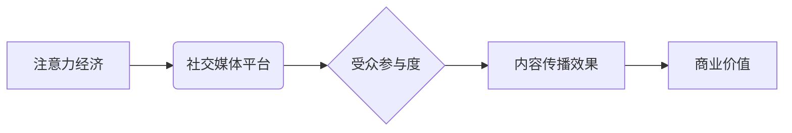

                 

##  注意力经济与社交媒体分析洞察力：了解受众参与度的秘密

> 关键词：注意力经济、社交媒体分析、受众参与度、算法原理、数学模型、代码实例、应用场景

## 1. 背景介绍

在当今数字时代，信息爆炸和竞争日益激烈，人们的注意力成为最宝贵的资源。这便是“注意力经济”的核心概念。社交媒体平台作为信息传播和用户互动的主要阵地，在注意力经济中扮演着至关重要的角色。 

社交媒体平台通过各种算法和机制，试图吸引用户的注意力，并将其转化为商业价值。然而，用户对内容的参与度并非一成不变，受众参与度的高低直接影响着平台的运营效果和商业成功。因此，深入了解受众参与度的秘密，并掌握相应的分析方法，对于社交媒体平台的运营和发展至关重要。

## 2. 核心概念与联系

### 2.1 注意力经济

注意力经济是指在信息过载的时代，人们对信息的筛选和选择能力成为决定性因素，而注意力本身成为一种稀缺资源。 

在社交媒体平台中，注意力经济体现在以下几个方面：

* **用户注意力是平台的核心资产:** 平台通过提供吸引人的内容和互动体验，争夺用户的注意力。
* **内容竞争日益激烈:**  平台上涌现出大量内容，用户需要花费时间和精力进行筛选，从而导致注意力竞争加剧。
* **个性化推荐:** 平台利用算法分析用户行为，提供个性化的内容推荐，以提高用户参与度。

### 2.2 社交媒体分析

社交媒体分析是指利用数据挖掘、机器学习等技术，从社交媒体平台上收集和分析用户数据，以洞察用户行为、趋势和洞察力。

社交媒体分析的目标包括：

* **了解用户群体:** 分析用户年龄、性别、兴趣爱好等特征，构建用户画像。
* **监测品牌声誉:** 分析用户对品牌和产品的评价，及时发现潜在问题。
* **优化内容策略:** 分析用户对不同类型内容的反应，制定更有效的营销策略。
* **预测用户行为:** 利用历史数据预测用户未来的行为，为平台运营提供决策依据。

### 2.3 受众参与度

受众参与度是指用户对特定内容的互动程度，通常通过点赞、评论、转发、分享等行为来衡量。

受众参与度的高低直接影响着内容的传播效果和价值。

### 2.4 核心概念关系图



## 3. 核心算法原理 & 具体操作步骤

### 3.1 算法原理概述

受众参与度分析通常依赖于机器学习算法，例如：

* **分类算法:**  用于预测用户对特定内容的参与行为，例如是否点赞、评论或转发。常见的分类算法包括逻辑回归、支持向量机和决策树。
* **回归算法:** 用于预测用户参与度的程度，例如点赞数、评论数或分享数。常见的回归算法包括线性回归、逻辑回归和支持向量回归。
* **聚类算法:** 用于将用户群体划分为不同的类别，例如根据兴趣爱好、行为模式或参与度水平。常见的聚类算法包括K-means聚类和层次聚类。

### 3.2 算法步骤详解

1. **数据收集:** 从社交媒体平台收集用户行为数据，例如用户ID、内容ID、点赞时间、评论内容、转发时间等。
2. **数据预处理:** 对收集到的数据进行清洗、转换和特征工程，例如删除重复数据、处理缺失值、提取文本特征等。
3. **模型选择:** 根据分析目标选择合适的机器学习算法。
4. **模型训练:** 使用训练数据训练选择的机器学习模型。
5. **模型评估:** 使用测试数据评估模型的性能，例如准确率、召回率、F1-score等。
6. **模型优化:** 根据评估结果调整模型参数，提高模型性能。
7. **模型部署:** 将训练好的模型部署到生产环境中，用于实时分析用户行为和预测受众参与度。

### 3.3 算法优缺点

**优点:**

* **精准预测:** 机器学习算法能够根据历史数据进行精准预测，提高受众参与度分析的准确性。
* **个性化推荐:** 通过分析用户行为，算法可以提供个性化的内容推荐，提高用户参与度。
* **自动化分析:** 机器学习算法可以自动化分析海量数据，节省人工成本。

**缺点:**

* **数据依赖:** 机器学习算法依赖于高质量的数据，数据质量直接影响算法性能。
* **算法黑盒:** 一些机器学习算法的内部机制较为复杂，难以解释其预测结果。
* **算法更新:** 随着用户行为的变化，算法需要定期更新才能保持准确性。

### 3.4 算法应用领域

受众参与度分析算法广泛应用于以下领域:

* **社交媒体营销:** 优化广告投放、内容创作和用户互动策略。
* **内容推荐系统:** 提供个性化的内容推荐，提高用户粘性和参与度。
* **舆情监测:** 分析用户对特定事件或话题的反应，及时发现潜在风险。
* **市场调研:** 了解用户需求和偏好，为产品开发和市场策略提供决策依据。

## 4. 数学模型和公式 & 详细讲解 & 举例说明

### 4.1 数学模型构建

受众参与度模型通常基于用户行为数据和内容特征，构建一个预测模型。

一个简单的受众参与度模型可以采用线性回归模型，其数学表达式如下：

$$
y = \beta_0 + \beta_1x_1 + \beta_2x_2 + ... + \beta_nx_n + \epsilon
$$

其中：

* $y$：受众参与度，例如点赞数、评论数或分享数。
* $x_1, x_2, ..., x_n$：用户行为特征和内容特征，例如用户年龄、性别、兴趣爱好、内容类型、内容长度等。
* $\beta_0, \beta_1, ..., \beta_n$：模型参数，通过训练数据学习得到。
* $\epsilon$：随机误差项。

### 4.2 公式推导过程

线性回归模型的目标是找到最佳的模型参数，使得预测值与实际值之间的误差最小。

常用的优化算法包括梯度下降法，其核心思想是迭代更新模型参数，逐步降低误差。

### 4.3 案例分析与讲解

假设我们想要预测一篇社交媒体文章的点赞数，我们可以使用线性回归模型，并选择以下特征：

* $x_1$：文章长度
* $x_2$：文章发布时间
* $x_3$：作者粉丝数

通过训练数据，我们可以学习到模型参数 $\beta_0, \beta_1, \beta_2$，并得到一个预测点赞数的公式。

例如，最终学习到的模型参数为：

* $\beta_0 = 10$
* $\beta_1 = 0.5$
* $\beta_2 = -2$
* $\beta_3 = 5$

则预测点赞数的公式为：

$$
y = 10 + 0.5x_1 - 2x_2 + 5x_3
$$

其中 $y$ 为预测点赞数，$x_1$ 为文章长度，$x_2$ 为文章发布时间，$x_3$ 为作者粉丝数。

## 5. 项目实践：代码实例和详细解释说明

### 5.1 开发环境搭建

* **编程语言:** Python
* **机器学习库:** scikit-learn
* **数据处理库:** pandas
* **数据可视化库:** matplotlib

### 5.2 源代码详细实现

```python
import pandas as pd
from sklearn.linear_model import LinearRegression
from sklearn.model_selection import train_test_split

# 加载数据
data = pd.read_csv('social_media_data.csv')

# 选择特征和目标变量
X = data[['article_length', 'post_time', 'author_followers']]
y = data['likes']

# 将数据划分为训练集和测试集
X_train, X_test, y_train, y_test = train_test_split(X, y, test_size=0.2, random_state=42)

# 创建线性回归模型
model = LinearRegression()

# 训练模型
model.fit(X_train, y_train)

# 预测测试集数据
y_pred = model.predict(X_test)

# 评估模型性能
from sklearn.metrics import mean_squared_error
mse = mean_squared_error(y_test, y_pred)
print('Mean Squared Error:', mse)

# 可视化预测结果
import matplotlib.pyplot as plt
plt.scatter(y_test, y_pred)
plt.xlabel('Actual Likes')
plt.ylabel('Predicted Likes')
plt.title('Linear Regression Model Performance')
plt.show()
```

### 5.3 代码解读与分析

* **数据加载和预处理:** 使用 pandas 库加载数据，并选择特征和目标变量。
* **数据分割:** 使用 train_test_split 函数将数据划分为训练集和测试集。
* **模型创建和训练:** 使用 scikit-learn 库创建线性回归模型，并使用训练数据进行模型训练。
* **模型预测:** 使用训练好的模型预测测试集数据。
* **模型评估:** 使用 mean_squared_error 函数评估模型性能。
* **结果可视化:** 使用 matplotlib 库可视化预测结果。

### 5.4 运行结果展示

运行代码后，会输出模型的均方误差值，以及预测结果与实际值的散点图。

## 6. 实际应用场景

### 6.1 内容创作优化

* 分析用户对不同类型内容的参与度，例如视频、图片、文字等。
* 优化内容长度、标题、标签等特征，提高内容的吸引力和传播效果。

### 6.2 广告投放策略

* 根据用户兴趣爱好和行为模式，精准投放广告，提高广告点击率和转化率。
* 分析不同广告创意和文案的受众参与度，优化广告策略。

### 6.3 社区运营管理

* 分析用户活跃度、参与度和贡献度，识别社区活跃用户和潜在问题。
* 针对不同用户群体，制定个性化的运营策略，提高用户粘性和参与度。

### 6.4 未来应用展望

随着人工智能技术的不断发展，受众参与度分析将更加精准和智能化。

未来，受众参与度分析可能应用于以下领域:

* **个性化内容推荐:** 提供更加精准和个性化的内容推荐，满足用户多样化的需求。
* **虚拟现实和增强现实:** 分析用户在虚拟环境中的行为和参与度，优化虚拟体验。
* **自动内容生成:** 利用机器学习算法自动生成受众感兴趣的内容，提高内容生产效率。

## 7. 工具和资源推荐

### 7.1 学习资源推荐

* **书籍:**
    * 《Python机器学习》
    * 《数据挖掘与机器学习》
* **在线课程:**
    * Coursera: Machine Learning
    * edX: Artificial Intelligence

### 7.2 开发工具推荐

* **Python:** 
    * scikit-learn
    * pandas
    * matplotlib
* **数据可视化工具:**
    * Tableau
    * Power BI

### 7.3 相关论文推荐

* **Attention Is All You Need:** https://arxiv.org/abs/1706.03762
* **BERT: Pre-training of Deep Bidirectional Transformers for Language Understanding:** https://arxiv.org/abs/1810.04805

## 8. 总结：未来发展趋势与挑战

### 8.1 研究成果总结

受众参与度分析已经取得了显著的成果，为社交媒体平台的运营和发展提供了重要的决策依据。

机器学习算法能够精准预测用户行为，帮助平台优化内容策略、广告投放和社区运营。

### 8.2 未来发展趋势

* **更精准的预测:** 利用深度学习等更先进的算法，提高受众参与度预测的准确性。
* **更个性化的体验:** 基于用户行为和偏好，提供更加个性化的内容推荐和互动体验。
* **更全面的分析:** 分析用户情绪、情感和意图，提供更深入的洞察力。

### 8.3 面临的挑战

* **数据隐私:** 如何保护用户数据隐私，同时满足分析需求是一个重要的挑战。
* **算法解释性:** 一些深度学习算法的内部机制较为复杂，难以解释其预测结果，这可能会影响算法的可信度和应用范围。
* **算法公平性:** 算法可能存在偏见，导致不公平的结果，需要不断改进算法设计，确保算法公平性。

### 8.4 研究展望

未来，受众参与度分析将继续朝着更精准、更智能、更公平的方向发展。

研究者需要探索新的算法和技术，解决数据隐私、算法解释性和算法公平性等挑战，为社交媒体平台的健康发展提供更强大的技术支持。

## 9. 附录：常见问题与解答

### 9.1 如何选择合适的受众参与度分析算法？

选择合适的算法取决于具体的分析目标和数据特征。

* **分类问题:** 使用逻辑回归、支持向量机或决策树等分类算法。
* **回归问题:** 使用线性回归、逻辑回归或支持向量回归等回归算法。
* **聚类问题:** 使用K-means聚类或层次聚类等聚类算法。

### 9.2 如何处理缺失数据？

缺失数据会影响模型的准确性，需要采取措施进行处理。

常用的处理方法包括：

* **删除缺失数据:** 如果缺失数据量较少，可以删除含有缺失数据的样本。
* **填充缺失数据:** 使用平均值、中位数或其他统计方法填充缺失数据。
* **使用机器学习算法进行预测:** 使用机器学习算法预测缺失数据。

### 9.3 如何评估模型性能？

常用的模型性能评估指标包括：

* **准确率:** 分类问题的评估指标，表示正确分类样本的比例。
* **召回率:** 分类问题的评估指标，表示所有正样本中被正确分类的比例。
* **F1-score:** 分类问题的评估指标，是准确率和召回率的调和平均值。
* **均方误差:** 回归问题的评估指标，表示预测值与实际值之间的平方差的平均值。


作者：禅与计算机程序设计艺术 / Zen and the Art of Computer Programming 
<end_of_turn>

