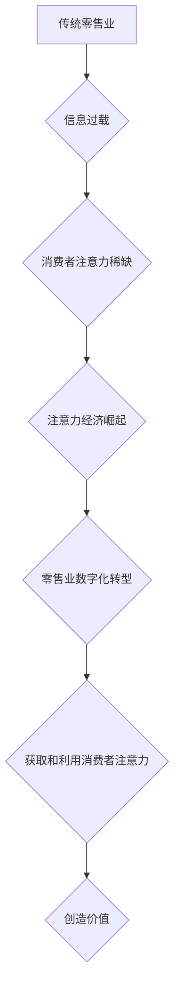

                 

## 1. 背景介绍

在当今信息爆炸的时代，人们的注意力资源变得越来越稀缺。传统零售业态长期以来依赖于线下门店的物理空间和广告投放来吸引顾客，但随着互联网和移动互联网的快速发展，消费者获取信息和购物方式发生了根本性的改变。注意力经济的兴起，为传统零售业态带来了前所未有的挑战和机遇。

### 1.1  注意力经济的崛起

注意力经济是指在信息过载的时代，将注意力作为最宝贵的资源，并通过各种手段获取、分配和利用注意力来创造价值的经济模式。

* **信息过载:**  互联网和移动互联网的普及，使人们每天接触的信息量呈指数级增长，导致注意力资源面临着巨大的压力。
* **个性化需求:**  消费者对商品和服务的个性化需求日益强烈，传统零售业态的“一刀切”模式难以满足。
* **数字化转型:**  互联网和移动互联网为零售业提供了全新的数字化转型机会，可以利用数据分析、人工智能等技术，更精准地获取和利用消费者注意力。

### 1.2  传统零售业态面临的挑战

传统零售业态面临着以下挑战：

* **竞争加剧:**  电商平台的崛起，给传统零售业带来了巨大的竞争压力。
* **顾客流失:**  消费者习惯于线上购物，线下门店的客流量不断下降。
* **运营成本高:**  传统零售业的运营成本较高，包括租金、人工、物流等费用。
* **数据孤岛:**  传统零售业缺乏统一的数据平台，难以进行数据分析和运营优化。

## 2. 核心概念与联系

注意力经济的核心概念是“注意力”和“价值”。

* **注意力:**  指个体对特定信息或刺激的认知焦点。
* **价值:**  指注意力带来的经济效益。

在注意力经济中，获取和利用注意力是创造价值的关键。零售业可以通过以下方式获取和利用消费者注意力：

* **内容营销:**  通过制作优质的线上内容，吸引消费者关注。
* **社交媒体营销:**  利用社交媒体平台，与消费者互动，建立品牌忠诚度。
* **个性化推荐:**  根据消费者的购买历史和兴趣爱好，提供个性化的商品推荐。
* **数据分析:**  利用数据分析，了解消费者的行为模式，优化营销策略。

**Mermaid 流程图**



## 3. 核心算法原理 & 具体操作步骤

### 3.1  算法原理概述

注意力机制是一种模仿人类注意力机制的机器学习算法，它可以帮助模型专注于输入数据中最重要的部分，从而提高模型的性能。

注意力机制的核心思想是通过一个“注意力权重”来分配输入数据中的不同部分的关注度。注意力权重可以根据输入数据的特征和模型的学习目标进行动态调整。

### 3.2  算法步骤详解

1. **输入数据:**  将输入数据（例如文本、图像）转换为模型可以理解的格式。
2. **特征提取:**  使用神经网络等模型提取输入数据的特征。
3. **注意力计算:**  计算每个输入数据部分的注意力权重。
4. **加权求和:**  根据注意力权重对特征进行加权求和，得到最终的输出。

### 3.3  算法优缺点

**优点:**

* 可以提高模型的性能，特别是对于长序列数据。
* 可以帮助模型理解输入数据的语义关系。
* 可以解释模型的决策过程。

**缺点:**

* 计算复杂度较高。
* 需要大量的训练数据。

### 3.4  算法应用领域

注意力机制在自然语言处理、计算机视觉、机器翻译等领域都有广泛的应用。

## 4. 数学模型和公式 & 详细讲解 & 举例说明

### 4.1  数学模型构建

注意力机制的数学模型可以表示为以下公式：

$$
\text{Attention}(Q, K, V) = \text{softmax}\left(\frac{Q K^T}{\sqrt{d_k}}\right) V
$$

其中：

* $Q$：查询矩阵
* $K$：键矩阵
* $V$：值矩阵
* $d_k$：键向量的维度
* $\text{softmax}$：softmax函数

### 4.2  公式推导过程

公式推导过程如下：

1. 计算查询矩阵 $Q$ 和键矩阵 $K$ 的点积，并除以 $\sqrt{d_k}$。
2. 应用 softmax 函数对点积结果进行归一化，得到注意力权重。
3. 将注意力权重与值矩阵 $V$ 进行加权求和，得到最终的输出。

### 4.3  案例分析与讲解

例如，在机器翻译中，查询矩阵 $Q$ 表示源语言的词向量，键矩阵 $K$ 表示目标语言的词向量，值矩阵 $V$ 表示目标语言的词嵌入。

注意力机制可以帮助模型关注源语言中与目标语言词语相关的部分，从而提高翻译的准确性。

## 5. 项目实践：代码实例和详细解释说明

### 5.1  开发环境搭建

* Python 3.6+
* TensorFlow 2.0+
* PyTorch 1.0+

### 5.2  源代码详细实现

```python
import tensorflow as tf

# 定义注意力机制层
class AttentionLayer(tf.keras.layers.Layer):
    def __init__(self, units):
        super(AttentionLayer, self).__init__()
        self.Wq = tf.keras.layers.Dense(units)
        self.Wk = tf.keras.layers.Dense(units)
        self.Wv = tf.keras.layers.Dense(units)
        self.fc = tf.keras.layers.Dense(units)

    def call(self, inputs):
        Q = self.Wq(inputs)
        K = self.Wk(inputs)
        V = self.Wv(inputs)
        attention_scores = tf.matmul(Q, K, transpose_b=True) / tf.math.sqrt(tf.cast(tf.shape(Q)[-1], tf.float32))
        attention_weights = tf.nn.softmax(attention_scores, axis=-1)
        context_vector = tf.matmul(attention_weights, V)
        output = self.fc(context_vector)
        return output

# 实例化注意力机制层
attention_layer = AttentionLayer(units=128)

# 输入数据
inputs = tf.random.normal(shape=(1, 10, 512))

# 通过注意力机制层进行处理
output = attention_layer(inputs)

# 打印输出结果
print(output.shape)
```

### 5.3  代码解读与分析

* 定义了一个 `AttentionLayer` 类，实现了注意力机制的计算过程。
* 使用 `tf.keras.layers.Dense` 创建了三个全连接层，分别用于计算查询、键和值的向量表示。
* 使用 `tf.matmul` 计算查询向量和键向量的点积，并进行归一化。
* 使用 `tf.nn.softmax` 计算注意力权重。
* 使用注意力权重对值向量进行加权求和，得到最终的输出。

### 5.4  运行结果展示

运行代码后，会输出一个形状为 `(1, 10, 128)` 的张量，表示经过注意力机制处理后的输出。

## 6. 实际应用场景

### 6.1  个性化推荐

注意力机制可以帮助电商平台根据用户的浏览历史、购买记录等数据，精准地推荐用户感兴趣的商品。

### 6.2  内容推荐

注意力机制可以帮助社交媒体平台根据用户的兴趣爱好，推荐用户感兴趣的内容。

### 6.3  搜索引擎优化

注意力机制可以帮助搜索引擎更好地理解用户搜索意图，并提供更相关的搜索结果。

### 6.4  未来应用展望

注意力机制在零售业的应用前景广阔，未来可能在以下领域得到更广泛的应用：

* **虚拟现实购物体验:**  注意力机制可以帮助虚拟现实购物体验更沉浸式和个性化。
* **智能客服:**  注意力机制可以帮助智能客服更好地理解用户的需求，并提供更精准的帮助。
* **供应链管理:**  注意力机制可以帮助优化供应链管理，提高效率和降低成本。

## 7. 工具和资源推荐

### 7.1  学习资源推荐

* **书籍:**  《深度学习》
* **在线课程:**  Coursera、edX、Udacity

### 7.2  开发工具推荐

* **TensorFlow:**  https://www.tensorflow.org/
* **PyTorch:**  https://pytorch.org/

### 7.3  相关论文推荐

* **Attention Is All You Need:**  https://arxiv.org/abs/1706.03762

## 8. 总结：未来发展趋势与挑战

### 8.1  研究成果总结

注意力机制在零售业的应用取得了显著的成果，例如个性化推荐、内容推荐等。

### 8.2  未来发展趋势

未来注意力机制在零售业的应用将更加深入和广泛，例如虚拟现实购物体验、智能客服等。

### 8.3  面临的挑战

* **数据隐私:**  注意力机制的应用需要大量用户数据，如何保护用户数据隐私是一个重要的挑战。
* **算法解释性:**  注意力机制的决策过程相对复杂，如何提高算法的解释性是一个重要的研究方向。
* **计算效率:**  注意力机制的计算复杂度较高，如何提高算法的计算效率是一个重要的技术挑战。

### 8.4  研究展望

未来研究将集中在以下几个方面：

* **隐私保护注意力机制:**  研究如何设计隐私保护的注意力机制，保护用户数据隐私。
* **可解释性注意力机制:**  研究如何提高注意力机制的解释性，使模型的决策过程更加透明。
* **高效注意力机制:**  研究如何提高注意力机制的计算效率，使其能够应用于更大型的数据集。

## 9. 附录：常见问题与解答

### 9.1  Q1: 注意力机制与传统机器学习模型有什么区别？

**A1:**  注意力机制是一种新的机器学习模型，它可以帮助模型关注输入数据中最重要的部分，从而提高模型的性能。传统机器学习模型通常是将所有输入数据都平等地对待，而注意力机制可以根据输入数据的特征和模型的学习目标动态地分配注意力。

### 9.2  Q2: 注意力机制的应用场景有哪些？

**A2:**  注意力机制在自然语言处理、计算机视觉、机器翻译等领域都有广泛的应用。在零售业，注意力机制可以用于个性化推荐、内容推荐、搜索引擎优化等。

### 9.3  Q3: 如何学习注意力机制？

**A3:**  可以阅读相关书籍和在线课程，例如《深度学习》和 Coursera 上的注意力机制课程。

作者：禅与计算机程序设计艺术 / Zen and the Art of Computer Programming 


<end_of_turn>

